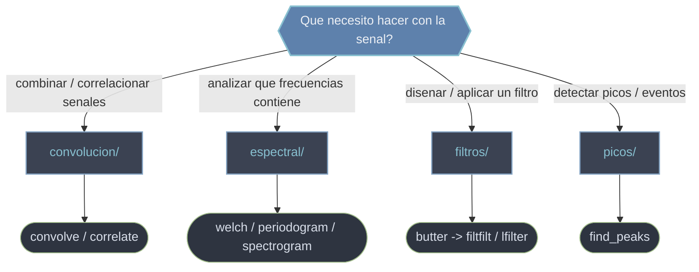

# scipy.signal — procesamiento de senales

`scipy.signal` es el submodulo de **procesamiento de senales**: el conjunto de herramientas para **analizar y transformar senales** entendidas como secuencias de muestras en el tiempo. Una senal vive en dos dominios complementarios, el **tiempo** (como varia la amplitud muestra a muestra) y la **frecuencia** (que tonos la componen), y casi todo lo que ofrece el modulo es moverse entre esos dominios o modificar la senal en alguno de ellos. Las cuatro subcarpetas siguen el recorrido tipico de un flujo real: combinar o comparar senales (convolucion), mirar su espectro para entender que contienen (espectral), disenar y aplicar un filtro que deje pasar lo util (filtros) y detectar los eventos relevantes sobre la senal limpia (picos). Es la caja de herramientas habitual con datos de sensores, audio o biosenales (ECG, EEG).

## En accion

```python
import numpy as np
from scipy.signal import butter, filtfilt, welch

# 1. Generar una senal: tono util a 5 Hz + interferencia a 120 Hz + ruido
fs = 1000.0                                   # Hz
t = np.arange(0, 2.0, 1/fs)
x = (np.sin(2*np.pi*5*t)                      # senal util
     + 0.6*np.sin(2*np.pi*120*t)              # interferencia de alta frecuencia
     + 0.3*np.random.randn(t.size))           # ruido

# 2. Filtrar: disenar un pasa-bajos Butterworth y aplicarlo sin desfase
b, a = butter(4, 30, btype='low', fs=fs)      # DISENA (corte a 30 Hz)
y = filtfilt(b, a, x)                          # APLICA con fase cero

# 3. Ver el espectro de ambas senales (PSD por Welch)
f, Pxx_cruda    = welch(x, fs, nperseg=1024)
f, Pxx_filtrada = welch(y, fs, nperseg=1024)
f[np.argmax(Pxx_filtrada)]   # → ~5.0   (tras filtrar domina el tono util)
```

## Que carpeta uso



## Subcarpetas

### [[Librerias/SciPy/scipy.signal/convolucion/index\|convolucion]]
Las dos operaciones que **deslizan** un array sobre otro y suman productos solapados. La **convolucion** (`convolve`) invierte el segundo array y modela la salida de un sistema LTI o un suavizado; la **correlacion** (`correlate`) no lo invierte y mide **similitud**, para localizar un patron o estimar el retardo entre dos senales. La diferencia decisiva: convolucion para producir una salida, correlacion para localizar o alinear.

### [[Librerias/SciPy/scipy.signal/espectral/index\|espectral]]
El paso del dominio del tiempo al de la **frecuencia**: estimar que tonos componen una senal y con que potencia. Reune la **densidad espectral de potencia** (`periodogram`, rapido y ruidoso; `welch`, promediado y estandar practico) y el **espectrograma** (`spectrogram`, como evoluciona el espectro en el tiempo para senales no estacionarias). Es la lente para diagnosticar una senal antes de filtrarla.

### [[Librerias/SciPy/scipy.signal/filtros/index\|filtros]]
El **diseno** y la **aplicacion** de filtros digitales, dos pasos deliberadamente separados: `butter` (y familia) calcula los coeficientes a partir del tipo y la frecuencia de corte; luego `filtfilt` (fase cero, offline) o `lfilter` (causal, tiempo real) los aplican. Es la herramienta para limpiar ruido, aislar bandas o eliminar derivas.

### [[Librerias/SciPy/scipy.signal/picos/index\|picos]]
La **deteccion de picos**: localizar los maximos locales relevantes de una senal 1D ignorando el ruido. `find_peaks` los detecta y los filtra por criterios como altura, separacion y, sobre todo, **prominencia** (cuanto sobresale cada pico de su entorno). Es el paso final para contar eventos (latidos, pulsos) o marcar maximos significativos sobre la senal ya procesada.

## Tabla de orientacion

| Quiero... | Carpeta | Rutina tipica |
|-----------|---------|---------------|
| Modelar un sistema LTI o suavizar con un nucleo | [[Librerias/SciPy/scipy.signal/convolucion/index\|convolucion]] | `convolve` |
| Localizar un patron o medir el retardo entre senales | [[Librerias/SciPy/scipy.signal/convolucion/index\|convolucion]] | `correlate` |
| Saber que frecuencias componen una senal | [[Librerias/SciPy/scipy.signal/espectral/index\|espectral]] | `welch` |
| Ver como cambia el espectro en el tiempo | [[Librerias/SciPy/scipy.signal/espectral/index\|espectral]] | `spectrogram` |
| Quitar ruido, aislar una banda o eliminar deriva | [[Librerias/SciPy/scipy.signal/filtros/index\|filtros]] | `butter` + `filtfilt` |
| Contar eventos o marcar maximos relevantes | [[Librerias/SciPy/scipy.signal/picos/index\|picos]] | `find_peaks` |

## Notas relacionadas

- [[Librerias/SciPy/scipy.signal/convolucion/index\|convolucion]]
- [[Librerias/SciPy/scipy.signal/espectral/index\|espectral]]
- [[Librerias/SciPy/scipy.signal/filtros/index\|filtros]]
- [[Librerias/SciPy/scipy.signal/picos/index\|picos]]
- [[concepto_relacion_numpy]]
