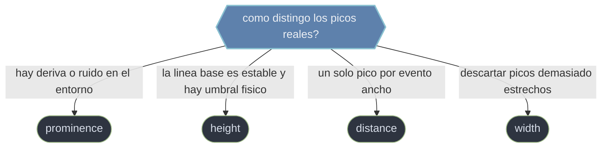

# scipy.signal picos — deteccion de maximos locales

Esta carpeta cubre la **deteccion de picos**: localizar los maximos locales relevantes de una senal 1D —puntos mayores que sus dos vecinos inmediatos— ignorando el ruido. Es el paso final de muchos flujos: una vez la senal esta limpia (filtrada, suavizada), interesa **contar eventos** (latidos, pulsos, cruces) o **marcar maximos significativos**. La pieza central es `find_peaks`, que detecta todos los maximos locales y luego los **filtra** por criterios opcionales. La clave no es detectar (eso es trivial), sino **separar picos reales de ondulaciones del ruido**, y para eso el criterio mas robusto es la **prominencia**: cuanto sobresale un pico de su entorno, en vez de su altura absoluta. Combinar prominencia con distancia (un pico por evento) resuelve la mayoria de los casos practicos.

## En accion

```python
import numpy as np
from scipy.signal import find_peaks

# Senal sinusoidal con ruido: queremos sus maximos, no las ondulaciones
t = np.linspace(0, 6*np.pi, 1500)
x = np.sin(t) + 0.08*np.random.randn(t.size)
x[700] += 0.6                                  # un pico extra mas marcado

# find_peaks devuelve (indices, properties); filtramos por varios criterios
peaks, props = find_peaks(
    x,
    height=0.3,        # altura absoluta minima
    distance=50,       # separacion minima entre picos, en muestras
    prominence=0.5,    # cuanto debe sobresalir del entorno (lo mas robusto)
)
peaks                  # → indices de los maximos validos
props['prominences']   # → cuanto sobresale cada pico detectado
```

## Que criterio de pico uso



## Contenido

### [[scipy.signal.find_peaks\|find_peaks]]
Detecta los **maximos locales** de una senal 1D y los filtra segun criterios opcionales. Devuelve la tupla `(peaks, properties)`: `peaks` son los **indices** de los picos que pasan los filtros y `properties` un `dict` con las propiedades calculadas (`peak_heights`, `prominences`, `widths`). Los criterios clave: `height` (altura absoluta), `distance` (separacion minima, conserva el mas alto), `prominence` (cuanto sobresale del entorno, el mas robusto frente a ruido y deriva) y `width` (anchura minima). Solo detecta maximos; para minimos se invierte la senal (`find_peaks(-x)`).

## Tabla de decision

| Si necesitas... | Criterio | Por que |
|-----------------|----------|---------|
| Separar picos reales del ruido / deriva | `prominence` | Mide forma local, no nivel absoluto: lo mas robusto |
| Filtrar por un umbral fisico con linea base estable | `height` | Compara el valor absoluto del pico |
| Un solo pico por evento ancho o en racimo | `distance` | Conserva el mas alto dentro de la separacion minima |
| Descartar picos demasiado estrechos (artefactos) | `width` | Mide la anchura a media altura relativa |
| Detectar minimos en vez de maximos | `find_peaks(-x)` | `find_peaks` solo busca maximos |

## Notas relacionadas

- [[scipy.signal.find_peaks]]
- [[Librerias/SciPy/scipy.signal/filtros/index\|filtros]]
- [[Librerias/SciPy/scipy.signal/convolucion/index\|convolucion]]
- [[Librerias/SciPy/scipy.signal/index\|scipy.signal]]
