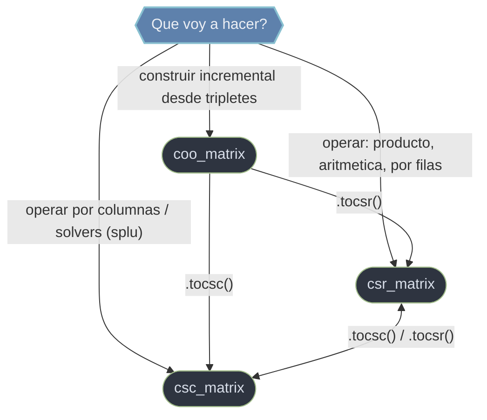

# scipy.sparse — matrices dispersas

`scipy.sparse` es el submodulo de **matrices dispersas**: estructuras que almacenan solo los elementos NO nulos. Cuando la mayoria de las entradas son cero, esto supone un ahorro masivo de **memoria** y de **computo** frente a un array denso de NumPy. La idea central es que cada formato optimiza una cosa distinta, asi que lo normal es **construir** en un formato flexible y **operar** en otro comprimido: ensamblar las entradas en COO (de tripletes) y convertir una sola vez a CSR (eje fila) o CSC (eje columna) para calcular. El algebra lineal dispersa vive aparte, en `scipy.sparse.linalg` (`spsolve`, `splu`, `cg`...).

## En accion

```python
import numpy as np
from scipy.sparse import coo_matrix

# 1. Construir incrementalmente en COO desde tripletes (fila, columna, valor)
row  = [0, 1, 1, 0]
col  = [2, 0, 2, 2]              # ojo: (0, 2) aparece dos veces
data = [3, 4, 5, 1]
A = coo_matrix((data, (row, col)), shape=(2, 3))

# 2. Convertir a CSR para poder operar (COO no soporta @ ni indexing)
A_csr = A.tocsr()               # los duplicados en (0,2) se SUMAN -> 4
A_csr.toarray()
# → array([[0, 0, 4],
#          [4, 0, 5]])

# 3. Operar por filas: producto matriz-vector, la operacion estrella de CSR
v = np.array([1, 1, 1])
A_csr @ v                       # → array([4, 9])
A_csr[0]                        # slicing por fila: barato en CSR

# 4. Si toca operar por columnas o factorizar, convertir a CSC
A_csc = A_csr.tocsc()
A_csc[:, 2].toarray()           # slicing por columna: barato en CSC
```

## Que formato uso



La regla de oro tiene dos fases: **construir** en un formato flexible (COO desde tripletes, con duplicados que se suman al comprimir) y **convertir y operar** en uno comprimido (CSR para eje fila / producto, CSC para eje columna / solvers). Construir directamente sobre CSR/CSC es caro: cada nueva posicion reestructura los arrays internos y emite `SparseEfficiencyWarning`. Construye flexible, comprime una vez.

## Notas del submodulo

### [[coo_matrix]]
Formato **COOrdinate** (de tripletes): almacena cada no nulo como `(fila, columna, valor)` en tres listas paralelas (`row`, `col`, `data`). Es el formato de **construccion** por excelencia: rapido de ensamblar elemento a elemento (tipico del metodo de elementos finitos) y de convertir a CSR/CSC. Los duplicados en la misma posicion se **suman** al comprimir. No soporta indexing ni aritmetica directos: es un formato de paso.

### [[csr_matrix]]
Formato **Compressed Sparse Row**: comprime por **filas** en `data`, `indices`, `indptr`. Es el **formato de calculo por defecto** de SciPy: rapido en producto matriz-vector `A @ v`, slicing por filas `A[i]` y aritmetica. Su contrapartida: cambiar la estructura (asignar posiciones nuevas) es caro.

### [[csc_matrix]]
Formato **Compressed Sparse Column**: el analogo exacto de CSR pero comprimido por **columnas**. Comparte API; cambia el eje barato. Es la eleccion para slicing por columnas `A[:, j]` y para solvers/factorizaciones orientados a columna (`splu` trabaja internamente en CSC).

## Tabla de orientacion

| Quiero... | Formato | Por que |
|-----------|---------|---------|
| Ensamblar desde tripletes (FEM) | [[coo_matrix\|COO]] | Construccion incremental; duplicados se suman |
| Producto matriz-vector `A @ v` | [[csr_matrix\|CSR]] | Comprimido por filas, formato de calculo |
| Slicing por filas `A[i]` | [[csr_matrix\|CSR]] | Acceso a fila inmediato |
| Slicing por columnas `A[:, j]` | [[csc_matrix\|CSC]] | Acceso a columna inmediato |
| Factorizacion LU (`splu`) | [[csc_matrix\|CSC]] | El solver trabaja en CSC |
| Convertir entre formatos | cualquiera | `.tocsr()`, `.tocsc()`, `.tocoo()` |

> Aviso de migracion: SciPy pasa de `*_matrix` a `*_array` (`csr_array`, ...). El cambio peligroso es `*`: en `*_matrix` es producto matricial, en `*_array` es elemento a elemento. Usa siempre `@` para producto matricial, que es inequivoco en ambas APIs.

## Notas relacionadas

- [[SciPy/index\|SciPy]]
- [[concepto_relacion_numpy]]
