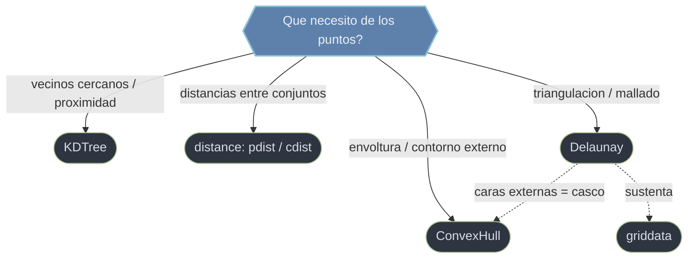

# scipy.spatial — geometria computacional y proximidad

`scipy.spatial` es el submodulo de **geometria computacional**: estructuras y algoritmos para razonar sobre nubes de puntos en N dimensiones. Cubre cuatro tareas que comparten la nocion de "puntos en el espacio" pero responden preguntas distintas: encontrar **vecinos cercanos** (`KDTree`), medir **distancias** entre puntos y conjuntos (`distance`), hallar el **contorno externo** de una nube (`ConvexHull`), y **triangular** el dominio para mallar o interpolar (`Delaunay`, y su dual `Voronoi`). Por debajo se apoya en la libreria **Qhull** para las construcciones geometricas.

## En accion

```python
import numpy as np
from scipy.spatial import KDTree

# Nube de 1000 puntos en 2D
rng = np.random.default_rng(0)
pts = rng.random((1000, 2))

# 1. Construir el arbol UNA vez: O(n log n)
tree = KDTree(pts)

# 2. Consultar los 3 vecinos mas cercanos al centro: O(log n) por consulta
dist, idx = tree.query([0.5, 0.5], k=3)
idx                              # indices de los 3 puntos mas cercanos
dist                             # sus distancias, en orden ascendente

# 3. Vectorizado: vecino mas cercano de 50 puntos a la vez
consulta = rng.random((50, 2))
d, i = tree.query(consulta, k=1)
i.shape                          # → (50,)

# 4. Todos los puntos dentro de un radio (vecindad por bola)
vecinos = tree.query_ball_point([0.5, 0.5], r=0.1)
len(vecinos)                     # cuantos caen en el circulo r=0.1
```

## Que herramienta uso



Las herramientas estan ligadas: las caras **externas** de la triangulacion de Delaunay forman exactamente la envolvente convexa, y `find_simplex` de Delaunay es la base de la interpolacion sobre datos dispersos (`griddata` lo usa por dentro). Para vecindad repetida sobre muchos puntos conviene un `KDTree` en vez de materializar toda la matriz de distancias de `distance`.

## Notas del submodulo

### [[KDTree]]
**Arbol k-d** para consultas de **vecinos mas cercanos** eficientes: tras un coste de construccion `O(n log n)`, cada consulta es `O(log n)` amortizado en dimension baja, frente al `O(n)` de la fuerza bruta. `query(x, k)` da los `k` vecinos y sus distancias; `query_ball_point(x, r)` los puntos dentro de un radio; `query_pairs(r)` las parejas internas cercanas. Es la herramienta de referencia para proximidad en mallas y nubes de puntos.

### [[scipy.spatial.distance|distance]]
**Metricas de distancia** entre vectores y conjuntos. `pdist(X)` calcula las distancias por pares **dentro** de un conjunto (vector condensado); `cdist(XA, XB)` cruza **dos** conjuntos (matriz rectangular); `squareform` convierte entre vector condensado y matriz cuadrada. El parametro `metric` selecciona la distancia (`euclidean`, `cityblock`, `cosine`, `mahalanobis`...). Base de clustering, vecinos y matrices de similitud.

### [[ConvexHull]]
**Envolvente convexa** (convex hull) via Qhull: el menor poligono (2D) o poliedro (3D+) convexo que contiene todos los puntos. `.vertices` da los indices del contorno, `.simplices` las facetas, `.volume` el area encerrada en 2D (volumen en 3D) y `.area` el perimetro en 2D (superficie en 3D). Sirve para el contorno externo de una nube y el area/volumen que ocupa.

### [[Delaunay]]
**Triangulacion de Delaunay** via Qhull: particion del dominio en triangulos (o simplices N-D) que maximiza el angulo minimo, evitando triangulos finos. `.simplices` da los vertices de cada triangulo, `.find_simplex(p)` localiza en que triangulo cae un punto (clave para interpolacion) y `.neighbors` los adyacentes. Es la base del mallado de datos dispersos; sustenta a `griddata`. Su estructura dual es el diagrama de **Voronoi** (`scipy.spatial.Voronoi`).

## Tabla de orientacion

| Quiero... | Herramienta | Rutina tipica |
|-----------|-------------|---------------|
| Los `k` vecinos mas cercanos | [[KDTree]] | `tree.query(x, k)` |
| Puntos dentro de un radio | [[KDTree]] | `tree.query_ball_point(x, r)` |
| Distancias internas de un conjunto | [[scipy.spatial.distance\|distance]] | `pdist(X)` |
| Distancias entre dos conjuntos | [[scipy.spatial.distance\|distance]] | `cdist(XA, XB)` |
| Contorno externo / area / volumen | [[ConvexHull]] | `ConvexHull(pts)` |
| Mallar / triangular para interpolar | [[Delaunay]] | `Delaunay(pts)`, `find_simplex` |

## Notas relacionadas

- [[SciPy/index\|SciPy]]
- [[SciPy/scipy.interpolate/index\|scipy.interpolate]]
