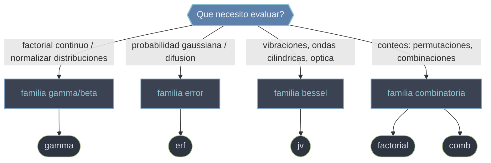

# scipy.special — funciones especiales

`scipy.special` es el submodulo de **funciones especiales**: las funciones matematicas que aparecen una y otra vez en fisica, estadistica y combinatoria pero que no tienen una expresion elemental cerrada. Reune la **funcion Gamma** y su pariente Beta (generalizaciones del factorial), la **funcion error** `erf` (ligada a la distribucion normal), las **funciones de Bessel** `jv` (vibraciones y ondas en geometria cilindrica) y los conteos **combinatorios** exactos o aproximados (`factorial`, `comb`). Casi todas son **ufuncs**: aceptan escalares y arrays NumPy y operan **elemento a elemento** (vectorizadas), por lo que se aplican directamente sobre un `ndarray` sin bucles.

## En accion

```python
import numpy as np
from scipy.special import gamma, erf

# gamma generaliza el factorial: Gamma(n+1) = n!  -> vectorizada sobre un array
gamma(np.arange(1, 6))       # → array([ 1.,  1.,  2.,  6., 24.])   (= 0!..4!)
gamma(0.5)                   # → 1.7724539...   (= sqrt(pi), factorial continuo)

# erf: funcion error, sigmoide impar de -1 a 1, sobre todo un array a la vez
erf(np.linspace(-3, 3, 7))
# → array([-0.9999779, -0.9953223, -0.8427008,  0.       ,
#           0.8427008,  0.9953223,  0.9999779])

# Uso tipico: CDF de la normal estandar  Phi(x) = 1/2 [1 + erf(x/sqrt(2))]
x = 1.0
Phi = 0.5 * (1 + erf(x / np.sqrt(2)))    # → 0.8413447...  P(Z <= 1)
```

## Familias de funciones



Una idea recorre todo el submodulo: muchas de estas funciones **crecen muy rapido** (`gamma` desborda `float64` desde `z > 171`) o **cancelan precision** en los extremos (`1 - erf` en las colas). Por eso cada familia tiene variantes estables: `gammaln` trabaja en escala logaritmica, `erfc` calcula la cola complementaria sin cancelacion, y `factorial`/`comb` ofrecen un modo `exact=True` con enteros de precision arbitraria.

## Notas del submodulo

### [[scipy.special.gamma|gamma]]
Funcion **Gamma** Γ(z), la extension del factorial a reales y complejos: Γ(n+1) = n!. Interpola "factoriales" en valores no enteros. Crece mas que exponencialmente y desborda a `inf` desde `z > 171`; para magnitudes grandes se trabaja en log con `gammaln`. Base de la normalizacion de distribuciones (chi-cuadrado, t de Student) y de la combinatoria continua. La funcion Beta `B(a,b) = Γ(a)Γ(b)/Γ(a+b)` es su pariente directa.

### [[scipy.special.erf|erf]]
Funcion **error** erf(x), sigmoide impar de −1 a 1, intimamente ligada a la **distribucion normal**: Φ(x) = ½[1 + erf(x/√2)]. Aparece en probabilidad gaussiana y en la solucion de la ecuacion de difusion/calor. En las colas (|x| grande) usar `erfc` (complementaria) para evitar la cancelacion de `1 - erf`; la inversa es `erfinv`.

### [[scipy.special.jv|jv]]
Funcion de **Bessel de primera especie** J_v(z) de orden real `v`: soluciones acotadas en el origen de la ecuacion de Bessel, que surge al separar variables del Laplaciano en **geometria cilindrica**. Modela modos de vibracion de membranas (tambores), guias de onda y patrones de difraccion (disco de Airy). Para orden entero puro existe la variante `jn`; los ceros se obtienen con `jn_zeros`.

### [[scipy.special.factorial|factorial]]
**Factorial** n!, con un flag decisivo: `exact=False` (default) lo calcula via Gamma como `float`, rapido y **vectorizable** sobre arrays, pero aproximado y con overflow desde n ≈ 171; `exact=True` devuelve el **entero exacto** de precision arbitraria. A diferencia de `math.factorial` (escalar), acepta arrays NumPy.

### [[scipy.special.comb|comb]]
**Coeficiente binomial** C(N, k) = N!/(k!(N−k)!): el numero de formas de elegir `k` de `N` sin importar el orden. Mismos flags que `factorial`: `exact=False` vectoriza via Gamma; `exact=True` da el entero exacto. Con `repetition=True` cuenta combinaciones con repeticion. Base de la probabilidad binomial; para conteos ordenados se usa `perm`.

## Tabla de orientacion

| Familia | Quiero... | Funcion | Variante estable / relacionada |
|---------|-----------|---------|--------------------------------|
| gamma/beta | Factorial continuo, normalizar densidades | [[scipy.special.gamma\|gamma]] | `gammaln`, `beta` |
| error | Probabilidad gaussiana, difusion | [[scipy.special.erf\|erf]] | `erfc`, `erfinv` |
| bessel | Vibraciones, ondas cilindricas, optica | [[scipy.special.jv\|jv]] | `jn`, `yv`, `jn_zeros` |
| combinatoria | Factorial (array o exacto) | [[scipy.special.factorial\|factorial]] | `factorial2` |
| combinatoria | Combinaciones C(N,k) | [[scipy.special.comb\|comb]] | `perm` |

## Notas relacionadas

- [[SciPy/index\|SciPy]]
- [[SciPy/scipy.constants/index\|scipy.constants]]
