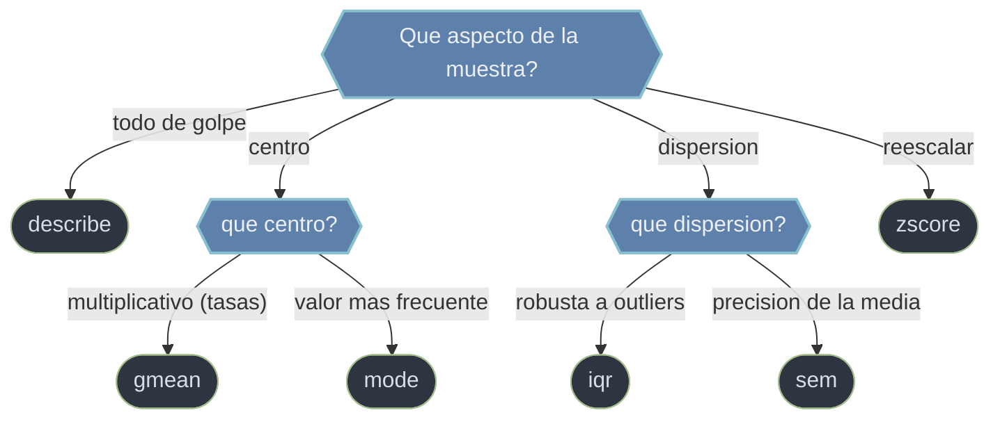

# descriptiva — resumir y diagnosticar una muestra

Esta carpeta reune las funciones de `scipy.stats` que **describen** una muestra: en vez de modelar o contrastar, condensan los datos en unos pocos numeros que dicen **donde estan centrados**, **cuanto se dispersan**, **que forma tienen** y como reescalarlos. Es el primer paso de cualquier analisis: mirar antes de inferir. Todas operan sobre arrays de numpy y devuelven escalares o objetos-resultado (namedtuples) accesibles por atributo. La pieza central es `describe`, que en una sola pasada reemplaza a media, varianza, min, max y momentos por separado; el resto son medidas puntuales que cubren lo que `describe` no calcula (media geometrica, moda, rango intercuartilico, error estandar) o que transforman la muestra (`zscore`).

## En accion

```python
import numpy as np
from scipy import stats

muestra = np.array([2.0, 4.0, 4.0, 4.0, 5.0, 5.0, 7.0, 9.0])

# Resumen univariante de una sola pasada (DescribeResult)
r = stats.describe(muestra)
r.nobs, r.minmax        # → 8 , (2.0, 9.0)
r.mean, r.variance      # → 5.0 , 4.571...   (varianza muestral, ddof=1)
r.skewness              # → ~0.5  (>0: cola hacia valores altos)

# Estandarizar la muestra a z-scores: (x - media) / desviacion
z = stats.zscore(muestra)
z.mean(), z.std()       # → ~0.0 , ~1.0  (centrada y de escala 1)
```

## Que mide cada funcion



## Contenido

### [[scipy.stats.describe\|describe]]
Resumen univariante en una sola pasada: devuelve `nobs`, `minmax`, `mean`, `variance`, `skewness` y `kurtosis` en un objeto `DescribeResult`. Mide centro (media), dispersion (varianza, **muestral** por defecto, `ddof=1`) y forma (asimetria; y curtosis **de Fisher**, comparada contra 0, no contra 3). Es el diagnostico rapido de una muestra antes de cualquier otra cosa.

### gmean
Media **geometrica**: la raiz n-esima del producto de los valores. Es el promedio correcto para magnitudes **multiplicativas** (tasas de crecimiento, factores, razones) y para datos en escala log. Exige valores positivos; resiste menos a los ceros que la media aritmetica, que los ignora.

### mode
**Moda**: el valor (o valores) mas frecuente de la muestra. Util en datos discretos o categoricos donde la media no tiene sentido. Devuelve un objeto-resultado con `mode` y `count`; ante empates toma el menor.

### iqr
**Rango intercuartilico** `Q3 - Q1`: la anchura del 50% central de los datos. Es una medida de dispersion **robusta a outliers** (no la arrastran los valores extremos como a la varianza), base de los diagramas de caja y del criterio `1.5*IQR` para marcar atipicos.

### sem
**Error estandar de la media**: `desviacion / sqrt(n)`. No mide la dispersion de los datos sino la **precision con la que se estima la media**; baja al crecer `n`. Es el bloque con el que se construyen los intervalos de confianza de la media.

### zscore
**Estandarizacion**: transforma cada dato en `(x - media) / desviacion`, dejando la muestra con media 0 y desviacion 1. No resume, **reescala**: permite comparar variables en distintas unidades y es el paso previo de muchos algoritmos. Usa `ddof` para elegir entre desviacion muestral o poblacional.

## Tabla de decision

| Quiero... | Funcion |
|-----------|---------|
| Centro, dispersion y forma de una muestra | `describe` |
| Promedio de tasas o factores multiplicativos | `gmean` |
| Valor mas frecuente (datos discretos) | `mode` |
| Dispersion robusta a outliers | `iqr` |
| Precision con que estimo la media | `sem` |
| Centrar y escalar a media 0, desviacion 1 | `zscore` |

## Notas relacionadas

- [[scipy.stats/distribuciones/index\|distribuciones]] — modelar la muestra con una distribucion parametrica
- [[scipy.stats.gaussian_kde]] — densidad empirica de una muestra (forma, no resumen numerico)
- [[rv_continuous]] — el modelo de objeto de distribucion
