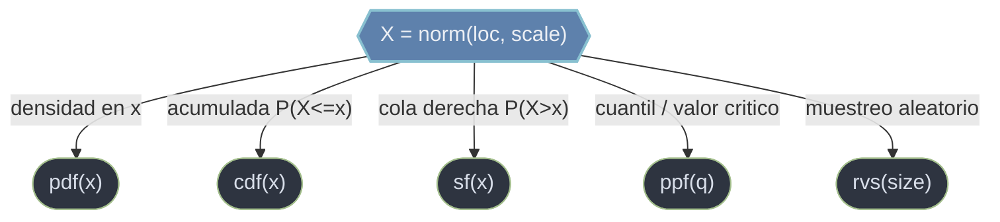

# distribuciones — objetos de distribucion de probabilidad

Esta carpeta reune los **objetos-distribucion** de `scipy.stats`: la normal, la t, la chi-cuadrado, la uniforme, la binomial, la poisson... Cada uno representa una distribucion de probabilidad concreta y expone **siempre la misma API de metodos** para evaluar su densidad, su acumulada, sus cuantiles y para muestrear de ella. Aprendida esa API una vez, se aplica identica a cualquier distribucion. Son la base de la inferencia: de aqui salen los p-valores y los valores criticos que usan los tests.

## Modelo mental: un objeto, dos formas de parametrizar

Una distribucion no es una funcion suelta sino un **objeto** con metodos. Hay dos maneras de fijar sus parametros:

- **Llamada con parametros**: se pasan `loc`, `scale` (y los de forma) en **cada** metodo. `norm.cdf(12, loc=10, scale=2)`. Comodo para una consulta puntual.
- **Distribucion congelada (frozen)**: `X = norm(loc=10, scale=2)` crea un objeto con los parametros ya incrustados; sus metodos se llaman sin repetirlos (`X.cdf(12)`). Preferible cuando se hacen varias consultas sobre la misma distribucion.

Todos comparten dos parametros universales: `loc` (desplaza) y `scale` (estira). Encima, cada distribucion añade sus **parametros de forma** (p. ej. `df`, o `n, p`), que van primero en cada llamada. Las **continuas** (instancias de `rv_continuous`) usan `.pdf` (densidad, puede pasar de 1); las **discretas** (`rv_discrete`, como `binom` o `poisson`) la reemplazan por **`.pmf(k)`** (probabilidad exacta de un valor) y no admiten `scale` ni `.fit`.

## En accion

```python
import numpy as np
from scipy.stats import norm

# Crear una normal congelada con media y desviacion
X = norm(loc=10, scale=2)        # frozen: una N(10, 2) reutilizable

# Evaluar la API comun sobre el objeto congelado
X.pdf(10)        # densidad en la media → 0.1995
X.cdf(12)        # P(X <= 12) → 0.8413  (una sigma por encima)
X.ppf(0.975)     # cuantil 0.975 (valor critico) → 13.92

# Muestrear: 5 valores aleatorios de esa N(10, 2)
muestra = X.rvs(size=5, random_state=0)
muestra.shape    # → (5,)
```

## Una distribucion, su API de metodos



`cdf` y `ppf` son inversas; `sf`/`isf` son la cola derecha (preferibles a `1 - cdf` para p-valores). En las discretas, `pdf` se vuelve `pmf`.

## Contenido

### [[rv_continuous\|rv_continuous]]
La nota **gobernante** del submodulo: documenta el modelo de objeto comun (parametros `loc`/`scale`, los metodos transversales, frozen vs con parametros, continua vs discreta). Las distribuciones concretas referencian esta nota y solo detallan lo suyo. Empieza por aqui.

### [[scipy.stats.norm\|norm]]
La **normal** (gaussiana), la campana. Sin parametros de forma: `loc` es la media `mu` y `scale` la desviacion tipica `sigma`. Con `(0, 1)` es la normal estandar; de ella salen los valores clasicos `norm.ppf(0.975) ≈ 1.96`. Base del teorema central del limite y de la inferencia.

### [[scipy.stats.uniform\|uniform]]
La **uniforme continua**: densidad constante en un intervalo. Clave: el intervalo **no** se da con extremos `a, b` sino como `[loc, loc+scale]`, donde `scale` es el **ancho** (no el extremo superior). Para `[2, 5]` se usa `loc=2, scale=3`.

### [[scipy.stats.binom\|binom]]
La **binomial** (discreta): numero de exitos en `n` ensayos independientes con probabilidad `p`. Por ser discreta usa **`.pmf(k)`** (probabilidad exacta de `k` exitos), no `.pdf`, y carece de `scale` y `.fit`. Es el ejemplo canonico del modelo `rv_discrete`.

### poisson
La **poisson** (discreta): numero de eventos en un intervalo fijo cuando ocurren a una tasa media `mu` (su unico parametro). Limite de la binomial con `n` grande y `p` pequeño. Como toda discreta usa `.pmf(k)`; tipica para conteos (llamadas por hora, defectos por lote).

### [[scipy.stats.t\|t]]
La **t de Student**: simetrica como la normal pero con **colas mas pesadas**, controladas por `df`. Modela la incertidumbre de estimar la varianza con muestras pequeñas; al crecer `df` tiende a la normal. Su uso estrella: `t.ppf(1-alfa/2, df=n-1)` da el multiplicador del intervalo de confianza de la media.

### [[scipy.stats.chi2\|chi2]]
La **chi-cuadrado**: suma de cuadrados de normales estandar, soporte no negativo y asimetrica a la derecha, parametrizada por `df`. Aparece en tests de bondad de ajuste e independencia. El p-valor de esos tests es la **cola derecha** `chi2.sf(estadistico, df)`.

## Tabla de decision

| Quiero modelar / consultar... | Objeto | Tipo |
|-------------------------------|--------|------|
| Variable en campana, media y desviacion | `norm` | continua |
| Valor equiprobable en un intervalo | `uniform` | continua |
| Numero de exitos en `n` ensayos | `binom` | discreta |
| Conteo de eventos a tasa media `mu` | `poisson` | discreta |
| Estadistico t / IC de la media (n pequeño) | `t` | continua |
| Estadistico de un test chi-cuadrado | `chi2` | continua |
| La API comun de metodos | `rv_continuous` | modelo |

## Notas relacionadas

- [[scipy.stats.gaussian_kde]] — estimar una densidad empirica cuando no hay distribucion parametrica
- [[scipy.stats/tests/index\|tests]] — los contrastes que consumen estas distribuciones
- [[scipy.stats.shapiro]] — test de normalidad
