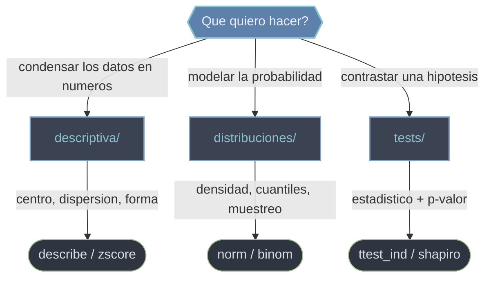

# scipy.stats — estadistica, distribuciones y tests

`scipy.stats` es el submodulo de **estadistica**. Cubre el ciclo completo de un analisis: primero **resumir** una muestra en unos pocos numeros (centro, dispersion, forma), luego **modelar** la aleatoriedad con objetos-distribucion (la normal, la binomial, la t...) que dan densidades, cuantiles y muestras, y por ultimo **contrastar hipotesis** con tests que devuelven un estadistico y un p-valor. Las tres tareas se apoyan unas en otras: los tests usan distribuciones para calcular sus p-valores, y la descriptiva es el diagnostico previo que decide que modelo y que test tienen sentido.

## En accion

```python
import numpy as np
from scipy import stats

# 1. Modelar probabilidad con la normal: densidad, acumulada y cuantil critico
stats.norm.pdf(0)            # densidad en 0 de la N(0,1) → 0.3989
stats.norm.cdf(1.96)         # P(X <= 1.96) → 0.975
stats.norm.ppf(0.975)        # cuantil 0.975 (el famoso 1.96) → 1.959...

# 2. Resumir una muestra (centro, dispersion, forma) en una llamada
muestra = np.array([2.0, 4.0, 4.0, 4.0, 5.0, 5.0, 7.0, 9.0])
r = stats.describe(muestra)
r.mean, r.variance           # → 5.0 , 4.571...  (varianza muestral, ddof=1)

# 3. Contrastar dos medias independientes: leer el p-valor
control = np.array([5.1, 4.9, 5.3, 5.0, 4.8])
tratado = np.array([5.6, 5.8, 5.5, 5.9, 6.0])
t, p = stats.ttest_ind(control, tratado, equal_var=False)
p < 0.05                     # True → se rechaza H0: las medias difieren
```

## Que carpeta uso



## Subcarpetas

### [[scipy.stats/descriptiva/index\|descriptiva]]
Resumir y diagnosticar una muestra **antes** de inferir. Reune `describe` (resumen univariante de una pasada: n, min/max, media, varianza, asimetria, curtosis) junto a medidas puntuales como `gmean`, `mode`, `iqr`, `sem` y la estandarizacion `zscore`. No modela ni contrasta: condensa los datos en numeros que dicen donde estan, cuanto se dispersan y que forma tienen. Es el primer paso obligado: mirar antes de inferir.

### [[scipy.stats/distribuciones/index\|distribuciones]]
Los **objetos-distribucion** (normal, t, chi-cuadrado, uniforme, binomial). Cada uno expone **siempre la misma API** (`pdf`/`pmf`, `cdf`, `sf`, `ppf`, `rvs`) para evaluar densidades, acumuladas, cuantiles y muestrear. Aprendida una vez, vale para todas. Son la maquinaria que convierte un estadistico en un p-valor o un valor critico, asi que sostienen la inferencia entera.

### [[scipy.stats/tests/index\|tests]]
Los **tests de hipotesis**: comparar medias (`ttest_ind`, `ttest_rel`), bondad de ajuste (`chisquare`), igualdad de distribuciones (`ks_2samp`), normalidad (`shapiro`) o correlacion (`pearsonr`). Todos devuelven un **objeto-resultado** con `.statistic` y `.pvalue`; la decision se toma comparando el p-valor contra un `alfa` fijado de antemano.

## Tabla de orientacion

| Quiero... | Carpeta | Rutina tipica |
|-----------|---------|---------------|
| Resumir una muestra (centro, dispersion, forma) | [[scipy.stats/descriptiva/index\|descriptiva]] | `describe` |
| Estandarizar datos a z-scores | [[scipy.stats/descriptiva/index\|descriptiva]] | `zscore` |
| Densidad, acumulada o cuantil de una distribucion | [[scipy.stats/distribuciones/index\|distribuciones]] | `norm.pdf` / `norm.ppf` |
| Muestrear de una distribucion | [[scipy.stats/distribuciones/index\|distribuciones]] | `norm.rvs` / `binom.rvs` |
| Comparar las medias de dos grupos | [[scipy.stats/tests/index\|tests]] | `ttest_ind` |
| Comprobar normalidad de una muestra | [[scipy.stats/tests/index\|tests]] | `shapiro` |

## Notas relacionadas

- [[rv_continuous]] — el modelo de objeto comun a todas las distribuciones
- [[scipy.stats.gaussian_kde]] — densidad empirica cuando no hay distribucion parametrica
- [[concepto_objetos_resultado]] — el namedtuple/Bunch que devuelven describe y los tests
