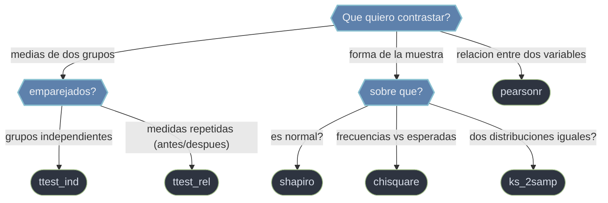

# tests — contrastes de hipotesis

Esta carpeta reune los **tests de hipotesis** de `scipy.stats`: rutinas que toman una o dos muestras y deciden si una afirmacion sobre la poblacion es compatible con los datos. Todas siguen el mismo molde: plantean una hipotesis nula **H0**, calculan un **estadistico** que mide cuanto se desvian los datos de esa H0 y lo traducen a un **p-valor** (la probabilidad de ver algo igual o mas extremo si H0 fuera cierta). Devuelven un **objeto-resultado** con `.statistic` y `.pvalue`, desempaquetable como tupla. La decision se toma comparando el p-valor contra un nivel `alfa` fijado **antes** de mirar los datos: `p < alfa` rechaza H0.

## En accion

```python
import numpy as np
from scipy.stats import ttest_ind

# Dos grupos independientes (sin emparejar)
control = np.array([5.1, 4.9, 5.3, 5.0, 4.8])
tratado = np.array([5.6, 5.8, 5.5, 5.9, 6.0])

# t-test de Welch (no asume varianzas iguales)
res = ttest_ind(control, tratado, equal_var=False)
res.statistic     # → -6.0...  (negativo: media de control < media de tratado)
res.pvalue        # → ~0.0003

alfa = 0.05
if res.pvalue < alfa:
    print("Se rechaza H0: las medias difieren")   # este caso
else:
    print("No se rechaza H0")
```

> Ojo a la **direccion** de H0. En `ttest_ind` un p bajo apoya que las medias **difieren**. En `shapiro` H0 es que la muestra **es** normal, asi que un p **alto** apoya la normalidad: el sentido inverso al habitual.

## Que test uso



## Contenido

### [[scipy.stats.ttest_ind\|ttest_ind]]
t-test de **dos muestras independientes**: contrasta si dos grupos distintos (control vs tratamiento) tienen la misma media. Las muestras no necesitan igual longitud. Conviene `equal_var=False` (test de Welch), mas robusto cuando varianzas o tamaños difieren. El signo de `statistic` indica la direccion de la diferencia.

### [[scipy.stats.ttest_rel\|ttest_rel]]
t-test **pareado** (de medidas repetidas): para el **mismo** sujeto medido dos veces (antes/despues, dos metodos sobre los mismos items). Trabaja sobre las **diferencias** intra-sujeto, lo que elimina la variabilidad entre individuos y gana potencia. Exige muestras de igual longitud y emparejadas en orden.

### [[scipy.stats.chisquare\|chisquare]]
Test chi-cuadrado de **bondad de ajuste**: compara las frecuencias **observadas** de categorias contra las **esperadas** bajo un modelo. H0: los datos siguen las proporciones esperadas. El p-valor sale de la cola derecha de la chi-cuadrado. Trabaja con conteos, no con proporciones.

### [[scipy.stats.kstest\|ks_2samp]]
Test de Kolmogorov-Smirnov de **dos muestras**: contrasta si dos muestras provienen de la **misma distribucion**, comparando sus acumuladas empiricas. No parametrico (no asume normalidad) y sensible a diferencias de forma completa, no solo de media. (En esta carpeta, `kstest` cubre tambien el caso de una muestra contra una distribucion teorica.)

### [[scipy.stats.shapiro\|shapiro]]
Test de **normalidad** de Shapiro-Wilk: contrasta si una muestra proviene de una distribucion normal. H0 = la muestra **es** normal, asi que un p **alto** apoya la normalidad. De los mas potentes en muestras pequeñas a medianas. Util como chequeo de supuestos antes de un t-test.

### pearsonr
Coeficiente de correlacion **lineal** de Pearson con su p-valor: mide la asociacion lineal `r ∈ [-1, 1]` entre dos variables y contrasta H0 de que no hay correlacion. Sensible a outliers; el p-valor asume normalidad bivariada. Para relaciones monotonas no lineales o con atipicos, su pareja es la correlacion de rangos.

## Tabla de decision

| Quiero contrastar... | Test | H0 |
|----------------------|------|----|
| Medias de dos grupos independientes | `ttest_ind` | medias iguales |
| Medias de medidas repetidas (pareadas) | `ttest_rel` | diferencia media = 0 |
| Frecuencias observadas vs esperadas | `chisquare` | ajustan al modelo |
| Dos muestras de la misma distribucion | `ks_2samp` | misma distribucion |
| Una muestra es normal | `shapiro` | es normal (p alto la apoya) |
| Correlacion lineal entre dos variables | `pearsonr` | no hay correlacion |

## Notas relacionadas

- [[scipy.stats/distribuciones/index\|distribuciones]] — las distribuciones que dan los p-valores y valores criticos
- [[scipy.stats/descriptiva/index\|descriptiva]] — el diagnostico previo que decide que test tiene sentido
- [[scipy.stats.chi2]] — la distribucion detras de `chisquare`
