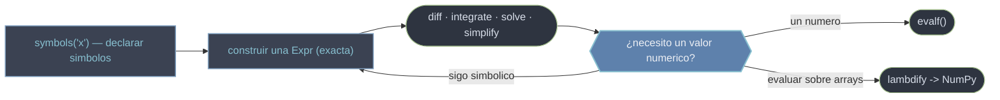

# SymPy — matematica simbolica exacta

SymPy es la biblioteca de **matematica simbolica** de Python: codigo abierto, en Python puro, sin dependencias. Permite derivar, integrar, factorizar, resolver ecuaciones y simplificar expresiones de forma **exacta**, conservando la estructura algebraica en lugar de aproximarla con flotantes. La diferencia de naturaleza con NumPy es la clave: NumPy opera sobre arrays de punto flotante (rapido, aproximado); SymPy opera sobre **expresiones simbolicas exactas** (`Expr`, arboles inmutables). El puente entre ambos mundos es `lambdify`.

## En accion

El patron mas comun: obtener la formula simbolica, verificarla con SymPy, y compilarla a NumPy para evaluacion masiva.

```python
from sympy import symbols, diff, solve, lambdify, sqrt, Rational
import numpy as np

x = symbols("x")                  # un simbolo, no una variable con valor

sqrt(8)          # 2*sqrt(2)      — exacto, no 2.828...
Rational(1, 3)   # 1/3            — no 0.333...

f = x**3 - 3*x + 2
diff(f, x)       # 3*x**2 - 3     — derivada exacta (una Expr)
solve(f, x)      # [-2, 1]        — soluciones exactas

f_num = lambdify(x, f, "numpy")   # compila la Expr a funcion NumPy
f_num(np.linspace(-2, 2, 5))      # array([0., 3.375, 2., 0.625, 0.])
```

## La idea central

Todo en SymPy es una instancia de [[concepto_expr_arbol|Expr]], un arbol de expresion inmutable. Los simbolos no son variables de Python con valor: son objetos algebraicos que se declaran con `symbols`. SymPy **no evalua** mas alla de lo trivial (`x + x` -> `2*x`); conserva la forma exacta hasta que se le pide un valor numerico. La exactitud es la norma; la aproximacion es opt-in.

## El flujo simbolico -> numerico



> [!tip] Regla practica
> Trabaja **simbolico el mayor tiempo posible** y pasa a numerico solo al final (`evalf` para un numero, `lambdify` para arrays). Mezclar flotantes de Python con expresiones SymPy contamina la precision.

## Cuando usar SymPy

| Necesidad | Herramienta |
|-----------|-------------|
| Resultado exacto (radicales, pi, fracciones) | SymPy |
| Derivar, integrar o resolver en forma cerrada | SymPy |
| Calculo numerico masivo (arrays grandes) | NumPy / SciPy |
| Simulacion u optimizacion numerica | SciPy |
| Generar codigo a partir de expresiones | SymPy -> `lambdify` / `ccode` |

## Mapa de submodulos

| Submodulo | Que aporta |
|-----------|-----------|
| [[conceptos_transversales/index\|conceptos_transversales]] | Las ideas que gobiernan la libreria; leerlas antes de cualquier submodulo |
| [[sympy.core/index\|sympy.core]] | El nucleo: simbolos, numeros exactos, `Expr`, sustitucion (`subs`) |
| [[sympy.simplify/index\|sympy.simplify]] | Reescribir una expresion en una forma equivalente mas simple |
| [[sympy.polys/index\|sympy.polys]] | Polinomios: expandir, factorizar y operar |
| [[sympy.calculus/index\|sympy.calculus]] | Derivadas, integrales, limites, series y sumatorios |
| [[sympy.solvers/index\|sympy.solvers]] | Resolver ecuaciones, sistemas, EDOs y recurrencias |
| [[sympy.matrices/index\|sympy.matrices]] | Algebra lineal simbolica con la clase `Matrix` |
| [[sympy.functions/index\|sympy.functions]] | Funciones matematicas simbolicas |
| [[sympy.sets/index\|sympy.sets]] | Conjuntos simbolicos: intervalos, finitos, operaciones |
| [[sympy.logic/index\|sympy.logic]] | Logica booleana simbolica |
| [[sympy.assumptions/index\|sympy.assumptions]] | Supuestos sobre simbolos y consultas |
| [[sympy.ntheory/index\|sympy.ntheory]] | Teoria de numeros |
| [[sympy.geometry/index\|sympy.geometry]] | Geometria analitica simbolica |
| [[sympy.stats/index\|sympy.stats]] | Probabilidad simbolica |
| [[sympy.physics.units/index\|sympy.physics.units]] | Magnitudes y unidades fisicas |
| [[sympy.printing/index\|sympy.printing]] | Render y generacion de codigo a partir de expresiones |

## Por donde empezar

1. **`conceptos_transversales`** — el modelo mental: que es una `Expr`, como funcionan los supuestos, exacto vs flotante, `evalf` y `lambdify`.
2. **`sympy.core`** — simbolos, numeros exactos (`Rational`, `Integer`), expresiones y sustitucion.
3. **`sympy.calculus`** — derivadas, integrales, limites, series.
4. **`sympy.solvers`** — `solve`, `solveset`, `dsolve`, sistemas.

## Notas relacionadas

- [[concepto_simbolico_vs_numerico]] — la frontera exacto vs flotante
- [[concepto_expr_arbol]] — que es una `Expr`
