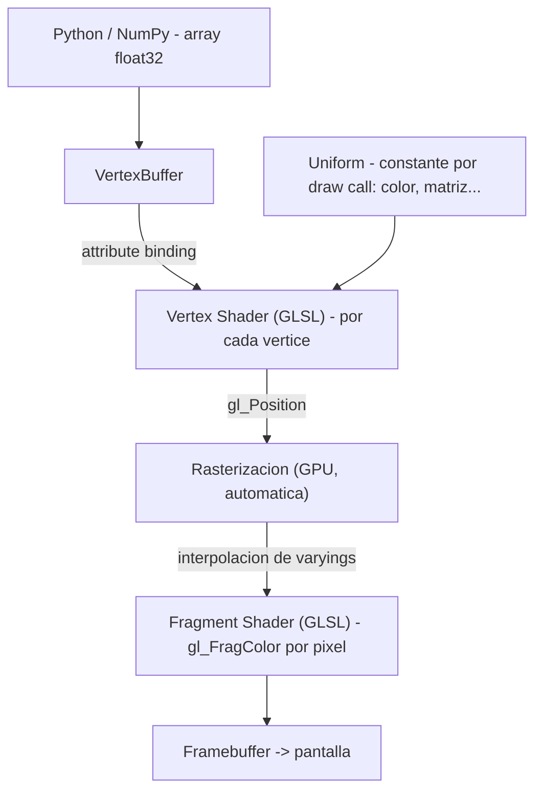

# Pipeline GPU de bajo nivel con vispy.gloo

`vispy.gloo` es un wrapper Pythonizado sobre OpenGL: permite escribir vertex y fragment
shaders en GLSL, subir datos al GPU via buffers y dibujar geometria con `program.draw()`.
Es el nivel que `vispy.scene` usa internamente, pero que el usuario raramente toca — a
menos que necesite control total del shader: efectos personalizados, geometria procedural
o rendering que `scene` no soporta. Si `scene` alcanza, usarlo; `gloo` es para el 5 % de
los casos donde el control del shader es imprescindible.

## La idea central

El ciclo minimo de `gloo` es: definir shaders GLSL en strings → compilar con `Program` →
subir datos con `VertexBuffer` → llamar `program.draw('triangles')` dentro de `on_draw`.
Todo ocurre en la GPU; Python solo transfiere datos y dispara el draw call.

```python
import vispy
vispy.use('pyqt5')
from vispy import app, gloo

VERT = """
attribute vec2 a_position;
void main() {
    gl_Position = vec4(a_position, 0.0, 1.0);
}
"""

FRAG = """
uniform vec4 u_color;
void main() {
    gl_FragColor = u_color;
}
"""

canvas = app.Canvas(size=(600, 600), keys='interactive')
program = gloo.Program(VERT, FRAG)
program['a_position'] = [(-0.5, -0.5), (0.5, -0.5), (0.0, 0.5)]  # triangulo
program['u_color'] = (1.0, 0.4, 0.0, 1.0)                         # naranja

@canvas.connect
def on_draw(event):
    gloo.clear('black')
    program.draw('triangles')

@canvas.connect
def on_resize(event):
    gloo.set_viewport(0, 0, *event.size)

canvas.show()
app.run()
```

## Como funciona

### Arquitectura del pipeline



### `Program`: compilar shaders y asignar datos

```python
import vispy
vispy.use('pyqt5')
from vispy import app, gloo
import numpy as np

VERT = """
attribute vec2 a_position;
attribute vec3 a_color;
varying vec3 v_color;
void main() {
    gl_Position = vec4(a_position, 0.0, 1.0);
    v_color = a_color;
}
"""

FRAG = """
varying vec3 v_color;
void main() {
    gl_FragColor = vec4(v_color, 1.0);
}
"""

canvas = app.Canvas(size=(600, 600), keys='interactive')
program = gloo.Program(VERT, FRAG)

# Vertices con color por vertice (interleaved o por separado)
vertices = np.array([
    [(-0.8, -0.8), (1.0, 0.0, 0.0)],   # rojo
    [( 0.8, -0.8), (0.0, 1.0, 0.0)],   # verde
    [( 0.0,  0.8), (0.0, 0.0, 1.0)],   # azul
], dtype=[('a_position', 'f4', 2), ('a_color', 'f4', 3)])

program.bind(gloo.VertexBuffer(vertices))

@canvas.connect
def on_draw(event):
    gloo.clear('black')
    program.draw('triangles')

@canvas.connect
def on_resize(event):
    gloo.set_viewport(0, 0, *event.size)

canvas.show()
app.run()
```

### Uniforms y actualizacion dinamica

Los uniforms son variables globales del shader (iguales para todos los vertices de un draw
call). Se actualizan desde Python en cualquier momento antes de `program.draw()`.

```python
import vispy
vispy.use('pyqt5')
from vispy import app, gloo
import numpy as np, math

VERT = """
attribute vec2 a_position;
uniform float u_time;
void main() {
    vec2 pos = a_position;
    pos.x += 0.3 * sin(u_time + pos.y * 5.0);  // onda
    gl_Position = vec4(pos, 0.0, 1.0);
}
"""

FRAG = """
void main() {
    gl_FragColor = vec4(0.2, 0.8, 1.0, 1.0);
}
"""

canvas = app.Canvas(size=(600, 600), keys='interactive')
program = gloo.Program(VERT, FRAG)

n = 200
y = np.linspace(-1, 1, n).astype('float32')
x = np.zeros(n, dtype='float32')
program['a_position'] = np.column_stack([x, y])
program['u_time'] = 0.0

t = [0.0]

@canvas.connect
def on_draw(event):
    gloo.clear('black')
    program['u_time'] = t[0]
    program.draw('line_strip')

timer = app.Timer(interval=1/60,
                  connect=lambda e: (t.__setitem__(0, t[0] + 0.05), canvas.update()),
                  start=True)

@canvas.connect
def on_resize(event):
    gloo.set_viewport(0, 0, *event.size)

canvas.show()
app.run()
```

### Modos de dibujo (`program.draw(mode)`)

| Modo | Geometria |
|------|-----------|
| `'points'` | Un punto por vertice (`gl_PointSize` lo controla) |
| `'lines'` | Pares de vertices forman segmentos independientes |
| `'line_strip'` | Vertices consecutivos forman una linea continua |
| `'triangles'` | Trios de vertices forman triangulos independientes |
| `'triangle_strip'` | Triangulos compartiendo aristas |

## Casos de uso

### Caso 1: scatter de puntos con tamano variable

```python
import vispy
vispy.use('pyqt5')
from vispy import app, gloo
import numpy as np

VERT = """
attribute vec2 a_position;
attribute float a_size;
attribute vec4 a_color;
varying vec4 v_color;
void main() {
    gl_Position = vec4(a_position, 0.0, 1.0);
    gl_PointSize = a_size;
    v_color = a_color;
}
"""

FRAG = """
varying vec4 v_color;
void main() {
    float d = length(gl_PointCoord - vec2(0.5));
    if (d > 0.5) discard;               // recorte circular
    gl_FragColor = v_color;
}
"""

canvas = app.Canvas(size=(700, 700), keys='interactive')
program = gloo.Program(VERT, FRAG)

n = 500
data = np.zeros(n, dtype=[('a_position', 'f4', 2),
                           ('a_size',     'f4'),
                           ('a_color',    'f4', 4)])
data['a_position'] = np.random.uniform(-0.9, 0.9, (n, 2))
data['a_size']     = np.random.uniform(5, 20, n)
data['a_color']    = np.random.uniform(0.3, 1.0, (n, 4))
data['a_color'][:, 3] = 0.8             # alpha

program.bind(gloo.VertexBuffer(data))

@canvas.connect
def on_draw(event):
    gloo.clear((0.05, 0.05, 0.05, 1.0))
    gloo.set_state(blend=True,
                   blend_func=('src_alpha', 'one_minus_src_alpha'))
    program.draw('points')

@canvas.connect
def on_resize(event):
    gloo.set_viewport(0, 0, *event.size)

canvas.show()
app.run()
```

### Caso 2: textura desde array NumPy

```python
import vispy
vispy.use('pyqt5')
from vispy import app, gloo
import numpy as np

VERT = """
attribute vec2 a_position;
attribute vec2 a_texcoord;
varying vec2 v_texcoord;
void main() {
    gl_Position = vec4(a_position, 0.0, 1.0);
    v_texcoord = a_texcoord;
}
"""

FRAG = """
uniform sampler2D u_texture;
varying vec2 v_texcoord;
void main() {
    gl_FragColor = texture2D(u_texture, v_texcoord);
}
"""

canvas = app.Canvas(size=(600, 600), keys='interactive')
program = gloo.Program(VERT, FRAG)

# Quad que cubre el canvas en NDC
vertices = np.array([(-1,-1, 0,0), (1,-1, 1,0), (-1,1, 0,1), (1,1, 1,1)],
                    dtype=[('a_position', 'f4', 2), ('a_texcoord', 'f4', 2)])
program.bind(gloo.VertexBuffer(vertices))

# Textura: gradiente de ruido
img = np.random.rand(128, 128).astype('float32')
program['u_texture'] = gloo.Texture2D(img, interpolation='linear')

@canvas.connect
def on_draw(event):
    gloo.clear('black')
    program.draw('triangle_strip')

@canvas.connect
def on_resize(event):
    gloo.set_viewport(0, 0, *event.size)

canvas.show()
app.run()
```

## Errores comunes

| Error | Causa | Solucion |
|-------|-------|----------|
| `CompileError` en el shader | Error de sintaxis GLSL o tipo incorrecto | Revisar el shader; GLSL es C estricto — no hay `int + float` implicito |
| Pantalla negra sin error | `on_resize` no llama `gloo.set_viewport` y el viewport es de tamano cero | Conectar `on_resize` con `gloo.set_viewport(0, 0, *event.size)` |
| `KeyError` al asignar `program['x']` | El nombre del attribute/uniform no existe en el shader o esta siendo optimizado por el compilador GLSL | Verificar que la variable se usa realmente en el shader |
| Los datos no coinciden con el shader | `dtype` del array no coincide con el tipo del attribute (`vec2` espera `float32`, no `float64`) | Usar `.astype('float32')` siempre |
| `gloo` y `scene` mezclados | Crear un `SceneCanvas` y llamar a `gloo.clear()` en su `on_draw` produce conflicto | Usar `app.Canvas` (bajo nivel) con `gloo`, no `SceneCanvas` |

## Notas relacionadas

- [[concepto_canvas_app]] — el `app.Canvas` que provee el contexto OpenGL para `gloo`
- [[concepto_scene_graph]] — la API de alto nivel que usa `gloo` internamente
- [[concepto_cameras_transforms]] — en `gloo` las proyecciones son matrices de uniforms manuales
- [[Tree VisPy]]
