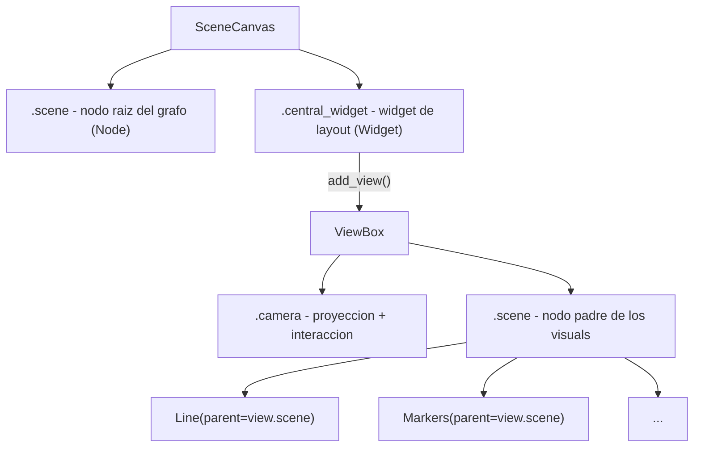

# Scene graph, ViewBox y visuals en vispy.scene

El scene graph de `vispy.scene` es un grafo dirigido de nodos donde cada nodo puede tener
hijos. Las transformaciones se propagan en cascada desde padres hacia hijos. Este modelo
reemplaza el concepto de "axes" de Matplotlib: en VisPy no hay axes — hay un arbol de nodos
con camaras, visuals y transformaciones. Entender el scene graph es la clave para saber
**donde agregar cada objeto** y **por que se ve donde se ve**.

## La idea central

El `SceneCanvas` tiene dos puntos de entrada: `.scene` (el nodo raiz del grafo) y
`.central_widget` (el widget de layout raiz). El **ViewBox** es el nodo clave del scene
graph: define un viewport, una camara y un area de clip. Los visuals se agregan siempre
como hijos de `view.scene` usando `parent=view.scene`.

```python
import vispy
vispy.use('pyqt5')
from vispy import scene, app
import numpy as np

canvas = scene.SceneCanvas(keys='interactive', show=True, size=(800, 600))
view = canvas.central_widget.add_view()         # ViewBox que ocupa todo el canvas
view.camera = 'panzoom'                         # camara 2D interactiva

pos = np.random.rand(100, 2).astype('float32')
scatter = scene.visuals.Markers(parent=view.scene)
scatter.set_data(pos, face_color='cyan', size=8)

app.run()
```

## Como funciona

### Jerarquia de nodos



Cada `Visual` es un nodo. Al pasar `parent=view.scene` se inserta como hijo del nodo raiz
del `ViewBox`. La transformacion de la camara se aplica automaticamente a todos los hijos.

### Agregar visuals: la forma correcta

```python
import vispy
vispy.use('pyqt5')
from vispy import scene, app
import numpy as np

canvas = scene.SceneCanvas(keys='interactive', show=True, size=(800, 600))
view = canvas.central_widget.add_view()
view.camera = 'turntable'               # camara 3D

# Forma correcta: parent=view.scene
x = np.linspace(-1, 1, 200).astype('float32')
pos = np.column_stack([x, np.sin(x * 5), np.zeros_like(x)])
line = scene.visuals.Line(pos=pos, color='lime', parent=view.scene)

# Ajustar rango inicial de la camara
view.camera.set_range(x=(-1.2, 1.2), y=(-1.2, 1.2))

app.run()
```

### Multiples ViewBox (subplots)

```python
import vispy
vispy.use('pyqt5')
from vispy import scene, app
import numpy as np

canvas = scene.SceneCanvas(keys='interactive', show=True, size=(1200, 500))
grid = canvas.central_widget.add_grid()    # layout en grilla

# ViewBox izquierdo: 2D
view1 = grid.add_view(row=0, col=0)
view1.camera = 'panzoom'
view1.border_color = 'white'

# ViewBox derecho: 3D
view2 = grid.add_view(row=0, col=1)
view2.camera = 'turntable'
view2.border_color = 'white'

x = np.linspace(0, 2 * np.pi, 300).astype('float32')
scene.visuals.Line(pos=np.column_stack([x, np.sin(x)]), color='cyan',
                   parent=view1.scene)

pts = np.random.randn(500, 3).astype('float32')
scene.visuals.Markers(parent=view2.scene).set_data(pts, face_color='orange', size=5)

app.run()
```

### Transformaciones en cascada

```python
import vispy
vispy.use('pyqt5')
from vispy import scene, app
from vispy.visuals.transforms import STTransform
import numpy as np

canvas = scene.SceneCanvas(keys='interactive', show=True, size=(800, 600))
view = canvas.central_widget.add_view()
view.camera = 'panzoom'

pos = np.array([[0, 0], [1, 0], [1, 1], [0, 1], [0, 0]], dtype='float32')
line = scene.visuals.Line(pos=pos, color='white', parent=view.scene)

# Aplicar transformacion: escalar x2 y trasladar (3, 2)
line.transform = STTransform(scale=(2, 2), translate=(3, 2))

view.camera.set_range(x=(-1, 8), y=(-1, 6))
app.run()
```

## Casos de uso

### Caso 1: imagen con overlay de marcadores

```python
import vispy
vispy.use('pyqt5')
from vispy import scene, app
import numpy as np

canvas = scene.SceneCanvas(keys='interactive', show=True, size=(800, 600))
view = canvas.central_widget.add_view()
view.camera = 'panzoom'

# Imagen de fondo
img_data = np.random.rand(256, 256).astype('float32')
image = scene.visuals.Image(img_data, cmap='grays', parent=view.scene)

# Marcadores encima — mismo parent, se superponen por orden de creacion
pts = np.random.rand(20, 2).astype('float32') * 256
markers = scene.visuals.Markers(parent=view.scene)
markers.set_data(pts, face_color='red', size=10)

view.camera.set_range()
app.run()
```

### Caso 2: actualizar datos en tiempo real

```python
import vispy
vispy.use('pyqt5')
from vispy import scene, app
import numpy as np

canvas = scene.SceneCanvas(keys='interactive', show=True, size=(800, 600))
view = canvas.central_widget.add_view()
view.camera = 'panzoom'

n = 500
pos = np.zeros((n, 2), dtype='float32')
pos[:, 0] = np.linspace(0, 10, n)
line = scene.visuals.Line(pos=pos, color='yellow', parent=view.scene)
view.camera.set_range(x=(0, 10), y=(-1.5, 1.5))

t = [0.0]

def update(event):
    t[0] += 0.05
    pos[:, 1] = np.sin(pos[:, 0] + t[0]).astype('float32')
    line.set_data(pos=pos)          # set_data actualiza sin reasignar el visual
    canvas.update()

timer = app.Timer(interval=1/60, connect=update, start=True)
app.run()
```

## Errores comunes

| Error | Causa | Solucion |
|-------|-------|----------|
| El visual no aparece | Se paso `parent=canvas.scene` en lugar de `parent=view.scene` | Siempre `parent=view.scene` para visuals dentro del ViewBox |
| `AttributeError: 'NoneType' has no attribute 'scene'` | Se olvido `add_view()` antes de crear visuals | Crear el `ViewBox` con `canvas.central_widget.add_view()` |
| Los visuals no responden a la camara | Se agrego el visual al nodo raiz (`canvas.scene`) en lugar del `view.scene` | Usar `parent=view.scene`, no `parent=canvas.scene` |
| Transformacion ignorada | Se asigno `transform` despues de `app.run()` sin `canvas.update()` | Reasignar y llamar `canvas.update()` |
| Multiples viewbox solapados | Se uso `add_view()` repetido en `central_widget` sin grilla | Usar `canvas.central_widget.add_grid()` y `grid.add_view(row, col)` |

## Notas relacionadas

- [[concepto_canvas_app]] — el event loop que ejecuta el scene graph
- [[concepto_cameras_transforms]] — las camaras que viven dentro del ViewBox
- [[concepto_gloo_pipeline]] — el nivel inferior que `scene` usa internamente
