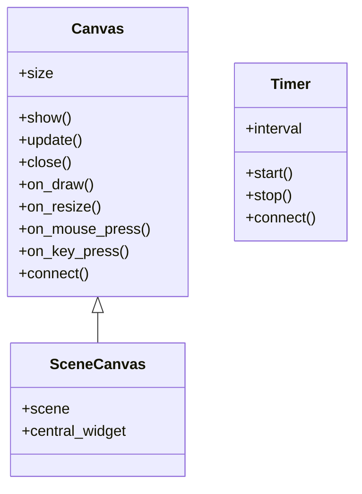

# vispy.app — ciclo de vida de la aplicacion

`vispy.app` es la capa que conecta VisPy con el **sistema operativo**: gestiona la ventana nativa ([[Canvas]]), la seleccion del backend de ventana ([[vispy.use]]) y el temporizador para animaciones ([[Timer]]). Sin `vispy.app` no hay ventana, no hay event loop y no hay renders.

Antes de crear cualquier Canvas o importar `vispy.scene`, el primer paso es fijar el backend:

```python
import vispy
vispy.use('pyqt5')          # fija el backend de ventana
from vispy import app       # ahora es seguro importar app
```

Luego `app.run()` entrega el control al **event loop** del backend, que despacha eventos de teclado, mouse, resize y timer hasta que la ventana se cierra.

## Ejemplo unificador — Canvas + Timer

El patron mas comun de `vispy.app`: una ventana de bajo nivel animada por un timer.

```python
import vispy
vispy.use('pyqt5')
from vispy import app, gloo
import numpy as np

canvas = app.Canvas(size=(800, 600), keys='interactive')
t_total = 0.0

@canvas.connect
def on_draw(event):
    color = (abs(np.sin(t_total)), 0.3, 0.6, 1.0)
    gloo.clear(color=color)

@canvas.connect
def on_resize(event):
    gloo.set_viewport(0, 0, *event.size)

timer = app.Timer(interval=1/60, start=False)

@timer.connect
def on_timer(event):
    global t_total
    t_total += event.dt   # dt = segundos desde el ultimo tick (no constante)
    canvas.update()       # solicita redibujado al event loop

canvas.show()
timer.start()
app.run()   # bloquea hasta cerrar la ventana
```

Flujo de ejecucion:

1. `vispy.use('pyqt5')` — selecciona el backend.
2. `app.Canvas(...)` — crea la ventana (no visible aun si `show=False`).
3. `@canvas.connect` — registra los callbacks de eventos.
4. `app.Timer(...)` — crea el temporizador.
5. `canvas.show()` + `timer.start()` — activa ambos.
6. `app.run()` — inicia el event loop; a partir de aqui todo es reactivo.

## Como se relacionan

| Componente | Rol | Cuando usarlo |
|------------|-----|---------------|
| [[vispy.use]] | Seleccion de backend | Siempre, en la primera linea; antes de todo |
| [[Canvas]] | Ventana nativa + event system | Pipeline gloo propio o uso low-level |
| [[Timer]] | Ticks a intervalo fijo o `'auto'` | Cualquier animacion o actualizacion periodica |
| `app.run()` | Inicia el event loop | Al final de cada script; bloquea hasta el cierre |

> [!tip] `Canvas` vs `SceneCanvas`
> `Canvas` (este modulo) es **low-level**: el dibujado es manual con `gloo`. Para la mayoria de los casos usa `SceneCanvas` de `vispy.scene`, que tiene el scene graph integrado y solo requiere agregar visuals.

## Clases que aporta

| Clase | Hereda de | Rol |
|-------|-----------|-----|
| [[Canvas]] | — (clase raiz) | Ventana OpenGL nativa. Metodos `.show()`, `.update()`, `.close()`, atributo `.size`; eventos `on_draw`/`on_resize`/`on_mouse_*`/`on_key_*`; `.events` y `.connect()` para registrar callbacks |
| [[Timer]] | — (clase raiz) | Temporizador de ticks no-bloqueantes. Metodos `.start()`, `.stop()`, `.connect()`; atributos `interval` y `.elapsed` |

`vispy.use()` no es una clase sino una **funcion**: fija el backend de ventana antes de crear cualquier Canvas o importar `vispy.scene`. Ver [[vispy.use]].

Nota clave: `vispy.scene.SceneCanvas` **hereda de `Canvas`**. La version de alto nivel ES un Canvas, por lo que comparte todos sus metodos y eventos; solo agrega el scene graph encima.

## Herencia y metodos compartidos



`SceneCanvas` no reimplementa el ciclo de vida de la ventana: lo **hereda** de `Canvas`. Por eso lo que aprendas de `Canvas` (mostrar, redibujar, conectar eventos, leer `.size`) aplica igual en `SceneCanvas`. `Timer` es una jerarquia aparte y no comparte metodos con `Canvas`.

### Tabla de backends

| Backend | Instalar con | Recomendado para |
|---------|--------------|------------------|
| `'pyqt5'` | `pip install pyqt5` | Desktop (mas estable) |
| `'pyqt6'` | `pip install pyqt6` | Desktop moderno |
| `'pyglet'` | `pip install pyglet` | Sin Qt |
| `'glfw'` | `pip install glfw` | Minimalista |
| `'jupyter_rfb'` | `pip install jupyter_rfb` | Jupyter Notebook |

## Notas

- [[Canvas]] — la ventana de renderizado; eventos `on_draw`, `on_resize`, `on_key_press`
- [[Timer]] — temporizador; `event.dt` para animaciones fisicamente correctas
- [[vispy.use]] — funcion de configuracion de backend; llamar antes que todo

## Notas relacionadas

- [[Tree VisPy]] — mapa completo del vault VisPy
- [[SceneCanvas]] — alternativa de alto nivel (vispy.scene); la mas usada en la practica
