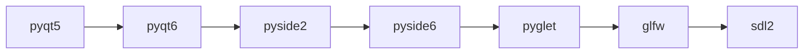

# vispy.use — seleccionar backend de ventana

`vispy.use()` fija el **backend de ventana** (y opcionalmente el backend de OpenGL) que VisPy usara para crear ventanas nativas. Debe llamarse **antes** de importar `vispy.app`, `vispy.scene` o cualquier modulo que instancie un contexto GL. Si no se llama, VisPy intenta auto-detectar en orden: `pyqt5 > pyqt6 > pyside2 > pyside6 > pyglet > glfw`.

## Importacion

```python
import vispy
vispy.use('pyqt5')          # llamar ANTES de cualquier otro import de vispy
from vispy import app, scene
```

## Firma

```python
vispy.use(app=None, gl=None)
```

| Parametro | Tipo | Descripcion |
|-----------|------|-------------|
| `app` | `str \| None` | Nombre del backend de ventana (ver tabla) |
| `gl` | `str \| None` | Backend de OpenGL: `'pyopengl'` (por defecto) o `'es2'` |

## Backends disponibles

| Backend | Instalar con | Entorno tipico |
|---------|--------------|----------------|
| `'pyqt5'` | `pip install pyqt5` | Desktop (recomendado, mas estable) |
| `'pyqt6'` | `pip install pyqt6` | Desktop (alternativa moderna) |
| `'pyside2'` | `pip install pyside2` | Desktop (licencia LGPL) |
| `'pyside6'` | `pip install pyside6` | Desktop (licencia LGPL, moderno) |
| `'pyglet'` | `pip install pyglet` | Desktop (ligero, sin Qt) |
| `'glfw'` | `pip install glfw` | Desktop (minimalista) |
| `'sdl2'` | `pip install pysdl2` | Desktop/embebido |
| `'jupyter_rfb'` | `pip install jupyter_rfb` | Jupyter Notebook / JupyterLab |

## Casos de uso

### Uso estandar en script

```python
import vispy
vispy.use('pyqt5')   # fijar backend antes de cualquier otro import de vispy

from vispy import scene, app
import numpy as np

canvas = scene.SceneCanvas(keys='interactive', show=True)
view = canvas.central_widget.add_view()
view.camera = 'turntable'

pos = np.random.randn(500, 3).astype('float32')
scatter = scene.visuals.Markers(parent=view.scene)
scatter.set_data(pos, face_color=(0.2, 0.8, 1.0, 0.9), size=6)

app.run()
```

### Uso en Jupyter Notebook

```python
import vispy
vispy.use('jupyter_rfb')   # backend para renderizado en celda de notebook

from vispy import scene, app
import numpy as np

canvas = scene.SceneCanvas(keys='interactive', show=True, size=(600, 400))
view = canvas.central_widget.add_view()
view.camera = 'turntable'

pos = np.random.randn(300, 3).astype('float32')
markers = scene.visuals.Markers(parent=view.scene)
markers.set_data(pos, face_color='yellow', size=5)

canvas   # mostrar el canvas inline en Jupyter
```

### Seleccionar backend por entorno

```python
import os
import vispy

# En produccion o CI, usar pyglet (sin Qt)
backend = os.environ.get('VISPY_BACKEND', 'pyqt5')
vispy.use(backend)

from vispy import scene, app
```

### Especificar backend de OpenGL

```python
import vispy
vispy.use(app='pyqt5', gl='pyopengl')   # mas explicito; pyopengl es el default
from vispy import app as vapp

canvas = vapp.Canvas(size=(800, 600))
```

> [!warning] Llamar antes de importar
> Si importas `from vispy import scene` **antes** de llamar `vispy.use()`, VisPy ya habra elegido (o fallado al elegir) un backend. En ese caso `vispy.use()` lanzara un error o sera ignorada. Pon siempre `vispy.use(...)` en la **primera linea** despues de `import vispy`.

## Tabla de decision: que backend elegir

| Situacion | Backend recomendado |
|-----------|---------------------|
| Script de escritorio general | `'pyqt5'` |
| Jupyter Notebook / JupyterLab | `'jupyter_rfb'` |
| Sin Qt disponible (servidor ligero) | `'pyglet'` o `'glfw'` |
| Licencia LGPL (sin PyQt) | `'pyside6'` |
| Qt6 moderno en desktop | `'pyqt6'` o `'pyside6'` |

## Auto-deteccion (sin llamar `vispy.use`)

Si no se llama a `vispy.use()`, VisPy prueba en orden:



Si ninguno esta instalado lanza `RuntimeError: No backend available`.

## Errores comunes

| Error | Causa | Solucion |
|-------|-------|----------|
| `RuntimeError: No backend available` | Ningun backend instalado | `pip install pyqt5` o `pip install pyglet` |
| `RuntimeError: vispy.use() called too late` | Se importo `vispy.app` o `vispy.scene` antes de `vispy.use()` | Mover `vispy.use()` antes de cualquier `from vispy import ...` |
| Ventana no aparece en Jupyter | Backend de escritorio en Jupyter | Usar `vispy.use('jupyter_rfb')` |
| `ImportError` al intentar el backend | El paquete no esta instalado | Instalar el paquete correspondiente (ver tabla) |

## Notas relacionadas

- [[Canvas]] — primera clase que usa el backend; hay que llamar `vispy.use` antes de instanciarla
- [[Timer]] — tambien depende del backend seleccionado
- [[Tree VisPy]]
