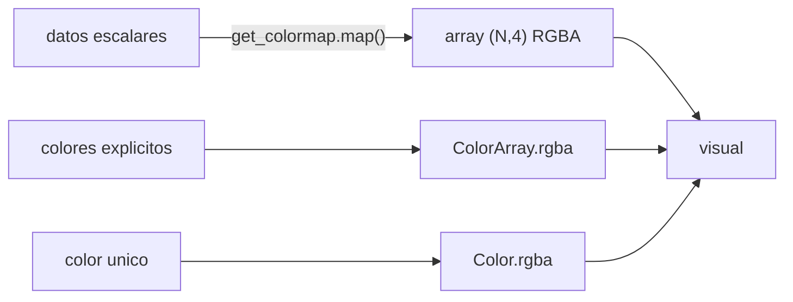
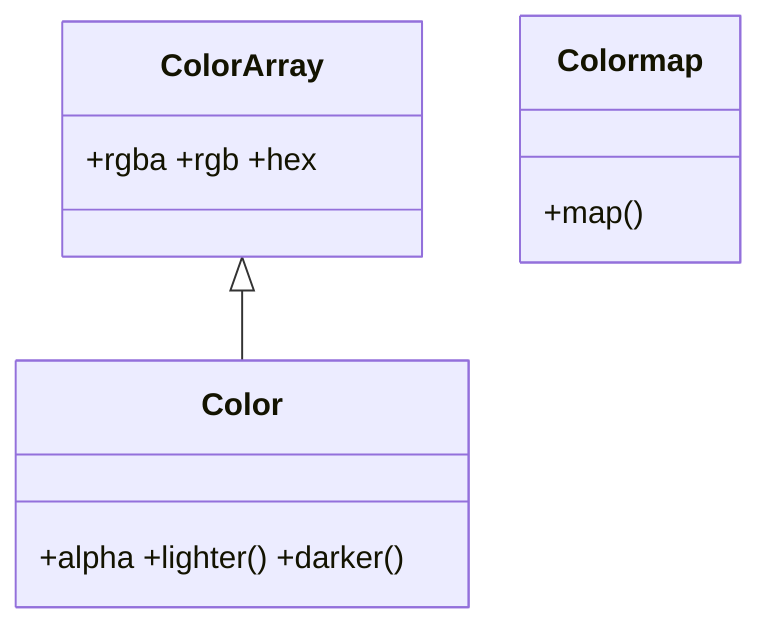

# vispy.color — sistema de colores de VisPy

`vispy.color` gestiona **todo lo relacionado con colores** en VisPy. El modulo cubre tres necesidades distintas: representar un color individual ([[Color]]), agrupar N colores para asignarlos elemento a elemento ([[ColorArray]]), y transformar datos numericos a colores mediante un colormap ([[vispy.get_colormap]]).

La mayoria de los visuals de VisPy (`Markers`, `Mesh`, `Image`) aceptan colores en formato array NumPy `(N, 4)` float32. `vispy.color` es la capa que construye esos arrays de forma expresiva y segura.

## Ejemplo unificador: datos → colormap → Markers

El patron mas frecuente: tomar un array de valores float, normalizarlos, mapearlos a colores con un colormap, y pasarlos a un scatter plot.

```python
import vispy
vispy.use('pyqt5')

import numpy as np
from vispy import scene, app
from vispy.color import get_colormap

# 1. Datos: 500 puntos con una magnitud asociada
n = 500
pos = np.random.rand(n, 2).astype('float32') * 10
magnitud = np.random.rand(n).astype('float32')   # ya en [0, 1]

# 2. Mapear magnitud → colores RGBA con un colormap
cmap = get_colormap('viridis')
colors = cmap.map(magnitud)   # (500, 4) float32

# 3. Pasar al visual
canvas = scene.SceneCanvas(keys='interactive', show=True)
view = canvas.central_widget.add_view()
view.camera = 'panzoom'
view.camera.set_range(x=(0, 10), y=(0, 10))

markers = scene.visuals.Markers(
    pos=pos,
    face_color=colors,   # (N, 4): un color por punto
    size=7,
    parent=view.scene
)

app.run()
```

## Como se relacionan

Tabla de decision: que usar segun el caso.

| Necesidad | Herramienta | Formato de salida |
|-----------|-------------|-------------------|
| Un color fijo uniforme | `Color('red').rgba` | array `(4,)` float32 |
| N colores explicitos (paleta, categorias) | `ColorArray([...]).rgba` | array `(N, 4)` float32 |
| Datos escalares → degradado continuo | `get_colormap('viridis').map(vals)` | array `(N, 4)` float32 |
| Nombre del colormap directo en visual | `cmap='fire'` como string en `Image`/`Volume` | interno al visual |

Las tres herramientas convergen en el mismo formato de salida: un array `(N, 4)` float32 que los visuals consumen sin conversion adicional.

### Relacion entre los tres tipos



`ColorArray.colors[i]` devuelve un `Color` individual, por lo que ambas clases son interoperables.

## Clases que aporta

| Clase | Hereda de | Rol |
|-------|-----------|-----|
| [[ColorArray]] | — (clase raiz) | Array de N colores. Atributos `.rgba`, `.rgb`, `.hex`; indexable `ca[i]` |
| [[Color]] | `ColorArray` | Un color individual (= un `ColorArray` de longitud 1). `.rgba`, `.hex`, `.alpha`, metodos `.lighter()`, `.darker()` |
| [[vispy.get_colormap]] | — | Mapea valores en 0–1 a colores con `.map(valores)`. Nota: `Colormap` es la clase; `get_colormap(nombre)` es la funcion que devuelve una instancia por nombre |

## Herencia y metodos compartidos



`Color` **hereda de `ColorArray`**: reusa `.rgba` y `.hex` sin reimplementarlos (un color es un array de longitud 1) y solo agrega lo propio de un color unico (`.alpha`, `.lighter()`, `.darker()`). `Colormap` es independiente y no comparte metodos con las dos anteriores.

## Notas

- [[Color]] — color individual: RGBA, hex, nombre CSS
- [[ColorArray]] — array de N colores; `.rgba` para pasar a visuals
- [[vispy.get_colormap]] — colormaps nombrados: fire, grays, viridis, plasma…

## Notas relacionadas

- [[Tree VisPy]] — estructura completa del vault VisPy
- [[Markers]] — visual donde `face_color` acepta array `(N, 4)` de `vispy.color`
- [[Image]] — acepta `cmap` como string; internamente usa el mismo sistema de colormaps
