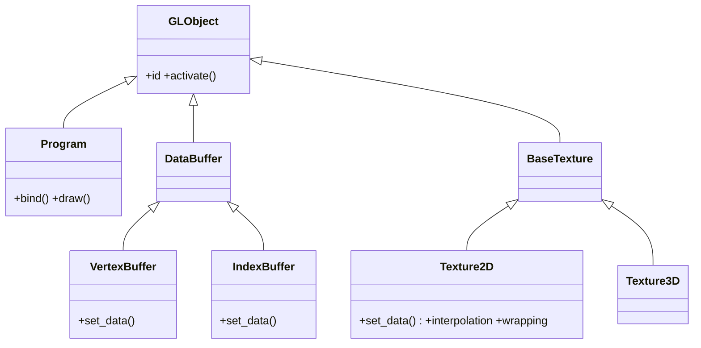

# vispy.gloo — pipeline OpenGL de bajo nivel

`vispy.gloo` es la API de **bajo nivel** de VisPy: expone el pipeline OpenGL casi directamente,
sin la abstraccion del scene graph. El usuario escribe sus propios shaders GLSL, sube datos
al GPU con buffers y texturas, y controla exactamente como se rasteriza cada pixel.
Usala cuando `vispy.scene` no es suficiente: efectos visuales personalizados, shaders
propios optimizados, o rendimiento maximo con control total.

> [!info] gloo vs scene
> **`vispy.scene`** = alto nivel; scene graph, camaras, visuals predefinidos; el 95 % de los casos.
> **`vispy.gloo`** = bajo nivel; shaders propios, control total del pipeline, maximo rendimiento.
> Las dos APIs no se mezclan en la misma app. Elige una.

## El flujo minimo con gloo

Todo programa gloo sigue el mismo patron de tres pasos:

```
1. Definir shaders GLSL (strings Python)
         |
         v
2. Crear Program + subir datos (VertexBuffer / Texture2D)
         |
         v
3. Llamar program.draw() dentro de on_draw
```

### Ejemplo completo — triangulo con color por vertice

```python
import vispy; vispy.use('pyqt5')
from vispy import app, gloo
import numpy as np

VERT = """
attribute vec2 position;
attribute vec4 color;
varying vec4 v_color;
void main() {
    gl_Position = vec4(position, 0.0, 1.0);
    v_color = color;
}
"""
FRAG = """
varying vec4 v_color;
void main() {
    gl_FragColor = v_color;
}
"""

data = np.zeros(3, dtype=[('position', np.float32, 2),
                            ('color',    np.float32, 4)])
data['position'] = [[-0.5, -0.5], [0.5, -0.5], [0.0, 0.5]]
data['color']    = [(1, 0, 0, 1), (0, 1, 0, 1), (0, 0, 1, 1)]

program = gloo.Program(VERT, FRAG)
program.bind(gloo.VertexBuffer(data))   # asigna 'position' y 'color' de golpe

canvas = app.Canvas(size=(600, 600), keys='interactive')

@canvas.connect
def on_draw(event):
    gloo.clear('black')
    program.draw('triangles')   # renderiza los 3 vertices

@canvas.connect
def on_resize(event):
    gloo.set_viewport(0, 0, *event.size)

canvas.show()
app.run()
```

Este ejemplo usa los tres elementos clave del modulo: [[Program]] (shaders compilados),
[[VertexBuffer]] (geometria en GPU) y [[Canvas]] (ventana con el evento `on_draw`).

## Como se relacionan

| Elemento | Rol en el pipeline | Cuando usarlo |
|----------|--------------------|---------------|
| [[Program]] | Compila y enlaza vertex + fragment shader; punto de entrada para `draw()` | Siempre — es el nucleo de toda app gloo |
| [[VertexBuffer]] | Sube un array numpy a GPU como datos por vertice (posicion, color, UV…) | Cuando tienes geometria o atributos por vertice |
| [[Texture2D]] | Sube una imagen o campo 2D a GPU; se muestrea en el fragment shader | Para imagenes, mapas de calor, video, render-to-texture |

### Tabla de decision — que objeto usar para mis datos

| Tipo de dato | Objeto gloo |
|--------------|-------------|
| Posiciones de vertices (geometria) | [[VertexBuffer]] como `attribute` |
| Color por vertice, normales, UV | [[VertexBuffer]] como `attribute` |
| Constante para toda la draw call (transformacion, tiempo) | Uniform del [[Program]] (valor Python directo) |
| Imagen o campo 2D (textura) | [[Texture2D]] como `uniform sampler2D` |
| Patron repetido en superficie (mapa de normales, detalle) | [[Texture2D]] con `wrapping='repeat'` |

## Clases que aporta

Todos los objetos de gloo viven en **memoria GPU** y comparten la misma base, `GLObject`. La API se arma por **composicion**: un `Program` se enlaza con buffers y texturas.

| Clase | Hereda de | Rol |
|-------|-----------|-----|
| `GLObject` | — (base de todo) | Base de todo objeto GPU. Gestiona el recurso en la tarjeta: `.id`, activar/desactivar el objeto |
| [[Program]] | `GLObject` | Shader GLSL compilado y enlazado: `program['uniform']=...`, `.bind()`, `.draw('triangles')` |
| `DataBuffer` | `GLObject` (via `Buffer`) | Base intermedia de los buffers de datos; no se usa directamente |
| [[VertexBuffer]] | `DataBuffer` | Datos por vertice en GPU (posicion, color, UV…): `.set_data()` |
| `IndexBuffer` | `DataBuffer` | Indices de vertices en GPU para dibujado indexado: `.set_data()` |
| `BaseTexture` | `GLObject` | Base de las texturas; no se usa directamente |
| [[Texture2D]] | `BaseTexture` | Textura 2D en GPU (imagen, campo 2D): `.set_data()`, `interpolation`, `wrapping` |
| `Texture3D` | `BaseTexture` | Textura 3D en GPU (volumen): `.set_data()`, `interpolation`, `wrapping` |

`GLObject`, `DataBuffer`, `Buffer` y `BaseTexture` son clases base internas (no tienen nota propia): existen para compartir codigo entre las clases que si usas a diario.

## Herencia y metodos compartidos



`.set_data()` es el metodo compartido por **buffers y texturas**: la forma de subir o actualizar datos en GPU es la misma idea en `VertexBuffer`, `IndexBuffer`, `Texture2D` y `Texture3D`. Todos, ademas, heredan de `GLObject` la gestion del recurso en la tarjeta (`.id`, activar/desactivar).

## Conceptos previos recomendados

Antes de usar gloo conviene entender el pipeline GPU: que hace el vertex shader
(transforma vertices) y el fragment shader (colorea pixels), como fluyen los datos
de atributo a `varying` y de `varying` al color final. Todo esto esta en
[[concepto_gloo_pipeline]].

## Notas

- [[Program]] — shader GLSL compilado; attributes, uniforms y `.draw()`
- [[VertexBuffer]] — datos de vertices en GPU; `.set_data()` para animacion eficiente
- [[Texture2D]] — textura 2D en GPU; imagenes, campos escalares, video

## Notas relacionadas

- [[Canvas]] — ventana de la app; provee el `on_draw` donde se llama `program.draw()`
- [[concepto_gloo_pipeline]] — modelo mental del pipeline vertex → rasterizacion → fragment
