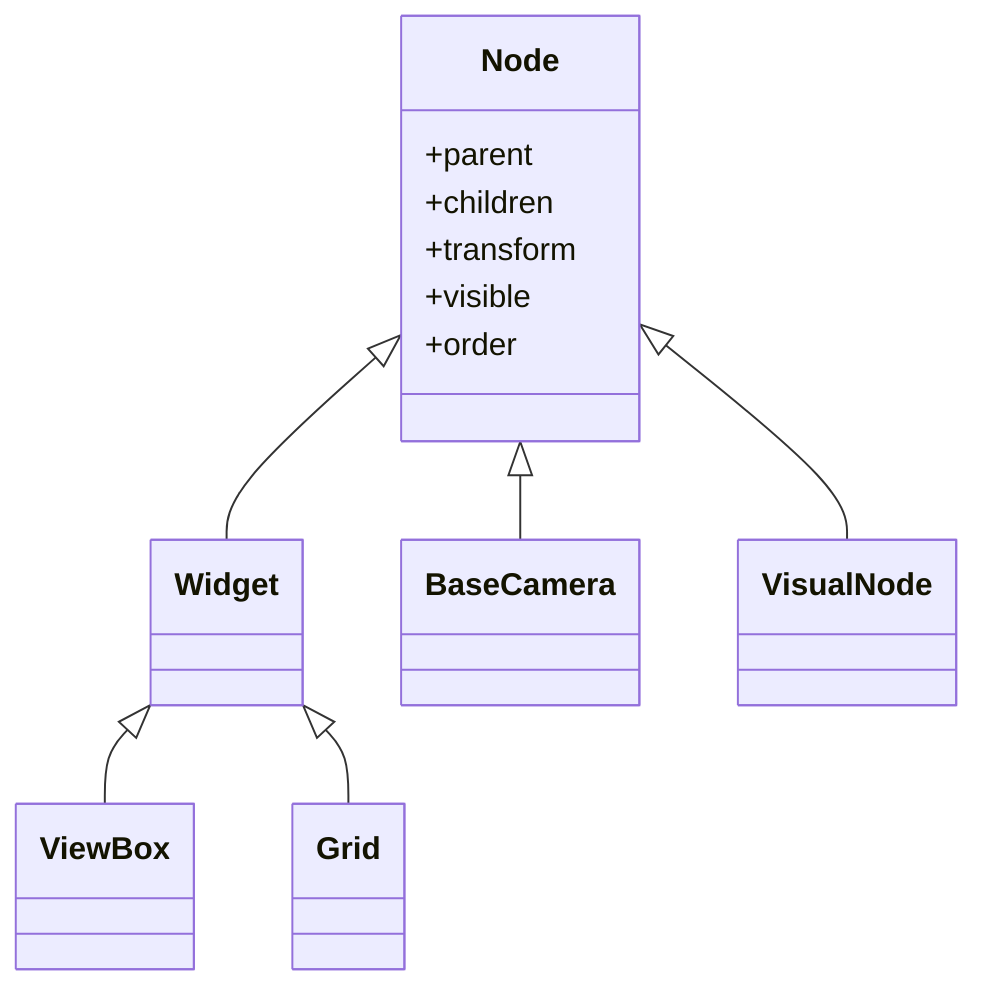

# Node — nodo base del scene graph

`Node` es la **clase base de todo el scene graph** de VisPy: cada cosa que vive en el arbol de la escena ES un Node. El [[ViewBox]], las camaras (subclases de [[BaseCamera]]) y todos los `scene.visuals.*` heredan de Node. Es la pieza que define el sistema de padres/hijos y de transformaciones que comparten absolutamente todos los nodos. Entender Node explica de donde salen `.parent`, `.transform` y `.visible` que aparecen una y otra vez en el resto de la API.

## Importacion

```python
from vispy.scene import Node
```

## Por que casi nunca lo instancias

Rara vez escribes `Node(...)` directamente: la clase esta pensada para **heredarse**, no para usarse suelta. En la practica interactuas con Node a traves de sus subclases —un ViewBox, una camara, un visual como [[Line]] o `Markers`—. Pero todos esos objetos exponen los mismos atributos heredados de Node:

- cuando haces `visual.parent = view.scene`, usas el sistema de padres/hijos de Node;
- cuando aplicas `visual.transform = STTransform(...)`, usas el sistema de transformaciones de Node;
- cuando ocultas algo con `visual.visible = False`, usas un atributo de Node.

Por eso conviene conocer Node aunque casi nunca lo construyas a mano: es el contrato comun de todo el arbol.

## Atributos y metodos heredados

Estos los comparten TODOS los nodos (ViewBox, camaras y visuals):

| Miembro | Tipo | Descripcion |
|---------|------|-------------|
| `.parent` | `Node \| None` | Nodo padre. Asignarlo **mueve** el nodo en el arbol; patron tipico `visual.parent = view.scene` |
| `.children` | `list[Node]` | Lista de hijos directos |
| `.transform` | `BaseTransform` | Transformacion local (`STTransform`, `MatrixTransform`...): posiciona, escala y rota el nodo y, en cascada, a sus hijos |
| `.transforms` | `TransformSystem` | Sistema de mapeo entre los distintos sistemas de coordenadas |
| `.visible` | `bool` | Mostrar u ocultar el nodo; afecta tambien a sus hijos |
| `.order` | `int` | Orden de dibujado entre hermanos |
| `.parent_chain()` | `list[Node]` | Cadena de ancestros desde el nodo hasta la raiz |

Constructor: `Node(parent=None, name=None)`.

## Herencia

El scene graph es un patron **Composite**: una jerarquia de nodos donde cada nodo puede contener otros. Las clases visibles de la API son todas subclases de Node, asi que heredan `.parent`, `.children`, `.transform`, `.visible` y `.order`:



- `Widget` → de el salen `ViewBox` y `Grid` (contenedores de layout).
- `BaseCamera` → raiz de todas las camaras; ver [[BaseCamera]].
- `VisualNode` = `Node` + `Visual`; es lo que convierte un [[Visual]] en un objeto del scene graph, y de ahi salen todos los `scene.visuals.*` (`Line`, `Markers`, `Mesh`...).

Por eso un visual, una camara y un ViewBox responden todos a `.parent`, `.transform` y `.visible`: lo heredan de Node.

## Composicion: padres e hijos

Agregar un nodo al arbol es asignarle un padre. El patron canonico es declarar `parent=view.scene` al crear un visual (o reasignar `.parent` despues):

```python
import vispy
vispy.use('pyqt5')
from vispy import scene, app
from vispy.visuals.transforms import STTransform
import numpy as np

canvas = scene.SceneCanvas(keys='interactive', show=True, size=(800, 600))
view = canvas.central_widget.add_view()
view.camera = 'turntable'
view.camera.set_range(x=(-10, 10), y=(-10, 10), z=(-10, 10))

# Un nodo "grupo" sin geometria propia, hijo de la escena del viewport.
grupo = scene.Node(parent=view.scene)
grupo.transform = STTransform(translate=(5, 0, 0))   # mueve a todos sus hijos

# Visual hijo del grupo: hereda la traslacion del padre.
pos = np.random.randn(300, 3).astype('float32')
m = scene.visuals.Markers(parent=grupo)              # parent = el grupo, no view.scene
m.set_data(pos, face_color='cyan', size=5)
m.transform = STTransform(scale=(2, 2, 2))           # transform local del propio visual

# Inspeccionar el arbol:
print(m.parent is grupo)         # True
print(grupo.children)            # [<Markers>]
print(m.parent_chain())          # m -> grupo -> view.scene -> ... -> raiz

app.run()
```

Las transformaciones se **acumulan** de padres a hijos: la posicion final de los markers es la composicion de su `transform` local (`scale=(2,2,2)`) con la del `grupo` (`translate=(5,0,0)`) y con las de todos sus ancestros hasta la raiz. Mover o escalar el padre arrastra a todos sus descendientes; ocultar el padre (`grupo.visible = False`) oculta tambien a sus hijos. Esa es la esencia del scene graph como patron Composite, descrita en [[concepto_scene_graph]].

## Notas relacionadas

- [[concepto_scene_graph]] — el modelo mental del arbol de nodos y la acumulacion de transforms
- [[ViewBox]] — Node concreto: viewport con camara y visuals (via `Widget`)
- [[BaseCamera]] — raiz de las camaras, tambien un Node
- [[Visual]] — combinado con Node da los `scene.visuals.*` (`VisualNode`)
