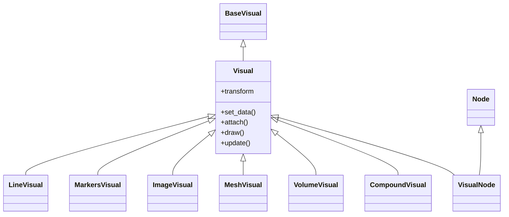

# Visual — la clase que sabe dibujarse en la GPU

`Visual` es la clase base de **todo objeto que sabe dibujarse en la GPU**. Encapsula un
programa de shaders GLSL, los datos y el estado de OpenGL: es la pieza que convierte datos
(arrays NumPy) en pixeles. Junto a [[Node]] es una de las dos bases sobre las que se
construye toda la API scene; cada [[Line]], [[Markers]] o [[Mesh]] que usas es, por dentro,
un `Visual` envuelto en un nodo del [[concepto_scene_graph]].

## Importacion

```python
# Para USAR un visual ya existente (camino normal):
from vispy.scene.visuals import Line, Markers, Mesh

# Para EXTENDER VisPy con un visual propio (caso avanzado):
from vispy.visuals import Visual, CompoundVisual
```

El primer import da las clases listas para colgar de `view.scene`. El segundo da las clases
base que solo se tocan al crear un tipo de dibujo nuevo.

## La doble herencia: VisualNode = Node + Visual

Cuando accedes a `scene.visuals.Line`, NO estas usando directamente `LineVisual`. VisPy toma
ese `LineVisual` y lo fusiona con [[Node]] mediante `create_visual_node`, produciendo un
**VisualNode**: una sola clase que hereda de las dos bases a la vez.

Por eso un `scene.visuals.Line` expone metodos de ambos mundos:

- Lado **Node** → vive en el scene graph: `.parent`, `.children`, `.transform`, `.visible`.
- Lado **Visual** → sabe renderizarse en GPU: `.set_data(...)`, `.attach()`, `.draw()`,
  `.update()`, `.shared_program`.

Esa doble herencia es el corazon de la API scene: el mismo objeto se posiciona en el arbol
(Node) y se dibuja sin escribir shaders (Visual).

La jerarquia del lado dibujo es `BaseVisual → Visual → CompoundVisual`. De `Visual` heredan
los visuales concretos (`LineVisual`, `MarkersVisual`, `ImageVisual`, `TextVisual`,
`MeshVisual`, `VolumeVisual`); `CompoundVisual` combina varios visuales en uno solo
(ej. `SurfacePlotVisual`, `AxisVisual`).



## Metodos y atributos compartidos

Todos los visuales (lado Visual) comparten esta interfaz; cada subclase ademas define sus
propios argumentos en `.set_data`.

| Miembro | Tipo | Que hace |
|---------|------|----------|
| `.set_data(...)` | metodo | Actualiza los datos SIN recrear el objeto; cada subclase define sus args |
| `.transform` | atributo | Posiciona, escala o rota el visual en el espacio |
| `.draw()` | metodo | Dibuja el visual; normalmente lo llama el canvas, no se invoca a mano |
| `.attach(filter)` | metodo | Adjunta un filtro al pipeline GPU (clipping, alpha, etc.) |
| `.shared_program` | atributo | El `gloo.Program` interno con los shaders compilados |
| `.update()` | metodo | Marca el visual como sucio para forzar el redibujado |
| `.set_gl_state(...)` | metodo | Configura el estado OpenGL (blending, depth_test, etc.) |

## Crear un visual personalizado

> [!warning] Caso AVANZADO de herencia
> Esto solo se hace para inventar un tipo de dibujo que VisPy no trae. El 99% de los usos se
> resuelve con los visuales existentes. Aqui se hereda directamente de `Visual` (o
> `CompoundVisual`), se escriben los shaders GLSL a mano y se conecta el pipeline del
> [[concepto_gloo_pipeline]].

Para un visual propio hay que heredar de `Visual`, escribir el vertex/fragment shader e
implementar dos hooks: `_prepare_transforms()` (inyecta la cadena de transforms en el shader)
y `_prepare_draw()` (sube los datos justo antes de dibujar).

```python
import numpy as np
from vispy.visuals import Visual
from vispy.scene.visuals import create_visual_node

# Shaders minimos: el vertex aplica la transform; el fragment pinta un color fijo.
VERT = """
attribute vec2 a_position;
void main() {
    gl_Position = $transform(vec4(a_position, 0.0, 1.0));
}
"""

FRAG = """
void main() {
    gl_FragColor = vec4(0.2, 0.8, 1.0, 1.0);
}
"""

class MiVisual(Visual):
    def __init__(self, pos):
        Visual.__init__(self, vcode=VERT, fcode=FRAG)
        self._pos = np.asarray(pos, dtype='float32')
        # Subir los vertices al programa de shaders (lado gloo):
        self.shared_program['a_position'] = self._pos
        self._draw_mode = 'line_strip'
        self.set_gl_state('translucent', depth_test=False)

    def _prepare_transforms(self, view):
        # Conecta la cadena de transforms del scene graph al placeholder $transform:
        view.view_program.vert['transform'] = view.get_transform()

    def _prepare_draw(self, view):
        # Se llama antes de cada draw; aqui se refrescan datos si cambiaron.
        return True

# Envolver el Visual con Node para usarlo en scene (igual que hace VisPy internamente):
MiVisualNode = create_visual_node(MiVisual)
```

Una vez registrado con `create_visual_node`, `MiVisualNode` se cuelga del scene graph como
cualquier otro visual:

```python
import vispy; vispy.use('pyqt5')
from vispy import scene, app
import numpy as np

canvas = scene.SceneCanvas(keys='interactive', show=True, size=(600, 400))
view = canvas.central_widget.add_view()
view.camera = 'panzoom'
view.camera.set_range(x=(0, 1), y=(-1, 1))

t = np.linspace(0, 1, 200)
pos = np.column_stack([t, np.sin(t * 12)]).astype('float32')
mi = MiVisualNode(pos, parent=view.scene)   # .parent viene del lado Node

app.run()
```

Para visuales que combinan varias primitivas (ej. una linea + sus marcadores + ejes) se
hereda de `CompoundVisual` y se pasa la lista de subvisuales a su constructor, en lugar de
escribir shaders propios.

## Notas relacionadas

- [[Node]]
- [[Line]]
- [[Markers]]
- [[Mesh]]
- [[concepto_gloo_pipeline]]
- [[concepto_scene_graph]]
- [[vispy.scene/visuals/index\|visuals]]
