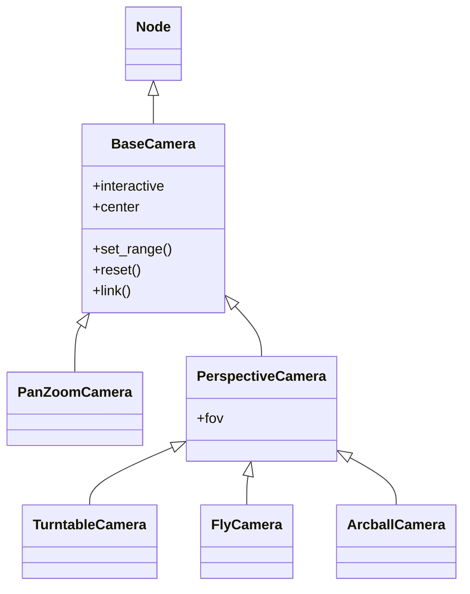

# BaseCamera — la clase base de las camaras

`BaseCamera` es la **clase base de todas las camaras** de VisPy: define como se proyecta el contenido de un `ViewBox` en la pantalla y como el usuario navega con raton y teclado. Hereda de [[Node]], asi que una camara es un nodo mas del scene graph y vive dentro del `ViewBox` como cualquier visual. No se instancia directamente: en la practica se usan sus subclases ([[PanZoomCamera]], [[TurntableCamera]], [[FlyCamera]]...) o se asignan por string (`view.camera = 'turntable'`).

## Importacion

```python
from vispy.scene.cameras import BaseCamera
# clase base: no se instancia directo, se usan sus subclases
```

## Metodos y atributos compartidos

Todo lo que sigue lo definen `BaseCamera` y por lo tanto **lo tienen TODAS las camaras por herencia**, sin importar cual este activa. Por eso `view.camera.set_range(...)`, `.reset()` o `.link(...)` funcionan igual con cualquier tipo de camara.

| Metodo / Atributo | Descripcion |
|-------------------|-------------|
| `set_range(x=None, y=None, z=None, margin=0.05)` | Ajusta la vista para encuadrar el contenido; calcula automaticamente distancia/zoom |
| `reset()` | Vuelve a la vista inicial de la camara |
| `link(other_camera)` | Sincroniza dos camaras: dos `ViewBox` que se mueven juntos |
| `.interactive` | `bool` — habilita o deshabilita la interaccion del usuario |
| `.center` | Punto central de la vista |
| `.viewbox` | El `ViewBox` al que pertenece la camara |

## Herencia



`TurntableCamera` tiene `.set_range()` porque lo **hereda de `BaseCamera`** (lo comparten todas las camaras). En cambio tiene `.fov` porque lo hereda de `PerspectiveCamera`, la base de las camaras 3D que ningun camara 2D ([[PanZoomCamera]]) posee.

## Como se asigna y se enlaza

```python
import vispy
vispy.use('pyqt5')
from vispy import scene, app
from vispy.scene.cameras import TurntableCamera

canvas = scene.SceneCanvas(keys='interactive', show=True, size=(800, 600))
view = canvas.central_widget.add_view()

# --- Asignar por string (shortcut) ---
view.camera = 'turntable'   # 'panzoom' | 'turntable' | 'fly' | 'arcball'

# --- Asignar por instancia (parametros explicitos) ---
view.camera = TurntableCamera(fov=45)

app.run()
```

```python
# --- Enlazar dos vistas para que se muevan juntas ---
view_a = canvas.central_widget.add_view()
view_b = canvas.central_widget.add_view()
view_a.camera = 'turntable'
view_b.camera = 'turntable'

# cualquier movimiento en una se replica en la otra
view_a.camera.link(view_b.camera)
```

`link()` aprovecha que cada camara es un `Node` con su propio `.transform`: al enlazarlas comparten el estado de navegacion, util para comparar dos representaciones del mismo dato lado a lado.

## Notas relacionadas

- [[Node]] — clase base del scene graph de la que hereda toda camara
- [[concepto_cameras_transforms]] — como una camara proyecta la escena
- [[PanZoomCamera]] — camara 2D; hereda directo de `BaseCamera`
- [[TurntableCamera]] — camara 3D de orbita
- [[FlyCamera]] — camara 3D de movimiento libre
- [[vispy.scene/cameras/index\|cameras]] — tabla de decision entre camaras
- [[Tree VisPy]]
