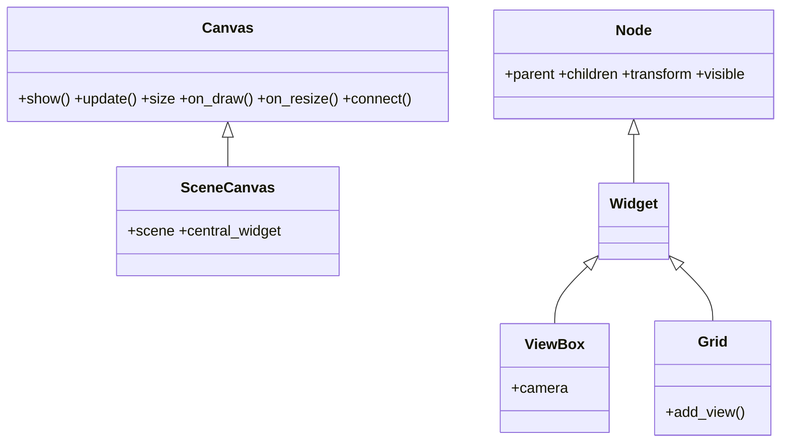

# vispy.scene — scene graph de alto nivel

`vispy.scene` es el modulo principal para el 95 % de los casos de uso de VisPy.
Proporciona un **scene graph** basado en nodos jerarquicos: el `SceneCanvas` actua como
ventana y nodo raiz; el `ViewBox` define el viewport con su camara y clip; los visuals
(lineas, puntos, imagenes, mallas…) se agregan como hijos del `view.scene`.

Todo el pipeline OpenGL queda oculto: se trabaja con objetos Python de alto nivel
y VisPy se encarga de compilar los shaders, subir los datos al GPU y gestionar el redibujado.

## Flujo minimo de uso

```python
import vispy; vispy.use('pyqt5')
from vispy import scene, app
import numpy as np

# 1. Canvas con scene graph integrado
canvas = scene.SceneCanvas(keys='interactive', show=True, size=(800, 600))

# 2. ViewBox: define el viewport y la camara
view = canvas.central_widget.add_view()
view.camera = 'turntable'            # camara 3D con orbita

# 3. Agregar visuals como hijos del scene
pos = np.random.randn(500, 3).astype('float32')
scatter = scene.visuals.Markers(parent=view.scene)
scatter.set_data(pos, face_color='cyan', size=5)

# 4. Entrar al event loop
app.run()
```

## Arquitectura interna

```
SceneCanvas
└── central_widget  (Widget raiz)
    └── ViewBox     (viewport + camara + clip)
        └── view.scene  (nodo raiz de visuals)
            ├── Markers(parent=view.scene)
            ├── Line(parent=view.scene)
            └── Image(parent=view.scene)
```

Los nodos forman un arbol: las transformaciones del padre se propagan a los hijos.
`view.scene` es el padre logico de todos los visuals en ese viewport.

## Clases que aporta

| Clase | Hereda de | Rol |
|-------|-----------|-----|
| [[SceneCanvas]] | `vispy.app.Canvas` | Ventana + scene graph integrado; aporta `.scene` (Node raiz) y `.central_widget` |
| [[Node]] | (raiz del grafo) | Nodo base del scene graph; todo lo que vive en la escena es un Node |
| `Widget` | `Node` | Nodo con area rectangular y layout; base de los contenedores visuales |
| [[ViewBox]] | `Widget` ← `Node` | Viewport con su propia `.camera`, su `.scene` interna y clipping |
| `Grid` | `Widget` ← `Node` | Distribuye sub-viewports en celdas; `.add_view(row, col)` para subplots |

## Herencia y metodos compartidos

`SceneCanvas` **ES un** `vispy.app.Canvas` (herencia directa). Por eso comparte toda
la API de ventana de [[vispy.app/index\|vispy.app]] sin que VisPy la reimplemente:



Esto importa: cualquier evento que conozcas de un `Canvas` normal (`on_draw`,
`on_mouse_move`, `on_key_press`…) funciona igual en un `SceneCanvas`; lo unico que
agrega es el scene graph (`.scene`, `.central_widget`).

El resto de las clases cuelgan de `Node`, la raiz del grafo (ver el diagrama de arriba).

Como `ViewBox` y `Grid` son `Node` (via `Widget`), tienen `.transform`, `.parent` y
`.visible` igual que cualquier visual: se posicionan, se anidan y se ocultan con la
misma API que un `Markers` o un `Line`. Las camaras tambien son `Node` — ver
[[vispy.scene/cameras/index\|cameras]].

## Como se relacionan

| Pregunta | Componente |
|----------|------------|
| Necesito una ventana con scene graph | [[SceneCanvas]] |
| Necesito definir un viewport con camara | [[ViewBox]] |
| Mi escena es 2D (grafica, imagen) | [[vispy.scene/cameras/index\|cameras]] → `PanZoomCamera` |
| Mi escena es 3D (nube de puntos, malla) | [[vispy.scene/cameras/index\|cameras]] → `TurntableCamera` |
| Quiero explorar libremente en 3D | [[vispy.scene/cameras/index\|cameras]] → `FlyCamera` |
| Dibujar lineas, puntos, imagenes, texto | [[vispy.scene/visuals/index\|visuals 2D]] |
| Dibujar mallas, volumenes, superficies | [[vispy.scene/visuals/index\|visuals 3D]] |
| Quiero multiples graficas | `SceneCanvas` + `add_grid()` → varios `ViewBox` |

## Subplots con grid

```python
canvas = scene.SceneCanvas(keys='interactive', show=True)
grid = canvas.central_widget.add_grid()

v1 = grid.add_view(row=0, col=0)
v1.camera = 'panzoom'

v2 = grid.add_view(row=0, col=1)
v2.camera = 'turntable'
```

## Notas

- [[SceneCanvas]] — canvas con scene graph integrado; hereda de `vispy.app.Canvas`; `.scene`, `.central_widget`
- [[Node]] — nodo base del scene graph; `.parent`, `.children`, `.transform`, `.visible`
- [[ViewBox]] — viewport + camara + clipping; hereda de `Widget` ← `Node`; patron `add_view()`
- [[vispy.scene/cameras/index|cameras]] — PanZoomCamera, TurntableCamera, FlyCamera
- [[vispy.scene/visuals/index|visuals]] — visuals 2D y 3D de alto nivel

## Notas relacionadas

- [[concepto_scene_graph]]
- [[concepto_cameras_transforms]]
- [[Tree VisPy]]
