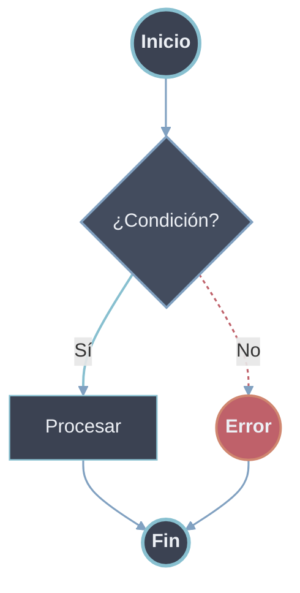
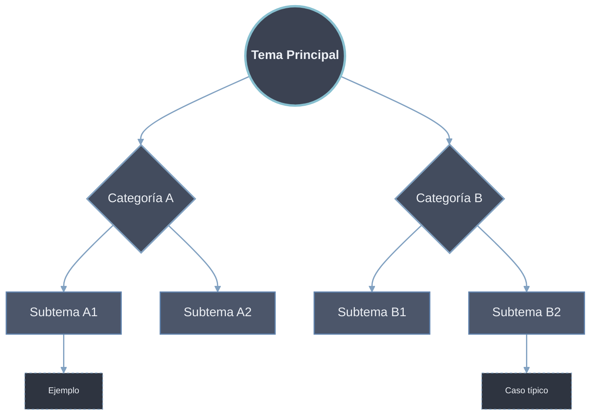
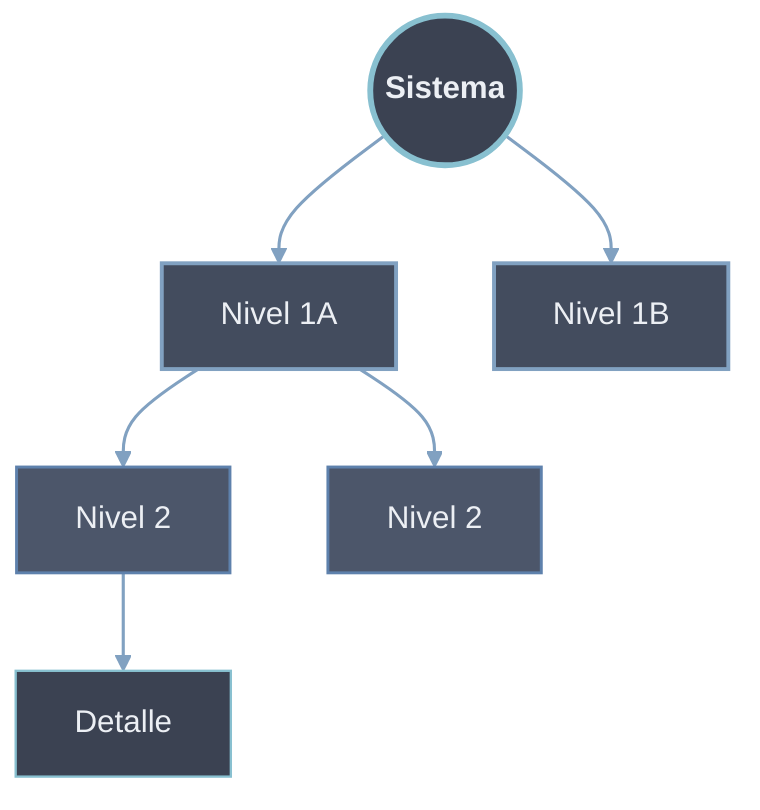
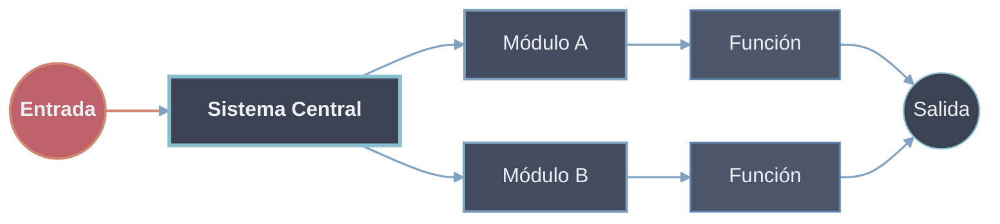

# 1️⃣ Estándar Global Mermaid (NORD · DARK · QUARTZ-SAFE)

## 🎨 Colores (referencia mental)

|Rol|Color|
|---|---|
|Texto|`#eceff4` _(Quartz fuerza esto)_|
|Fondo base|`#2e3440`|
|Raíz / foco|`#3b4252`|
|Categoría|`#434c5e`|
|Subcategoría|`#4c566a`|
|Acento fuerte|`#88c0d0`|
|Acento medio|`#81a1c1`|
|Acento estructural|`#5e81ac`|
|Error / Fin|`#bf616a`|
|Éxito / Highlight|`#d08770`|

---

# 2️⃣ Plantilla BASE (SIEMPRE incluir)

👉 **Esta va al inicio de TODOS los diagramas**

```css
classDef raiz fill:#3b4252,stroke:#88c0d0,stroke-width:3px,color:#eceff4,font-weight:bold;
classDef categoria fill:#434c5e,stroke:#81a1c1,stroke-width:2px,color:#eceff4;
classDef subcategoria fill:#4c566a,stroke:#5e81ac,stroke-width:1.5px,color:#eceff4;
classDef proceso fill:#3b4252,stroke:#88c0d0,stroke-width:1.2px,color:#eceff4;
classDef especial fill:#bf616a,stroke:#d08770,stroke-width:2px,color:#eceff4,font-weight:bold;
classDef ejemplo fill:#2e3440,stroke:#81a1c1,stroke-width:1px,stroke-dasharray:3 3,color:#eceff4,font-size:11px;

%% Flechas seguras (OBSIDIAN-PROOF)
linkStyle default stroke:#81a1c1,stroke-width:1.6px
```

---

# 3️⃣ Flowchart – **Flujos Lógicos** (decisiones, validaciones)

👉 Para **algoritmos, procesos, validaciones, pasos**



📌 **Regla mental**

- Rombo = decisión
    
- Círculo = inicio/fin
    
- Rectángulo = acción
    

---

# 4️⃣ Flowchart – **Conceptual / Clasificación**

👉 Para **temas, conceptos, taxonomías, teoría**



📌 **No hay flujo temporal**  
👉 Solo **estructura mental**

---

# 5️⃣ Flowchart – **Jerárquico**

👉 Para **OOP, niveles, capas, herencia, sistemas teóricos**



📌 **Regla**

- De arriba → abajo = abstracción → concreción
    

---

# 6️⃣ Flowchart – **Arquitectura / Sistemas**

👉 Para **software, módulos, pipelines, data flow**



---

# 7️⃣ Subgraphs (uso correcto)

👉 **Solo para contexto**, nunca para jerarquía principal

```css
subgraph sg1 [Contexto]
    A --> B
end

style sg1 fill:3b4252,stroke:#5e81ac,stroke-width:1.5px,stroke-dasharray:5 5
```

---

# 8️⃣ Guía rápida: ¿qué tipo uso?

|Quiero explicar…|Usa|
|---|---|
|Un algoritmo|Flow lógico|
|Clasificar ideas|Conceptual|
|Niveles / capas|Jerárquico|
|Software / pipeline|Arquitectura|
|Enseñar|Conceptual + ejemplos|
|Documentar código|Jerárquico + arquitectura|

