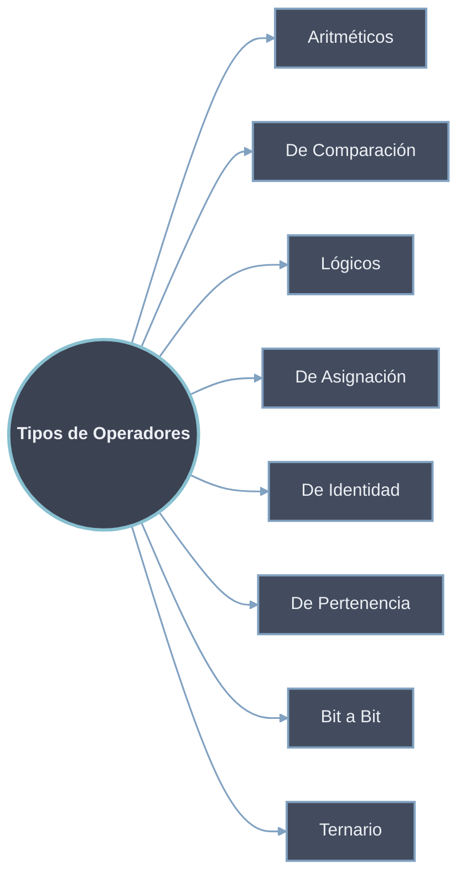

Los operadores en Python **son símbolos especiales que permiten realizar operaciones sobre valores y variables**. Estos operadores son fundamentales para la manipulación de datos y la lógica de programación.
# Tipos de Operadores


## Operadores Aritméticos

Los operadores aritméticos realizan operaciones matemáticas básicas:

```python
a = 15
b = 4

# Operaciones básicas
print("Suma:", a + b)              # 19
print("Resta:", a - b)             # 11
print("Multiplicación:", a * b)    # 60
print("División:", a / b)          # 3.75
print("División entera:", a // b)  # 3
print("Módulo:", a % b)            # 3
print("Exponenciación:", a ** b)   # 50625
```

## Operadores de Comparación

Los operadores de comparación evalúan relaciones entre valores:

```python
a = 13
b = 33

print(a > b)   # False (mayor que)
print(a < b)   # True  (menor que)
print(a == b)  # False (igual que)
print(a != b)  # True  (diferente que)
print(a >= b)  # False (mayor o igual que)
print(a <= b)  # True  (menor o igual que)
```

## Operadores Lógicos

Los operadores lógicos combinan condiciones:

```python
a = True
b = False

print(a and b)  # False (AND)
print(a or b)   # True  (OR)
print(not a)    # False (NOT)
```

## Operadores de Asignación

Los operadores de asignación combinan operaciones con asignación:

```python
a = 10
b = a
print(b)  # 10

# Operadores compuestos
b += a  # b = b + a
print(b)  # 20

b -= a  # b = b - a
print(b)  # 10

b *= a  # b = b * a
print(b)  # 100

b //= a  # b = b // a
print(b)  # 10
```

## Operadores de Identidad

Los operadores de identidad comparan si dos variables son el mismo objeto en memoria:

```python
a = 10
b = 20
c = a

print(a is not b)  # True (no es el mismo objeto)
print(a is c)      # True (es el mismo objeto)
```

## Operadores de Pertenece

Los operadores `in` y `not in` verifican la existencia de elementos en secuencias:

```python
numeros = [10, 20, 30, 40, 50]
x = 24
y = 20

print(x not in numeros)  # True (no está en la lista)
print(y in numeros)      # True (está en la lista)
```

## Operadores Bit a Bit

Los operadores bit a bit realizan operaciones a nivel de bits:

```python
a = 10  # 1010 en binario
b = 4   # 0100 en binario

print(a & b)   # 0   (AND bit a bit)
print(a | b)   # 14  (OR bit a bit)
print(~a)      # -11 (NOT bit a bit)
print(a ^ b)   # 14  (XOR bit a bit)
print(a >> 2)  # 2   (desplazamiento derecha)
print(a << 2)  # 40  (desplazamiento izquierda)
```

## Operador Ternario

El operador ternario es una forma concisa de escribir expresiones [[01 Condicionales|condicionales]]:

```python
a, b = 10, 20
minimo = a if a < b else b
print(minimo)  # 10
```

# Precedencia de Operadores en Python

**La precedencia de operadores determina el orden en que Python evalúa diferentes operadores en una expresión**. Cuando una expresión contiene múltiples operadores, Python los evalúa siguiendo un orden específico.

## Tabla Completa de Precedencia

**De Mayor a Menor:**

```python
# Tabla visual de precedencia
precedencia = [
    ("()", "Paréntesis - agrupación explícita"),
    ("**", "Exponenciación"),
    ("+x, -x, ~x", "Positivo, negativo, bitwise NOT"),
    ("*, /, //, %", "Multiplicación, división, floor division, módulo"),
    ("+, -", "Suma, resta"),
    ("<<, >>", "Desplazamiento de bits"),
    ("&", "AND bit a bit"),
    ("^", "XOR bit a bit"),
    ("|", "OR bit a bit"),
    ("==, !=, <, <=, >, >=, is, is not, in, not in", "Comparaciones, identidad, pertenencia"),
    ("not", "NOT lógico"),
    ("and", "AND lógico"),
    ("or", "OR lógico"),
    ("if - else", "Operador ternario")
]
```

## Ejemplos Detallados de Precedencia

### 1. **Operadores Aritméticos**

```python
# ** tiene mayor precedencia que *, /
resultado = 2 * 3 ** 2             # 2 * (3**2) = 2 * 9 = 18
print("2 * 3 ** 2 =", resultado)   # 18

# *, /, //, % tienen misma precedencia (se evalúan de izquierda a derecha)
resultado = 10 / 2 * 5             # (10/2) * 5 = 5 * 5 = 25
print("10 / 2 * 5 =", resultado)   # 25

# + y - tienen menor precedencia
resultado = 2 + 3 * 4              # 2 + (3*4) = 2 + 12 = 14
print("2 + 3 * 4 =", resultado)    # 14
```

### 2. **Operadores de Comparación vs Lógicos**

```python
x = 5
y = 10
z = 15

# Las comparaciones se evalúan ANTES que los operadores lógicos
resultado = x < y and y < z                 # (x < y) and (y < z) = True and True = True
print("x < y and y < z =", resultado)       # True

# NOT lógico tiene mayor precedencia que AND/OR
resultado = not x > y or y == 10            # (not False) or True = True or True = True
print("not x > y or y == 10 =", resultado)  # True

# Paréntesis cambian el orden
resultado = not (x > y or y == 10)  # not (False or True) = not True = False
print("not (x > y or y == 10) =", resultado)  # False
```

### 3. **Operadores Bit a Bit**

```python
a = 12  # 1100 en binario
b = 10  # 1010 en binario

# Los operadores bit a bit tienen precedencia entre aritméticos y comparaciones
resultado = a << 2 + 3              # a << (2 + 3) = a << 5 = 12 * 32 = 384
print("a << 2 + 3 =", resultado)    # 384

resultado = a & b == 8              # a & (b == 8) = 12 & False = Error 
                                    #(pero mejor usar paréntesis)
# Lo correcto sería:
resultado = (a & b) == 8            # (1100 & 1010) == 1000 → 1000 == 1000 = True
print("(a & b) == 8 =", resultado)  # True
```

### 4. **Operador Ternario (Último en precedencia)**

```python
x = 5
y = 10

# El operador ternario tiene la MÁS BAJA precedencia
resultado = "x es mayor" if x > y else "y es mayor" if y > x else "son iguales"
# Equivale a: resultado = ("x es mayor" if (x > y) else ("y es mayor" if (y > x) else "son iguales"))
print(resultado)  # "y es mayor"

# Cuidado con mezclar ternario y otros operadores
z = 2
resultado = x * 2 if x > y else y * 2  # (x*2) if (x>y) else (y*2)
print(resultado)  # 20
```

## Reglas Específicas y Detalles Importantes

### 1. **Asociatividad**
Cuando operadores tienen la misma precedencia, Python los evalúa según su asociatividad:

```python
# La mayoría son asociativos por la izquierda
resultado = 10 - 5 - 2  # (10 - 5) - 2 = 5 - 2 = 3
print("10 - 5 - 2 =", resultado)  # 3

# La exponenciación es asociativa por la DERECHA
resultado = 2 ** 3 ** 2  # 2 ** (3 ** 2) = 2 ** 9 = 512
print("2 ** 3 ** 2 =", resultado)  # 512
```

### 2. **Operadores de Asignación**
Tienen la menor precedencia de todos (excepto el operador ternario):

```python
x = 5
y = 10
z = 0

# Primero se evalúa todo a la derecha, luego se asigna
z = x + y * 2  # z = (x + (y * 2)) = 5 + 20 = 25
print("z =", z)  # 25

# Operadores de asignación compuesta
x += y * 2  # x = x + (y * 2) = 5 + 20 = 25
print("x después de += :", x)  # 25
```

### 3. **Comparaciones Encadenadas**
Python permite comparaciones encadenadas que se evalúan de manera especial:

```python
x = 5
y = 10
z = 15

# Las comparaciones encadenadas son evaluadas como ANDs
resultado = 0 < x < 10  # Equivale a: (0 < x) and (x < 10)
print("0 < x < 10 =", resultado)  # True

resultado = x < y < z < 20  # (x < y) and (y < z) and (z < 20)
print("x < y < z < 20 =", resultado)  # True
```

## Ejemplos Complejos y Peligros Comunes

### Ejemplo 1: Expresión compleja sin paréntesis

```python
a = 2
b = 3
c = 4
d = 5

# Expresión compleja - difícil de leer
resultado = a + b * c ** d / 2 - 1
# Orden de evaluación:
# 1. c ** d     (4**5 = 1024)
# 2. b * 1024   (3 * 1024 = 3072)
# 3. 3072 / 2   (3072 / 2 = 1536)
# 4. a + 1536   (2 + 1536 = 1538)
# 5. 1538 - 1   (1538 - 1 = 1537)

print("a + b * c ** d / 2 - 1 =", resultado)  # 1537
```

### Ejemplo 2: Mejorando con paréntesis

```python
# La misma expresión con paréntesis para claridad
resultado = a + ((b * (c ** d)) / 2) - 1
print("Con paréntesis explícitos:", resultado)  # 1537

# O incluso mejor: dividir en múltiples líneas
potencia = c ** d
producto = b * potencia
division = producto / 2
resultado = a + division - 1
print("Con variables intermedias:", resultado)  # 1537
```

### Ejemplo 3: Peligro con operadores bit a bit

```python
x = 10  # 1010
y = 6   # 0110
z = 3   # 0011

# Cuidado: los operadores bit a bit tienen precedencia baja
resultado = x & y == 2  # x & (y == 2) = 10 & False = Error
# Lo correcto:
resultado = (x & y) == 2  # (1010 & 0110) == 0010 → 0010 == 0010 = True
print("(x & y) == 2 =", resultado)  # True
```

## Mejores Prácticas para la Precedencia

1. **Usa paréntesis para claridad**
   ```python
   # En lugar de:
   resultado = a + b * c
   
   # Mejor:
   resultado = a + (b * c)
   ```

2. **Divide expresiones complejas**
   ```python
   # En lugar de una línea larga:
   resultado = (a * b) + (c / d) - (e ** f)
   
   # Considera dividirla:
   temp1 = a * b
   temp2 = c / d
   temp3 = e ** f
   resultado = temp1 + temp2 - temp3
   ```

3. **Conoce las reglas clave:**
   - `**` es asociativo por la derecha
   - Las comparaciones se encadenan naturalmente
   - `not` > `and` > `or`
   - El operador ternario tiene muy baja precedencia

4. **Prueba dudoso**
   ```python
   # Si tienes dudas, prueba con pequeños ejemplos
   print("5 & 3 == 1:", 5 & 3 == 1)      # False (porque 5 & (3 == 1))
   print("(5 & 3) == 1:", (5 & 3) == 1)  # True
   ```

## Resumen Visual de Precedencia

```mermaid
flowchart TD
    classDef principal fill:#2e3440,stroke:#5e81ac,stroke-width:2px,color:#eceff4,font-weight:bold;
    classDef categoria fill:#434c5e,stroke:#5e81ac,stroke-width:1px,color:#eceff4;
    classDef tipo fill:#4c566a,stroke:#5e81ac,stroke-width:1px,color:#eceff4;
    classDef especial fill:#d08770,stroke:#bf616a,stroke-width:1px,color:#2e3440;

    Title((Prioridad de Operadores)):::principal

    Title --> B1["( ) Paréntesis"]:::especial
    B1 --> B2["** Potencia"]:::tipo

    subgraph G1 [Aritmética]
        B2 --> B3["*, /, //, %, Multiplicativos"]:::tipo
        B3 --> B4["+, - Aditivos"]:::tipo
    end

    subgraph G2 [Bit a Bit]
        B4 --> B5["<< >> Desplazamiento"]:::tipo
        B5 --> B6["& AND"]:::tipo
        B6 --> B7["^ XOR"]:::tipo
        B7 --> B8["| OR"]:::tipo
    end

    subgraph G3 [Comparación]
        B8 --> B9["< > == != Comparadores"]:::tipo
        B9 --> B10["is / in Identidad"]:::especial
    end

    subgraph G4 [Lógica]
        B10 --> B11["not Lógico"]:::tipo
        B11 --> B12["and Lógico"]:::tipo
        B12 --> B13["or Lógico"]:::tipo
    end

    subgraph G5 [Finales]
        B13 --> B14["if-else Ternario"]:::especial
        B14 --> B15["= += -= Asignación"]:::especial
    end

    style G1 fill:#3b4252,stroke:#5e81ac,stroke-dasharray:5 5
    style G2 fill:#3b4252,stroke:#5e81ac,stroke-dasharray:5 5
    style G3 fill:#3b4252,stroke:#5e81ac,stroke-dasharray:5 5
    style G4 fill:#3b4252,stroke:#5e81ac,stroke-dasharray:5 5
    style G5 fill:#3b4252,stroke:#5e81ac,stroke-dasharray:5 5

```




