# Cadenas (Strings) en Python: Texto y Manipulación

```mermaid
flowchart LR 
    classDef principal fill:#2e3440,stroke:#5e81ac,stroke-width:2px,color:#eceff4,font-weight:bold;
    classDef categoria fill:#434c5e,stroke:#5e81ac,stroke-width:1px,color:#eceff4;
    classDef tipo fill:#4c566a,stroke:#5e81ac,stroke-width:1px,color:#eceff4;

    A((Cadenas en Python)):::principal

    A --> B[Características Principales]:::categoria
    A --> C[Sintaxis y Creación]:::categoria
    A --> D[Operaciones Básicas]:::categoria
    A --> E[Métodos de Cadenas]:::categoria
    A --> F[Formateo]:::categoria
    A --> G[Expresiones Regulares]:::categoria

    subgraph G1 [ ]
        B --> B1[Inmutables]:::tipo
        B --> B2[Secuencias]:::tipo
        B --> B3[Iterables]:::tipo
        B --> B4[Indexables]:::tipo
        B --> B5[Unicode]:::tipo
    end

    subgraph G2 [ ]
        C --> C1[Comillas simples '']:::tipo
        C --> C2[Comillas dobles ""]:::tipo
        C --> C3[Triples comillas]:::tipo
        C --> C4[Raw strings]:::tipo
        C --> C5[F-strings]:::tipo
        C --> C6[Constructor str]:::tipo
    end

    subgraph G3 [ ]
        D --> D1[Indexación]:::tipo
        D --> D2[Slicing]:::tipo
        D --> D3[Concatenación]:::tipo
        D --> D4[Repetición]:::tipo
        D --> D5[Pertenencia]:::tipo
    end

    subgraph G4 [ ]
        E --> E1[Búsqueda]:::tipo
        E --> E2[Modificación]:::tipo
        E --> E3[Validación]:::tipo
        E --> E4[Alineación]:::tipo
        E --> E5[División/Unión]:::tipo
    end

    subgraph G5 [ ]
        F --> F1[F-strings]:::tipo
        F --> F2[format]:::tipo
        F --> F3[% formatting]:::tipo
    end

    subgraph G6 [ ]
        G --> G1_1[match]:::tipo
        G --> G2_1[search]:::tipo
        G --> G3_1[findall]:::tipo
        G --> G4_1[sub]:::tipo
        G --> G5_1[split]:::tipo
    end

    style G1 fill:#3b4252,stroke:#5e81ac,stroke-dasharray:5 5
    style G2 fill:#3b4252,stroke:#5e81ac,stroke-dasharray:5 5
    style G3 fill:#3b4252,stroke:#5e81ac,stroke-dasharray:5 5
    style G4 fill:#3b4252,stroke:#5e81ac,stroke-dasharray:5 5
    style G5 fill:#3b4252,stroke:#5e81ac,stroke-dasharray:5 5
    style G6 fill:#3b4252,stroke:#5e81ac,stroke-dasharray:5 5

```



## Definición y Características

Una **cadena (string)** en Python es una **secuencia inmutable de caracteres Unicode**. Representa texto y es uno de los tipos más utilizados en Python.

### Características Principales:

1. **Inmutables**: No se pueden modificar después de creadas
2. **Secuencias**: Ordenadas y accesibles por índice
3. **Unicode**: Soportan caracteres de todos los idiomas y emojis
4. **Iterables**: Se pueden recorrer carácter por carácter
5. **Indexables**: Acceso directo a caracteres por posición
6. **Hashables**: Pueden usarse como claves en diccionarios

```python
# Demostración de características
texto = "Python 🐍"

# Inmutabilidad
try:
    texto[0] = "J"  # Error: no se puede modificar
except TypeError as e:
    print(f"Inmutabilidad: {e}")

# Pero podemos crear nuevas cadenas
nuevo_texto = "J" + texto[1:]
print(f"Nuevo texto: {nuevo_texto}")  # "Jython 🐍"

# Unicode
print(f"Emoji: {texto[-1]}")  # "🐍"
print(f"Carácter chino: {'中国'}")  # "中国"

# Hashable
diccionario = {texto: "valor"}  # ✅ Válido
print(f"Como clave en diccionario: {diccionario['Python 🐍']}")
```

## Sintaxis y Creación

### 1. **Comillas Simples y Dobles**

```python
# Comillas simples
simple = 'Hola Mundo'
print(f"Simple: {simple}")

# Comillas dobles
doble = "Python es genial"
print(f"Doble: {doble}")

# Para incluir comillas dentro del texto
con_comillas = "Ella dijo: 'Hola'"
con_apostrofe = 'Python es genial, ¿no crees?'
print(f"Con comillas: {con_comillas}")
print(f"Con apóstrofe: {con_apostrofe}")

# Escapar caracteres
escapado = "Ella dijo: \"Hola\""
print(f"Escapado: {escapado}")
```

### 2. **Triples Comillas (Multilínea)**

```python
# Comillas triples simples
poema = '''Roses are red,
Violets are blue,
Python is awesome,
And so are you!'''
print(poema)

# Comillas triples dobles
texto_largo = """Este es un texto
que ocupa múltiples líneas
y respeta los saltos de línea."""
print(texto_largo)

# Para documentación (docstrings)
def funcion():
    """Esta es una función
    con documentación multilínea."""
    pass

print(funcion.__doc__)
```

### 3. **Raw Strings (Cadenas Crudas)**

```python
# Las raw strings ignoran secuencias de escape
normal = "C:\\Users\\nombre\\archivo.txt"
print(f"Normal: {normal}")

raw = r"C:\Users\nombre\archivo.txt"
print(f"Raw: {raw}")

# Útil para expresiones regulares
import re
patron = r"\d{3}-\d{3}-\d{4}"  # Patrón para teléfono
print(f"Patrón regex: {patron}")

# No funciona para la barra invertida final
# raw_trailing = r"esto no funciona\"  # ❌ Error
```

### 4. **F-Strings (Cadenas Formateadas)**

```python
nombre = "Ana"
edad = 28
precio = 19.99

# Interpolación básica
mensaje = f"Hola, me llamo {nombre} y tengo {edad} años."
print(mensaje)

# Expresiones dentro de llaves
resultado = f"El doble de {edad} es {edad * 2}"
print(resultado)

# Formato de números
precio_formateado = f"Precio: {precio:.2f}€"
print(precio_formateado)

# Llamadas a funciones
def mayusculas(texto):
    return texto.upper()

mensaje_funcion = f"Nombre en mayúsculas: {mayusculas(nombre)}"
print(mensaje_funcion)

# Diccionarios
persona = {"nombre": "Carlos", "edad": 35}
print(f"Nombre: {persona['nombre']}, Edad: {persona['edad']}")
```

### 5. **Constructor `str()`**

```python
# Desde diferentes tipos
entero = str(42)
print(f"Entero a string: '{entero}'")

flotante = str(3.14159)
print(f"Flotante a string: '{flotante}'")

booleano = str(True)
print(f"Booleano a string: '{booleano}'")

lista = str([1, 2, 3])
print(f"Lista a string: '{lista}'")

# Personalizar representación con __str__
class Punto:
    def __init__(self, x, y):
        self.x = x
        self.y = y
    
    def __str__(self):
        return f"Punto({self.x}, {self.y})"

p = Punto(3, 4)
print(f"Objeto personalizado: {str(p)}")
```

### 6. **Métodos de Clase**

```python
# str.join() - crear string desde iterable
palabras = ["Python", "es", "genial"]
frase = " ".join(palabras)
print(f"Join: '{frase}'")

# str.splitlines() - dividir por saltos de línea
texto = "línea1\nlínea2\nlínea3"
lineas = texto.splitlines()
print(f"Splitlines: {lineas}")

# str.maketrans() y translate() - tablas de traducción
tabla = str.maketrans("aeiou", "12345")
texto_traducido = "hola mundo".translate(tabla)
print(f"Translate: '{texto_traducido}'")
```

## Operaciones Básicas

### 1. **Indexación y Slicing**

```python
texto = "Python Programming"

# Índices positivos
print(f"Primer carácter: '{texto[0]}'")      # 'P'
print(f"Séptimo carácter: '{texto[6]}'")     # ' ' (espacio)

# Índices negativos
print(f"Último carácter: '{texto[-1]}'")     # 'g'
print(f"Penúltimo: '{texto[-2]}'")           # 'n'

# Slicing básico
print(f"Primeras 6 letras: '{texto[:6]}'")   # 'Python'
print(f"Desde posición 7: '{texto[7:]}'")    # 'Programming'
print(f"Slice con paso: '{texto[::2]}'")     # 'Pto rgamn'
print(f"Reverso: '{texto[::-1]}'")           # 'gnimmargorP nohtyP'

# Slicing con pasos negativos
print(f"Cada 2 caracteres al revés: '{texto[::-2]}'")  # 'gmiaor nhy'

# Slicing con índices fuera de rango (no da error)
print(f"Slice más allá del final: '{texto[10:50]}'")  # 'Programming'
```

### 2. **Concatenación y Repetición**

```python
# Concatenación con +
saludo = "Hola" + " " + "Mundo"
print(f"Concatenación: '{saludo}'")

# Concatenación implícita (solo con literales)
concatenacion_implicita = "Python" " " "es" " " "genial"
print(f"Concatenación implícita: '{concatenacion_implicita}'")

# Repetición con *
eco = "Eco " * 3
print(f"Repetición: '{eco}'")

# Línea decorativa
linea = "-" * 50
print(linea)

# Cuidado con strings vacíos
vacio = "" * 100
print(f"String vacío repetido: '{vacio}'")  # ''
print(f"Longitud: {len(vacio)}")  # 0

# Eficiencia: join vs concatenación en bucle
import time

# Método ineficiente (crea nuevas strings)
inicio = time.time()
resultado1 = ""
for i in range(1000):
    resultado1 += str(i)
tiempo1 = time.time() - inicio

# Método eficiente (join)
inicio = time.time()
resultado2 = "".join(str(i) for i in range(1000))
tiempo2 = time.time() - inicio

print(f"Tiempo concatenación: {tiempo1:.6f}s")
print(f"Tiempo join: {tiempo2:.6f}s")
```

### 3. **Pertenencia y Longitud**

```python
texto = "Python es un lenguaje de programación"

# Operador in
print("Python" in texto)      # True
print("Java" in texto)        # False

# Operador not in
print("Java" not in texto)    # True

# Múltiples condiciones
lenguajes = ["Python", "Java", "C++"]
if any(leng in texto for leng in lenguajes):
    print("El texto menciona algún lenguaje conocido")

# Función len()
longitud = len(texto)
print(f"Longitud del texto: {longitud} caracteres")

# len() con strings vacíos
vacio = ""
print(f"Longitud vacío: {len(vacio)}")  # 0

# Longitud con caracteres Unicode (no bytes)
emoji = "🐍"
print(f"Longitud emoji: {len(emoji)}")  # 1 (no 2)
```

## Métodos de Cadenas

### 1. **Métodos de Búsqueda**

```python
texto = "Python es genial. Python es poderoso. Python es divertido."

# find() - encuentra primera posición (retorna -1 si no existe)
pos1 = texto.find("Python")
print(f"Primer 'Python' en: {pos1}")

pos2 = texto.find("Python", pos1 + 1)
print(f"Segundo 'Python' en: {pos2}")

pos_no_existe = texto.find("Java")
print(f"Java encontrado en: {pos_no_existe}")  # -1

# rfind() - encuentra última posición
ultimo = texto.rfind("Python")
print(f"Último 'Python' en: {ultimo}")

# index() - como find pero lanza ValueError
try:
    pos = texto.index("Java")
except ValueError as e:
    print(f"Error: {e}")

# count() - cuenta ocurrencias
conteo = texto.count("Python")
print(f"'Python' aparece {conteo} veces")

conteo_letras = texto.count("e")
print(f"La letra 'e' aparece {conteo_letras} veces")

# startswith() / endswith()
print(f"¿Empieza con 'Python'? {texto.startswith('Python')}")
print(f"¿Termina con 'divertido.'? {texto.endswith('divertido.')}")

# in con múltiples opciones
terminaciones = ('.', '!', '?')
print(f"¿Termina en puntuación? {texto.endswith(terminaciones)}")
```

### 2. **Métodos de Modificación (Crean Nuevas Strings)**

```python
texto = "  Python Es Genial  "

# upper() / lower()
print(f"Upper: '{texto.upper()}'")
print(f"Lower: '{texto.lower()}'")
print(f"Capitalize: '{texto.capitalize()}'")  # Primera mayúscula
print(f"Title: '{texto.title()}'")            # Cada palabra en mayúscula
print(f"Swapcase: '{texto.swapcase()}'")      # Intercambia mayúsculas/minúsculas

# strip() - elimina espacios (y otros caracteres)
print(f"Strip: '{texto.strip()}'")
print(f"Lstrip: '{texto.lstrip()}'")
print(f"Rstrip: '{texto.rstrip()}'")

# strip con caracteres específicos
texto2 = "***Python***"
print(f"Strip '*': '{texto2.strip('*')}'")

# replace()
texto3 = "Me gusta Python. Python es mi favorito."
reemplazado = texto3.replace("Python", "JavaScript")
print(f"Replace: '{reemplazado}'")
print(f"Replace limitado: '{texto3.replace('Python', 'Java', 1)}'")
```

### 3. **Métodos de Validación**

```python
# isalpha() - solo letras
print("'abc'.isalpha():", "abc".isalpha())      # True
print("'abc123'.isalpha():", "abc123".isalpha()) # False
print("'áéíóú'.isalpha():", "áéíóú".isalpha())   # True (Unicode)

# isdigit() - solo dígitos
print("'123'.isdigit():", "123".isdigit())       # True
print("'12.3'.isdigit():", "12.3".isdigit())     # False (el punto no es dígito)
print("'Ⅻ'.isdigit():", "Ⅻ".isdigit())           # False (número romano)

# isnumeric() - cualquier representación numérica
print("'123'.isnumeric():", "123".isnumeric())   # True
print("'Ⅻ'.isnumeric():", "Ⅻ".isnumeric())       # True
print("'①'.isnumeric():", "①".isnumeric())       # True

# isalnum() - alfanumérico
print("'abc123'.isalnum():", "abc123".isalnum()) # True
print("'abc123!'.isalnum():", "abc123!".isalnum()) # False

# isspace() - solo espacios
print("'   '.isspace():", "   ".isspace())       # True
print("'\\n\\t'.isspace():", "\n\t".isspace())   # True

# islower() / isupper()
print("'abc'.islower():", "abc".islower())       # True
print("'ABC'.isupper():", "ABC".isupper())       # True
print("'AbC'.islower():", "AbC".islower())       # False

# Validación práctica
def validar_usuario(username):
    if not username:
        return "Usuario vacío"
    if not username[0].isalpha():
        return "Debe empezar con letra"
    if not username.isalnum():
        return "Solo caracteres alfanuméricos"
    if len(username) < 3 or len(username) > 20:
        return "Longitud debe ser 3-20 caracteres"
    return "Válido"

print(validar_usuario("juan123"))  # Válido
print(validar_usuario("_juan"))    # Debe empezar con letra
```

### 4. **Métodos de Alineación**

```python
texto = "Python"

# center() - centrar
print(f"Center: '{texto.center(20)}'")
print(f"Center con relleno: '{texto.center(20, '*')}'")

# ljust() / rjust() - justificar izquierda/derecha
print(f"Ljust: '{texto.ljust(20, '-')}'")
print(f"Rjust: '{texto.rjust(20, '-')}'")

# zfill() - rellenar con ceros a la izquierda
numero = "42"
print(f"Zfill (5): '{numero.zfill(5)}'")
print(f"Zfill con negativo: '{'-42'.zfill(5)}'")

# expandtabs() - expandir tabs
texto_tabs = "a\tb\tc"
print(f"Sin expand: '{texto_tabs}'")
print(f"Expand(8): '{texto_tabs.expandtabs(8)}'")
```

### 5. **Métodos de División y Unión**

```python
# split() - dividir en lista
texto = "manzana,banana,cereza,dátil"
frutas = texto.split(",")
print(f"Split por coma: {frutas}")

texto2 = "Python es genial"
palabras = texto2.split()
print(f"Split por espacios: {palabras}")

# split con límite
texto3 = "a,b,c,d,e"
print(f"Split 2 partes: {texto3.split(',', 2)}")

# rsplit() - dividir desde la derecha
print(f"Rsplit: {texto3.rsplit(',', 2)}")

# splitlines() - dividir por saltos de línea
multilinea = "línea1\nlínea2\r\nlínea3"
print(f"Splitlines: {multilinea.splitlines()}")
print(f"Splitlines con True: {multilinea.splitlines(True)}")  # Mantiene saltos

# partition() / rpartition() - dividir en tres partes
texto = "Python es genial y poderoso"
print(f"Partition 'es': {texto.partition('es')}")
print(f"Rpartition 'e': {texto.rpartition('e')}")

# join() - unir lista
frutas = ["manzana", "banana", "cereza"]
unidas = ", ".join(frutas)
print(f"Join con coma: '{unidas}'")

# join con diferentes separadores
print(" - ".join(frutas))
print("".join(frutas))
print("\n".join(frutas))
```

## Formateo de Cadenas

### 1. **F-Strings (Python 3.6+)**

```python
nombre = "María"
edad = 28
altura = 1.65

# Formato básico
print(f"Nombre: {nombre}, Edad: {edad}, Altura: {altura}")

# Formato de números
print(f"Altura con 2 decimales: {altura:.2f}")
print(f"Porcentaje: {0.756:.1%}")  # 75.6%
print(f"Notación científica: {1234567:.2e}")

# Alineación
print(f"{'Texto':<20}|")  # Izquierda
print(f"{'Texto':>20}|")  # Derecha
print(f"{'Texto':^20}|")  # Centro

# Relleno con caracteres
print(f"{'Texto':*^20}")  # ******Texto******
print(f"{'Texto':#>20}")  # ###############Texto

# Fechas
from datetime import datetime
ahora = datetime.now()
print(f"Fecha: {ahora:%d/%m/%Y %H:%M:%S}")
print(f"Día de semana: {ahora:%A}")

# Expresiones complejas
valores = [1, 2, 3, 4, 5]
print(f"Suma: {sum(valores)}")
print(f"Promedio: {sum(valores)/len(valores):.2f}")

# Debugging fácil (Python 3.8+)
x = 10
y = 20
print(f"{x=}, {y=}")  # x=10, y=20
print(f"{x + y=}")     # x + y=30
```

### 2. **Método `format()`**

```python
# Posicional
print("{} {} {}".format(1, 2, 3))
print("{0} {1} {0}".format("a", "b"))  # "a b a"

# Nombrado
print("Nombre: {nombre}, Edad: {edad}".format(nombre="Juan", edad=30))

# Formato de números
print("Número: {:d}".format(42))
print("Flotante: {:.2f}".format(3.14159))
print("Binario: {:b}".format(42))  # 101010
print("Hexadecimal: {:x}".format(255))  # ff
print("Octal: {:o}".format(64))  # 100

# Alineación
print("{:<10}|".format("izquierda"))
print("{:>10}|".format("derecha"))
print("{:^10}|".format("centro"))

# Diccionarios
datos = {"nombre": "Ana", "edad": 25}
print("Nombre: {nombre}, Edad: {edad}".format(**datos))
```

### 3. **Formato % (Estilo C)**

```python
nombre = "Carlos"
edad = 32
precio = 29.99

# Básico
print("Hola, %s" % nombre)
print("Edad: %d" % edad)
print("Precio: %.2f" % precio)

# Múltiples valores
print("%s tiene %d años" % (nombre, edad))

# Formato con diccionario
datos = {"nombre": "Elena", "edad": 27}
print("%(nombre)s tiene %(edad)d años" % datos)

# Diferentes especificadores
print("Entero: %d" % 42)
print("Octal: %o" % 42)
print("Hexadecimal: %x" % 42)
print("Flotante: %f" % 3.14)
print("Exponencial: %e" % 1234.56)
```

## Expresiones Regulares (re module)

```python
import re

# Compilación de patrones (para mejor rendimiento)
patron_telefono = re.compile(r'\d{3}-\d{3}-\d{4}')
patron_email = re.compile(r'[\w\.-]+@[\w\.-]+\.\w+')
patron_fecha = re.compile(r'\d{2}/\d{2}/\d{4}')

### 1. **search() - Busca primera coincidencia**
texto = "Contacto: 555-123-4567 o 555-987-6543"
telefono = patron_telefono.search(texto)
if telefono:
    print(f"Teléfono encontrado: {telefono.group()}")
    print(f"Posición: {telefono.start()}-{telefono.end()}")

### 2. **findall() - Encuentra todas las coincidencias**
texto = "Emails: ana@mail.com, juan@empresa.org, info@web.net"
emails = patron_email.findall(texto)
print(f"Todos los emails: {emails}")

### 3. **match() - Busca al inicio**
texto = "555-123-4567 es mi teléfono"
if patron_telefono.match(texto):
    print("El texto comienza con un teléfono")

### 4. **fullmatch() - El texto completo debe coincidir**
if patron_telefono.fullmatch("555-123-4567"):
    print("Texto completo es un teléfono válido")

### 5. **finditer() - Iterador de coincidencias**
texto = "Fechas: 15/03/2023, 20/05/2023, 01/12/2023"
for match in patron_fecha.finditer(texto):
    print(f"Fecha: {match.group()} en posición {match.start()}")

### 6. **sub() - Reemplazar**
texto = "Contacto: 555-123-4567"
anonimizado = patron_telefono.sub("XXX-XXX-XXXX", texto)
print(f"Anonimizado: {anonimizado}")

### 7. **split() - Dividir por patrón**
texto = "manzana,banana;cereza|dátil"
partes = re.split(r'[,;|]', texto)
print(f"Dividido: {partes}")

### 8. **Grupos de captura**
patron = re.compile(r'(\d{3})-(\d{3})-(\d{4})')
telefono = patron.search("Tel: 555-123-4567")
if telefono:
    print(f"Código área: {telefono.group(1)}")
    print(f"Primera parte: {telefono.group(2)}")
    print(f"Segunda parte: {telefono.group(3)}")
    print(f"Todo: {telefono.group(0)}")

### 9. **Flags (modificadores)**
# IGNORECASE
texto = "Python PYTHON python"
print(re.findall("python", texto, re.IGNORECASE))

# MULTILINE
texto = "inicio\npython\nfinal"
print(re.findall("^python", texto, re.MULTILINE))

# DOTALL (el punto incluye saltos de línea)
texto = "línea1\nlínea2"
print(re.findall("línea.*2", texto, re.DOTALL))

### 10. **Patrones comunes**
patrones = {
    "email": r'[\w\.-]+@[\w\.-]+\.\w+',
    "teléfono": r'\d{3}[-.]?\d{3}[-.]?\d{4}',
    "código postal": r'\d{5}(-\d{4})?',
    "URL": r'https?://[\w./-]+',
    "IP": r'\d{1,3}\.\d{1,3}\.\d{1,3}\.\d{1,3}',
    "fecha": r'\d{2}/\d{2}/\d{4}',
    "hora": r'\d{1,2}:\d{2}(:\d{2})?',
    "moneda": r'\$\d+(\.\d{2})?',
}

# Validar formato
def validar_email(email):
    patron = r'^[\w\.-]+@[\w\.-]+\.\w+$'
    return bool(re.match(patron, email))

print(validar_email("usuario@dominio.com"))  # True
print(validar_email("usuario@dominio"))      # False
```

## Características Especiales

### 1. **Raw Strings y Unicode**

```python
# Raw strings para patrones
path = r"C:\Users\Usuario\Documentos"
print(f"Path raw: {path}")

# Unicode normalización
import unicodedata

texto = "café"
normalizado = unicodedata.normalize('NFD', texto)
print(f"Original: {texto}")      # "café"
print(f"Normalizado: {normalizado}")  # "café" (e + acento)

# Información de caracteres
caracter = 'ñ'
print(f"Nombre Unicode: {unicodedata.name(caracter)}")
print(f"Categoría: {unicodedata.category(caracter)}")
```

### 2. **Secuencias de Escape**

```python
# Secuencias comunes
print("Salto de línea\ndos líneas")
print("Tabulador\ttexto tabulado")
print("Retorno de carro\rsobreescribe")
print("Backspace\b borra")
print("Form feed\fnueva página")
print("Comilla simple: \'")
print("Comilla doble: \"")
print("Backslash: \\")

# Secuencias Unicode
print("\u00A9")  # ©
print("\u00AE")  # ®
print("\u03A9")  # Ω
print("\U0001F600")  # 😀 (emojis)
```

### 3. **Bytes y Codificaciones**

```python
# String a bytes (encoding)
texto = "Python 🐍"
bytes_utf8 = texto.encode('utf-8')
bytes_ascii = texto.encode('ascii', errors='ignore')
bytes_latin1 = texto.encode('latin-1', errors='replace')

print(f"UTF-8: {bytes_utf8}")
print(f"ASCII (ignore): {bytes_ascii}")
print(f"Latin-1 (replace): {bytes_latin1}")

# Bytes a string (decoding)
decodificado = bytes_utf8.decode('utf-8')
print(f"Decodificado: {decodificado}")

# Diferentes codificaciones
print("Códigos:")
for codificacion in ['utf-8', 'utf-16', 'utf-32', 'latin-1']:
    bytes_cod = texto.encode(codificacion)
    print(f"  {codificacion}: {len(bytes_cod)} bytes")
```

## Tabla Resumen de Métodos

| Categoría | Método | Descripción |
|-----------|---------|-------------|
| **Búsqueda** | `find()`, `rfind()` | Encuentra posición |
| | `index()`, `rindex()` | Como find pero lanza error |
| | `count()` | Cuenta ocurrencias |
| | `startswith()`, `endswith()` | Verifica inicio/fin |
| **Modificación** | `upper()`, `lower()` | Cambia mayúsculas/minúsculas |
| | `capitalize()`, `title()` | Capitalización |
| | `strip()`, `lstrip()`, `rstrip()` | Elimina espacios |
| | `replace()` | Reemplaza subcadenas |
| **Validación** | `isalpha()`, `isdigit()` | Verifica tipo de caracteres |
| | `isalnum()`, `isspace()` | Alfanumérico/espacios |
| | `islower()`, `isupper()` | Mayúsculas/minúsculas |
| **Alineación** | `center()`, `ljust()`, `rjust()` | Justificación |
| | `zfill()` | Rellena con ceros |
| **División/Unión** | `split()`, `rsplit()` | Divide en lista |
| | `splitlines()` | Divide por saltos línea |
| | `partition()`, `rpartition()` | Divide en 3 partes |
| | `join()` | Une secuencia |

## Buenas Prácticas

```python
# 1. Usa f-strings para formateo (Python 3.6+)
nombre = "Ana"
edad = 28
print(f"Hola {nombre}, tienes {edad} años")

# 2. Usa join para concatenar muchas strings
partes = ["Python", "es", "genial"]
frase = " ".join(partes)  # ✅
# frase = partes[0] + " " + partes[1] + " " + partes[2]  # ❌

# 3. Usa raw strings para rutas y regex
ruta = r"C:\Users\Usuario\Documentos"  # ✅
# ruta = "C:\\Users\\Usuario\\Documentos"  # ❌

# 4. Verifica antes de modificar
def procesar_texto(texto):
    if not isinstance(texto, str):
        texto = str(texto)
    return texto.strip().upper()

# 5. Usa slicing para manipulaciones claras
def obtener_iniciales(nombre_completo):
    partes = nombre_completo.split()
    return "".join(p[0].upper() for p in partes)

print(obtener_iniciales("juan carlos pérez"))  # JCP

# 6. Maneja codificaciones adecuadamente
def leer_archivo_seguro(ruta, encoding='utf-8'):
    try:
        with open(ruta, 'r', encoding=encoding) as f:
            return f.read()
    except UnicodeDecodeError:
        # Intentar con otra codificación
        with open(ruta, 'r', encoding='latin-1') as f:
            return f.read()

# 7. Usa strip() para limpiar entrada de usuario
entrada = input("Nombre: ").strip()
if entrada:  # Verifica que no esté vacío después de limpiar
    print(f"Hola {entrada}")

# 8. Validación con patrones reutilizables
import re

EMAIL_PATTERN = re.compile(r'^[\w\.-]+@[\w\.-]+\.\w+$')
def es_email_valido(email):
    return bool(EMAIL_PATTERN.match(email))
```

