```mermaid
flowchart LR
    classDef principal fill:#2e3440,stroke:#5e81ac,stroke-width:2px,color:#eceff4,font-weight:bold;
    classDef categoria fill:#434c5e,stroke:#5e81ac,stroke-width:1.5px,color:#eceff4,font-weight:bold;
    classDef tipo fill:#4c566a,stroke:#5e81ac,stroke-width:1px,color:#eceff4;

    A((Diccionarios en Python)):::principal

    A --> B[Características Principales]:::categoria
    subgraph G1 [ ]
        direction LR
        B --> B1(Pares Clave-Valor):::tipo
        B --> B2(Claves Únicas):::tipo
        B --> B3(Claves Inmutables):::tipo
        B --> B4(Orden de Inserción):::tipo
        B --> B5(Hash Tables):::tipo
    end

    A --> C[Sintaxis y Creación]:::categoria
    subgraph G2 [ ]
        direction LR
        C --> C1["Llaves {}"]:::tipo
        C --> C2["Constructor dict()"]:::tipo
        C --> C3["Comprensión"]:::tipo
        C --> C4["fromkeys()"]:::tipo
    end

    A --> D[Operaciones Básicas]:::categoria
    subgraph G3 [ ]
        direction LR
        D --> D1("Acceso [] / get()"):::tipo
        D --> D2(Actualización):::tipo
        D --> D3(Pertenencia in):::tipo
        D --> D4(Iteración):::tipo
    end

    A --> E[Métodos Esenciales]:::categoria
    subgraph G4 [ ]
        direction LR
        E --> E1(keys / values / items):::tipo
        E --> E2(update / setdefault):::tipo
        E --> E3(pop / popitem):::tipo
        E --> E4(clear / copy):::tipo
    end

    A --> F[Tipos Especializados]:::categoria
    subgraph G5 [ ]
        direction LR
        F --> F1(defaultdict):::tipo
        F --> F2(OrderedDict):::tipo
        F --> F3(Counter):::tipo
        F --> F4(ChainMap):::tipo
    end

    style G1 fill:#3b4252,stroke:#5e81ac,stroke-dasharray:8 6
    style G2 fill:#3b4252,stroke:#5e81ac,stroke-dasharray:8 6
    style G3 fill:#3b4252,stroke:#5e81ac,stroke-dasharray:8 6
    style G4 fill:#3b4252,stroke:#5e81ac,stroke-dasharray:8 6
    style G5 fill:#3b4252,stroke:#5e81ac,stroke-dasharray:8 6
```

## Definición y Características

Un **diccionario** en Python es una **colección no ordenada (en Python <3.7), mutable y dinámica** de pares clave-valor. A partir de Python 3.7, los diccionarios mantienen el **orden de inserción**.

### Características Principales:

1. **Pares clave-valor**: Cada elemento tiene una clave única y un valor asociado
2. **Claves únicas**: No pueden haber claves duplicadas
3. **Claves inmutables**: Las claves deben ser tipos hashables (strings, números, tuplas)
4. **Orden de inserción**: Mantiene orden de inserción desde Python 3.7
5. **Hash Tables**: Implementados internamente como tablas hash (acceso O(1) promedio)
6. **Dinámicos**: Pueden crecer o reducirse durante la ejecución
7. **Heterogéneos**: Valores pueden ser de cualquier tipo, claves de tipos hashables

```python
# Demostración de características principales
diccionario = {
    "nombre": "Juan",
    "edad": 30,
    "ciudad": "Madrid",
    "activo": True,
    "puntuaciones": [8.5, 9.0, 7.5]
}

print(f"Diccionario: {diccionario}")
print(f"Tipo: {type(diccionario)}")

# Claves únicas (la última prevalece)
duplicado = {"a": 1, "a": 2, "b": 3}
print(f"Claves duplicadas: {duplicado}")  # {'a': 2, 'b': 3}

# Orden de inserción (Python 3.7+)
ordenado = {}
ordenado["z"] = 1
ordenado["a"] = 2
ordenado["m"] = 3
print(f"Orden de inserción: {list(ordenado.keys())}")  # ['z', 'a', 'm']

# Claves inmutables (ejemplo de error)
try:
    dic_erroneo = {[1, 2]: "lista"}  # Lista no es hashable
except TypeError as e:
    print(f"Error con lista como clave: {e}")

# Pero tuplas SÍ pueden ser claves
dic_tupla = {(1, 2): "punto A", (3, 4): "punto B"}
print(f"Tuplas como claves: {dic_tupla}")
```

## Sintaxis y Creación

### 1. **Creación Básica con Corchetes**

```python
# Diccionario vacío
dic_vacio = {}
print(f"Diccionario vacío: {dic_vacio}")

# Diccionario con elementos
persona = {
    "nombre": "Ana",
    "edad": 25,
    "profesion": "ingeniera",
    "casado": False
}
print(f"Persona: {persona}")

# Con diferentes tipos de claves y valores
dic_mixto = {
    "string": "texto",
    123: "número entero",
    3.14: "pi",
    True: "verdadero",
    (1, 2): "tupla",
    # [1, 2]: "lista"  # ERROR: lista no es hashable
}
print(f"Diccionario mixto: {dic_mixto}")

# Anidamiento
empresa = {
    "nombre": "TechCorp",
    "empleados": {
        "director": {"nombre": "Carlos", "edad": 45},
        "empleado1": {"nombre": "María", "edad": 30}
    },
    "departamentos": ["IT", "Ventas", "Marketing"]
}
print(f"Empresa anidada: {empresa}")
```

### 2. **Uso del Constructor `dict()`**

```python
# Desde pares clave=valor
dic1 = dict(nombre="Juan", edad=30, ciudad="Madrid")
print(f"Constructor 1: {dic1}")

# Desde lista de tuplas
dic2 = dict([("a", 1), ("b", 2), ("c", 3)])
print(f"Constructor 2: {dic2}")

# Desde dos iterables (zip)
claves = ["x", "y", "z"]
valores = [10, 20, 30]
dic3 = dict(zip(claves, valores))
print(f"Constructor 3: {dic3}")

# Desde otro diccionario (copia superficial)
original = {"a": 1, "b": 2}
copia = dict(original)
print(f"Original: {original}, id: {id(original)}")
print(f"Copia: {copia}, id: {id(copia)}")
print(f"¿Son el mismo objeto?: {original is copia}")  # False

# Diccionario vacío
dic_vacio = dict()
print(f"Diccionario vacío constructor: {dic_vacio}")
```

### 3. **Método `fromkeys()`**

```python
# Crear diccionario con claves y valor por defecto
claves = ["nombre", "edad", "ciudad"]
valor_por_defecto = "desconocido"

dic1 = dict.fromkeys(claves)
print(f"fromkeys sin valor: {dic1}")  # {'nombre': None, 'edad': None, 'ciudad': None}

dic2 = dict.fromkeys(claves, valor_por_defecto)
print(f"fromkeys con valor: {dic2}")  # Todos los valores son "desconocido"

# Cuidado: valor por defecto mutable
claves = ["a", "b", "c"]
dic_peligroso = dict.fromkeys(claves, [])
dic_peligroso["a"].append(1)
print(f"Problema con mutable: {dic_peligroso}")  # Todas las claves tienen [1]

# Solución: usar dict comprehension
dic_seguro = {k: [] for k in claves}
dic_seguro["a"].append(1)
print(f"Solución segura: {dic_seguro}")  # Solo 'a' tiene [1]
```

### 4. **Acceso a Elementos**

```python
persona = {"nombre": "Carlos", "edad": 35, "ciudad": "Barcelona"}

# Acceso con corchetes []
print(f"Nombre: {persona['nombre']}")    # Carlos
print(f"Edad: {persona['edad']}")        # 35

# KeyError si clave no existe
try:
    print(persona["profesion"])  # KeyError
except KeyError as e:
    print(f"Clave no encontrada: {e}")

# Acceso seguro con get()
print(f"Con get: {persona.get('nombre')}")          # Carlos
print(f"Con get y default: {persona.get('profesion', 'No especificado')}")  # No especificado
print(f"Clave inexistente: {persona.get('telefono')}")  # None

# setdefault() - obtiene valor o lo establece
valor = persona.setdefault("idioma", "español")
print(f"setdefault: idioma={valor}, persona={persona}")

# Si ya existe, devuelve el valor sin modificar
valor2 = persona.setdefault("ciudad", "Madrid")
print(f"setdefault existente: ciudad={valor2}")  # Barcelona (no cambió)
```

## Operaciones Básicas

### 1. **Modificación de Valores**

```python
dic = {"a": 1, "b": 2, "c": 3}

# Modificar valor existente
dic["a"] = 100
print(f"Modificación: {dic}")

# Añadir nueva clave-valor
dic["d"] = 4
print(f"Añadido: {dic}")

# Modificar múltiples valores con update()
dic.update({"b": 200, "e": 5, "f": 6})
print(f"Update: {dic}")

# Update con diferentes formas
dic.update([("g", 7), ("h", 8)])  # Lista de tuplas
dic.update(i=9, j=10)             # Argumentos clave=valor
print(f"Múltiples updates: {dic}")

# Incrementar valor
if "a" in dic:
    dic["a"] += 1
print(f"Incrementado 'a': {dic['a']}")
```

### 2. **Eliminación de Elementos**

```python
dic = {"a": 1, "b": 2, "c": 3, "d": 4, "e": 5}

# del - eliminar clave específica
del dic["a"]
print(f"Después de del 'a': {dic}")

# del con KeyError si no existe
try:
    del dic["z"]
except KeyError:
    print("Clave 'z' no existe para eliminar")

# pop() - eliminar y devolver valor
valor = dic.pop("b")
print(f"pop('b'): valor={valor}, diccionario={dic}")

# pop() con valor por defecto
valor2 = dic.pop("z", "no encontrado")
print(f"pop('z', default): {valor2}")

# popitem() - eliminar y devolver último par (LIFO)
clave, valor = dic.popitem()
print(f"popitem(): ({clave}, {valor}), diccionario={dic}")

# clear() - vaciar completamente
dic.clear()
print(f"Después de clear: {dic}")
```

### 3. **Pertenencia y Longitud**

```python
dic = {"nombre": "Ana", "edad": 28, "ciudad": "Sevilla"}

# Operador in (solo para claves)
print("nombre" in dic)     # True
print("Ana" in dic)        # False (busca en claves, no valores)
print("telefono" not in dic)  # True

# Verificar en valores
print("Ana" in dic.values())      # True
print("Sevilla" in dic.values())  # True
print("Madrid" in dic.values())   # False

# Verificar en items (pares clave-valor)
print(("nombre", "Ana") in dic.items())      # True
print(("nombre", "Juan") in dic.items())     # False

# Longitud con len()
print(f"Número de elementos: {len(dic)}")  # 3
print(f"Diccionario vacío: {len({})}")     # 0
```

### 4. **Iteración sobre Diccionarios**

```python
estudiante = {
    "nombre": "María",
    "edad": 22,
    "carrera": "Informática",
    "promedio": 8.5,
    "cursos": ["Python", "Base de Datos", "Algoritmos"]
}

# Iterar sobre claves (por defecto)
print("Claves:")
for clave in estudiante:
    print(f"  - {clave}")

# Iterar sobre claves explícitamente
print("\nClaves con keys():")
for clave in estudiante.keys():
    print(f"  {clave}: {estudiante[clave]}")

# Iterar sobre valores
print("\nValores:")
for valor in estudiante.values():
    print(f"  {valor}")

# Iterar sobre pares clave-valor
print("\nItems (pares):")
for clave, valor in estudiante.items():
    print(f"  {clave}: {valor}")

# Iterar con enumerate
print("\nCon índice:")
for i, (clave, valor) in enumerate(estudiante.items(), 1):
    print(f"  {i}. {clave} = {valor}")
```

## Métodos Esenciales

### 1. **`keys()`, `values()`, `items()`**

```python
dic = {"a": 1, "b": 2, "c": 3, "d": 4}

# keys() - vista de claves
claves = dic.keys()
print(f"Vista de claves: {claves}")        # dict_keys(['a', 'b', 'c', 'd'])
print(f"Tipo: {type(claves)}")             # <class 'dict_keys'>
print(f"Lista de claves: {list(claves)}")  # ['a', 'b', 'c', 'd']

# La vista se actualiza automáticamente
dic["e"] = 5
print(f"Claves actualizadas: {list(claves)}")  # ['a', 'b', 'c', 'd', 'e']

# values() - vista de valores
valores = dic.values()
print(f"\nValores: {list(valores)}")

# items() - vista de pares clave-valor
items = dic.items()
print(f"\nItems: {list(items)}")

# Operaciones con vistas
print(f"Intersección de claves: {claves & {'a', 'b', 'x'}}")  # {'a', 'b'}
print(f"Unión de claves: {claves | {'x', 'y'}}")              # {'a', 'b', 'c', 'd', 'e', 'x', 'y'}
```

### 2. **`update()` y `setdefault()`**

```python
# update() - actualizar con otro diccionario
dic1 = {"a": 1, "b": 2}
dic2 = {"b": 20, "c": 3, "d": 4}

dic1.update(dic2)
print(f"Después de update: {dic1}")  # {'a': 1, 'b': 20, 'c': 3, 'd': 4}

# update() con diferentes fuentes
dic3 = {"e": 5}
dic3.update([("f", 6), ("g", 7)])          # Lista de tuplas
dic3.update(h=8, i=9)                      # Argumentos clave=valor
dic3.update({"j": 10})                     # Otro diccionario
print(f"Múltiples updates: {dic3}")

# setdefault() - obtener o establecer valor
config = {"tema": "oscuro", "idioma": "es"}

# Clave existente
valor = config.setdefault("idioma", "en")
print(f"setdefault existente: idioma={valor}")  # "es" (no cambió)

# Clave nueva
valor2 = config.setdefault("notificaciones", True)
print(f"setdefault nueva: notificaciones={valor2}")
print(f"Configuración final: {config}")
```

### 3. **`pop()` y `popitem()`**

```python
dic = {"a": 1, "b": 2, "c": 3, "d": 4, "e": 5}

# pop() - eliminar clave específica
valor_b = dic.pop("b")
print(f"pop('b'): eliminado={valor_b}, diccionario={dic}")

# pop() con valor por defecto
valor_z = dic.pop("z", "no encontrado")
print(f"pop('z', default): {valor_z}")

# pop() sin default (error)
try:
    dic.pop("x")  # KeyError
except KeyError as e:
    print(f"Error pop sin default: {e}")

# popitem() - eliminar último elemento (LIFO)
print(f"\nAntes de popitem: {dic}")
while dic:
    clave, valor = dic.popitem()
    print(f"  Eliminado: {clave}={valor}, Restante: {len(dic)} elementos")
```

### 4. **`copy()` y `clear()`**

```python
# copy() - copia superficial
original = {"a": 1, "b": [2, 3], "c": {"d": 4}}
copia = original.copy()

print(f"Original: {original}")
print(f"Copia: {copia}")
print(f"¿Mismo objeto?: {original is copia}")  # False

# Modificar copia superficial
copia["a"] = 100
print(f"\nDespués modificar copia['a']:")
print(f"  Original: {original['a']}")  # 1 (sin cambios)
print(f"  Copia: {copia['a']}")        # 100

# Cuidado: copia superficial con objetos anidados
copia["b"].append(4)
print(f"\nDespués modificar lista anidada:")
print(f"  Original['b']: {original['b']}")  # [2, 3, 4] ¡MODIFICADO!
print(f"  Copia['b']: {copia['b']}")        # [2, 3, 4]

# clear() - vaciar diccionario
dic = {"x": 10, "y": 20, "z": 30}
print(f"\nAntes de clear: {dic}, id: {id(dic)}")
dic.clear()
print(f"Después de clear: {dic}, id: {id(dic)}")  # Mismo id, vacío
```

## Diccionarios por Comprensión

### 1. **Sintaxis Básica**

```python
# Sintaxis: {expresión_clave: expresión_valor for elemento in iterable}

# Crear diccionario de cuadrados
cuadrados = {x: x**2 for x in range(1, 6)}
print(f"Cuadrados: {cuadrados}")  # {1: 1, 2: 4, 3: 9, 4: 16, 5: 25}

# Transformar lista a diccionario
palabras = ["hola", "mundo", "python"]
longitudes = {p: len(p) for p in palabras}
print(f"Longitudes: {longitudes}")  # {'hola': 4, 'mundo': 5, 'python': 6}

# Intercambiar claves y valores (si valores son únicos)
inverso = {v: k for k, v in longitudes.items()}
print(f"Inverso: {inverso}")  # {4: 'hola', 5: 'mundo', 6: 'python'}

# Con dos iterables simultáneamente
claves = ["a", "b", "c"]
valores = [1, 2, 3]
dic_zip = {k: v for k, v in zip(claves, valores)}
print(f"Desde zip: {dic_zip}")  # {'a': 1, 'b': 2, 'c': 3}
```

### 2. **Con Condiciones**

```python
# Filtrar por clave
numeros = {str(i): i for i in range(10)}
pares = {k: v for k, v in numeros.items() if v % 2 == 0}
print(f"Números pares: {pares}")  # {'0': 0, '2': 2, '4': 4, '6': 6, '8': 8}

# Filtrar por valor
estudiantes = {"Juan": 8.5, "María": 9.0, "Carlos": 7.0, "Ana": 8.0}
aprobados = {nombre: nota for nombre, nota in estudiantes.items() if nota >= 8.0}
print(f"Aprobados: {aprobados}")  # {'Juan': 8.5, 'María': 9.0, 'Ana': 8.0}

# Condiciones múltiples
temperaturas = {"Madrid": 25, "Barcelona": 22, "Sevilla": 30, "Bilbao": 18}
calurosas = {ciudad: temp for ciudad, temp in temperaturas.items() 
             if temp > 20 and len(ciudad) > 6}
print(f"Ciudades calurosas largas: {calurosas}")  # {'Barcelona': 22, 'Sevilla': 30}

# Transformación condicional
precios = {"manzana": 1.5, "banana": 2.0, "naranja": 1.8}
con_impuesto = {fruta: precio * 1.21 if precio > 1.5 else precio 
                for fruta, precio in precios.items()}
print(f"Con impuesto: {con_impuesto}")
```

### 3. **Diccionarios Anidados por Comprensión**

```python
# Matriz como diccionario de diccionarios
matriz = {
    i: {j: i * j for j in range(1, 4)} 
    for i in range(1, 4)
}
print("Matriz de multiplicación:")
for fila, valores in matriz.items():
    print(f"  {fila}: {valores}")

# Aplanar diccionario anidado
anidado = {
    "persona1": {"nombre": "Juan", "edad": 30},
    "persona2": {"nombre": "Ana", "edad": 25}
}

aplanado = {
    f"{clave_externa}_{clave_interna}": valor
    for clave_externa, interno in anidado.items()
    for clave_interna, valor in interno.items()
}
print(f"\nAplanado: {aplanado}")

# Contar letras en palabras
texto = "python es genial"
conteo_letras = {
    letra: texto.count(letra)
    for letra in set(texto.replace(" ", ""))
}
print(f"\nConteo de letras: {conteo_letras}")
```

## Tipos Especializados de Diccionarios

### 1. **`collections.defaultdict`**

```python
from collections import defaultdict

# defaultdict con tipo por defecto
conteo = defaultdict(int)  # int() devuelve 0
palabras = ["manzana", "banana", "manzana", "naranja", "banana", "manzana"]

for palabra in palabras:
    conteo[palabra] += 1

print(f"Conteo palabras: {dict(conteo)}")  # {'manzana': 3, 'banana': 2, 'naranja': 1}

# defaultdict con lista
grupos = defaultdict(list)
datos = [("A", 1), ("B", 2), ("A", 3), ("C", 4), ("B", 5)]

for clave, valor in datos:
    grupos[clave].append(valor)

print(f"Grupos: {dict(grupos)}")  # {'A': [1, 3], 'B': [2, 5], 'C': [4]}

# defaultdict con función personalizada
def valor_por_defecto():
    return "desconocido"

dic_personalizado = defaultdict(valor_por_defecto)
dic_personalizado["a"] = "conocido"
print(f"Personalizado: {dic_personalizado['a']}")      # conocido
print(f"Personalizado: {dic_personalizado['b']}")      # desconocido
```

### 2. **`collections.OrderedDict`**

```python
from collections import OrderedDict

# En Python 3.7+, dict mantiene orden, pero OrderedDict tiene métodos adicionales
od = OrderedDict()
od["z"] = 1
od["a"] = 2
od["m"] = 3

print(f"OrderedDict: {od}")
print(f"Claves en orden: {list(od.keys())}")

# Mover elementos al final
od.move_to_end("z")
print(f"Después move_to_end('z'): {list(od.keys())}")

# Mover al principio
od.move_to_end("a", last=False)
print(f"Después move_to_end('a', last=False): {list(od.keys())}")

# Último elemento
ultimo_clave, ultimo_valor = od.popitem()
print(f"popitem(): ({ultimo_clave}, {ultimo_valor})")

# Primer elemento
primer_clave, primer_valor = od.popitem(last=False)
print(f"popitem(last=False): ({primer_clave}, {primer_valor})")

# Comparación de orden
od1 = OrderedDict([("a", 1), ("b", 2)])
od2 = OrderedDict([("b", 2), ("a", 1)])
print(f"¿Mismo orden?: {od1 == od2}")  # False (orden diferente)
```

### 3. **`collections.Counter`**

```python
from collections import Counter

# Contar elementos de una secuencia
texto = "abracadabra"
contador = Counter(texto)
print(f"Contador texto: {contador}")
print(f"Letra más común: {contador.most_common(1)}")  # [('a', 5)]
print(f"Las 3 más comunes: {contador.most_common(3)}")

# Operaciones con Counter
c1 = Counter("abracadabra")
c2 = Counter("alacazam")

print(f"\nc1: {c1}")
print(f"c2: {c2}")
print(f"c1 + c2: {c1 + c2}")    # Suma
print(f"c1 - c2: {c1 - c2}")    # Resta (solo positivos)
print(f"c1 & c2: {c1 & c2}")    # Intersección (mínimos)
print(f"c1 | c2: {c1 | c2}")    # Unión (máximos)

# Actualizar Counter
c = Counter()
c.update("abc")
c.update("bcd")
print(f"\nActualizado: {c}")  # Counter({'b': 2, 'c': 2, 'a': 1, 'd': 1})

# Contar palabras en texto
texto_largo = "el gato caza ratones y el perro ladra al gato"
palabras = texto_largo.split()
contador_palabras = Counter(palabras)
print(f"\nPalabras más comunes: {contador_palabras.most_common(3)}")
```

### 4. **Otros Diccionarios Especializados**

```python
from collections import ChainMap, UserDict

# ChainMap - múltiples diccionarios como uno solo
defaults = {"tema": "claro", "idioma": "es"}
personalizado = {"tema": "oscuro"}

config = ChainMap(personalizado, defaults)
print(f"ChainMap tema: {config['tema']}")      # oscuro (de personalizado)
print(f"ChainMap idioma: {config['idioma']}")  # es (de defaults)

# Añadir nuevo contexto
config = config.new_child({"tema": "auto"})
print(f"Nuevo tema: {config['tema']}")

# UserDict - para crear diccionarios personalizados
class DiccionarioSiemprePositivo(UserDict):
    """Diccionario que convierte valores negativos a positivos."""
    
    def __setitem__(self, key, value):
        if isinstance(value, (int, float)) and value < 0:
            value = abs(value)
        super().__setitem__(key, value)

dp = DiccionarioSiemprePositivo()
dp["a"] = -5
dp["b"] = 10
dp["c"] = -3.14
print(f"\nDiccionario positivo: {dp}")  # {'a': 5, 'b': 10, 'c': 3.14}
```

## Tabla Resumen de Métodos de Diccionarios

| Método | Descripción | Retorna | Ejemplo |
|--------|-------------|---------|---------|
| **`clear()`** | Elimina todos los elementos | `None` | `d.clear()` |
| **`copy()`** | Copia superficial | nuevo dict | `d2 = d.copy()` |
| **`fromkeys(seq, val)`** | Crea dict desde secuencia | nuevo dict | `dict.fromkeys(['a','b'], 0)` |
| **`get(key, default)`** | Obtiene valor o default | valor | `d.get('x', 0)` |
| **`items()`** | Vista de pares (clave, valor) | dict_items | `for k,v in d.items()` |
| **`keys()`** | Vista de claves | dict_keys | `list(d.keys())` |
| **`values()`** | Vista de valores | dict_values | `list(d.values())` |
| **`pop(key, default)`** | Elimina y devuelve valor | valor | `d.pop('a')` |
| **`popitem()`** | Elimina último par (LIFO) | (clave, valor) | `k,v = d.popitem()` |
| **`setdefault(key, default)`** | Obtiene o establece valor | valor | `d.setdefault('x', [])` |
| **`update(other)`** | Actualiza con otro dict | `None` | `d.update({'x':1})` |

## Casos de Uso Prácticos

### 1. **Configuración de Aplicación**

```python
# Configuración por defecto
CONFIG_DEFAULT = {
    "tema": "claro",
    "idioma": "es",
    "notificaciones": True,
    "volumen": 80,
    "resolucion": "1920x1080"
}

# Configuración del usuario
config_usuario = {
    "tema": "oscuro",
    "volumen": 90,
    "modo_offline": False
}

# Combinar configuraciones (usuario prevalece sobre default)
config_final = CONFIG_DEFAULT.copy()
config_final.update(config_usuario)

print("Configuración final:")
for clave, valor in sorted(config_final.items()):
    print(f"  {clave:15}: {valor}")

# Acceso seguro con get
tema = config_final.get("tema", "claro")
cache_size = config_final.get("cache_size", 100)  # Usa default si no existe
print(f"\nTema: {tema}, Cache size: {cache_size}")
```

### 2. **Agrupación de Datos**

```python
# Lista de estudiantes
estudiantes = [
    {"nombre": "Juan", "edad": 20, "carrera": "Informática"},
    {"nombre": "Ana", "edad": 22, "carrera": "Matemáticas"},
    {"nombre": "Carlos", "edad": 21, "carrera": "Informática"},
    {"nombre": "María", "edad": 20, "carrera": "Física"},
    {"nombre": "Luis", "edad": 22, "carrera": "Informática"}
]

# Agrupar por carrera
from collections import defaultdict

grupos_carrera = defaultdict(list)
for estudiante in estudiantes:
    grupos_carrera[estudiante["carrera"]].append(estudiante["nombre"])

print("Estudiantes por carrera:")
for carrera, nombres in grupos_carrera.items():
    print(f"  {carrera}: {', '.join(nombres)}")

# Agrupar por edad y carrera
from collections import defaultdict

grupos_edad_carrera = defaultdict(lambda: defaultdict(list))
for estudiante in estudiantes:
    grupos_edad_carrera[estudiante["edad"]][estudiante["carrera"]].append(estudiante["nombre"])

print("\nEstudiantes por edad y carrera:")
for edad, carreras in grupos_edad_carrera.items():
    print(f"  Edad {edad}:")
    for carrera, nombres in carreras.items():
        print(f"    {carrera}: {', '.join(nombres)}")
```

### 3. **Caché Simple**

```python
# Implementación simple de caché
class CacheSimple:
    def __init__(self, max_size=100):
        self.cache = {}
        self.max_size = max_size
        self.access_count = {}
    
    def get(self, key):
        """Obtiene valor del caché, o None si no existe."""
        if key in self.cache:
            self.access_count[key] = self.access_count.get(key, 0) + 1
            return self.cache[key]
        return None
    
    def set(self, key, value):
        """Establece valor en el caché."""
        if len(self.cache) >= self.max_size:
            # Eliminar el menos usado
            menos_usado = min(self.access_count, key=self.access_count.get)
            del self.cache[menos_usado]
            del self.access_count[menos_usado]
        
        self.cache[key] = value
        self.access_count[key] = 0
    
    def clear(self):
        """Limpia el caché."""
        self.cache.clear()
        self.access_count.clear()
    
    def stats(self):
        """Estadísticas del caché."""
        return {
            "size": len(self.cache),
            "max_size": self.max_size,
            "hits": sum(self.access_count.values()),
            "most_accessed": max(self.access_count.items(), key=lambda x: x[1]) if self.access_count else None
        }

# Uso del caché
cache = CacheSimple(max_size=3)
cache.set("user_123", {"nombre": "Juan", "edad": 30})
cache.set("product_456", {"nombre": "Laptop", "precio": 999})
cache.set("config", {"tema": "oscuro", "idioma": "es"})

print(f"Usuario 123: {cache.get('user_123')}")
print(f"Estadísticas: {cache.stats()}")

cache.set("nuevo", "valor")  # Esto eliminará el menos accedido
print(f"\nDespués de añadir nuevo: {cache.stats()}")
```

## Buenas Prácticas con Diccionarios

```python
# BIEN: Usar get() para acceso seguro
valor = diccionario.get("clave", "default")

# BIEN: Usar setdefault() para inicializar listas/dicts
grupos.setdefault("categoria", []).append("elemento")

# BIEN: Dict comprehension para transformaciones
cuadrados = {x: x**2 for x in range(10)}

# BIEN: Usar items() para iterar sobre pares
for clave, valor in diccionario.items():
    procesar(clave, valor)

# EVITA: Verificar existencia y luego acceder
# if "clave" in diccionario:
#     valor = diccionario["clave"]  # Ineficiente (dos búsquedas)

# MEJOR: Usar get() o try/except
valor = diccionario.get("clave")  # Una búsqueda

# BIEN: Usar defaultdict para agrupaciones
from collections import defaultdict
grupos = defaultdict(list)

# BIEN: Usar Counter para conteos
from collections import Counter
contador = Counter(lista_elementos)

# EVITA: Modificar diccionario mientras iteras
# for clave in diccionario:
#     if condicion(clave):
#         del diccionario[clave]  # Error en tiempo de ejecución

# MEJOR: Crear lista de claves a eliminar
claves_a_eliminar = [clave for clave in diccionario if condicion(clave)]
for clave in claves_a_eliminar:
    del diccionario[clave]
```

