# Conjuntos (Sets) en Python: Colecciones Únicas y Operaciones Matemáticas

```mermaid
flowchart LR
    classDef principal fill:#2e3440,stroke:#5e81ac,stroke-width:2px,color:#eceff4,font-weight:bold;
    classDef categoria fill:#434c5e,stroke:#5e81ac,stroke-width:1px,color:#eceff4;
    classDef tipo fill:#4c566a,stroke:#5e81ac,stroke-width:1px,color:#eceff4;

    A((Conjuntos en Python)):::principal

    A --> B[Propiedades Principales]:::categoria
    A --> C[Sintaxis y Creación]:::categoria
    A --> D[Operaciones de Conjunto]:::categoria
    A --> E[Métodos Principales]:::categoria
    A --> F[Frozenset]:::categoria

    subgraph G1 [ ]
        B --> B1[Elementos Únicos]:::tipo
        B --> B2[No Ordenados]:::tipo
        B --> B3[Mutables]:::tipo
        B --> B4[Hashables]:::tipo
        B --> B5[Iterables]:::tipo
    end

    subgraph G2 [ ]
        C --> C1["Llaves {}"]:::tipo
        C --> C2[Constructor set]:::tipo
        C --> C3[Set vacío]:::tipo
        C --> C4[Set comprehension]:::tipo
    end

    subgraph G3 [ ]
        D --> D1["Unión | union"]:::tipo
        D --> D2[Intersección & intersection]:::tipo
        D --> D3[Diferencia - difference]:::tipo
        D --> D4[Diferencia simétrica ^]:::tipo
        D --> D5[Comparación <= >=]:::tipo
    end

    subgraph G4 [ ]
        E --> E1[Añadir/Eliminar]:::tipo
        E --> E2[Modificación con operaciones]:::tipo
        E --> E3[Relaciones entre conjuntos]:::tipo
        E --> E4[Copia y limpieza]:::tipo
    end

    subgraph G5 [ ]
        F --> F1[Inmutable]:::tipo
        F --> F2[Hashable]:::tipo
        F --> F3[Como clave en dict]:::tipo
        F --> F4[Como elemento de set]:::tipo
    end

    style G1 fill:#3b4252,stroke:#5e81ac,stroke-dasharray:5 5
    style G2 fill:#3b4252,stroke:#5e81ac,stroke-dasharray:5 5
    style G3 fill:#3b4252,stroke:#5e81ac,stroke-dasharray:5 5
    style G4 fill:#3b4252,stroke:#5e81ac,stroke-dasharray:5 5
    style G5 fill:#3b4252,stroke:#5e81ac,stroke-dasharray:5 5

```



## Propiedades Principales

Un **conjunto (set)** en Python es una **colección mutable, no ordenada y sin elementos duplicados**. Está basado en la estructura matemática de conjuntos y utiliza una tabla hash para almacenar elementos.

### Características Principales:

1. **Elementos Únicos**: No puede haber duplicados
2. **No Ordenados**: No mantienen orden de inserción (Python 3.7+ mantiene orden de inserción como detalle de implementación, pero no se debe confiar en ello)
3. **Mutables**: Se pueden añadir o eliminar elementos
4. **Hashables**: Los elementos deben ser hashables (inmutables)
5. **Iterables**: Se pueden recorrer con bucles `for`
6. **Eficientes**: Búsqueda O(1) promedio

```python
# Demostración de características
conjunto = {1, 2, 3, 2, 1}  # Los duplicados se eliminan automáticamente
print(f"Conjunto con duplicados: {conjunto}")  # {1, 2, 3}

# No ordenado (en Python <3.7)
conjunto_numeros = {5, 1, 4, 2, 3}
print(f"Conjunto (posiblemente desordenado): {conjunto_numeros}")

# Los elementos deben ser hashables (inmutables)
conjunto_valido = {1, "hola", (1, 2), 3.14}
print(f"Conjunto válido: {conjunto_valido}")

try:
    conjunto_invalido = {1, 2, [3, 4]}  # Error: lista no es hashable
except TypeError as e:
    print(f"Error al crear con lista: {e}")

# Búsqueda eficiente
import time

lista = list(range(1000000))
conjunto_busqueda = set(lista)

# Búsqueda en lista O(n)
inicio = time.time()
999999 in lista
tiempo_lista = time.time() - inicio

# Búsqueda en set O(1)
inicio = time.time()
999999 in conjunto_busqueda
tiempo_set = time.time() - inicio

print(f"Búsqueda en lista: {tiempo_lista:.6f}s")
print(f"Búsqueda en set: {tiempo_set:.6f}s")
```

## Sintaxis y Creación

### 1. **Creación con Llaves `{}`**

```python
# Conjunto básico
frutas = {"manzana", "banana", "cereza"}
print(f"Frutas: {frutas}")
print(f"Tipo: {type(frutas)}")

# Conjunto con diferentes tipos
mixto = {1, "dos", 3.0, (4, 5)}
print(f"Mixto: {mixto}")

# Los duplicados se eliminan automáticamente
duplicados = {1, 2, 2, 3, 3, 3}
print(f"Sin duplicados: {duplicados}")  # {1, 2, 3}

# IMPORTANTE: {} NO es un conjunto vacío, es un diccionario
no_es_set = {}
print(f"{{}} es: {type(no_es_set)}")  # <class 'dict'>
```

### 2. **Constructor `set()`**

```python
# Conjunto vacío (forma correcta)
set_vacio = set()
print(f"Set vacío: {set_vacio}, Tipo: {type(set_vacio)}")

# Desde una lista (útil para eliminar duplicados)
lista = [1, 2, 2, 3, 3, 3, 4]
set_desde_lista = set(lista)
print(f"Desde lista: {set_desde_lista}")

# Desde una tupla
tupla = (1, 2, 3, 2, 1)
set_desde_tupla = set(tupla)
print(f"Desde tupla: {set_desde_tupla}")

# Desde un string (caracteres únicos)
set_desde_string = set("hola mundo")
print(f"Desde string: {set_desde_string}")  # Caracteres únicos

# Desde un rango
set_desde_rango = set(range(5))
print(f"Desde rango: {set_desde_rango}")

# Desde un diccionario (solo claves)
diccionario = {"a": 1, "b": 2, "c": 3}
set_desde_dict = set(diccionario)
print(f"Desde diccionario (claves): {set_desde_dict}")
```

### 3. **Set Comprehension**

```python
# Sintaxis: {expresión for elemento in iterable if condición}

# Cuadrados de números
cuadrados = {x**2 for x in range(10)}
print(f"Cuadrados: {cuadrados}")

# Filtrar números pares
pares = {x for x in range(10) if x % 2 == 0}
print(f"Pares: {pares}")

# Longitud de palabras
palabras = ["hola", "mundo", "python", "es", "genial"]
longitudes = {len(palabra) for palabra in palabras}
print(f"Longitudes únicas: {longitudes}")

# Caracteres únicos en frases
frases = ["hola mundo", "adiós mundo", "hola adiós"]
caracteres_unicos = {caracter for frase in frases for caracter in frase if caracter != ' '}
print(f"Caracteres únicos: {sorted(caracteres_unicos)}")

# Números primos pequeños
def es_primo(n):
    if n < 2:
        return False
    for i in range(2, int(n**0.5) + 1):
        if n % i == 0:
            return False
    return True

primos = {x for x in range(50) if es_primo(x)}
print(f"Números primos < 50: {primos}")
```

### 4. **Conversiones entre Tipos**

```python
# Lista a Set (eliminar duplicados)
lista_con_duplicados = [1, 2, 2, 3, 3, 3, 4, 4, 4, 4]
set_unico = set(lista_con_duplicados)
lista_sin_duplicados = list(set_unico)
print(f"Original: {lista_con_duplicados}")
print(f"Sin duplicados: {lista_sin_duplicados}")

# Set a Lista (perdiendo orden original)
set_original = {5, 1, 4, 2, 3}
lista_desde_set = list(set_original)
print(f"Set a lista: {lista_desde_set}")

# Set a Tupla
tupla_desde_set = tuple(set_original)
print(f"Set a tupla: {tupla_desde_set}")

# Verificar si todos los elementos son únicos
def todos_unicos(iterable):
    return len(iterable) == len(set(iterable))

print(todos_unicos([1, 2, 3, 4]))     # True
print(todos_unicos([1, 2, 3, 1]))     # False
```

## Operaciones de Conjunto

### 1. **Unión (`|` o `union()`)**

```python
A = {1, 2, 3, 4}
B = {3, 4, 5, 6}
C = {5, 6, 7, 8}

# Unión de dos conjuntos
union_operador = A | B
union_metodo = A.union(B)

print(f"A: {A}")
print(f"B: {B}")
print(f"A | B: {union_operador}")        # {1, 2, 3, 4, 5, 6}
print(f"A.union(B): {union_metodo}")     # {1, 2, 3, 4, 5, 6}

# Unión de múltiples conjuntos
union_multiple = A | B | C
print(f"A | B | C: {union_multiple}")

# Unión con otros iterables (solo método)
union_con_lista = A.union([5, 6, 7, 8])  # Acepta cualquier iterable
print(f"A.union([5,6,7,8]): {union_con_lista}")

# Unión en asignación (modifica el conjunto original)
D = {1, 2, 3}
D |= {3, 4, 5}  # Equivalente a D = D | {3,4,5}
print(f"D después de |=: {D}")
```

### 2. **Intersección (`&` o `intersection()`)**

```python
A = {1, 2, 3, 4, 5}
B = {3, 4, 5, 6, 7}
C = {5, 6, 7, 8, 9}

# Intersección de dos conjuntos
interseccion_operador = A & B
interseccion_metodo = A.intersection(B)

print(f"A: {A}")
print(f"B: {B}")
print(f"A & B: {interseccion_operador}")        # {3, 4, 5}
print(f"A.intersection(B): {interseccion_metodo}")

# Intersección de múltiples conjuntos
interseccion_multiple = A & B & C
print(f"A & B & C: {interseccion_multiple}")    # {5}

# Intersección con otros iterables
interseccion_con_lista = A.intersection([4, 5, 6, 10])
print(f"A.intersection([4,5,6]): {interseccion_con_lista}")

# Intersección en asignación
D = {1, 2, 3, 4, 5}
D &= {3, 4, 5, 6}  # Equivalente a D = D & {3,4,5,6}
print(f"D después de &=: {D}")

# Ejemplo práctico: usuarios comunes
usuarios_web = {"ana", "juan", "carlos", "maria"}
usuarios_movil = {"juan", "maria", "pedro", "laura"}
usuarios_comunes = usuarios_web & usuarios_movil
print(f"Usuarios en ambas plataformas: {usuarios_comunes}")
```

### 3. **Diferencia (`-` o `difference()`)**

```python
A = {1, 2, 3, 4, 5, 6}
B = {4, 5, 6, 7, 8}

# Diferencia (elementos en A que no están en B)
diferencia_operador = A - B
diferencia_metodo = A.difference(B)

print(f"A: {A}")
print(f"B: {B}")
print(f"A - B: {diferencia_operador}")        # {1, 2, 3}
print(f"A.difference(B): {diferencia_metodo}")

# Diferencia (B - A)
diferencia_inversa = B - A
print(f"B - A: {diferencia_inversa}")         # {7, 8}

# Diferencia con múltiples conjuntos
C = {3, 4, 5}
diferencia_multiple = A - B - C
print(f"A - B - C: {diferencia_multiple}")    # {1, 2}

# Diferencia con otros iterables
diferencia_con_lista = A.difference([4, 5, 6, 10])
print(f"A.difference([4,5,6,10]): {diferencia_con_lista}")

# Diferencia en asignación
D = {1, 2, 3, 4, 5}
D -= {3, 4, 5, 6}  # Equivalente a D = D - {3,4,5,6}
print(f"D después de -=: {D}")

# Ejemplo práctico: usuarios que solo usan web
usuarios_web = {"ana", "juan", "carlos", "maria"}
usuarios_movil = {"juan", "maria", "pedro", "laura"}
solo_web = usuarios_web - usuarios_movil
print(f"Usuarios solo web: {solo_web}")
```

### 4. **Diferencia Simétrica (`^` o `symmetric_difference()`)**

```python
A = {1, 2, 3, 4, 5}
B = {4, 5, 6, 7, 8}

# Diferencia simétrica (elementos en A o B pero no en ambos)
diff_sim_operador = A ^ B
diff_sim_metodo = A.symmetric_difference(B)

print(f"A: {A}")
print(f"B: {B}")
print(f"A ^ B: {diff_sim_operador}")        # {1, 2, 3, 6, 7, 8}
print(f"A.symmetric_difference(B): {diff_sim_metodo}")

# Diferencia simétrica es conmutativa
print(f"B ^ A: {B ^ A}")                    # Mismo resultado

# Diferencia simétrica en asignación
C = {1, 2, 3}
C ^= {2, 3, 4}  # Equivalente a C = C ^ {2,3,4}
print(f"C después de ^=: {C}")              # {1, 4}

# Ejemplo práctico: cambios en suscripciones
suscripciones_enero = {"ana", "juan", "carlos", "maria"}
suscripciones_febrero = {"juan", "maria", "pedro", "laura"}
cambios = suscripciones_enero ^ suscripciones_febrero
altas = suscripciones_febrero - suscripciones_enero
bajas = suscripciones_enero - suscripciones_febrero

print(f"Cambios totales: {cambios}")
print(f"Altas: {altas}")
print(f"Bajas: {bajas}")
```

### 5. **Comparación de Conjuntos**

```python
A = {1, 2, 3, 4}
B = {1, 2, 3, 4, 5, 6}
C = {1, 2, 3}
D = {1, 2, 3, 4}

# Subconjunto (todos los elementos de A están en B)
print(f"A ⊆ B: {A <= B}")                    # True
print(f"C ⊆ A: {C <= A}")                    # True
print(f"A ⊆ A: {A <= A}")                    # True (subconjunto propio? no)
print(f"A.issubset(B): {A.issubset(B)}")     # True

# Subconjunto propio (A ⊆ B y A != B)
print(f"C < A: {C < A}")                     # True (subconjunto propio)
print(f"A < B: {A < B}")                     # True
print(f"A < A: {A < A}")                     # False

# Superconjunto (B contiene todos los elementos de A)
print(f"B ⊇ A: {B >= A}")                    # True
print(f"A ⊇ C: {A >= C}")                    # True
print(f"A.issuperset(C): {A.issuperset(C)}") # True

# Superconjunto propio
print(f"B > A: {B > A}")                     # True
print(f"A > C: {A > C}")                     # True
print(f"A > A: {A > A}")                     # False

# Conjuntos disjuntos (sin elementos en común)
E = {7, 8, 9}
F = {10, 11, 12}
G = {9, 10, 11}

print(f"A y E disjuntos: {A.isdisjoint(E)}") # True
print(f"A y G disjuntos: {A.isdisjoint(G)}") # False (comparten 9)

# Comparación de igualdad
print(f"A == D: {A == D}")                   # True
print(f"A == B: {A == B}")                   # False
```

## Métodos Principales

### 1. **Métodos para Añadir Elementos**

```python
conjunto = {1, 2, 3}
print(f"Conjunto inicial: {conjunto}")

# add() - añade un elemento
conjunto.add(4)
print(f"Después de add(4): {conjunto}")

# Añadir elemento existente (no hace nada)
conjunto.add(2)
print(f"Después de add(2) (existente): {conjunto}")

# update() - añade múltiples elementos (cualquier iterable)
conjunto.update([5, 6, 7])
print(f"Después de update([5,6,7]): {conjunto}")

conjunto.update({8, 9}, (10, 11), "abc")
print(f"Después de múltiples updates: {conjunto}")

# Cuidado: update añade elementos individuales, no el iterable como elemento
conjunto2 = {1, 2}
conjunto2.update([3, 4])  # Añade 3 y 4
print(f"Update con lista: {conjunto2}")

conjunto2.add([5, 6])  # Error: lista no es hashable

# Añadir tupla (es hashable)
conjunto2.add((7, 8))
print(f"Después de add tupla: {conjunto2}")
```

### 2. **Métodos para Eliminar Elementos**

```python
conjunto = {1, 2, 3, 4, 5}
print(f"Conjunto inicial: {conjunto}")

# remove() - elimina elemento (error si no existe)
conjunto.remove(3)
print(f"Después de remove(3): {conjunto}")

try:
    conjunto.remove(10)  # Elemento no existe
except KeyError as e:
    print(f"Error en remove(10): {e}")

# discard() - elimina elemento (NO error si no existe)
conjunto.discard(4)
print(f"Después de discard(4): {conjunto}")

conjunto.discard(100)  # No hace nada, no lanza error
print(f"Después de discard(100) (inexistente): {conjunto}")

# pop() - elimina y devuelve un elemento arbitrario
elemento = conjunto.pop()
print(f"Elemento eliminado con pop(): {elemento}")
print(f"Conjunto después de pop: {conjunto}")

# pop() en conjunto vacío
vacio = set()
try:
    vacio.pop()
except KeyError as e:
    print(f"Error en pop() de conjunto vacío: {e}")

# clear() - elimina todos los elementos
conjunto.clear()
print(f"Después de clear(): {conjunto}")

# Ejemplo práctico: procesamiento seguro
def eliminar_si_existe(conjunto, elemento):
    """Elimina elemento si existe, retorna True si se eliminó."""
    if elemento in conjunto:
        conjunto.remove(elemento)
        return True
    return False

datos = {1, 2, 3, 4}
print(eliminar_si_existe(datos, 3))  # True
print(eliminar_si_existe(datos, 10)) # False
```

### 3. **Métodos de Modificación con Operaciones**

```python
A = {1, 2, 3, 4}
B = {3, 4, 5, 6}
C = {5, 6, 7, 8}

print(f"A: {A}")
print(f"B: {B}")
print(f"C: {C}")

# intersection_update() - modifica con la intersección
A.intersection_update(B)
print(f"A después de intersection_update(B): {A}")  # {3, 4}

# difference_update() - modifica con la diferencia
B.difference_update(C)
print(f"B después de difference_update(C): {B}")    # {3, 4}

# symmetric_difference_update() - modifica con diferencia simétrica
D = {1, 2, 3, 4}
D.symmetric_difference_update({3, 4, 5, 6})
print(f"D después de symmetric_difference_update: {D}")  # {1, 2, 5, 6}

# Versiones con operadores (más concisas)
E = {1, 2, 3, 4}
E &= {3, 4, 5, 6}      # Equivalente a intersection_update
print(f"E después de &=: {E}")

F = {1, 2, 3, 4}
F -= {3, 4, 5, 6}      # Equivalente a difference_update
print(f"F después de -=: {F}")

G = {1, 2, 3, 4}
G ^= {3, 4, 5, 6}      # Equivalente a symmetric_difference_update
print(f"G después de ^=: {G}")
```

### 4. **Métodos de Copia y Otros**

```python
original = {1, 2, 3, 4, 5}

# copy() - copia superficial
copia = original.copy()
print(f"Original: {original}")
print(f"Copia: {copia}")
print(f"¿Mismo objeto?: {original is copia}")  # False
print(f"¿Mismo contenido?: {original == copia}")  # True

# Modificar copia no afecta original
copia.add(6)
print(f"Copia después de add(6): {copia}")
print(f"Original después: {original}")

# len() - número de elementos
print(f"Tamaño del conjunto: {len(original)}")

# in - pertenencia
print(f"¿3 está en original? {3 in original}")
print(f"¿10 está en original? {10 in original}")

# Iteración
for elemento in sorted(original):  # sorted para orden predecible
    print(f"Elemento: {elemento}")

# Convertir a lista ordenada
lista_ordenada = sorted(original)
print(f"Lista ordenada: {lista_ordenada}")
```

## Frozenset: Conjuntos Inmutables

### 1. **Creación y Propiedades**

```python
# Creación de frozenset
fs1 = frozenset([1, 2, 3, 4])
fs2 = frozenset({3, 4, 5, 6})
fs3 = frozenset("hola")

print(f"Frozenset desde lista: {fs1}")
print(f"Frozenset desde set: {fs2}")
print(f"Frozenset desde string: {fs3}")
print(f"Tipo: {type(fs1)}")

# Frozenset vacío
fs_vacio = frozenset()
print(f"Frozenset vacío: {fs_vacio}")

# Inmutabilidad
try:
    fs1.add(5)  # Error
except AttributeError as e:
    print(f"Error al intentar modificar: {e}")

try:
    fs1.remove(1)  # Error
except AttributeError as e:
    print(f"Error al intentar eliminar: {e}")
```

### 2. **Frozenset como Clave de Diccionario**

```python
# Frozenset puede ser clave (set normal no puede)
diccionario_con_sets = {}

# Intentar con set normal
try:
    diccionario_con_sets[{1, 2}] = "valor"  # Error
except TypeError as e:
    print(f"Error con set como clave: {e}")

# Con frozenset funciona
diccionario_con_frozenset = {
    frozenset([1, 2]): "conjunto A",
    frozenset([3, 4]): "conjunto B",
    frozenset([5, 6]): "conjunto C"
}

print("Diccionario con frozenset como claves:")
for conjunto, valor in diccionario_con_frozenset.items():
    print(f"  {conjunto} -> {valor}")

# Acceso
clave_busqueda = frozenset([3, 4])
print(f"Valor para {clave_busqueda}: {diccionario_con_frozenset[clave_busqueda]}")
```

### 3. **Frozenset como Elemento de Set**

```python
# Set de frozensets (set normal no puede contener sets)
conjunto_de_conjuntos = set()

# Intentar añadir set normal
try:
    conjunto_de_conjuntos.add({1, 2})  # Error
except TypeError as e:
    print(f"Error al añadir set a set: {e}")

# Con frozenset funciona
conjunto_de_conjuntos.add(frozenset([1, 2]))
conjunto_de_conjuntos.add(frozenset([3, 4]))
conjunto_de_conjuntos.add(frozenset([1, 2]))  # Duplicado, no se añade

print("Set de frozensets:")
for elemento in conjunto_de_conjuntos:
    print(f"  {elemento}")

# Útil para conjuntos de conjuntos
poderes = {
    frozenset(["volar", "invisibilidad"]),
    frozenset(["super fuerza", "rayos láser"]),
    frozenset(["volar", "super velocidad"]),
}

print("\nCombinaciones de poderes:")
for poderes_combinados in poderes:
    print(f"  {poderes_combinados}")
```

### 4. **Operaciones con Frozenset**

```python
fs1 = frozenset([1, 2, 3, 4])
fs2 = frozenset([3, 4, 5, 6])

# Las operaciones devuelven nuevos frozensets
union = fs1 | fs2
interseccion = fs1 & fs2
diferencia = fs1 - fs2
diff_sim = fs1 ^ fs2

print(f"fs1: {fs1}")
print(f"fs2: {fs2}")
print(f"Unión: {union}")
print(f"Intersección: {interseccion}")
print(f"Diferencia: {diferencia}")
print(f"Diferencia simétrica: {diff_sim}")

# Comparaciones
print(f"¿fs1 es subconjunto de fs1? {fs1 <= fs1}")
print(f"¿fs1 es subconjunto de union? {fs1 <= union}")
print(f"¿fs1 y fs2 son disjuntos? {fs1.isdisjoint(fs2)}")

# No hay métodos de modificación (porque son inmutables)
# fs1.union(fs2) existe y devuelve nuevo frozenset
nuevo = fs1.union(fs2)
print(f"fs1.union(fs2): {nuevo}")
```

## Ejemplos Prácticos y Casos de Uso

### 1. **Eliminar Duplicados**

```python
# Problema clásico: eliminar duplicados de una lista
def eliminar_duplicados(lista):
    """Elimina duplicados manteniendo orden (Python 3.7+)."""
    return list(dict.fromkeys(lista))  # Usa dict para mantener orden

def eliminar_duplicados_sin_orden(lista):
    """Elimina duplicados sin mantener orden (más eficiente)."""
    return list(set(lista))

datos = [3, 1, 4, 1, 5, 9, 2, 6, 5, 3, 5]

print(f"Original: {datos}")
print(f"Sin duplicados (con orden): {eliminar_duplicados(datos)}")
print(f"Sin duplicados (sin orden): {eliminar_duplicados_sin_orden(datos)}")

# Para Python <3.7, mantener orden requiere más trabajo
def eliminar_duplicados_orden_antiguo(lista):
    vistos = set()
    resultado = []
    for elemento in lista:
        if elemento not in vistos:
            vistos.add(elemento)
            resultado.append(elemento)
    return resultado

print(f"Sin duplicados (orden antiguo): {eliminar_duplicados_orden_antiguo(datos)}")
```

### 2. **Análisis de Datos y Ciencia de Datos**

```python
# Análisis de usuarios y comportamientos
usuarios = {
    "ana": {"compras": {"libro", "película", "música"}},
    "juan": {"compras": {"película", "videojuego"}},
    "carlos": {"compras": {"libro", "música", "software"}},
    "maria": {"compras": {"libro", "película", "videojuego", "música"}},
}

# Productos más populares
todas_compras = set()
for usuario, datos in usuarios.items():
    todas_compras |= datos["compras"]

print(f"Productos únicos vendidos: {todas_compras}")

# Usuarios que compraron libro y película
libro_y_pelicula = set()
for usuario, datos in usuarios.items():
    if "libro" in datos["compras"] and "película" in datos["compras"]:
        libro_y_pelicula.add(usuario)

print(f"Usuarios con libro y película: {libro_y_pelicula}")

# Recomendaciones basadas en similitud
def recomendar(usuario_referencia, k=2):
    """Recomienda productos basados en usuarios similares."""
    compras_ref = usuarios[usuario_referencia]["compras"]
    recomendaciones = set()
    
    for usuario, datos in usuarios.items():
        if usuario == usuario_referencia:
            continue
        
        compras_usuario = datos["compras"]
        # Usuarios con al menos k productos en común
        if len(compras_ref & compras_usuario) >= k:
            recomendaciones |= compras_usuario - compras_ref
    
    return recomendaciones

print(f"Recomendaciones para ana: {recomendar('ana')}")
```

### 3. **Procesamiento de Texto y NLP**

```python
# Análisis de textos con sets
texto1 = "Python es un lenguaje de programación increíble y poderoso"
texto2 = "Python es utilizado en ciencia de datos e inteligencia artificial"

# Convertir a sets de palabras
palabras1 = set(texto1.lower().split())
palabras2 = set(texto2.lower().split())

print(f"Texto 1 tiene {len(palabras1)} palabras únicas")
print(f"Texto 2 tiene {len(palabras2)} palabras únicas")

# Palabras comunes
comunes = palabras1 & palabras2
print(f"Palabras comunes: {comunes}")

# Palabras exclusivas de cada texto
exclusivas1 = palabras1 - palabras2
exclusivas2 = palabras2 - palabras1
print(f"Exclusivas texto1: {exclusivas1}")
print(f"Exclusivas texto2: {exclusivas2}")

# Similitud de Jaccard
def similitud_jaccard(set1, set2):
    """Calcula la similitud entre dos conjuntos."""
    if not set1 and not set2:
        return 1.0
    return len(set1 & set2) / len(set1 | set2)

jaccard = similitud_jaccard(palabras1, palabras2)
print(f"Similitud de Jaccard: {jaccard:.2f}")
```

### 4. **Gestión de Permisos y Roles**

```python
# Sistema de permisos usando sets
class SistemaPermisos:
    def __init__(self):
        self.permisos_usuario = {}
        self.roles = {}
    
    def definir_rol(self, nombre_rol, permisos):
        """Define un rol con sus permisos."""
        self.roles[nombre_rol] = set(permisos)
    
    def asignar_rol(self, usuario, rol):
        """Asigna un rol a un usuario."""
        if usuario not in self.permisos_usuario:
            self.permisos_usuario[usuario] = set()
        self.permisos_usuario[usuario] |= self.roles[rol]
    
    def asignar_permiso_directo(self, usuario, permiso):
        """Asigna permiso directo a usuario."""
        if usuario not in self.permisos_usuario:
            self.permisos_usuario[usuario] = set()
        self.permisos_usuario[usuario].add(permiso)
    
    def revocar_permiso(self, usuario, permiso):
        """Revoca un permiso específico."""
        if usuario in self.permisos_usuario:
            self.permisos_usuario[usuario].discard(permiso)
    
    def tiene_permiso(self, usuario, permiso):
        """Verifica si usuario tiene permiso."""
        return permiso in self.permisos_usuario.get(usuario, set())
    
    def permisos_comunes(self, usuario1, usuario2):
        """Permisos que tienen en común dos usuarios."""
        return self.permisos_usuario.get(usuario1, set()) & self.permisos_usuario.get(usuario2, set())

# Uso del sistema
sistema = SistemaPermisos()

# Definir roles
sistema.definir_rol("admin", {"leer", "escribir", "borrar", "configurar"})
sistema.definir_rol("editor", {"leer", "escribir", "editar"})
sistema.definir_rol("lector", {"leer"})

# Asignar roles
sistema.asignar_rol("ana", "admin")
sistema.asignar_rol("juan", "editor")
sistema.asignar_rol("carlos", "lector")
sistema.asignar_permiso_directo("juan", "exportar")

# Verificar permisos
print(f"¿Ana puede configurar? {sistema.tiene_permiso('ana', 'configurar')}")
print(f"¿Juan puede borrar? {sistema.tiene_permiso('juan', 'borrar')}")
print(f"¿Juan puede exportar? {sistema.tiene_permiso('juan', 'exportar')}")

# Permisos comunes
print(f"Permisos comunes Ana y Juan: {sistema.permisos_comunes('ana', 'juan')}")
```

### 5. **Detección de Anomalías y Filtrado**

```python
# Detectar transacciones sospechosas
transacciones_normales = {
    "pago_tarjeta", "transferencia", "retiro_cajero",
    "pago_servicios", "deposito", "compra_comercio"
}

transacciones_usuario = {
    "pago_tarjeta", "transferencia", "criptomonedas",
    "retiro_cajero", "pago_servicios", "paraíso_fiscal"
}

# Detectar transacciones inusuales
inusuales = transacciones_usuario - transacciones_normales
print(f"Transacciones inusuales: {inusuales}")

if inusuales:
    print("⚠️ ALERTA: Actividad sospechosa detectada")

# Sistema de detección de fraude
class DetectorFraude:
    def __init__(self):
        self.patrones_fraude = set()
        self.historial_usuarios = {}
    
    def agregar_patron_fraude(self, patron):
        self.patrones_fraude.add(patron)
    
    def registrar_actividad(self, usuario, actividad):
        if usuario not in self.historial_usuarios:
            self.historial_usuarios[usuario] = set()
        self.historial_usuarios[usuario].add(actividad)
    
    def detectar_fraude(self, usuario):
        if usuario not in self.historial_usuarios:
            return False
        return bool(self.historial_usuarios[usuario] & self.patrones_fraude)
    
    def actividad_sospechosa(self, usuario):
        return self.historial_usuarios.get(usuario, set()) & self.patrones_fraude

# Uso
detector = DetectorFraude()
detector.agregar_patron_fraude({"múltiples_intentos", "ip_extranjera", "monto_elevado"})

detector.registrar_actividad("ana", "login_normal")
detector.registrar_actividad("ana", "compra_normal")

detector.registrar_actividad("juan", "login_normal")
detector.registrar_actividad("juan", "múltiples_intentos")
detector.registrar_actividad("juan", "ip_extranjera")

print(f"¿Ana es fraudulenta? {detector.detectar_fraude('ana')}")
print(f"¿Juan es fraudulento? {detector.detectar_fraude('juan')}")
print(f"Actividad sospechosa de Juan: {detector.actividad_sospechosa('juan')}")
```

## Tabla Comparativa: Listas, Tuplas y Sets

| Característica | Lista | Tupla | Set | Frozenset |
|----------------|-------|-------|-----|-----------|
| **Mutable** | ✅ Sí | ❌ No | ✅ Sí | ❌ No |
| **Ordenado** | ✅ Sí | ✅ Sí | ❌ No* | ❌ No* |
| **Duplicados** | ✅ Permitidos | ✅ Permitidos | ❌ No | ❌ No |
| **Indexable** | ✅ Sí | ✅ Sí | ❌ No | ❌ No |
| **Hashable** | ❌ No | ✅ Sí** | ❌ No | ✅ Sí |
| **Búsqueda** | O(n) | O(n) | O(1) | O(1) |
| **Sintaxis** | `[]` | `()` | `{}` | `frozenset()` |
| **Uso típico** | Secuencias | Datos inmutables | Conjuntos matemáticos | Claves de dict |

*Python 3.7+ mantiene orden de inserción en sets como detalle de implementación
**Solo si todos sus elementos son hashables

## Buenas Prácticas y Consejos

```python
# 1. Usa sets para eliminar duplicados rápidamente
datos = [1, 2, 2, 3, 3, 3, 4]
unicos = set(datos)  # ✅
# unicos = []  # Luego habría que implementar lógica

# 2. Verifica pertenencia con in (más eficiente que listas)
conjunto_grande = set(range(1000000))
if 999999 in conjunto_grande:  # O(1)
    print("Encontrado")

# 3. Usa operaciones de conjuntos en lugar de bucles
a = {1, 2, 3, 4}
b = {3, 4, 5, 6}

comunes = a & b  # ✅
# comunes = [x for x in a if x in b]  # Menos eficiente y menos legible

# 4. Frozenset para conjuntos que necesitan ser hashables
cache = {}
def procesar_conjunto(conjunto):
    conjunto_hashable = frozenset(conjunto)  # Para usar como clave
    if conjunto_hashable in cache:
        return cache[conjunto_hashable]
    # Procesar...
    cache[conjunto_hashable] = resultado
    return resultado

# 5. Cuidado con conjuntos grandes en memoria
def procesar_en_lotes(iterable, tamano_lote=1000):
    """Procesa elementos en lotes para conjuntos grandes."""
    lote = set()
    for i, elemento in enumerate(iterable, 1):
        lote.add(elemento)
        if i % tamano_lote == 0:
            yield lote
            lote = set()
    if lote:
        yield lote

# 6. Usa update para añadir múltiples elementos
conjunto = {1, 2, 3}
conjunto.update([4, 5, 6])  # Más eficiente
# for x in [4,5,6]: conjunto.add(x)  # Menos eficiente

# 7. Verifica si un conjunto es vacío correctamente
if not conjunto:  # Forma Pythonica
    print("Conjunto vacío")
# if len(conjunto) == 0:  # Menos Pythonico

# 8. Convierte a frozenset para conjuntos de conjuntos
conjunto_de_conjuntos = set()
subconjunto1 = frozenset([1, 2])
subconjunto2 = frozenset([3, 4])
conjunto_de_conjuntos.add(subconjunto1)
conjunto_de_conjuntos.add(subconjunto2)

# 9. Usa isdisjoint para verificar si no hay elementos comunes
if a.isdisjoint(b):  # Claro y eficiente
    print("No hay elementos comunes")
# if not (a & b):  # Crea conjunto temporal innecesario

# 10. Aprovecha sets para pruebas de pertenencia rápidas
palabras_prohibidas = {"malo", "feo", "prohibido"}
def texto_limpio(texto):
    palabras = set(texto.lower().split())
    return palabras.isdisjoint(palabras_prohibidas)

print(texto_limpio("hola mundo"))  # True
print(texto_limpio("qué malo eres"))  # False
```

