#  ¿Qué es una Estructura de Datos?

Desde un punto de vista técnico:

> Una **estructura de datos** es un modelo formal para organizar, almacenar y manipular datos en memoria, optimizando operaciones como acceso, inserción, eliminación y recorrido.

En programación, no basta con “guardar información”; necesitamos hacerlo de forma **eficiente**, **coherente** y **predecible**.

En Python, las estructuras de datos determinan:

- Cómo se almacenan los elementos en memoria.
    
- Si permiten repetidos.
    
- Si son mutables o inmutables.
    
- Cómo se accede a sus elementos.
    
- Qué operaciones están optimizadas.
    

En otras palabras:  
- Elegir la estructura correcta es elegir el comportamiento del dato.

---

#  Clasificación de las Estructuras de Datos Nativas en Python

Podemos clasificarlas según distintos criterios técnicos.

##  Según Mutabilidad

**Mutables (pueden cambiar en memoria):**

- [[02 Listas|Listas]]
    
- [[04 Diccionarios|Diccionarios]]
    
- [[05 Conjuntos|Conjuntos]]
    

**Inmutables (no pueden modificarse después de crearse):**

- [[01 Cadenas|Cadenas]]
    
- [[03 Tuplas|Tuplas]]
    

---

## Según Organización Interna

###  Secuenciales (ordenadas por posición)

Estructuras que mantienen un orden indexado.

- [[01 Cadenas|Cadenas]]
    
- [[02 Listas|Listas]]
    
- [[03 Tuplas|Tuplas]]
    

Características:

- Acceso por índice
    
- Permiten slicing
    
- Conservan orden de inserción
    

---

###  No Secuenciales (basadas en hash)

- [[04 Diccionarios|Diccionarios]]
    
- [[05 Conjuntos|Conjuntos]]
    

Características:

- No se basan en índices numéricos
    
- Acceso por clave o pertenencia
    
- Operaciones optimizadas mediante hashing
    

---

##  Según Permisión de Elementos Duplicados

| Permiten duplicados | No permiten duplicados |
| ------------------- | ---------------------- |
| [[01 Cadenas]]      | [[04 Diccionarios]]    |
| [[02 Listas]]       | [[05 Conjuntos]]       |
| [[03 Tuplas]]       |                        |

---

#  Mapa Conceptual General

Las estructuras de datos en Python forman un sistema coherente:

- Las **Cadenas** modelan texto.
    
- Las **Listas** modelan colecciones dinámicas.
    
- Las **Tuplas** modelan registros inmutables.
    
- Los **Diccionarios** modelan asociaciones clave → valor.
    
- Los **Conjuntos** modelan teoría de conjuntos matemática.

```mermaid
flowchart LR
    classDef principal fill:#2e3440,stroke:#5e81ac,stroke-width:2px,color:#eceff4,font-weight:bold;
    classDef categoria fill:#434c5e,stroke:#5e81ac,stroke-width:1px,color:#eceff4,font-weight:bold;
    classDef tipo fill:#4c566a,stroke:#5e81ac,stroke-width:1px,color:#eceff4;
    classDef especial fill:#d08770,stroke:#bf616a,stroke-width:1px,color:#2e3440;

    A((Clasificación de Estructuras en Python)):::principal


    A --> M[Según Mutabilidad]:::categoria
    
    subgraph G1 [ ]
        M --> M1[Mutables]:::tipo
        M1 --> M1a[Listas]:::tipo
        M1 --> M1b[Diccionarios]:::tipo
        M1 --> M1c[Conjuntos]:::tipo
        
        M --> M2[Inmutables]:::especial
        M2 --> M2a[Cadenas]:::tipo
        M2 --> M2b[Tuplas]:::tipo
    end


    A --> O[Según Organización Interna]:::categoria

    subgraph G2 [ ]
        O --> O1[Secuenciales]:::tipo
        O1 --> O1a[Cadenas]:::tipo
        O1 --> O1b[Listas]:::tipo
        O1 --> O1c[Tuplas]:::tipo
        
        O1 --> O1d[Acceso por índice]:::tipo
        O1 --> O1e[Permiten slicing]:::tipo
        O1 --> O1f[Conservan orden]:::tipo
        
        O --> O2[No Secuenciales]:::especial
        O2 --> O2a[Diccionarios]:::tipo
        O2 --> O2b[Conjuntos]:::tipo
        
        O2 --> O2c[Acceso por clave o pertenencia]:::tipo
        O2 --> O2d[Basados en hashing]:::tipo
    end


    A --> D[Según Permisión de Duplicados]:::categoria

    subgraph G3 [ ]
        D --> D1[Permiten duplicados]:::tipo
        D1 --> D1a[Cadenas]:::tipo
        D1 --> D1b[Listas]:::tipo
        D1 --> D1c[Tuplas]:::tipo
        
        D --> D2[No permiten duplicados]:::especial
        D2 --> D2a[Conjuntos]:::tipo
    end

    style G1 fill:#3b4252,stroke:#5e81ac,stroke-dasharray:5 5
    style G2 fill:#3b4252,stroke:#5e81ac,stroke-dasharray:5 5
    style G3 fill:#3b4252,stroke:#5e81ac,stroke-dasharray:5 5

```
    

Cada una existe porque resuelve un problema distinto.

---

#  Notas del Módulo

- [[01 Cadenas|Cadenas]]
    
- [[02 Listas|Listas]]
    
- [[03 Tuplas|Tuplas]]
    
- [[04 Diccionarios|Diccionarios]]
    
- [[05 Conjuntos|Conjuntos]]
    
