---
tags:
draft: false
---




```mermaid
flowchart LR
    classDef principal fill:#2e3440,stroke:#5e81ac,stroke-width:2px,color:#eceff4,font-weight:bold;
    classDef categoria fill:#434c5e,stroke:#5e81ac,stroke-width:1px,color:#eceff4,font-weight:bold;
    classDef tipo fill:#4c566a,stroke:#5e81ac,stroke-width:1px,color:#eceff4;

    A((Funciones en Python)):::principal

    A --> B[Definición Básica]:::categoria
    A --> C[Llamada/Invocación]:::categoria
    A --> D[Parámetros y Argumentos]:::categoria
    A --> E[Valores de Retorno]:::categoria

    subgraph G1 [ ]
        B --> B1["def nombre():"]:::tipo
        B --> B2[Cuerpo indentado]:::tipo
        B --> B3[Docstrings]:::tipo
        B --> B4[Pass para esqueleto]:::tipo
    end

    subgraph G2 [ ]
        C --> C1["nombre()"]:::tipo
        C --> C2[Con argumentos]:::tipo
        C --> C3[En expresiones]:::tipo
        C --> C4[Como argumento]:::tipo
    end

    subgraph G3 [ ]
        D --> D1[Posicionales]:::tipo
        D --> D2[Nombrados]:::tipo
        D --> D3[Por defecto]:::tipo
        D --> D4[Variables *args]:::tipo
        D --> D5[Variables **kwargs]:::tipo
        D --> D6[Solo posicionales /]:::tipo
        D --> D7[Solo nombrados *]:::tipo
    end

    subgraph G4 [ ]
        E --> E1["return valor"]:::tipo
        E --> E2["return múltiple"]:::tipo
        E --> E3["return None"]:::tipo
        E --> E4[Sin return]:::tipo
    end

    style G1 fill:#3b4252,stroke:#5e81ac,stroke-dasharray:5 5
    style G2 fill:#3b4252,stroke:#5e81ac,stroke-dasharray:5 5
    style G3 fill:#3b4252,stroke:#5e81ac,stroke-dasharray:5 5
    style G4 fill:#3b4252,stroke:#5e81ac,stroke-dasharray:5 5

```

# Definición de Funciones

Una **función** en Python es un bloque de código reutilizable que realiza una tarea específica. Se define con la palabra clave `def` seguida del nombre de la función, paréntesis y dos puntos.

## Sintaxis Básica

```python
# Estructura más simple
def saludar():
    print("¡Hola, mundo!")

# Función con documentación (docstring)
def despedirse():
    """Esta función imprime una despedida."""
    print("¡Adiós, mundo!")

# Función con cuerpo vacío (útil para esqueletos)
def funcion_futura():
    pass  # Placeholder, no hace nada

# Función con múltiples líneas
def mostrar_info():
    """Muestra información del sistema."""
    print("=== INFORMACIÓN ===")
    print("Versión: 1.0")
    print("Autor: Python Dev")
    print("===================")
```

## Elementos de la Definición

```python
# 1. Nombre de función (debe ser descriptivo)
def calcular_promedio():
    pass

# 2. Parámetros (entre paréntesis)
def saludar_persona(nombre):
    print(f"Hola, {nombre}!")

# 3. Cuerpo indentado (obligatorio)
def operacion_matematica():
    resultado = 10 + 20  # Cuerpo
    print(f"Resultado: {resultado}")

# 4. Docstring (documentación)
def calcular_area_circulo(radio):
    """
    Calcula el área de un círculo dado su radio.
    
    Args:
        radio (float): El radio del círculo
        
    Returns:
        float: El área calculada
    """
    return 3.14159 * radio ** 2

# Ver documentación
help(calcular_area_circulo)
print(calcular_area_circulo.__doc__)
```

## Nombrado de Funciones (PEP 8)

```python
# ✅ Correcto (snake_case)
def calcular_total():
    pass

def obtener_usuario_por_id():
    pass

def es_valido():
    pass

# ❌ Incorrecto (estilos no recomendados)
def CalcularTotal():  # CamelCase para clases, no funciones
    pass

def calcularTotal():   # Mezcla de estilos
    pass

def f():              # Nombre demasiado corto y poco descriptivo
    pass
```

# Llamada/Invocación de Funciones

## Sintaxis Básica de Llamada

```python
# Definición
def saludar():
    print("¡Hola!")

# Llamada
saludar()  # ¡Hola!

# Las funciones deben definirse antes de llamarse
# Esto daría error:
# funcion_no_definida()  # NameError

# Pero pueden llamarse dentro de otras funciones
def preparar_cafe():
    print("Preparando café...")

def desayunar():
    preparar_cafe()  # Llamada dentro de otra función
    print("¡A desayunar!")

desayunar()
```

## Llamadas en Diferentes Contextos

```python
def suma(a, b):
    return a + b

def multiplica(a, b):
    return a * b

# Llamada directa
resultado = suma(5, 3)
print(f"Resultado directo: {resultado}")

# Llamada en expresión
valor = suma(10, 20) * 2
print(f"En expresión: {valor}")

# Llamada anidada
complejo = suma(multiplica(2, 3), multiplica(4, 5))
print(f"Llamada anidada: {complejo}")  # (2*3) + (4*5) = 6 + 20 = 26

# Llamada como argumento
print(f"Como argumento: {suma(suma(1, 2), suma(3, 4))}")  # (1+2)+(3+4)=10

# Llamada en condicionales
if suma(5, 5) > 5:
    print("La suma es mayor que 5")

# Llamada en listas por comprensión
resultados = [suma(x, x) for x in range(5)]
print(f"En list comprehension: {resultados}")
```

## Reutilización y Múltiples Llamadas

```python
def convertir_mayusculas(texto):
    """Convierte texto a mayúsculas y añade formato."""
    return f"**{texto.upper()}**"

# Múltiples llamadas con diferentes argumentos
print(convertir_mayusculas("hola"))
print(convertir_mayusculas("python"))
print(convertir_mayusculas("funciones"))

# Llamada en bucle
nombres = ["ana", "juan", "carlos"]
for nombre in nombres:
    print(convertir_mayusculas(nombre))

# Acumulación de resultados
def cuadrado(x):
    return x ** 2

numeros = [1, 2, 3, 4, 5]
cuadrados = [cuadrado(n) for n in numeros]
print(f"Cuadrados: {cuadrados}")
```

# Parámetros y Argumentos

## Parámetros Posicionales

```python
# Definición con parámetros posicionales
def saludar(nombre, apellido):
    """Saluda a una persona con nombre y apellido."""
    print(f"Hola, {nombre} {apellido}!")

# Llamada con argumentos posicionales (orden importa)
saludar("Juan", "Pérez")     # ✅ Hola, Juan Pérez!
saludar("Pérez", "Juan")     # ❌ Hola, Pérez Juan! (orden incorrecto)

# Múltiples parámetros
def calcular_imc(peso, altura):
    """Calcula el Índice de Masa Corporal."""
    imc = peso / (altura ** 2)
    return imc

# Uso correcto
mi_imc = calcular_imc(70, 1.75)
print(f"IMC: {mi_imc:.2f}")
```

## Argumentos Nombrados (Keyword Arguments)

```python
def crear_perfil(nombre, edad, ciudad, profesion):
    """Crea un perfil de usuario."""
    perfil = f"Nombre: {nombre}\nEdad: {edad}\nCiudad: {ciudad}\nProfesión: {profesion}"
    return perfil

# Llamada con argumentos nombrados (orden no importa)
perfil1 = crear_perfil(
    nombre="Ana",
    edad=28,
    ciudad="Madrid",
    profesion="Ingeniera"
)

perfil2 = crear_perfil(
    ciudad="Barcelona",
    profesion="Diseñadora",
    nombre="Carlos",
    edad=32
)

print(perfil1)
print(perfil2)

# Mezcla de posicionales y nombrados
def configurar(host, puerto, debug=False, ssl=True):
    print(f"Host: {host}, Puerto: {puerto}, Debug: {debug}, SSL: {ssl}")

# Válido: posicionales primero, luego nombrados
configurar("localhost", 8080, debug=True)

# Inválido: nombrados antes que posicionales
# configurar(host="localhost", 8080)  # ❌ SyntaxError
```

## Parámetros con Valores por Defecto

```python
# Definición con valores por defecto
def saludar(nombre, mensaje="Hola", signo="!"):
    """Saluda con mensaje personalizable."""
    print(f"{mensaje}, {nombre}{signo}")

# Llamadas con diferentes niveles de especificidad
saludar("Ana")                    # Hola, Ana!
saludar("Juan", "Buenos días")    # Buenos días, Juan!
saludar("Carlos", "Adiós", "...") # Adiós, Carlos...
saludar(nombre="María", signo="?") # Hola, María?

# Reglas importantes:
def ejemplo(a, b=2, c=3):  # ✅ Correcto: parámetros sin defecto primero
    return a + b + c

# def error(a=1, b, c=3):  # ❌ SyntaxError: parámetro sin defecto después de con defecto
#     pass

print(ejemplo(5))        # 5 + 2 + 3 = 10
print(ejemplo(5, 4))     # 5 + 4 + 3 = 12
print(ejemplo(5, 4, 6))  # 5 + 4 + 6 = 15

# Cuidado con valores por defecto mutables
def problema(lista=[]):  # ❌ Mala práctica: lista compartida entre llamadas
    lista.append(1)
    return lista

print(problema())  # [1]
print(problema())  # [1, 1] (no [1] como esperarías)
print(problema())  # [1, 1, 1]

# Solución correcta
def solucion(lista=None):
    if lista is None:
        lista = []
    lista.append(1)
    return lista

print(solucion())  # [1]
print(solucion())  # [1]
print(solucion([2]))  # [2, 1]
```

## Parámetros Variables: `*args`

```python
# *args permite recibir número variable de argumentos posicionales
def sumar_todo(*numeros):
    """Suma cualquier cantidad de números."""
    print(f"Recibidos: {numeros}")  # numeros es una tupla
    return sum(numeros)

# Llamadas con diferente número de argumentos
print(sumar_todo(1, 2))               # 3
print(sumar_todo(1, 2, 3, 4))         # 10
print(sumar_todo(10, 20, 30, 40, 50)) # 150

# Combinación con parámetros normales
def presentar(separador, *nombres):
    """Presenta una lista de nombres."""
    return separador.join(nombres)

print(presentar(" - ", "Ana", "Juan", "Carlos"))  # Ana - Juan - Carlos
print(presentar(", ", "Lunes", "Martes", "Miércoles"))  # Lunes, Martes, Miércoles

# Uso práctico: función de logging
def log(level, *mensajes):
    """Registra mensajes con nivel."""
    print(f"[{level}]", *mensajes)

log("INFO", "Usuario", "ha", "iniciado", "sesión")
log("ERROR", "No se pudo conectar")

# Desempaquetado de secuencias como argumentos
numeros = [1, 2, 3, 4, 5]
print(sumar_todo(*numeros))  # El * desempaqueta la lista
```

## Parámetros Variables: `**kwargs`

```python
# **kwargs permite recibir número variable de argumentos nombrados
def mostrar_datos(**datos):
    """Muestra cualquier cantidad de datos nombrados."""
    print(f"Recibidos: {datos}")  # datos es un diccionario
    for clave, valor in datos.items():
        print(f"  {clave}: {valor}")

# Llamadas con diferentes argumentos nombrados
mostrar_datos(nombre="Ana", edad=28)
mostrar_datos(producto="Laptop", precio=1200, stock=10)

# Combinación con parámetros normales y *args
def crear_perfil_completo(tipo, *habilidades, **metadata):
    """Crea un perfil con habilidades y metadatos."""
    print(f"Tipo de perfil: {tipo}")
    print(f"Habilidades: {habilidades}")
    print(f"Metadatos: {metadata}")
    print("-" * 30)

crear_perfil_completo(
    "profesional",
    "Python", "SQL", "Git",
    nombre="Ana",
    experiencia=5,
    empresa="Tech Corp"
)

# Desempaquetado de diccionarios
config = {
    "host": "localhost",
    "port": 8080,
    "debug": True
}

def conectar(host, port, debug):
    print(f"Conectando a {host}:{port}, debug={debug}")

conectar(**config)  # Desempaqueta el diccionario como kwargs
```

## Parámetros Solo Posicionales y Solo Nombrados

```python
# Python 3.8+ introduce / y * para mayor control

# Parámetros solo posicionales (antes de /)
def dividir(numerador, denominador, /):
    """Los parámetros antes de / son SOLO posicionales."""
    return numerador / denominador

# Válido
print(dividir(10, 2))     # 5.0
# Inválido
# print(dividir(numerador=10, denominador=2))  # ❌ TypeError

# Parámetros solo nombrados (después de *)
def configurar(*, host, port):
    """Los parámetros después de * son SOLO nombrados."""
    print(f"Config: {host}:{port}")

# Válido
configurar(host="localhost", port=8080)
# Inválido
# configurar("localhost", 8080)  # ❌ TypeError

# Combinación de ambos
def procesar(datos, /, opciones=None, *, verbose=False):
    """
    - datos: solo posicional
    - opciones: posicional o nombrado
    - verbose: solo nombrado
    """
    print(f"Datos: {datos}")
    print(f"Opciones: {opciones}")
    print(f"Verbose: {verbose}")

# Todas válidas
procesar([1, 2, 3])
procesar([1, 2, 3], {"modo": "rápido"})
procesar([1, 2, 3], opciones={"modo": "rápido"}, verbose=True)
```

# Valores de Retorno

## Return Básico

```python
# Función que retorna un valor
def suma(a, b):
    resultado = a + b
    return resultado

# El valor retornado puede asignarse
total = suma(5, 3)
print(f"Total: {total}")

# Return inmediato
def es_par(numero):
    return numero % 2 == 0

print(es_par(4))  # True
print(es_par(5))  # False

# Return condicional
def clasificar_edad(edad):
    if edad < 0:
        return "Edad inválida"
    if edad < 18:
        return "Menor de edad"
    if edad < 65:
        return "Adulto"
    return "Jubilado"

print(clasificar_edad(15))   # Menor de edad
print(clasificar_edad(30))   # Adulto
print(clasificar_edad(70))   # Jubilado
```

## Return Múltiple

```python
# Retornar múltiples valores (como tupla)
def operaciones_basicas(a, b):
    suma = a + b
    resta = a - b
    multiplicacion = a * b
    division = a / b if b != 0 else None
    return suma, resta, multiplicacion, division

# Asignación múltiple
s, r, m, d = operaciones_basicas(10, 3)
print(f"Suma: {s}, Resta: {r}, Mult: {m}, Div: {d}")

# También se puede recibir como tupla
resultados = operaciones_basicas(10, 3)
print(f"Tupla: {resultados}")
print(f"Suma: {resultados[0]}")

# Otro ejemplo común
def dividir_con_resto(dividendo, divisor):
    cociente = dividendo // divisor
    resto = dividendo % divisor
    return cociente, resto

coc, res = dividir_con_resto(17, 5)
print(f"17 ÷ 5 = {coc} (resto {res})")
```

## Return None y Funciones Sin Return

```python
# Función sin return explícito → retorna None
def mostrar_mensaje(mensaje):
    print(mensaje)
    # No hay return

resultado = mostrar_mensaje("Hola")
print(f"Resultado: {resultado}")  # None
print(f"Tipo: {type(resultado)}")  # <class 'NoneType'>

# Return explícito de None
def validar_positivo(numero):
    if numero > 0:
        return True
    # Equivalente a: return None
    # También explícito: return None

# Verificar None
def procesar_si_valido(valor):
    if valor is not None:  # Comparación correcta con None
        print(f"Procesando: {valor}")
    else:
        print("Valor no válido")

procesar_si_valido(validar_positivo(5))   # Procesando: True
procesar_si_valido(validar_positivo(-3))  # Valor no válido
```

## Return en Funciones Anidadas y Closures

```python
# Función que retorna otra función
def crear_multiplicador(factor):
    """Retorna una función que multiplica por factor."""
    def multiplicador(x):
        return x * factor
    return multiplicador

# Crear funciones específicas
duplicar = crear_multiplicador(2)
triplicar = crear_multiplicador(3)

print(duplicar(5))   # 10
print(triplicar(5))  # 15

# Función que retorna múltiples funciones
def crear_operaciones():
    def suma(a, b):
        return a + b
    
    def resta(a, b):
        return a - b
    
    return suma, resta  # Retorna las funciones

suma_func, resta_func = crear_operaciones()
print(suma_func(10, 5))   # 15
print(resta_func(10, 5))  # 5
```

## Return Temprano (Early Return)

```python
def procesar_usuario(usuario):
    """Ejemplo de early returns para claridad."""
    
    # Validaciones tempranas
    if not usuario:
        return None, "Usuario vacío"
    
    if not usuario.get("nombre"):
        return None, "Nombre requerido"
    
    if usuario.get("edad", 0) < 18:
        return None, "Debe ser mayor de edad"
    
    # Procesamiento principal
    resultado = f"Usuario {usuario['nombre']} procesado"
    return resultado, None  # None indica sin error

# Uso
usuarios = [
    {},
    {"nombre": "Ana"},
    {"nombre": "Juan", "edad": 15},
    {"nombre": "Carlos", "edad": 25}
]

for usuario in usuarios:
    resultado, error = procesar_usuario(usuario)
    if error:
        print(f"Error: {error}")
    else:
        print(f"Éxito: {resultado}")
```

# Tabla Resumen de Sintaxis

| Concepto | Sintaxis | Ejemplo |
|----------|----------|---------|
| **Definición básica** | `def nombre():` | `def saludar():` |
| **Con parámetros** | `def nombre(param):` | `def suma(a, b):` |
| **Con docstring** | `"""documentación"""` | `def func(): """docs"""` |
| **Llamada** | `nombre()` | `saludar()` |
| **Return** | `return valor` | `return a + b` |
| **Return múltiple** | `return a, b, c` | `return x, y` |
| **Parámetros por defecto** | `def f(a, b=5):` | `def potencia(x, exp=2):` |
| ***args** | `def f(*args):` | `def suma(*nums):` |
| ****kwargs** | `def f(**kwargs):` | `def config(**opts):` |
| **Solo posicional** | `def f(a, b, /):` | `def division(a, b, /):` |
| **Solo nombrado** | `def f(*, a, b):` | `def config(*, host):` |

# Buenas Prácticas

```python
# 1. Nombres descriptivos
# ✅ Bueno
def calcular_edad_promedio(estudiantes):
    pass

# ❌ Malo
def f(x):
    pass

# 2. Funciones pequeñas y enfocadas
# ✅ Bueno: una función, una tarea
def validar_email(email):
    return '@' in email and '.' in email

def enviar_email(destino, mensaje):
    if validar_email(destino):
        print(f"Enviando a {destino}")
    else:
        print("Email inválido")

# ❌ Malo: demasiadas responsabilidades
def procesar_usuario_completo(usuario):
    # Validar, guardar, enviar email, actualizar stats...
    pass

# 3. Documentar funciones complejas
def factorial(n):
    """
    Calcula el factorial de un número n.
    
    Args:
        n (int): Número entero no negativo
        
    Returns:
        int: El factorial de n
        
    Raises:
        ValueError: Si n es negativo
        
    Example:
        >>> factorial(5)
        120
    """
    if n < 0:
        raise ValueError("n debe ser no negativo")
    if n <= 1:
        return 1
    return n * factorial(n - 1)

# 4. Type hints (Python 3.5+)
def procesar_lista(elementos: list[str]) -> dict[str, int]:
    """Procesa lista y retorna diccionario con conteos."""
    return {elem: elementos.count(elem) for elem in set(elementos)}

# 5. Evitar efectos secundarios inesperados
# ❌ Malo: modifica argumento
def agregar_elemento_malo(lista, elemento):
    lista.append(elemento)  # Modifica la lista original
    return lista

# ✅ Bueno: retorna nueva lista
def agregar_elemento_bueno(lista, elemento):
    nueva_lista = lista.copy()
    nueva_lista.append(elemento)
    return nueva_lista

# 6. Usar valores por defecto inmutables
# ❌ Malo
def problema(opciones={}):  # ❌ Diccionario mutable
    pass

# ✅ Bueno
def solucion(opciones=None):
    if opciones is None:
        opciones = {}
    pass

# 7. Mantener cohesión
def operaciones_matematicas(a, b):
    """Funciones que hacen cosas relacionadas."""
    def suma():
        return a + b
    
    def resta():
        return a - b
    
    def multiplicacion():
        return a * b
    
    return suma, resta, multiplicacion

# 8. Usar guiones bajos para funciones "privadas"
def _funcion_interna():  # Convención: "privada"
    """Sugiere que no debe usarse fuera del módulo."""
    pass

def funcion_publica():
    """API pública del módulo."""
    _funcion_interna()
    pass
```

