# Clasificación de Funciones en Python

```mermaid
flowchart LR
    classDef principal fill:#2e3440,stroke:#5e81ac,stroke-width:2px,color:#eceff4,font-weight:bold;
    classDef categoria fill:#434c5e,stroke:#5e81ac,stroke-width:1px,color:#eceff4,font-weight:bold;
    classDef tipo fill:#4c566a,stroke:#5e81ac,stroke-width:1px,color:#eceff4;

    A((Clasificación de Funciones)):::principal

    A --> B[Funciones Built-in]:::categoria
    A --> C[Funciones de Usuario]:::categoria
    A --> D[Funciones Lambda]:::categoria
    A --> E[Funciones Recursivas]:::categoria

    subgraph G1 [ ]
        B --> B1[I/O: print, input]:::tipo
        B --> B2[Tipo: int, str, list]:::tipo
        B --> B3[Matemáticas: abs, sum, round]:::tipo
        B --> B4[Iterables: len, range, enumerate]:::tipo
        B --> B5[Utilitarias: help, dir, id]:::tipo
    end

    subgraph G2 [ ]
        C --> C1["def nombre():"]:::tipo
        C --> C2[Con/sin parámetros]:::tipo
        C --> C3[Con/sin retorno]:::tipo
        C --> C4[Anidadas]:::tipo
        C --> C5[Como objetos]:::tipo
    end

    subgraph G3 [ ]
        D --> D1["lambda args: expresión"]:::tipo
        D --> D2[Anónimas]:::tipo
        D --> D3[Una línea]:::tipo
        D --> D4[Usos: sorted, map, filter]:::tipo
    end

    subgraph G4 [ ]
        E --> E1[Se llama a sí misma]:::tipo
        E --> E2[Caso base]:::tipo
        E --> E3[Caso recursivo]:::tipo
        E --> E4[Pila de llamadas]:::tipo
        E --> E5[Ejemplos: factorial, fibonacci]:::tipo
    end

    style G1 fill:#3b4252,stroke:#5e81ac,stroke-dasharray:5 5
    style G2 fill:#3b4252,stroke:#5e81ac,stroke-dasharray:5 5
    style G3 fill:#3b4252,stroke:#5e81ac,stroke-dasharray:5 5
    style G4 fill:#3b4252,stroke:#5e81ac,stroke-dasharray:5 5

```



## 1. Funciones Built-in de Python

Las **funciones built-in** son funciones que vienen incluidas en el intérprete de Python y están siempre disponibles sin necesidad de importar módulos.

### Funciones de Entrada/Salida

```python
# print() - mostrar información
print("Hola mundo")  # Hola mundo
print("Valor:", 42)  # Valor: 42
print("a", "b", "c", sep="-")  # a-b-c
print("Sin salto", end="")  # No añade nueva línea

# input() - recibir entrada del usuario
nombre = input("¿Cómo te llamas? ")
edad = int(input("¿Cuántos años tienes? "))  # Convertir a entero
```

### Funciones de Conversión de Tipos

```python
# Conversión a enteros
entero1 = int("42")        # 42
entero2 = int(3.14)        # 3 (trunca)
entero3 = int("1010", 2)   # 10 (binario a decimal)

# Conversión a flotantes
flotante1 = float("3.14")  # 3.14
flotante2 = float(5)       # 5.0

# Conversión a strings
texto1 = str(42)           # "42"
texto2 = str([1, 2, 3])    # "[1, 2, 3]"

# Conversión a booleanos
bool(0)        # False
bool(1)        # True
bool("")       # False
bool("Hola")   # True
bool([])       # False
bool([1, 2])   # True

# Conversión a colecciones
lista = list("abc")        # ['a', 'b', 'c']
tupla = tuple([1, 2, 3])   # (1, 2, 3)
conjunto = set([1, 2, 2, 3])  # {1, 2, 3}
```

### Funciones Matemáticas

```python
# abs() - valor absoluto
print(abs(-5))        # 5
print(abs(3.14))      # 3.14

# sum() - suma de iterable
print(sum([1, 2, 3, 4]))     # 10
print(sum([1, 2, 3], 10))    # 16 (10 + suma)

# round() - redondeo
print(round(3.14159, 2))     # 3.14
print(round(3.5))            # 4 (redondeo bancario)

# max() / min() - máximo y mínimo
print(max(1, 5, 3, 9, 2))    # 9
print(min([4, 2, 8, 1]))     # 1
print(max("python"))          # 'y' (orden alfabético)

# pow() - potencia
print(pow(2, 3))             # 8
print(pow(2, 3, 5))          # 3 (2^3 % 5)

# divmod() - división con resto
cociente, resto = divmod(17, 5)
print(f"17 ÷ 5 = {cociente}, resto {resto}")  # 3, resto 2
```

### Funciones para Iterables

```python
# len() - longitud
print(len("Python"))          # 6
print(len([1, 2, 3, 4]))      # 4
print(len({"a": 1, "b": 2}))  # 2

# range() - generar secuencias
list(range(5))                # [0, 1, 2, 3, 4]
list(range(2, 8))             # [2, 3, 4, 5, 6, 7]
list(range(1, 10, 2))         # [1, 3, 5, 7, 9]

# enumerate() - índice y valor
frutas = ["manzana", "banana", "cereza"]
for i, fruta in enumerate(frutas, start=1):
    print(f"{i}. {fruta}")

# zip() - combinar iterables
nombres = ["Ana", "Juan", "Carlos"]
edades = [25, 30, 35]
for nombre, edad in zip(nombres, edades):
    print(f"{nombre} tiene {edad} años")

# all() / any() - condiciones sobre iterables
numeros = [1, 2, 3, 4, 5]
print(all(n > 0 for n in numeros))   # True (todos positivos)
print(any(n > 10 for n in numeros))  # False (ninguno > 10)

# sorted() - ordenar
print(sorted([3, 1, 4, 2]))          # [1, 2, 3, 4]
print(sorted(["ana", "Juan", "carlos"], key=str.lower))  # Orden sin distinguir mayúsculas

# reversed() - invertir
print(list(reversed([1, 2, 3])))     # [3, 2, 1]
```

### Funciones de Utilitarias

```python
# type() - obtener tipo
print(type(42))           # <class 'int'>
print(type("hola"))       # <class 'str'>
print(type([1, 2]))       # <class 'list'>

# id() - identidad del objeto
x = [1, 2, 3]
y = x
print(id(x) == id(y))     # True (mismo objeto)

# help() - documentación
# help(print)  # Muestra ayuda sobre print
# help(str)    # Muestra ayuda sobre strings

# dir() - atributos y métodos
print(dir([]))            # Lista métodos de lista
print(dir(str))           # Lista métodos de string

# isinstance() - verificar tipo
print(isinstance(42, int))           # True
print(isinstance("hola", (str, list)))  # True (es string)

# callable() - verificar si es llamable
def funcion():
    pass
print(callable(funcion))  # True
print(callable(42))       # False
```

### Funciones de Módulos Específicos (requieren import)

```python
import math
import random
import datetime

# math
print(math.pi)                    # 3.141592653589793
print(math.sqrt(16))              # 4.0
print(math.floor(3.7))            # 3
print(math.ceil(3.2))             # 4

# random
print(random.randint(1, 10))      # Aleatorio entre 1 y 10
print(random.choice(["rojo", "verde", "azul"]))  # Aleatorio de lista

# datetime
hoy = datetime.date.today()
print(hoy)                        # Fecha actual
```

## 2. Funciones Definidas por Usuario

### Funciones Básicas

```python
# Función más simple
def saludar():
    """Función sin parámetros ni retorno."""
    print("¡Hola!")

saludar()  # ¡Hola!

# Función con parámetros
def saludar_persona(nombre):
    """Función con un parámetro."""
    print(f"¡Hola, {nombre}!")

saludar_persona("Ana")  # ¡Hola, Ana!

# Función con retorno
def suma(a, b):
    """Función que retorna un valor."""
    return a + b

resultado = suma(5, 3)
print(f"Suma: {resultado}")  # Suma: 8

# Función con múltiples retornos
def operaciones(a, b):
    """Función que retorna múltiples valores."""
    suma = a + b
    resta = a - b
    multi = a * b
    div = a / b if b != 0 else None
    return suma, resta, multi, div

s, r, m, d = operaciones(10, 3)
print(f"10 y 3: +{s} -{r} *{m} /{d}")
```

### Funciones con Parámetros Avanzados

```python
# Parámetros con valores por defecto
def crear_perfil(nombre, edad, ciudad="Desconocida", activo=True):
    """Crea un perfil con valores por defecto."""
    return {
        "nombre": nombre,
        "edad": edad,
        "ciudad": ciudad,
        "activo": activo
    }

print(crear_perfil("Ana", 25))
print(crear_perfil("Juan", 30, "Madrid"))
print(crear_perfil("Carlos", 22, activo=False))

# *args - número variable de argumentos posicionales
def sumar_todos(*numeros):
    """Suma cualquier cantidad de números."""
    return sum(numeros)

print(sumar_todos(1, 2))           # 3
print(sumar_todos(1, 2, 3, 4, 5))  # 15

# **kwargs - número variable de argumentos nombrados
def mostrar_datos(**datos):
    """Muestra datos con nombre."""
    for clave, valor in datos.items():
        print(f"{clave}: {valor}")

mostrar_datos(nombre="Ana", edad=25, ciudad="Madrid")
```

### Funciones Anidadas

```python
def operacion_matematica(x, y, operacion="suma"):
    """Función que contiene funciones anidadas."""
    
    def suma():
        return x + y
    
    def resta():
        return x - y
    
    def multiplicacion():
        return x * y
    
    if operacion == "suma":
        return suma()
    elif operacion == "resta":
        return resta()
    elif operacion == "multiplicacion":
        return multiplicacion()
    else:
        return None

print(operacion_matematica(10, 5, "suma"))           # 15
print(operacion_matematica(10, 5, "multiplicacion")) # 50

# Closures - funciones que "recuerdan" su entorno
def crear_multiplicador(factor):
    """Retorna una función que multiplica por factor."""
    def multiplicador(x):
        return x * factor
    return multiplicador

duplicar = crear_multiplicador(2)
triplicar = crear_multiplicador(3)

print(duplicar(5))   # 10
print(triplicar(5))  # 15
```

### Funciones como Objetos

```python
# Las funciones son objetos de primera clase
def saludar():
    return "Hola"

# Asignar función a variable
mi_funcion = saludar
print(mi_funcion())  # Hola

# Pasar función como argumento
def aplicar_operacion(func, a, b):
    return func(a, b)

def suma(a, b):
    return a + b

def resta(a, b):
    return a - b

print(aplicar_operacion(suma, 10, 5))   # 15
print(aplicar_operacion(resta, 10, 5))  # 5

# Retornar funciones
def seleccionar_operacion(operacion):
    if operacion == "suma":
        return suma
    elif operacion == "resta":
        return resta
    else:
        return None

operacion = seleccionar_operacion("suma")
print(operacion(10, 5))  # 15

# Almacenar funciones en estructuras de datos
operaciones = {
    "suma": suma,
    "resta": resta
}
print(operaciones["suma"](10, 5))  # 15
```

### Decoradores Básicos

```python
# Los decoradores son funciones que modifican otras funciones
def mi_decorador(func):
    def wrapper():
        print("Antes de la función")
        func()
        print("Después de la función")
    return wrapper

@mi_decorador
def saludar():
    print("¡Hola!")

saludar()
# Antes de la función
# ¡Hola!
# Después de la función

# Decorador con argumentos
def repetir(n):
    def decorador(func):
        def wrapper(*args, **kwargs):
            for _ in range(n):
                resultado = func(*args, **kwargs)
            return resultado
        return wrapper
    return decorador

@repetir(3)
def decir_hola():
    print("Hola")

decir_hola()  # Imprime "Hola" 3 veces
```

## 3. Funciones Lambda (Anónimas)

Las **funciones lambda** son funciones pequeñas y anónimas definidas en una sola línea.

### Sintaxis Básica

```python
# Sintaxis: lambda argumentos: expresión

# Lambda simple
suma = lambda a, b: a + b
print(suma(5, 3))  # 8

# Lambda sin usar variable (anónima realmente)
print((lambda x: x ** 2)(5))  # 25

# Lambda con múltiples argumentos
multiplica = lambda x, y, z: x * y * z
print(multiplica(2, 3, 4))  # 24

# Lambda condicional
es_par = lambda x: x % 2 == 0
print(es_par(4))  # True
print(es_par(5))  # False
```

### Usos Comunes de Lambda

```python
# 1. Con sorted() - ordenamiento personalizado
personas = [
    ("Ana", 25, "Madrid"),
    ("Juan", 30, "Barcelona"),
    ("Carlos", 22, "Valencia")
]

# Ordenar por edad
ordenado_edad = sorted(personas, key=lambda p: p[1])
print(ordenado_edad)  # [('Carlos',22), ('Ana',25), ('Juan',30)]

# Ordenar por ciudad
ordenado_ciudad = sorted(personas, key=lambda p: p[2])
print(ordenado_ciudad)  # Barcelona, Madrid, Valencia

# 2. Con map() - aplicar función a cada elemento
numeros = [1, 2, 3, 4, 5]
cuadrados = list(map(lambda x: x ** 2, numeros))
print(cuadrados)  # [1, 4, 9, 16, 25]

# 3. Con filter() - filtrar elementos
pares = list(filter(lambda x: x % 2 == 0, numeros))
print(pares)  # [2, 4]

# 4. Con reduce() - acumular valores
from functools import reduce
producto = reduce(lambda a, b: a * b, numeros)
print(producto)  # 120 (1*2*3*4*5)

# 5. En list comprehensions (aunque mejor sin lambda)
# Con lambda (menos eficiente)
cuadrados_lambda = [(lambda x: x ** 2)(x) for x in numeros]
# Sin lambda (mejor)
cuadrados_directo = [x ** 2 for x in numeros]
```

### Lambdas en Diccionarios

```python
# Diccionario de operaciones con lambdas
operaciones = {
    "suma": lambda a, b: a + b,
    "resta": lambda a, b: a - b,
    "multiplica": lambda a, b: a * b,
    "divide": lambda a, b: a / b if b != 0 else None,
    "potencia": lambda a, b: a ** b
}

# Usar según necesidad
print(operaciones["suma"](10, 5))       # 15
print(operaciones["potencia"](2, 3))    # 8
print(operaciones["divide"](10, 2))     # 5.0

# Calculadora simple
def calculadora(operacion, a, b):
    if operacion in operaciones:
        return operaciones[operacion](a, b)
    return "Operación no válida"

print(calculadora("suma", 15, 7))       # 22
print(calculadora("resta", 15, 7))      # 8
```

### Lambdas con Condicionales

```python
# Lambda con if-else (operador ternario)
clasificar = lambda x: "par" if x % 2 == 0 else "impar"
print(clasificar(4))   # par
print(clasificar(5))   # impar

# Lambda con múltiples condiciones
calificar = lambda nota: (
    "Sobresaliente" if nota >= 9 else
    "Notable" if nota >= 7 else
    "Bien" if nota >= 6 else
    "Suficiente" if nota >= 5 else
    "Insuficiente"
)

print(calificar(8.5))  # Notable
print(calificar(4.9))  # Insuficiente

# Lambda con and/or (no recomendado, mejor if-else)
maximo = lambda a, b: a if a > b else b
print(maximo(10, 20))  # 20
```

### Limitaciones de Lambda

```python
# ❌ No pueden contener statements (asignaciones, bucles, etc.)
# lambda x: x = 5  # SyntaxError

# ❌ No pueden tener múltiples líneas
# lambda x: 
#     x = x + 1
#     return x  # SyntaxError

# ✅ Pero pueden contener expresiones complejas
procesar = lambda x: (
    x ** 2 if x > 0 else 
    abs(x) ** 0.5 if x < 0 else 
    0
)

print(procesar(4))   # 16
print(procesar(-4))  # 2.0

# Comparación: lambda vs función normal
# Lambda
cuadrado_lambda = lambda x: x ** 2

# Función normal
def cuadrado_funcion(x):
    return x ** 2

# Para lógica simple, lambda es más conciso
# Para lógica compleja, función normal es más clara
```

## 4. Funciones Recursivas

Las **funciones recursivas** son aquellas que se llaman a sí mismas durante su ejecución.

### Estructura Básica

```python
# Toda función recursiva necesita:
# 1. Caso base (condición de parada)
# 2. Caso recursivo (llamada a sí misma)

def cuenta_regresiva(n):
    """Ejemplo simple de recursión."""
    # Caso base
    if n <= 0:
        print("¡Despegue!")
        return
    
    # Caso recursivo
    print(n)
    cuenta_regresiva(n - 1)

cuenta_regresiva(5)
# 5
# 4
# 3
# 2
# 1
# ¡Despegue!
```

### Factorial

```python
def factorial(n):
    """
    Calcula el factorial de n (n!)
    
    Caso base: factorial(0) = 1
    Caso recursivo: factorial(n) = n * factorial(n-1)
    """
    # Caso base
    if n <= 1:
        return 1
    
    # Caso recursivo
    return n * factorial(n - 1)

# Pruebas
print(factorial(5))   # 120 (5*4*3*2*1)
print(factorial(0))   # 1
print(factorial(1))   # 1

# Visualización del proceso
def factorial_detallado(n, nivel=0):
    """Versión con traza."""
    indent = "  " * nivel
    print(f"{indent}factorial({n}) - Inicio")
    
    if n <= 1:
        print(f"{indent}  Caso base: retorna 1")
        return 1
    
    print(f"{indent}  Llamando a factorial({n-1})")
    resultado_parcial = factorial_detallado(n - 1, nivel + 1)
    resultado = n * resultado_parcial
    
    print(f"{indent}  {n} * {resultado_parcial} = {resultado}")
    print(f"{indent}factorial({n}) - Retorna {resultado}")
    return resultado

factorial_detallado(4)
```

### Fibonacci

```python
def fibonacci(n):
    """
    Calcula el n-ésimo número de Fibonacci.
    
    Fibonacci: 0, 1, 1, 2, 3, 5, 8, 13, ...
    Casos base: fib(0) = 0, fib(1) = 1
    Caso recursivo: fib(n) = fib(n-1) + fib(n-2)
    """
    # Casos base
    if n == 0:
        return 0
    if n == 1:
        return 1
    
    # Caso recursivo
    return fibonacci(n - 1) + fibonacci(n - 2)

# Pruebas
for i in range(10):
    print(f"fib({i}) = {fibonacci(i)}")

# Versión ineficiente (exponencial)
import time

inicio = time.time()
fibonacci(35)
print(f"fib(35) tomó: {time.time() - inicio:.4f}s")

# Versión optimizada con memoización
def fibonacci_memo(n, memo={}):
    """
    Fibonacci con memoización (guardar resultados).
    """
    if n in memo:
        return memo[n]
    
    if n == 0:
        return 0
    if n == 1:
        return 1
    
    memo[n] = fibonacci_memo(n - 1, memo) + fibonacci_memo(n - 2, memo)
    return memo[n]

inicio = time.time()
fibonacci_memo(35)
print(f"fib_memo(35) tomó: {time.time() - inicio:.4f}s")
```

### Recursión en Estructuras de Datos

```python
# Suma de elementos en lista anidada
def suma_anidada(lista):
    """Suma todos los números en una lista que puede contener sublistas."""
    total = 0
    for elemento in lista:
        if isinstance(elemento, list):
            total += suma_anidada(elemento)
        else:
            total += elemento
    return total

lista_anidada = [1, 2, [3, 4, [5, 6], 7], 8, [9, 10]]
print(f"Suma anidada: {suma_anidada(lista_anidada)}")  # 55

# Profundidad máxima de anidamiento
def profundidad_maxima(lista, nivel=1):
    """Calcula la máxima profundidad de anidamiento."""
    if not any(isinstance(e, list) for e in lista):
        return nivel
    
    profundidades = []
    for elemento in lista:
        if isinstance(elemento, list):
            profundidades.append(profundidad_maxima(elemento, nivel + 1))
    
    return max(profundidades) if profundidades else nivel

print(f"Profundidad máxima: {profundidad_maxima(lista_anidada)}")  # 3

# Aplanar lista anidada
def aplanar(lista):
    """Convierte lista anidada en lista plana."""
    resultado = []
    for elemento in lista:
        if isinstance(elemento, list):
            resultado.extend(aplanar(elemento))
        else:
            resultado.append(elemento)
    return resultado

plana = aplanar(lista_anidada)
print(f"Lista aplanada: {plana}")  # [1, 2, 3, 4, 5, 6, 7, 8, 9, 10]
```

### Recursión en Árboles

```python
# Representación de un árbol binario
class Nodo:
    def __init__(self, valor, izquierdo=None, derecho=None):
        self.valor = valor
        self.izquierdo = izquierdo
        self.derecho = derecho
    
    def __repr__(self):
        return f"Nodo({self.valor})"

# Crear árbol de ejemplo
arbol = Nodo(10,
    Nodo(5,
        Nodo(3),
        Nodo(7)
    ),
    Nodo(15,
        Nodo(12),
        Nodo(18)
    )
)

# Recorrido in-order (izquierdo, raíz, derecho)
def in_order(nodo):
    """Recorrido in-order del árbol."""
    if nodo is None:
        return []
    
    resultado = []
    resultado.extend(in_order(nodo.izquierdo))
    resultado.append(nodo.valor)
    resultado.extend(in_order(nodo.derecho))
    
    return resultado

print(f"In-order: {in_order(arbol)}")  # [3, 5, 7, 10, 12, 15, 18]

# Recorrido pre-order (raíz, izquierdo, derecho)
def pre_order(nodo):
    if nodo is None:
        return []
    
    resultado = [nodo.valor]
    resultado.extend(pre_order(nodo.izquierdo))
    resultado.extend(pre_order(nodo.derecho))
    
    return resultado

print(f"Pre-order: {pre_order(arbol)}")  # [10, 5, 3, 7, 15, 12, 18]

# Recorrido post-order (izquierdo, derecho, raíz)
def post_order(nodo):
    if nodo is None:
        return []
    
    resultado = []
    resultado.extend(post_order(nodo.izquierdo))
    resultado.extend(post_order(nodo.derecho))
    resultado.append(nodo.valor)
    
    return resultado

print(f"Post-order: {post_order(arbol)}")  # [3, 7, 5, 12, 18, 15, 10]

# Altura del árbol
def altura(nodo):
    """Calcula la altura del árbol."""
    if nodo is None:
        return 0
    
    return 1 + max(altura(nodo.izquierdo), altura(nodo.derecho))

print(f"Altura: {altura(arbol)}")  # 3

# Buscar valor
def buscar(nodo, valor):
    """Busca un valor en el árbol."""
    if nodo is None:
        return False
    
    if nodo.valor == valor:
        return True
    
    return buscar(nodo.izquierdo, valor) or buscar(nodo.derecho, valor)

print(f"¿Existe 7? {buscar(arbol, 7)}")   # True
print(f"¿Existe 20? {buscar(arbol, 20)}") # False
```

### Recursión vs Iteración

```python
import time

# Comparación: factorial recursivo vs iterativo
def factorial_recursivo(n):
    if n <= 1:
        return 1
    return n * factorial_recursivo(n - 1)

def factorial_iterativo(n):
    resultado = 1
    for i in range(2, n + 1):
        resultado *= i
    return resultado

# Comparación de rendimiento
n = 500

# Python tiene límite de recursión (~1000)
try:
    inicio = time.time()
    factorial_recursivo(n)
    tiempo_rec = time.time() - inicio
    print(f"Recursivo: {tiempo_rec:.6f}s")
except RecursionError:
    print(f"Recursivo: Error - límite de recursión excedido para {n}")

inicio = time.time()
factorial_iterativo(n)
tiempo_it = time.time() - inicio
print(f"Iterativo: {tiempo_it:.6f}s")

# Comparación: Fibonacci
def fib_recursivo(n):
    if n <= 1:
        return n
    return fib_recursivo(n - 1) + fib_recursivo(n - 2)

def fib_iterativo(n):
    if n <= 1:
        return n
    a, b = 0, 1
    for _ in range(2, n + 1):
        a, b = b, a + b
    return b

# Fibonacci 35
n_fib = 35

inicio = time.time()
fib_recursivo(n_fib)
tiempo_rec = time.time() - inicio

inicio = time.time()
fib_iterativo(n_fib)
tiempo_it = time.time() - inicio

print(f"Fibonacci recursivo ({n_fib}): {tiempo_rec:.4f}s")
print(f"Fibonacci iterativo ({n_fib}): {tiempo_it:.4f}s")

# Conclusión: recursión es más elegante pero menos eficiente
# Usar recursión cuando:
# - La solución recursiva es más natural y clara
# - La profundidad es limitada
# - El problema tiene estructura recursiva (árboles, etc.)
```

### Recursión de Cola (Tail Recursion)

```python
# La recursión de cola ocurre cuando la llamada recursiva es la última operación
# Python NO optimiza la recursión de cola, pero es un concepto importante

# Factorial sin recursión de cola
def factorial_normal(n):
    if n <= 1:
        return 1
    return n * factorial_normal(n - 1)  # No es tail: multiplica después de llamar

# Factorial con recursión de cola
def factorial_cola(n, acumulador=1):
    if n <= 1:
        return acumulador
    return factorial_cola(n - 1, n * acumulador)  # Tail: llamada es última operación

print(factorial_normal(5))   # 120
print(factorial_cola(5))     # 120

# Suma de lista con recursión de cola
def suma_lista_cola(lista, acumulador=0):
    if not lista:
        return acumulador
    return suma_lista_cola(lista[1:], acumulador + lista[0])

print(suma_lista_cola([1, 2, 3, 4, 5]))  # 15
```

### Problemas Comunes con Recursión

```python
# 1. Límite de recursión
def recursión_infinita():
    return recursión_infinita()  # ❌ Eventualmente RecursionError

# 2. Olvidar caso base
def factorial_sin_base(n):
    # Faltó el caso base
    return n * factorial_sin_base(n - 1)  # ❌ Recursión infinita

# 3. No progresar hacia el caso base
def recursión_estancada(n):
    if n <= 0:
        return 0
    # No modifica n adecuadamente
    return n + recursión_estancada(n)  # ❌ Nunca llega al caso base

# 4. Solución: siempre verificar
def factorial_seguro(n):
    """Factorial con validación."""
    if not isinstance(n, int) or n < 0:
        raise ValueError("n debe ser entero no negativo")
    
    if n <= 1:
        return 1
    
    return n * factorial_seguro(n - 1)

# 5. Usar sys.setrecursionlimit para aumentar límite
import sys
print(f"Límite actual: {sys.getrecursionlimit()}")
sys.setrecursionlimit(5000)  # Aumentar límite (con cuidado)
print(f"Nuevo límite: {sys.getrecursionlimit()}")
```

## Tabla Comparativa de Tipos de Funciones

| Tipo | Sintaxis | Uso Típico | Ventajas | Desventajas |
|------|----------|------------|----------|-------------|
| **Built-in** | `print()`, `len()` | Operaciones comunes | Rápidas, probadas, siempre disponibles | Limitadas a lo que ofrece Python |
| **Usuario** | `def nombre():` | Lógica de negocio personalizada | Flexibilidad total, reutilizable | Requiere implementación manual |
| **Lambda** | `lambda x: x**2` | Operaciones simples, callbacks | Concisa, anónima | Solo una expresión, menos legible |
| **Recursiva** | `def f(): f()` | Estructuras jerárquicas (árboles) | Elegante para problemas recursivos | Puede ser ineficiente, límite de pila |

## Buenas Prácticas por Tipo de Función

### Funciones Built-in
```python
# ✅ Conocer y usar built-ins apropiados
numeros = [3, 1, 4, 1, 5]
# Mejor usar sum()
total = sum(numeros)  # ✅
# total = 0; for n in numeros: total += n  # ❌

# Mejor usar max()/min()
maximo = max(numeros)  # ✅
# maximo = numeros[0]; for n in numeros: if n > maximo: maximo = n  # ❌
```

### Funciones de Usuario
```python
# ✅ Funciones pequeñas y enfocadas
def validar_email(email):
    return '@' in email and '.' in email

def enviar_notificacion(usuario, mensaje):
    if validar_email(usuario.email):
        # Enviar...
        pass

# ✅ Documentar funciones complejas
def procesar_datos(datos):
    """
    Procesa datos y retorna estadísticas.
    
    Args:
        datos (list): Lista de números
        
    Returns:
        dict: Estadísticas calculadas
    """
    return {
        'suma': sum(datos),
        'media': sum(datos) / len(datos),
        'max': max(datos),
        'min': min(datos)
    }
```

### Funciones Lambda
```python
# ✅ Usar lambda para operaciones simples
cuadrados = list(map(lambda x: x**2, range(10)))

# ✅ Usar lambda con sorted() para ordenamiento personalizado
personas.sort(key=lambda p: p.edad)

# ❌ NO usar lambda para lógica compleja
# operacion = lambda x: (x**2 if x > 0 else abs(x)**0.5 if x < 0 else 0)
# Mejor:
def operacion_compleja(x):
    if x > 0:
        return x ** 2
    elif x < 0:
        return abs(x) ** 0.5
    return 0
```

### Funciones Recursivas
```python
# ✅ Siempre tener caso base claro
def contar_hasta(n):
    if n <= 0:  # Caso base
        return
    print(n)
    contar_hasta(n - 1)  # Progresión hacia caso base

# ✅ Considerar iteración para problemas profundos
# Recursión para árboles
def recorrer_arbol(nodo):
    if nodo is None:
        return
    print(nodo.valor)
    recorrer_arbol(nodo.izquierdo)
    recorrer_arbol(nodo.derecho)

# Iteración para secuencias simples
def factorial(n):
    resultado = 1
    for i in range(2, n + 1):
        resultado *= i
    return resultado
```
