# Ámbito y Espacios de Nombres en Python

```mermaid
flowchart LR
    classDef principal fill:#2e3440,stroke:#5e81ac,stroke-width:2px,color:#eceff4,font-weight:bold;
    classDef categoria fill:#434c5e,stroke:#5e81ac,stroke-width:1px,color:#eceff4,font-weight:bold;
    classDef tipo fill:#4c566a,stroke:#5e81ac,stroke-width:1px,color:#eceff4;

    A[Ámbito y Espacios de Nombres]:::principal

    A --> B[Variables Locales vs Globales]:::categoria
    A --> C[Regla LEGB]:::categoria
    A --> D[Palabra clave global]:::categoria
    A --> E[Palabra clave nonlocal]:::categoria

    subgraph G1 [ ]
        B --> B1[Locales: dentro de función]:::tipo
        B --> B2[Globales: a nivel de módulo]:::tipo
        B --> B3[Tiempo de vida diferente]:::tipo
        B --> B4[Acceso vs Modificación]:::tipo
    end

    subgraph G2 [ ]
        C --> C1[L - Local]:::tipo
        C --> C2[E - Enclosing]:::tipo
        C --> C3[G - Global]:::tipo
        C --> C4[B - Built-in]:::tipo
    end

    subgraph G3 [ ]
        D --> D1[Declarar variable global]:::tipo
        D --> D2[Modificar global desde función]:::tipo
        D --> D3[Crear global desde función]:::tipo
    end

    subgraph G4 [ ]
        E --> E1[Funciones anidadas]:::tipo
        E --> E2[Modificar enclosing scope]:::tipo
        E --> E3[Closures y nonlocal]:::tipo
    end

    style G1 fill:#3b4252,stroke:#5e81ac,stroke-dasharray:5 5
    style G2 fill:#3b4252,stroke:#5e81ac,stroke-dasharray:5 5
    style G3 fill:#3b4252,stroke:#5e81ac,stroke-dasharray:5 5
    style G4 fill:#3b4252,stroke:#5e81ac,stroke-dasharray:5 5

```



## Variables Locales vs Globales

### Variables Globales

Las **variables globales** se definen fuera de cualquier función y son accesibles desde cualquier parte del módulo.

```python
# Variables globales
nombre = "Ana"
edad = 25
PI = 3.14159  # Convención: constantes en mayúsculas

def saludar():
    # Acceso a variable global (solo lectura)
    print(f"Hola, me llamo {nombre}")

def mostrar_edad():
    # También puede acceder a globales
    print(f"Tengo {edad} años")

saludar()      # Hola, me llamo Ana
mostrar_edad() # Tengo 25 años

# Modificar global (sin declaración especial)
print(f"Nombre antes: {nombre}")
nombre = "Ana María"  # Modificación directa
print(f"Nombre después: {nombre}")

# Las globales persisten durante toda la ejecución
print(f"Siempre tenemos acceso a PI: {PI}")
```

### Variables Locales

Las **variables locales** se definen dentro de una función y solo existen mientras la función se ejecuta.

```python
def procesar_datos():
    # Variables locales
    nombre_local = "Carlos"
    edad_local = 30
    resultado = nombre_local + " tiene " + str(edad_local) + " años"
    return resultado

print(procesar_datos())  # Carlos tiene 30 años

# Intentar acceder a variable local fuera de la función
try:
    print(nombre_local)  # ❌ NameError
except NameError as e:
    print(f"Error: {e}")

# Las variables locales se crean en cada llamada
def contador():
    cuenta = 0  # Se reinicia en cada llamada
    cuenta += 1
    print(f"Cuenta: {cuenta}")

contador()  # Cuenta: 1
contador()  # Cuenta: 1 (otra vez 1, no 2)
contador()  # Cuenta: 1
```

### Interacción entre Locales y Globales

```python
# Variable global
mensaje = "Hola desde global"

def funcion_ambito():
    # Variable local con el mismo nombre
    mensaje = "Hola desde local"
    print("Dentro de función:", mensaje)

print("Fuera:", mensaje)    # Fuera: Hola desde global
funcion_ambito()            # Dentro: Hola desde local
print("Fuera:", mensaje)    # Fuera: Hola desde global (sin cambios)

# Demostración de que son variables diferentes
def demostrar_id():
    x = 10
    print(f"ID local x: {id(x)}")

x = 5
print(f"ID global x: {id(x)}")
demostrar_id()  # ID diferente
```

### Tiempo de Vida de las Variables

```python
def ciclo_vida():
    # Variable local: nace aquí
    temp = [1, 2, 3]
    print(f"Dentro: {temp}")
    # Variable local: muere al salir

ciclo_vida()
# temp ya no existe

# Las variables globales viven todo el programa
contador_global = 0

def incrementar():
    global contador_global
    contador_global += 1

incrementar()
incrementar()
incrementar()
print(f"Contador global: {contador_global}")  # 3

# Las variables locales se crean y destruyen
def crear_lista():
    lista_local = [x for x in range(1000)]
    return len(lista_local)

for i in range(5):
    print(f"Llamada {i}: {crear_lista()} elementos")
    # Cada llamada crea y destruye una lista nueva
```

## La Regla LEGB

Python busca nombres siguiendo el orden **LEGB**:

- **L**ocal: Dentro de la función actual
- **E**nclosing: En funciones que contienen a la actual (anidadas)
- **G**lobal: A nivel de módulo
- **B**uilt-in: Nombres predefinidos de Python

### Demostración de LEGB

```python
# Built-in
print(len)  # <built-in function len>

# Global
x = "global"

def funcion_exterior():
    # Enclosing
    x = "enclosing"
    
    def funcion_interior():
        # Local
        x = "local"
        print("Dentro de interior:", x)
    
    funcion_interior()
    print("Dentro de exterior:", x)

funcion_exterior()
print("Global:", x)

# Salida:
# Dentro de interior: local
# Dentro de exterior: enclosing
# Global: global
```

### Ejemplo Completo de LEGB

```python
# Built-in: cualquier función built-in
print("Built-in: print está disponible")

# Global
animal = "perro"
comida = "croquetas"

def zoo():
    # Enclosing
    animal = "gato"
    vegetal = "lechuga"  # Nueva variable en enclosing
    
    def alimentar():
        # Local
        comida = "pescado"
        
        # Búsqueda LEGB:
        print(f"Alimentar: {comida}")          # Local: pescado
        print(f"Animal: {animal}")             # Enclosing: gato
        print(f"Vegetal: {vegetal}")           # Enclosing: lechuga
        print(f"Global original: {globals()['animal']}")  # Global: perro
        
        # Built-in (len, print, etc.)
        print(f"Longitud: {len(comida)}")      # Built-in
    
    alimentar()

zoo()
```

### Visualización de la Búsqueda LEGB

```python
# Función para trazar la búsqueda LEGB
def trazar_legb(nombre, profundidad=0):
    """
    Muestra cómo Python busca una variable.
    """
    indent = "  " * profundidad
    print(f"{indent}Buscando '{nombre}'...")
    
    # Simular búsqueda en cada nivel
    print(f"{indent}  Local: {'Encontrada' if nombre in locals() else 'No encontrada'}")
    print(f"{indent}  Enclosing: {'Encontrada' if nombre in globals() else 'No encontrada'}")
    print(f"{indent}  Global: {'Encontrada' if nombre in globals() else 'No encontrada'}")
    print(f"{indent}  Built-in: {'Encontrada' if nombre in dir(__builtins__) else 'No encontrada'}")

# Demostración
x = 100  # Global

def nivel1():
    y = 200  # Enclosing para nivel2
    
    def nivel2():
        z = 300  # Local para nivel2
        trazar_legb('z', 1)  # z local
        trazar_legb('y', 1)  # y enclosing
        trazar_legb('x', 1)  # x global
        trazar_legb('print', 1)  # print built-in
    
    nivel2()

nivel1()
```

## La Palabra Clave `global`

La palabra clave `global` se usa para indicar que una variable es global y queremos **modificarla** dentro de una función.

### Uso Básico de global

```python
# Variable global
contador = 0

def incrementar_sin_global():
    # Esto crea una variable LOCAL, no modifica la global
    contador = contador + 1  # ❌ UnboundLocalError
    return contador

def incrementar_con_global():
    global contador
    contador = contador + 1  # ✅ Modifica la global
    return contador

try:
    incrementar_sin_global()
except UnboundLocalError as e:
    print(f"Error sin global: {e}")

print(f"Contador antes: {contador}")
incrementar_con_global()
incrementar_con_global()
incrementar_con_global()
print(f"Contador después: {contador}")  # 3
```

### Modificar Múltiples Globales

```python
# Múltiples variables globales
usuario = None
intentos = 0
ultimo_acceso = None

def iniciar_sesion(nombre):
    global usuario, intentos, ultimo_acceso
    
    if usuario is not None:
        print(f"Ya hay sesión activa: {usuario}")
        return False
    
    usuario = nombre
    intentos = 0
    ultimo_acceso = "ahora"
    print(f"Sesión iniciada para {usuario}")
    return True

def intentar_acceso():
    global intentos
    intentos += 1
    print(f"Intento #{intentos}")

def cerrar_sesion():
    global usuario, ultimo_acceso
    print(f"Cerrando sesión de {usuario}")
    usuario = None
    ultimo_acceso = None

# Uso
iniciar_sesion("Ana")
intentar_acceso()
intentar_acceso()
print(f"Usuario actual: {usuario}")
cerrar_sesion()
print(f"Usuario actual: {usuario}")
```

### Crear Globales desde Dentro de Función

```python
def crear_global():
    global nueva_variable
    nueva_variable = "Creada desde función"
    print(f"Dentro: {nueva_variable}")

# nueva_variable no existe aún
try:
    print(nueva_variable)
except NameError as e:
    print(f"Error: {e}")

crear_global()
print(f"Fuera: {nueva_variable}")  # Ahora existe

# Ver todas las globales
print("Variables globales:")
for nombre in list(globals().keys())[-5:]:  # Últimas 5
    if not nombre.startswith('__'):
        print(f"  {nombre}: {globals()[nombre]}")
```

### Peligros del Uso de Globales

```python
# Ejemplo de problemas con globales
saldo = 1000

def retirar(cantidad):
    global saldo
    if cantidad <= saldo:
        saldo -= cantidad
        print(f"Retirado {cantidad}. Saldo restante: {saldo}")
        return True
    print("Saldo insuficiente")
    return False

def depositar(cantidad):
    global saldo
    saldo += cantidad
    print(f"Depositado {cantidad}. Nuevo saldo: {saldo}")

# Múltiples funciones modifican la misma global
retirar(500)
depositar(200)
retirar(800)  # Saldo insuficiente después de operaciones

# Problema: cualquier función puede modificar saldo
def error_grave():
    global saldo
    saldo = 0  # 😱 Borra todo el saldo
    print("¡Error catastrófico!")

error_grave()
print(f"Saldo final: {saldo}")  # 0
```

### Alternativas a Globales

```python
# 1. Usar parámetros y retorno (programación funcional)
def incrementar(contador):
    return contador + 1

contador = 0
contador = incrementar(contador)
contador = incrementar(contador)
print(f"Contador funcional: {contador}")

# 2. Usar clases y atributos
class Contador:
    def __init__(self):
        self.valor = 0
    
    def incrementar(self):
        self.valor += 1
        return self.valor

cont = Contador()
cont.incrementar()
cont.incrementar()
print(f"Contador con clase: {cont.valor}")

# 3. Usar closures
def crear_contador():
    contador = 0
    def incrementar():
        nonlocal contador
        contador += 1
        return contador
    return incrementar

mi_contador = crear_contador()
print(f"Closure: {mi_contador()}")
print(f"Closure: {mi_contador()}")
```

## La Palabra Clave `nonlocal`

`nonlocal` se usa en funciones anidadas para modificar variables del ámbito **enclosing** (no global, no local).

### Uso Básico de nonlocal

```python
def exterior():
    mensaje = "Hola desde exterior"
    contador = 0
    
    def interior():
        nonlocal mensaje, contador
        mensaje = "Modificado desde interior"
        contador += 1
        print(f"Interior llamada #{contador}: {mensaje}")
    
    print(f"Antes: {mensaje}")
    interior()
    interior()
    print(f"Después: {mensaje}")

exterior()
# Salida:
# Antes: Hola desde exterior
# Interior llamada #1: Modificado desde interior
# Interior llamada #2: Modificado desde interior
# Después: Modificado desde interior
```

### Comparación: Local, nonlocal, global

```python
x = "global"

def exterior():
    x = "enclosing"
    
    def interior():
        x = "local"
        print(f"Dentro interior (local): {x}")
    
    interior()
    print(f"Dentro exterior: {x}")

exterior()
print(f"Global: {x}")

print("-" * 30)

# Con nonlocal
def exterior_nonlocal():
    x = "enclosing"
    
    def interior_nonlocal():
        nonlocal x
        x = "modificado con nonlocal"
        print(f"Dentro interior (nonlocal): {x}")
    
    interior_nonlocal()
    print(f"Dentro exterior: {x}")

exterior_nonlocal()
print(f"Global: {x}")  # No afectada
```

### Ejemplo Práctico: Contador con Closures

```python
def crear_contador_pasos():
    """Crea un contador con paso configurable."""
    contador = 0
    
    def incrementar(paso=1):
        nonlocal contador
        contador += paso
        return contador
    
    def decrementar(paso=1):
        nonlocal contador
        contador -= paso
        return contador
    
    def obtener_valor():
        return contador
    
    def resetear():
        nonlocal contador
        contador = 0
    
    # Retornar múltiples funciones para manipular el contador
    return incrementar, decrementar, obtener_valor, resetear

inc, dec, val, reset = crear_contador_pasos()

print(f"Valor inicial: {val()}")
inc()
inc(2)
print(f"Después de inc: {val()}")  # 3
dec()
print(f"Después de dec: {val()}")  # 2
reset()
print(f"Después de reset: {val()}")  # 0
```

### Ejemplo: Acumulador con nonlocal

```python
def crear_acumulador():
    """Crea un acumulador que suma números."""
    total = 0
    historial = []
    
    def acumular(numero):
        nonlocal total
        total += numero
        historial.append(numero)  # historial es de enclosing
        return total
    
    def obtener_historial():
        return historial.copy()
    
    def obtener_total():
        return total
    
    return acumular, obtener_historial, obtener_total

acumular, hist, total = crear_acumulador()

print(acumular(5))   # 5
print(acumular(3))   # 8
print(acumular(10))  # 18
print(f"Historial: {hist()}")  # [5, 3, 10]
print(f"Total final: {total()}")  # 18
```

### Múltiples Niveles de Anidamiento

```python
def nivel1():
    a = "a de nivel1"
    b = "b de nivel1"
    
    def nivel2():
        a = "a de nivel2"  # Sombra a nivel1.a
        c = "c de nivel2"
        
        def nivel3():
            nonlocal a  # Modifica a de nivel2, NO nivel1
            nonlocal c  # c está en nivel2
            a = "modificado desde nivel3"
            c = "modificado desde nivel3"
            
            # Para modificar b de nivel1, necesitaríamos nonlocal en nivel2
            print(f"Nivel3 - a: {a}, c: {c}")
        
        print(f"Antes de nivel3 - a: {a}, c: {c}")
        nivel3()
        print(f"Después de nivel3 - a: {a}, c: {c}")
    
    print(f"Antes de nivel2 - a: {a}, b: {b}")
    nivel2()
    print(f"Después de nivel2 - a: {a}, b: {b}")

nivel1()
```

### nonlocal vs global en Funciones Anidadas

```python
x = 100

def exterior():
    x = 10
    y = 20
    
    def interior():
        global x  # Se refiere a la global
        nonlocal y  # Se refiere a y de exterior
        
        x = 999  # Modifica global
        y = 999  # Modifica y de exterior
        
        print(f"Interior - x (global): {x}, y: {y}")
    
    print(f"Antes - x (exterior): {x}, y: {y}, x global: {globals()['x']}")
    interior()
    print(f"Después - x (exterior): {x}, y: {y}, x global: {globals()['x']}")

exterior()
```

## El Espacio de Nombres

### Funciones locals() y globals()

```python
# globals() - diccionario de variables globales
print("Variables globales:")
for nombre, valor in list(globals().items())[:5]:  # Primeras 5
    if not nombre.startswith('__'):
        print(f"  {nombre}: {valor}")

# locals() - diccionario de variables locales
def mostrar_locales():
    nombre = "Ana"
    edad = 25
    habilidades = ["Python", "SQL"]
    
    locales = locals()
    print("\nVariables locales:")
    for nombre, valor in locales.items():
        print(f"  {nombre}: {valor}")
    
    return locales

locales_guardados = mostrar_locales()
print(f"\nLocales fuera: {locales_guardados}")
```

### Crear Variables Dinámicamente

```python
# Crear variables globales dinámicamente
for i in range(3):
    globals()[f"variable_{i}"] = i * 10

print(variable_0)  # 0
print(variable_1)  # 10
print(variable_2)  # 20

# Crear variables locales dinámicamente
def crear_locales():
    for i in range(3):
        locals()[f"local_{i}"] = i * 100
    
    # locals() es solo lectura en la práctica
    try:
        print(local_0)  # ❌ No funciona realmente
    except NameError as e:
        print(f"Error: {e}")

crear_locales()

# Forma correcta de crear locales dinámicamente
def crear_locales_correcto():
    valores = {}
    for i in range(3):
        valores[f"local_{i}"] = i * 100
    
    # Usar el diccionario
    for nombre, valor in valores.items():
        print(f"{nombre}: {valor}")

crear_locales_correcto()
```

### Espacio de Nombres de Módulos

```python
# archivo: mi_modulo.py (simulado)
# PI = 3.14159
# def saludar(): print("Hola")

# Importar módulo
import math

# El módulo tiene su propio espacio de nombres
print("Atributos de math:")
for nombre in dir(math)[:5]:  # Primeros 5
    if not nombre.startswith('__'):
        print(f"  math.{nombre}")

# Acceder a variables del módulo
print(f"math.pi: {math.pi}")
print(f"math.e: {math.e}")

# El espacio de nombres del módulo es independiente
pi = 3.14  # Nuestra variable
print(f"pi local: {pi}")
print(f"math.pi: {math.pi}")  # Sigue siendo el original
```

## Casos Especiales y Errores Comunes

### 1. **UnboundLocalError**

```python
contador = 0

def problema():
    # Python ve una asignación, asume que contador es local
    contador += 1  # ❌ UnboundLocalError
    return contador

def solucion1():
    global contador
    contador += 1
    return contador

def solucion2(contador):
    contador += 1
    return contador

try:
    problema()
except UnboundLocalError as e:
    print(f"Error: {e}")

print(f"Solución1: {solucion1()}")  # 1
print(f"Solución2: {solucion2(5)}")  # 6 (no modifica global)
```

### 2. **Modificar Variables Inmutables sin global**

```python
# Con inmutables (int, str, tuple) necesitas global para modificar
nombre = "Ana"

def cambiar_nombre_mal():
    nombre = "Juan"  # Crea local, no modifica global
    print(f"Dentro: {nombre}")

def cambiar_nombre_bien():
    global nombre
    nombre = "Juan"
    print(f"Dentro: {nombre}")

cambiar_nombre_mal()
print(f"Fuera (mal): {nombre}")  # Ana

cambiar_nombre_bien()
print(f"Fuera (bien): {nombre}")  # Juan
```

### 3. **Modificar Mutables sin global**

```python
# Con mutables (list, dict) puedes modificar contenido sin global
lista = [1, 2, 3]
diccionario = {"a": 1}

def modificar_mutables():
    # No necesita global para modificar contenido
    lista.append(4)
    diccionario["b"] = 2
    
    # Pero SÍ necesita global para reasignar
    # lista = [5, 6, 7]  # Esto crearía local

print(f"Antes: lista={lista}, dict={diccionario}")
modificar_mutables()
print(f"Después: lista={lista}, dict={diccionario}")

# Para reasignar completamente, necesitas global
def reasignar_lista():
    global lista
    lista = [5, 6, 7]
    print(f"Dentro (reasignada): {lista}")

reasignar_lista()
print(f"Fuera (reasignada): {lista}")
```

### 4. **nonlocal con Variables No Existentes**

```python
def exterior():
    # x no está definida en exterior
    def interior():
        nonlocal x  # ❌ SyntaxError: no binding for nonlocal 'x'
        x = 10
    
    interior()

try:
    exterior()
except SyntaxError as e:
    print(f"Error: {e}")

# Correcto
def exterior_correcto():
    x = 0  # Definir en enclosing
    def interior():
        nonlocal x
        x = 10
    interior()
    print(f"x modificada: {x}")

exterior_correcto()
```

## Tabla Resumen

| Concepto | Alcance | Modificación | Palabra Clave | Ejemplo |
|----------|---------|--------------|---------------|---------|
| **Local** | Dentro de función | Directa | - | `x = 5` |
| **Global** | Todo el módulo | Lectura directa, modificación con `global` | `global` | `global x; x = 5` |
| **Enclosing** | Función contenedora | Lectura directa, modificación con `nonlocal` | `nonlocal` | `nonlocal x; x = 5` |
| **Built-in** | Todo Python | No modificable | - | `len()`, `print()` |

## Buenas Prácticas

```python
# 1. ✅ Evitar globales cuando sea posible
# Malo
contador = 0
def incrementar():
    global contador
    contador += 1

# Bueno
def incrementar(contador):
    return contador + 1

# 2. ✅ Usar constantes con mayúsculas
MAX_INTENTOS = 3
PI = 3.14159

# 3. ✅ Documentar el uso de global
contador_global = 0  # ⚠️ Global - modificar con cuidado

def resetear_contador():
    """Resetea el contador global a 0."""
    global contador_global
    contador_global = 0

# 4. ✅ Usar clases en lugar de muchas globales
class Configuracion:
    def __init__(self):
        self.debug = False
        self.verbose = False
    
    def toggle_debug(self):
        self.debug = not self.debug

config = Configuracion()  # Una sola global

# 5. ✅ Usar nonlocal para closures
def crear_temporizador():
    inicio = None
    
    def empezar():
        nonlocal inicio
        import time
        inicio = time.time()
    
    def detener():
        nonlocal inicio
        if inicio:
            import time
            transcurrido = time.time() - inicio
            inicio = None
            return transcurrido
        return 0
    
    return empezar, detener

empezar, detener = crear_temporizador()
empezar()
import time
time.sleep(0.1)
print(f"Tiempo: {detener():.3f}s")

# 6. ✅ Usar variables de módulo con _ para "privadas"
_config_cache = {}  # Convención: "privada" del módulo

def get_config(key):
    return _config_cache.get(key)

# 7. ✅ Preferir inyectar dependencias
# Malo
def procesar():
    global usuario_actual
    print(f"Procesando para {usuario_actual}")

# Bueno
def procesar(usuario):
    print(f"Procesando para {usuario}")
```

