# Patrones de Argumentos en Python

```mermaid
flowchart LR
    classDef principal fill:#2e3440,stroke:#5e81ac,stroke-width:2px,color:#eceff4,font-weight:bold;
    classDef categoria fill:#434c5e,stroke:#5e81ac,stroke-width:1px,color:#eceff4,font-weight:bold;
    classDef tipo fill:#4c566a,stroke:#5e81ac,stroke-width:1px,color:#eceff4;

    A[Patrones de Argumentos]:::principal

    A --> B[Posicionales y Nominales]:::categoria
    A --> C[Valores por Defecto]:::categoria
    A --> D[*args y **kwargs]:::categoria
    A --> E[Solo Posicionales /]:::categoria
    A --> F[Solo Nominales *]:::categoria

    subgraph G1 [ ]
        B --> B1["Por posición: func(1, 2, 3)"]:::tipo
        B --> B2["Por nombre: func(a=1, b=2)"]:::tipo
        B --> B3[Mezcla: posicionales + nominales]:::tipo
    end

    subgraph G2 [ ]
        C --> C1["def func(a, b=5)"]:::tipo
        C --> C2[Parámetros opcionales]:::tipo
        C --> C3[Orden: sin defecto → con defecto]:::tipo
    end

    subgraph G3 [ ]
        D --> D1[*args - tupla de posicionales]:::tipo
        D --> D2[**kwargs - dict de nominales]:::tipo
        D --> D3[Combinación: *args, **kwargs]:::tipo
        D --> D4[Desempaquetado con * y **]:::tipo
    end

    subgraph G4 [ ]
        E --> E1[Parámetros antes de /]:::tipo
        E --> E2[No pueden ser por nombre]:::tipo
        E --> E3["def func(a, b, /, c)"]:::tipo
    end

    subgraph G5 [ ]
        F --> F1[Parámetros después de *]:::tipo
        F --> F2[Deben ser por nombre]:::tipo
        F --> F3["def func(*, a, b)"]:::tipo
    end

    style G1 fill:#3b4252,stroke:#5e81ac,stroke-dasharray:5 5
    style G2 fill:#3b4252,stroke:#5e81ac,stroke-dasharray:5 5
    style G3 fill:#3b4252,stroke:#5e81ac,stroke-dasharray:5 5
    style G4 fill:#3b4252,stroke:#5e81ac,stroke-dasharray:5 5
    style G5 fill:#3b4252,stroke:#5e81ac,stroke-dasharray:5 5

```



## 1. Argumentos Posicionales y Nominales

### Argumentos Posicionales

Los **argumentos posicionales** se pasan en el orden en que fueron definidos los parámetros.

```python
def describir_persona(nombre, edad, ciudad):
    """Función con tres parámetros posicionales."""
    print(f"{nombre} tiene {edad} años y vive en {ciudad}")

# Llamada con argumentos posicionales (el orden importa)
describir_persona("Ana", 25, "Madrid")     # ✅ Correcto
describir_persona(25, "Ana", "Madrid")     # ❌ Lógico: 25 años se llama Ana?

# Ejemplo con cálculo
def calcular_precio(base, impuesto, descuento):
    """Calcula precio final con impuesto y descuento."""
    precio_con_impuesto = base * (1 + impuesto)
    precio_final = precio_con_impuesto * (1 - descuento)
    return precio_final

# El orden debe coincidir con la definición
print(calcular_precio(100, 0.21, 0.10))  # 100€ +21% -10% = 108.9€
print(calcular_precio(0.21, 100, 0.10))  # ❌ Resultado sin sentido
```

### Argumentos Nominales (Keyword Arguments)

Los **argumentos nominales** se pasan explícitamente con el nombre del parámetro.

```python
def crear_usuario(nombre, email, edad, activo=True):
    """Crea un usuario con varios atributos."""
    usuario = {
        "nombre": nombre,
        "email": email,
        "edad": edad,
        "activo": activo
    }
    return usuario

# Llamada con argumentos nominales (el orden NO importa)
usuario1 = crear_usuario(
    nombre="Ana",
    email="ana@email.com",
    edad=25,
    activo=True
)

usuario2 = crear_usuario(
    edad=30,
    nombre="Carlos",
    email="carlos@email.com",
    activo=False
)

print(usuario1)
print(usuario2)

# Ventaja: claridad en la llamada
def configurar_servidor(host, puerto, ssl, timeout, max_conexiones):
    """Configura un servidor con múltiples opciones."""
    print(f"Servidor: {host}:{puerto}, SSL={ssl}, timeout={timeout}, max={max_conexiones}")

# Con posicionales (difícil de leer)
configurar_servidor("localhost", 8080, True, 30, 100)

# Con nominales (mucho más claro)
configurar_servidor(
    host="localhost",
    puerto=8080,
    ssl=True,
    timeout=30,
    max_conexiones=100
)
```

### Mezcla de Posicionales y Nominales

```python
def registrar_transaccion(fecha, monto, tipo, descripcion="", moneda="EUR"):
    """Registra una transacción financiera."""
    print(f"Fecha: {fecha}")
    print(f"Monto: {monto} {moneda}")
    print(f"Tipo: {tipo}")
    if descripcion:
        print(f"Desc: {descripcion}")
    print("-" * 20)

# Regla: primero posicionales, luego nominales
registrar_transaccion("2024-01-15", 1500.50, "ingreso")

registrar_transaccion(
    "2024-01-16",           # posicional
    75.30,                  # posicional
    "gasto",                # posicional
    descripcion="Supermercado",  # nominal
    moneda="USD"            # nominal
)

# ❌ Error: nominal antes que posicional
# registrar_transaccion(
#     fecha="2024-01-17",  # nominal antes de posicionales
#     200,                  # ❌ SyntaxError
#     "transferencia"
# )

# ❌ Error: argumento posicional después de nominal
# registrar_transaccion(
#     "2024-01-17",
#     monto=200,            # nominal
#     "transferencia"       # ❌ posicional después de nominal
# )
```

## 2. Valores por Defecto

Los **valores por defecto** permiten que algunos parámetros sean opcionales.

### Sintaxis Básica

```python
# Parámetros con valores por defecto
def saludar(nombre, mensaje="Hola", signo="!"):
    """Saluda con mensaje personalizable."""
    print(f"{mensaje}, {nombre}{signo}")

# Llamadas con diferente número de argumentos
saludar("Ana")                    # Hola, Ana!
saludar("Juan", "Buenos días")    # Buenos días, Juan!
saludar("Carlos", "Adiós", "...") # Adiós, Carlos...
saludar(nombre="María", signo="?") # Hola, María?

# Múltiples valores por defecto
def crear_producto(nombre, precio, stock=0, categoria="General", disponible=True):
    """Crea un producto con valores por defecto."""
    return {
        "nombre": nombre,
        "precio": precio,
        "stock": stock,
        "categoria": categoria,
        "disponible": disponible
    }

print(crear_producto("Laptop", 1200))
print(crear_producto("Mouse", 25, stock=10, categoria="Periféricos"))
```

### Reglas Importantes

```python
# 1. ✅ Correcto: parámetros sin defecto primero, con defecto después
def funcion_correcta(a, b, c=3, d=4):
    return a + b + c + d

# ❌ Incorrecto: parámetro con defecto antes que sin defecto
# def funcion_incorrecta(a=1, b, c):  # SyntaxError
#     pass

# 2. Los valores por defecto se evalúan una vez, en tiempo de definición
import datetime

def mostrar_fecha(mensaje, fecha=datetime.date.today()):
    """Muestra mensaje con fecha (cuidado: fecha se evalúa una vez)."""
    print(f"{mensaje}: {fecha}")

# Todas las llamadas mostrarán la misma fecha (la del momento de definición)
mostrar_fecha("Hoy")
# Simular paso del tiempo
import time
time.sleep(2)
mostrar_fecha("Dos segundos después")  # Misma fecha

# Solución: usar None como valor por defecto
def mostrar_fecha_correcta(mensaje, fecha=None):
    if fecha is None:
        fecha = datetime.date.today()  # Se evalúa en cada llamada
    print(f"{mensaje}: {fecha}")

mostrar_fecha_correcta("Hoy")
time.sleep(2)
mostrar_fecha_correcta("Dos segundos después")  # Fecha actualizada
```

### Peligro con Mutables como Valores por Defecto

```python
# ❌ MAL: usar mutable como valor por defecto
def agregar_elemento_mal(elemento, lista=[]):
    """Intenta agregar elemento a lista (compartida entre llamadas)."""
    lista.append(elemento)
    return lista

print(agregar_elemento_mal(1))  # [1]
print(agregar_elemento_mal(2))  # [1, 2] (no [2] como esperarías)
print(agregar_elemento_mal(3))  # [1, 2, 3]

# ✅ BIEN: usar None y crear nueva lista
def agregar_elemento_bien(elemento, lista=None):
    """Agrega elemento a lista (nueva lista por defecto)."""
    if lista is None:
        lista = []
    lista.append(elemento)
    return lista

print(agregar_elemento_bien(1))  # [1]
print(agregar_elemento_bien(2))  # [2] (nueva lista)
print(agregar_elemento_bien(3))  # [3]

# Mismo problema con diccionarios
def configurar_mal(opciones={}):
    """Configuración con diccionario compartido."""
    opciones["debug"] = True
    return opciones

print(configurar_mal())        # {'debug': True}
print(configurar_mal())        # {'debug': True} (el mismo diccionario)

# Solución correcta
def configurar_bien(opciones=None):
    if opciones is None:
        opciones = {}
    opciones["debug"] = True
    return opciones
```

## 3. *args y **kwargs

### *args - Número Variable de Argumentos Posicionales

```python
# *args recoge argumentos posicionales extra en una tupla
def sumar_todos(*numeros):
    """Suma cualquier cantidad de números."""
    print(f"Recibidos: {numeros} (tipo: {type(numeros)})")
    return sum(numeros)

# Llamadas con diferente número de argumentos
print(sumar_todos(1, 2))               # 3
print(sumar_todos(1, 2, 3, 4))         # 10
print(sumar_todos(10, 20, 30, 40, 50)) # 150

# Combinación con parámetros normales
def presentar(separador, *nombres):
    """Presenta una lista de nombres con separador."""
    return separador.join(nombres)

print(presentar(" - ", "Ana", "Juan", "Carlos"))  # Ana - Juan - Carlos
print(presentar(", ", "Lunes", "Martes", "Miércoles"))  # Lunes, Martes, Miércoles

# Ejemplo práctico: logging
def log(level, *mensajes):
    """Registra mensajes con nivel."""
    timestamp = datetime.datetime.now().strftime("%H:%M:%S")
    mensaje_completo = " ".join(str(m) for m in mensajes)
    print(f"[{timestamp}] {level}: {mensaje_completo}")

log("INFO", "Usuario", "Ana", "inició", "sesión")
log("ERROR", "No se pudo conectar a", "base de datos", "en", "localhost")
```

### **kwargs - Número Variable de Argumentos Nominales

```python
# **kwargs recoge argumentos nominales extra en un diccionario
def mostrar_datos(**datos):
    """Muestra cualquier cantidad de datos nombrados."""
    print(f"Recibidos: {datos} (tipo: {type(datos)})")
    for clave, valor in datos.items():
        print(f"  {clave}: {valor}")

# Llamadas con diferentes argumentos nominales
mostrar_datos(nombre="Ana", edad=25)
mostrar_datos(producto="Laptop", precio=1200, stock=10, disponible=True)

# Ejemplo práctico: configuración flexible
def configurar_aplicacion(**opciones):
    """Configura una aplicación con opciones arbitrarias."""
    config = {
        "host": "localhost",
        "port": 8080,
        "debug": False,
        "ssl": False
    }
    # Actualizar con opciones proporcionadas
    config.update(opciones)
    return config

print(configurar_aplicacion(debug=True))
print(configurar_aplicacion(host="192.168.1.100", port=3000, ssl=True))
print(configurar_aplicacion(modo="produccion", cache=True))  # Añade nuevas claves
```

### Combinación de *args y **kwargs

```python
def funcion_completa(requerido1, requerido2, *args, **kwargs):
    """Función que acepta todo tipo de argumentos."""
    print(f"Requerido1: {requerido1}")
    print(f"Requerido2: {requerido2}")
    print(f"args: {args}")
    print(f"kwargs: {kwargs}")
    print("-" * 30)

# Llamadas con diferentes combinaciones
funcion_completa(1, 2)
funcion_completa(1, 2, 3, 4, 5)
funcion_completa(1, 2, a=10, b=20)
funcion_completa(1, 2, 3, 4, x=100, y=200)

# Ejemplo real: wrapper/decorador
def temporizador(func):
    """Decorador que mide tiempo de ejecución."""
    import time
    
    def wrapper(*args, **kwargs):
        inicio = time.time()
        resultado = func(*args, **kwargs)
        fin = time.time()
        print(f"{func.__name__} tomó {fin - inicio:.4f}s")
        return resultado
    
    return wrapper

@temporizador
def proceso_lento(n, *valores, **opciones):
    """Proceso que simula ser lento."""
    import time
    time.sleep(0.1)
    suma = sum(valores)
    return suma

proceso_lento(10, 1, 2, 3, 4, verbose=True, cache=False)
```

### Desempaquetado con * y **

```python
# Desempaquetado de listas/tuplas con *
def suma_tres(a, b, c):
    return a + b + c

numeros = [10, 20, 30]
print(suma_tres(*numeros))  # 60 - desempaqueta lista

# También funciona con tuplas, rangos, etc.
tupla = (5, 6, 7)
print(suma_tres(*tupla))  # 18

rango = range(3, 6)  # 3,4,5
print(suma_tres(*rango))  # 12

# Desempaquetado de diccionarios con **
def conectar(host, port, ssl=False):
    print(f"Conectando a {host}:{port}, SSL={ssl}")

config = {
    "host": "localhost",
    "port": 8080,
    "ssl": True
}
conectar(**config)  # Desempaqueta diccionario como kwargs

# Combinación de desempaquetados
def procesar(a, b, c, d, e):
    return a + b + c + d + e

lista1 = [1, 2]
lista2 = [3, 4]
diccionario = {"e": 5}

print(procesar(*lista1, *lista2, **diccionario))  # 15

# En llamadas a funciones
def crear_perfil(nombre, edad, ciudad, *habilidades, **metadata):
    perfil = {
        "nombre": nombre,
        "edad": edad,
        "ciudad": ciudad,
        "habilidades": habilidades,
        "metadata": metadata
    }
    return perfil

# Datos para desempaquetar
datos_basicos = ["Ana", 25, "Madrid"]
habilidades = ["Python", "SQL", "Git"]
metadata = {"experiencia": 5, "empresa": "Tech"}

perfil = crear_perfil(*datos_basicos, *habilidades, **metadata)
print(perfil)
```

## 4. Parámetros Solo Posicionales (/)

Los **parámetros solo posicionales** (Python 3.8+) no pueden ser especificados por nombre.

### Sintaxis Básica

```python
# Los parámetros antes de / son SOLO posicionales
def dividir(numerador, denominador, /):
    """División: numerador y denominador solo posicionales."""
    if denominador == 0:
        return None
    return numerador / denominador

# ✅ Válido: argumentos posicionales
print(dividir(10, 2))  # 5.0

# ❌ Inválido: argumentos nominales
# print(dividir(numerador=10, denominador=2))  # TypeError

# Mezcla: algunos posicionales, otros normales
def registrar(nombre, edad, /, ciudad, activo=True):
    """Registra persona: nombre/edad posicionales, ciudad/activo pueden ser nominales."""
    print(f"Nombre: {nombre}")
    print(f"Edad: {edad}")
    print(f"Ciudad: {ciudad}")
    print(f"Activo: {activo}")

# ✅ Válido
registrar("Ana", 25, "Madrid")                    # ciudad posicional
registrar("Juan", 30, ciudad="Barcelona")         # ciudad nominal
registrar("Carlos", 22, ciudad="Valencia", activo=False)

# ❌ Inválido: nombre o edad como nominales
# registrar(nombre="Ana", edad=25, ciudad="Madrid")  # TypeError
```

### Ejemplos Prácticos

```python
# 1. Función matemática donde el orden es importante
def potencia(base, exponente, /):
    """Potencia: base^exponente (solo posicional)."""
    return base ** exponente

# Tiene sentido porque intercambiar argumentos daría resultado diferente
print(potencia(2, 3))   # 8
print(potencia(3, 2))   # 9 (diferente)

# 2. Función con parámetros que deberían ser posicionales
def calcular_imc(peso, altura, /):
    """Calcula IMC: peso(kg) y altura(m) solo posicionales."""
    return peso / (altura ** 2)

# No confundir: calcular_imc(altura=1.75, peso=70) no tendría sentido

# 3. API donde los nombres podrían cambiar
def crear_vector(x, y, z, /):
    """Crea vector 3D con coordenadas posicionales."""
    return (x, y, z)

# Los nombres podrían cambiar a coord_x, etc., pero la llamada sigue funcionando
v = crear_vector(1, 2, 3)

# 4. Función con parámetros posicionales y nominales
def formatear_fecha(dia, mes, anio, /, formato="corto", separador="/"):
    """Formatea fecha: día, mes, año son solo posicionales."""
    if formato == "corto":
        return f"{dia:02d}{separador}{mes:02d}{separador}{anio}"
    else:
        meses = ["ene", "feb", "mar", "abr", "may", "jun",
                 "jul", "ago", "sep", "oct", "nov", "dic"]
        return f"{dia:02d} {meses[mes-1]} {anio}"

print(formatear_fecha(15, 3, 2024))
print(formatear_fecha(15, 3, 2024, formato="largo", separador="-"))
```

## 5. Parámetros Solo Nominales (*)

Los **parámetros solo nominales** (keyword-only) deben ser especificados por nombre.

### Sintaxis Básica

```python
# Los parámetros después de * son SOLO nominales
def configurar(*, host, port, ssl=False):
    """Configura servidor: todos los parámetros solo nominales."""
    print(f"Config: {host}:{port}, SSL={ssl}")

# ✅ Válido: argumentos nominales
configurar(host="localhost", port=8080)
configurar(host="192.168.1.1", port=3000, ssl=True)

# ❌ Inválido: argumentos posicionales
# configurar("localhost", 8080)  # TypeError

# Mezcla: algunos posicionales, otros solo nominales
def crear_evento(fecha, hora, *, lugar, importancia="normal"):
    """Crea evento: fecha/hora posicionales, lugar/importancia nominales."""
    print(f"Evento: {fecha} {hora}")
    print(f"Lugar: {lugar} (importancia: {importancia})")

# ✅ Válido
crear_evento("2024-01-15", "18:30", lugar="Sala A")
crear_evento("2024-01-16", "10:00", lugar="Sala B", importancia="alta")

# ❌ Inválido: lugar como posicional
# crear_evento("2024-01-15", "18:30", "Sala A")  # TypeError
```

### Ejemplos Prácticos

```python
# 1. Función con muchos parámetros opcionales
def enviar_email(destinatario, asunto, *, cc=None, bcc=None, importancia="normal", adjuntos=None):
    """Envía email: destinatario/asunto posicionales, resto nominales."""
    print(f"Enviando a: {destinatario}")
    print(f"Asunto: {asunto}")
    if cc:
        print(f"CC: {cc}")
    if bcc:
        print(f"BCC: {bcc}")
    print(f"Importancia: {importancia}")
    if adjuntos:
        print(f"Adjuntos: {len(adjuntos)} archivo(s)")

# Uso claro y explícito
enviar_email(
    "ana@email.com",
    "Reunión importante",
    cc="jefe@empresa.com",
    importancia="alta"
)

# 2. Operaciones con parámetros nominales obligatorios
def operacion_matematica(*, operacion, a, b):
    """Realiza operación matemática con parámetros nominales."""
    if operacion == "suma":
        return a + b
    elif operacion == "resta":
        return a - b
    elif operacion == "multiplica":
        return a * b
    elif operacion == "divide":
        return a / b if b != 0 else None

# Obliga a ser explícito
print(operacion_matematica(operacion="suma", a=10, b=5))
print(operacion_matematica(operacion="multiplica", a=7, b=8))

# 3. Función con parámetros posicionales y nominales obligatorios
def procesar_archivo(nombre_archivo, modo, *, encoding="utf-8", linea_por_linea=False):
    """Procesa archivo: nombre/modo posicionales, encoding/linea_por_linea nominales."""
    print(f"Abriendo {nombre_archivo} en modo {modo}")
    print(f"Encoding: {encoding}")
    print(f"Modo: {'línea por línea' if linea_por_linea else 'completo'}")

procesar_archivo("datos.txt", "r")
procesar_archivo("config.json", "w", encoding="ascii", linea_por_linea=True)
```

### Combinación de / y *

```python
# Función con todo tipo de parámetros
def funcion_compleja(requerido1, requerido2, /,  # Solo posicionales
                     opcional1=None, opcional2=None,  # Posicionales o nominales
                     *,  # A partir de aquí solo nominales
                     nominal1, nominal2,  # Obligatorios nominales
                     nominal3="default"):  # Opcional nominal
    """Demuestra combinación de todos los patrones."""
    print(f"Posicionales: {requerido1}, {requerido2}")
    print(f"Opcionales: {opcional1}, {opcional2}")
    print(f"Nominales: {nominal1}, {nominal2}, {nominal3}")

# Llamada válida
funcion_compleja(
    1, 2,                    # Solo posicionales
    opcional1="x",           # Puede ser nominal
    opcional2="y",           # Puede ser nominal
    nominal1="A",            # Solo nominal
    nominal2="B",            # Solo nominal
    nominal3="C"             # Solo nominal
)

# También válida (opcionales posicionales)
funcion_compleja(
    1, 2,                    # Posicionales
    "x", "y",                # Opcionales posicionales
    nominal1="A",            # Solo nominal
    nominal2="B"             # Solo nominal
)

# Ejemplo práctico: función de base de datos
def consultar_bd(tabla, /,  # Solo posicional
                 columnas="*",  # Posicional o nominal
                 *,  # A partir de aquí solo nominal
                 where=None,
                 order_by=None,
                 limit=None):
    """Consulta a base de datos con parámetros flexibles."""
    query = f"SELECT {columnas} FROM {tabla}"
    if where:
        query += f" WHERE {where}"
    if order_by:
        query += f" ORDER BY {order_by}"
    if limit:
        query += f" LIMIT {limit}"
    return query

# Llamadas claras y flexibles
print(consultar_bd("usuarios"))
print(consultar_bd("productos", "nombre, precio", where="activo=true", limit=10))
print(consultar_bd("ventas", order_by="fecha DESC", limit=100))
```

## Tabla Resumen de Patrones

| Patrón | Sintaxis | Uso | Ejemplo |
|--------|----------|-----|---------|
| **Posicional** | `def f(a, b):` | Orden importa | `f(1, 2)` |
| **Nominal** | `def f(a, b):` | Orden no importa | `f(b=2, a=1)` |
| **Valor por defecto** | `def f(a, b=5):` | Parámetros opcionales | `f(1)`, `f(1, 2)` |
| ***args** | `def f(*args):` | Variable posicionales | `f(1,2,3)` |
| ****kwargs** | `def f(**kwargs):` | Variable nominales | `f(x=1, y=2)` |
| **Solo posicional** | `def f(a, b, /):` | Forzar posicionales | `f(1, 2)` |
| **Solo nominal** | `def f(*, a, b):` | Forzar nominales | `f(a=1, b=2)` |

## Ejemplos Integrados

```python
# API REST simulada
def api_request(endpoint, /,  # Solo posicional
                 method="GET",  # Posicional o nominal
                 *,  # A partir de aquí solo nominal
                 data=None,
                 headers=None,
                 auth=None,
                 timeout=30):
    """Realiza petición API con parámetros flexibles."""
    print(f"\n--- API Request ---")
    print(f"Endpoint: {endpoint}")
    print(f"Method: {method}")
    if data:
        print(f"Data: {data}")
    if headers:
        print(f"Headers: {headers}")
    if auth:
        print(f"Auth: {auth}")
    print(f"Timeout: {timeout}s")
    return f"Response from {endpoint}"

# Diferentes formas de llamar
api_request("/users")  # GET simple
api_request("/users", "POST", data={"name": "Ana"})  # POST con datos
api_request("/users", headers={"X-API-Key": "123"}, auth=("user", "pass"))  # Con auth
api_request("/search", "GET", timeout=60, headers={"Accept": "application/json"})

# Función genérica para cualquier operación
def ejecutar_operacion(operacion, /, *args, **kwargs):
    """Ejecuta cualquier operación con argumentos variables."""
    print(f"\nOperación: {operacion}")
    print(f"Args posicionales: {args}")
    print(f"Args nominales: {kwargs}")
    
    if operacion == "suma":
        return sum(args)
    elif operacion == "multiplica":
        resultado = 1
        for n in args:
            resultado *= n
        return resultado
    elif operacion == "formatea":
        plantilla = kwargs.get("plantilla", "{}")
        separador = kwargs.get("separador", ", ")
        return plantilla.format(separador.join(str(a) for a in args))
    else:
        return f"Operación {operacion} no implementada"

print(ejecutar_operacion("suma", 1, 2, 3, 4))
print(ejecutar_operacion("multiplica", 2, 3, 4))
print(ejecutar_operacion("formatea", "Python", "es", "genial", plantilla="[{}]", separador="-"))
```

## Buenas Prácticas

```python
# 1. ✅ Usar valores por defecto para parámetros opcionales
def conectar(host, port=5432, ssl=False):
    pass

# 2. ✅ Usar *args para número variable de argumentos del mismo tipo
def sumar(*numeros):
    return sum(numeros)

# 3. ✅ Usar **kwargs para opciones de configuración
def configurar(**opciones):
    config = {"debug": False, "cache": True}
    config.update(opciones)
    return config

# 4. ✅ Usar / para API estables (evita romper código si cambian nombres)
def crear_punto(x, y, /):
    return (x, y)

# 5. ✅ Usar * para funciones con muchos parámetros opcionales
def enviar_email(destino, asunto, *, cc=None, bcc=None, adjuntos=None):
    pass

# 6. ✅ Orden correcto en definición: posicionales, *args, nominales, **kwargs
def funcion_correcta(a, b, *args, c=10, d=20, **kwargs):
    pass

# 7. ❌ Evitar *args y **kwargs si no son necesarios
def suma_dos(a, b):  # ✅ Mejor que *args para solo dos números
    return a + b

# 8. ✅ Documentar claramente los patrones usados
def calcular(precio, impuesto=0.21, /, descuento=0, *, redondear=True):
    """
    Calcula precio final.
    
    Args:
        precio (float): Precio base (solo posicional)
        impuesto (float): Tasa de impuesto (solo posicional)
        descuento (float): Descuento aplicable (posicional o nominal)
        redondear (bool): Si redondear resultado (solo nominal)
    """
    pass

# 9. ✅ Usar nombres descriptivos en kwargs
# ❌ Malo
def procesar(**kwargs):
    nombre = kwargs.get('n')
    edad = kwargs.get('e')

# ✅ Bueno
def procesar(**datos):
    nombre = datos.get('nombre')
    edad = datos.get('edad')
```
