# Excepciones en Python: Built-in y Jerarquía

```mermaid
flowchart LR
    classDef principal fill:#2e3440,stroke:#5e81ac,stroke-width:2px,color:#eceff4,font-weight:bold;
    classDef categoria fill:#434c5e,stroke:#5e81ac,stroke-width:1px,color:#eceff4,font-weight:bold;
    classDef tipo fill:#4c566a,stroke:#5e81ac,stroke-width:1px,color:#eceff4;

    A[Excepciones Built-in]:::principal

    A --> B[Jerarquía Base]:::categoria
    A --> C[Excepciones Comunes]:::categoria
    A --> D[Categorías de Errores]:::categoria

    subgraph G1 [ ]
        B --> B1[BaseException]:::tipo
        B1 --> B2[Exception]:::tipo
        B2 --> B3[Errores de Programa]:::tipo
        B2 --> B4[Errores de Sistema]:::tipo
        B1 --> B5[SystemExit]:::tipo
        B1 --> B6[KeyboardInterrupt]:::tipo
        B1 --> B7[GeneratorExit]:::tipo
    end

    subgraph G2 [ ]
        C --> C1[NameError]:::tipo
        C --> C2[TypeError]:::tipo
        C --> C3[ValueError]:::tipo
        C --> C4[IndexError]:::tipo
        C --> C5[KeyError]:::tipo
        C --> C6[AttributeError]:::tipo
        C --> C7[FileNotFoundError]:::tipo
        C --> C8[ZeroDivisionError]:::tipo
        C --> C9[ImportError]:::tipo
    end

    subgraph G3 [ ]
        D --> D1[Errores de Sintaxis]:::tipo
        D --> D2[Errores en Tiempo de Ejecución]:::tipo
        D --> D3[Errores Lógicos]:::tipo
        D --> D4[Errores de Sistema/IO]:::tipo
    end

    style G1 fill:#3b4252,stroke:#5e81ac,stroke-dasharray:5 5
    style G2 fill:#3b4252,stroke:#5e81ac,stroke-dasharray:5 5
    style G3 fill:#3b4252,stroke:#5e81ac,stroke-dasharray:5 5

```



## 1. Jerarquía de Excepciones en Python

Todas las excepciones en Python heredan de `BaseException`, formando una jerarquía que permite capturar excepciones de manera específica o general.

### La Jerarquía Completa

```python
# Jerarquía simplificada de excepciones
def mostrar_jerarquia_excepciones():
    """Muestra la jerarquía de excepciones más importante."""
    
    jerarquia = {
        "BaseException": {
            "SystemExit": "Lanzada por sys.exit()",
            "KeyboardInterrupt": "Lanzada por Ctrl+C",
            "GeneratorExit": "Lanzada cuando un generador cierra",
            "Exception": {
                "StopIteration": "Fin de iteración",
                "ArithmeticError": {
                    "ZeroDivisionError": "División por cero",
                    "OverflowError": "Resultado demasiado grande",
                    "FloatingPointError": "Error en punto flotante"
                },
                "LookupError": {
                    "IndexError": "Índice fuera de rango",
                    "KeyError": "Clave no encontrada"
                },
                "NameError": {
                    "UnboundLocalError": "Variable local sin referencia"
                },
                "TypeError": "Operación en tipo incorrecto",
                "ValueError": "Valor incorrecto",
                "ImportError": {
                    "ModuleNotFoundError": "Módulo no encontrado"
                },
                "AttributeError": "Atributo no existe",
                "FileNotFoundError": "Archivo no encontrado",
                "PermissionError": "Permiso denegado",
                "OSError": "Error del sistema operativo"
            }
        }
    }
    
    def print_jerarquia(diccionario, nivel=0):
        indent = "  " * nivel
        for nombre, valor in diccionario.items():
            if isinstance(valor, dict):
                print(f"{indent}├─ {nombre}")
                print_jerarquia(valor, nivel + 1)
            else:
                print(f"{indent}├─ {nombre}: {valor}")
    
    print("Jerarquía de Excepciones en Python:")
    print_jerarquia(jerarquia)

mostrar_jerarquia_excepciones()
```

### Demostración de la Jerarquía

```python
# La jerarquía permite capturar excepciones específicas o generales
def demostrar_jerarquia():
    """Muestra cómo la jerarquía afecta la captura de excepciones."""
    
    try:
        resultado = 10 / 0  # ZeroDivisionError
    except ZeroDivisionError:
        print("1. Capturado ZeroDivisionError específicamente")
    
    try:
        resultado = 10 / 0
    except ArithmeticError:  # Padre de ZeroDivisionError
        print("2. Capturado ArithmeticError (general)")
    
    try:
        resultado = 10 / 0
    except Exception:  # Aún más general
        print("3. Capturado Exception (muy general)")
    
    try:
        resultado = 10 / 0
    except BaseException:  # El más general (no recomendado)
        print("4. Capturado BaseException (demasiado general)")
    
    print("\n⚠️ Nota: Capturar excepciones muy generales puede ocultar errores")

demostrar_jerarquia()
```

### Verificación de Herencia

```python
# Verificar relaciones de herencia
def verificar_herencia():
    """Comprueba relaciones de herencia entre excepciones."""
    
    excepciones = [
        (ZeroDivisionError, ArithmeticError),
        (ArithmeticError, Exception),
        (Exception, BaseException),
        (KeyError, LookupError),
        (LookupError, Exception),
        (ModuleNotFoundError, ImportError),
        (ImportError, Exception),
        (FileNotFoundError, OSError),
        (OSError, Exception)
    ]
    
    for hijo, padre in excepciones:
        es_subclase = issubclass(hijo, padre)
        print(f"¿{hijo.__name__} es subclase de {padre.__name__}? {es_subclase}")
    
    print("\nMRO de ZeroDivisionError:")
    print(ZeroDivisionError.__mro__)

verificar_herencia()
```

## 2. Excepciones Más Comunes y Cuándo Ocurren

### NameError - Nombre no definido

```python
def demostrar_name_error():
    """NameError ocurre cuando se usa un nombre no definido."""
    
    print("1. NameError - Variable no definida:")
    try:
        print(variable_inexistente)
    except NameError as e:
        print(f"   Error: {e}")
    
    print("\n2. NameError - Función no definida:")
    try:
        funcion_inexistente()
    except NameError as e:
        print(f"   Error: {e}")
    
    print("\n3. NameError vs UnboundLocalError:")
    x = 10
    try:
        print(x)
        x = x + 1  # Esto funciona
    except NameError:
        print("   Esto no ocurrirá")
    
    def problema():
        print(y)  # y no está definida
        y = 5
    
    try:
        problema()
    except UnboundLocalError as e:  # Subtipo de NameError
        print(f"   UnboundLocalError: {e}")

demostrar_name_error()
```

### TypeError - Tipo incorrecto

```python
def demostrar_type_error():
    """TypeError ocurre cuando se opera con tipos incompatibles."""
    
    print("1. TypeError - Sumar string y número:")
    try:
        resultado = "hola" + 5
    except TypeError as e:
        print(f"   Error: {e}")
    
    print("\n2. TypeError - Llamar a no-función:")
    try:
        numero = 42
        numero()
    except TypeError as e:
        print(f"   Error: {e}")
    
    print("\n3. TypeError - Iterar sobre no-iterable:")
    try:
        for x in 42:
            pass
    except TypeError as e:
        print(f"   Error: {e}")
    
    print("\n4. TypeError - Índice con tipo incorrecto:")
    lista = [1, 2, 3]
    try:
        print(lista["0"])
    except TypeError as e:
        print(f"   Error: {e}")
    
    print("\n5. TypeError - Argumentos incorrectos:")
    try:
        print(len(1, 2, 3))  # len espera un solo argumento
    except TypeError as e:
        print(f"   Error: {e}")

demostrar_type_error()
```

### ValueError - Valor incorrecto

```python
def demostrar_value_error():
    """ValueError ocurre cuando el valor es inapropiado aunque el tipo sea correcto."""
    
    print("1. ValueError - Conversión inválida:")
    try:
        numero = int("hola")
    except ValueError as e:
        print(f"   Error: {e}")
    
    print("\n2. ValueError - Índice fuera de rango en métodos:")
    lista = [1, 2, 3]
    try:
        lista.index(10)  # ValueError, no IndexError
    except ValueError as e:
        print(f"   Error: {e}")
    
    print("\n3. ValueError - Raíz de número negativo (sin cmath):")
    import math
    try:
        math.sqrt(-1)
    except ValueError as e:
        print(f"   Error: {e}")
    
    print("\n4. ValueError - remove() con elemento inexistente:")
    try:
        lista.remove(10)
    except ValueError as e:
        print(f"   Error: {e}")
    
    print("\n5. ValueError - range() con step cero:")
    try:
        list(range(0, 10, 0))
    except ValueError as e:
        print(f"   Error: {e}")

demostrar_value_error()
```

### IndexError - Índice fuera de rango

```python
def demostrar_index_error():
    """IndexError ocurre al acceder a un índice inexistente."""
    
    print("1. IndexError - Índice positivo fuera de rango:")
    lista = [1, 2, 3]
    try:
        print(lista[5])
    except IndexError as e:
        print(f"   Error: {e}")
    
    print("\n2. IndexError - Índice negativo fuera de rango:")
    try:
        print(lista[-10])
    except IndexError as e:
        print(f"   Error: {e}")
    
    print("\n3. IndexError - En strings:")
    texto = "Python"
    try:
        print(texto[10])
    except IndexError as e:
        print(f"   Error: {e}")
    
    print("\n4. IndexError - En tuplas:")
    tupla = (1, 2, 3)
    try:
        print(tupla[5])
    except IndexError as e:
        print(f"   Error: {e}")
    
    print("\n5. IndexError no ocurre en diccionarios (KeyError):")
    diccionario = {"a": 1}
    try:
        print(diccionario[5])  # Esto es KeyError, no IndexError
    except KeyError as e:
        print(f"   Es KeyError: {e}")

demostrar_index_error()
```

### KeyError - Clave no encontrada

```python
def demostrar_key_error():
    """KeyError ocurre al acceder a una clave inexistente en diccionario."""
    
    print("1. KeyError - Clave inexistente:")
    diccionario = {"nombre": "Ana", "edad": 25}
    try:
        print(diccionario["direccion"])
    except KeyError as e:
        print(f"   Error: {e}")
    
    print("\n2. KeyError - Diferencia con get():")
    # get() no lanza excepción
    valor = diccionario.get("direccion", "No especificada")
    print(f"   Usando get(): {valor}")
    
    try:
        valor = diccionario["direccion"]
    except KeyError as e:
        print(f"   Usando []: KeyError: {e}")
    
    print("\n3. KeyError en diccionarios anidados:")
    datos = {
        "usuario": {
            "nombre": "Juan",
            "contacto": {
                "email": "juan@mail.com"
            }
        }
    }
    
    try:
        print(datos["usuario"]["contacto"]["telefono"])
    except KeyError as e:
        print(f"   Error: clave '{e}' no encontrada")
    
    print("\n4. KeyError en pop() con clave inexistente:")
    try:
        diccionario.pop("direccion")
    except KeyError as e:
        print(f"   Error: {e}")
    
    # pop() con default no lanza error
    valor = diccionario.pop("direccion", None)
    print(f"   pop() con default: {valor}")

demostrar_key_error()
```

### AttributeError - Atributo no existe

```python
def demostrar_attribute_error():
    """AttributeError ocurre al acceder a un atributo inexistente."""
    
    print("1. AttributeError - Método inexistente:")
    lista = [1, 2, 3]
    try:
        lista.añadir(4)  # append, no añadir
    except AttributeError as e:
        print(f"   Error: {e}")
    
    print("\n2. AttributeError - Atributo inexistente:")
    class Persona:
        def __init__(self, nombre):
            self.nombre = nombre
    
    p = Persona("Ana")
    try:
        print(p.edad)
    except AttributeError as e:
        print(f"   Error: {e}")
    
    print("\n3. AttributeError - En módulos:")
    import math
    try:
        math.seno(30)  # math.sin, no math.seno
    except AttributeError as e:
        print(f"   Error: {e}")
    
    print("\n4. AttributeError - En NoneType:")
    valor = None
    try:
        valor.append(5)
    except AttributeError as e:
        print(f"   Error: {e}")
    
    print("\n5. AttributeError vs KeyError:")
    # En diccionarios, acceso con punto es AttributeError
    d = {"nombre": "Ana"}
    try:
        d.nombre  # Esto busca atributo, no clave
    except AttributeError as e:
        print(f"   Acceso con punto: {e}")
    
    # Acceso con corchetes es KeyError
    try:
        d["nombre"]  # Esto funciona
        d["edad"]    # Esto da KeyError
    except KeyError as e:
        print(f"   Acceso con []: KeyError: {e}")

demostrar_attribute_error()
```

### ZeroDivisionError - División por cero

```python
def demostrar_zero_division():
    """ZeroDivisionError ocurre al dividir por cero."""
    
    print("1. ZeroDivisionError - División entera:")
    try:
        resultado = 10 / 0
    except ZeroDivisionError as e:
        print(f"   Error: {e}")
    
    print("\n2. ZeroDivisionError - División flotante:")
    try:
        resultado = 10.5 / 0.0
    except ZeroDivisionError as e:
        print(f"   Error: {e}")
    
    print("\n3. ZeroDivisionError - División entera (//):")
    try:
        resultado = 10 // 0
    except ZeroDivisionError as e:
        print(f"   Error: {e}")
    
    print("\n4. ZeroDivisionError - Módulo (%):")
    try:
        resultado = 10 % 0
    except ZeroDivisionError as e:
        print(f"   Error: {e}")
    
    print("\n5. ZeroDivisionError no ocurre con 0.0 en algunos contextos:")
    # En contextos matemáticos avanzados, 0.0 puede dar infinito
    import math
    try:
        print(f"   math.atanh(1.0) = {math.atanh(1.0)}")  # infinito
    except ValueError as e:  # No ZeroDivisionError
        print(f"   Error: {e}")

demostrar_zero_division()
```

### FileNotFoundError - Archivo no encontrado

```python
def demostrar_file_not_found():
    """FileNotFoundError ocurre al intentar abrir archivo inexistente."""
    
    print("1. FileNotFoundError - Abrir archivo:")
    try:
        with open("archivo_inexistente.txt", "r") as f:
            contenido = f.read()
    except FileNotFoundError as e:
        print(f"   Error: {e}")
    
    print("\n2. FileNotFoundError - Diferente de PermissionError:")
    try:
        # Intentar abrir directorio como archivo
        with open("/", "r") as f:  # En Unix
            pass
    except FileNotFoundError:
        print("   No es FileNotFoundError en este caso")
    except IsADirectoryError as e:  # Subtipo de OSError
        print(f"   Error: {e}")
    except PermissionError as e:
        print(f"   Error: {e}")
    except OSError as e:
        print(f"   Error OSError: {e}")
    
    print("\n3. FileNotFoundError en os.remove():")
    import os
    try:
        os.remove("archivo_inexistente.txt")
    except FileNotFoundError as e:
        print(f"   Error: {e}")
    
    print("\n4. FileNotFoundError en os.rename():")
    try:
        os.rename("origen_inexistente.txt", "destino.txt")
    except FileNotFoundError as e:
        print(f"   Error: {e}")
    
    print("\n5. FileNotFoundError es subclase de OSError:")
    print(f"   issubclass(FileNotFoundError, OSError): {issubclass(FileNotFoundError, OSError)}")

demostrar_file_not_found()
```

### ImportError / ModuleNotFoundError

```python
def demostrar_import_error():
    """ImportError ocurre al importar módulos inexistentes."""
    
    print("1. ModuleNotFoundError - Módulo inexistente:")
    try:
        import modulo_inexistente
    except ModuleNotFoundError as e:
        print(f"   Error: {e}")
    
    print("\n2. ImportError - Atributo inexistente en módulo:")
    try:
        from math import seno  # math tiene sin, no seno
    except ImportError as e:
        print(f"   Error: {e}")
    
    print("\n3. ModuleNotFoundError vs ImportError:")
    try:
        # Esto lanza ModuleNotFoundError
        import modulo_inexistente
    except ModuleNotFoundError as e:
        print(f"   ModuleNotFoundError: {type(e).__name__}")
    
    try:
        # Esto lanza ImportError (no ModuleNotFoundError)
        from math import seno
    except ImportError as e:
        print(f"   ImportError: {type(e).__name__}")
    
    print("\n4. Herencia:")
    print(f"   ¿ModuleNotFoundError es subclase de ImportError? "
          f"{issubclass(ModuleNotFoundError, ImportError)}")
    
    print("\n5. Captura general de ImportError:")
    try:
        import sys
        if sys.version_info[0] < 3:
            from urlparse import urlparse  # Python 2
        else:
            from urllib.parse import urlparse  # Python 3
        print("   Importación exitosa")
    except ImportError as e:
        print(f"   Error de importación: {e}")

demostrar_import_error()
```

## 3. Categorías de Errores

### Errores de Sintaxis (SyntaxError)

```python
def demostrar_errores_sintaxis():
    """Los SyntaxError ocurren antes de la ejecución."""
    
    print("⚠️ Los SyntaxError no se pueden capturar con try/except")
    print("   porque ocurren durante el parseo, no en ejecución.\n")
    
    ejemplos_sintaxis = [
        "if x == 5  # Faltan dos puntos",
        "    print('Hola')  # Indentación incorrecta",
        "def funcion()  # Faltan dos puntos",
        "print('Hola'  # Falta paréntesis de cierre",
        "a = 5 = b  # Asignación invertida",
        "return x  # return fuera de función",
        "break  # break fuera de bucle",
        "from math import *  # Aunque válido, a veces no recomendado"
    ]
    
    print("Ejemplos que causarían SyntaxError:")
    for i, ejemplo in enumerate(ejemplos_sintaxis, 1):
        print(f"  {i}. {ejemplo}")
    
    print("\nPara ver un SyntaxError real, descomenta la siguiente línea:")
    print("# eval('if True print(\"hola\")')")  # Esto lanzaría SyntaxError

demostrar_errores_sintaxis()
```

### Errores en Tiempo de Ejecución (RuntimeError)

```python
def demostrar_errores_runtime():
    """Errores que ocurren durante la ejecución del programa."""
    
    print("1. RecursionError - Demasiada recursión:")
    def recursivo():
        return recursivo()
    
    try:
        recursivo()
    except RecursionError as e:
        print(f"   Error: {e}")
    
    print("\n2. MemoryError - Memoria insuficiente:")
    try:
        # Intentar crear lista enorme
        lista_gigante = [0] * (10**10)
    except MemoryError as e:
        print(f"   Error: {e}")
    
    print("\n3. SystemError - Error interno del intérprete:")
    # Raro en código normal, más común en extensiones C
    
    print("\n4. RuntimeError - Error general de ejecución:")
    try:
        # raise RuntimeError("Error personalizado")
        pass
    except RuntimeError as e:
        print(f"   Error: {e}")
    
    print("\n5. NotImplementedError - Método no implementado:")
    class ClaseBase:
        def metodo_abstracto(self):
            raise NotImplementedError("Debe implementarse en subclase")
    
    try:
        obj = ClaseBase()
        obj.metodo_abstracto()
    except NotImplementedError as e:
        print(f"   Error: {e}")

demostrar_errores_runtime()
```

### Errores Lógicos (Semánticos)

```python
def demostrar_errores_logicos():
    """Errores lógicos: el código funciona pero hace algo incorrecto."""
    
    print("⚠️ Los errores lógicos NO lanzan excepciones")
    print("   pero producen resultados incorrectos.\n")
    
    ejemplos_logicos = [
        "1. Usar = en lugar de == en condicionales",
        "2. Off-by-one errors en bucles",
        "3. Confundir and/or en condiciones",
        "4. No considerar todos los casos en condicionales",
        "5. Errores de precisión con floats"
    ]
    
    for ejemplo in ejemplos_logicos:
        print(f"  {ejemplo}")
    
    print("\nEjemplo concreto:")
    
    # Error lógico: usar = en lugar de ==
    x = 5
    if x = 10:  # Esto sería SyntaxError, pero conceptualmente es error lógico
        print("  Esto no se ejecutaría")
    
    # Error off-by-one
    def suma_hasta_n_mal(n):
        """Intenta sumar números de 1 a n, pero tiene error."""
        suma = 0
        for i in range(n):  # range(n) va de 0 a n-1
            suma += i
        return suma
    
    def suma_hasta_n_bien(n):
        """Suma correctamente números de 1 a n."""
        return sum(range(1, n + 1))
    
    print(f"  suma_hasta_n_mal(5) = {suma_hasta_n_mal(5)} (incorrecto, debería ser 15)")
    print(f"  suma_hasta_n_bien(5) = {suma_hasta_n_bien(5)} (correcto)")
    
    # Error de precisión con floats
    print("\n  Error de precisión con floats:")
    print(f"  0.1 + 0.2 = {0.1 + 0.2} (no es exactamente 0.3)")

demostrar_errores_logicos()
```

### Errores de Sistema/IO (OSError)

```python
def demostrar_errores_sistema():
    """Errores relacionados con el sistema operativo y E/S."""
    
    print("1. PermissionError - Sin permisos:")
    import os
    try:
        if os.name == 'posix':  # Unix/Linux/Mac
            with open("/etc/shadow", "r") as f:
                pass
        else:  # Windows
            with open("C:\\Windows\\System32\\config\\SAM", "r") as f:
                pass
    except PermissionError as e:
        print(f"   Error: {e}")
    except FileNotFoundError:
        print("   Archivo no encontrado (depende del sistema)")
    
    print("\n2. IsADirectoryError - Es un directorio:")
    try:
        with open("/", "r") as f:  # Intentar abrir directorio como archivo
            pass
    except IsADirectoryError as e:
        print(f"   Error: {e}")
    
    print("\n3. FileExistsError - Archivo ya existe:")
    try:
        os.mkdir("nuevo_directorio")
        os.mkdir("nuevo_directorio")  # Intentar crear directorio existente
    except FileExistsError as e:
        print(f"   Error: {e}")
    except Exception as e:
        print(f"   Otro error: {e}")
    finally:
        # Limpiar
        if os.path.exists("nuevo_directorio"):
            os.rmdir("nuevo_directorio")
    
    print("\n4. ConnectionError - Errores de conexión:")
    import socket
    try:
        sock = socket.socket(socket.AF_INET, socket.SOCK_STREAM)
        sock.connect(("localhost", 9999))  # Puerto probablemente no abierto
    except ConnectionRefusedError as e:
        print(f"   ConnectionRefusedError: {e}")
    except Exception as e:
        print(f"   Otro error: {e}")
    finally:
        sock.close()
    
    print("\n5. TimeoutError - Tiempo de espera agotado:")
    try:
        import time
        import signal
        
        def timeout_handler(signum, frame):
            raise TimeoutError("Operación timeout")
        
        # Configurar alarma (solo Unix)
        if os.name == 'posix':
            signal.signal(signal.SIGALRM, timeout_handler)
            signal.alarm(1)  # Alarma en 1 segundo
            
            try:
                time.sleep(3)  # Esperar más que la alarma
            except TimeoutError as e:
                print(f"   Error: {e}")
            finally:
                signal.alarm(0)  # Cancelar alarma
        else:
            print("   Timeout con señal solo en Unix")
    
    except Exception as e:
        print(f"   Error: {e}")

# demostrar_errores_sistema()  # Requiere permisos especiales, comentado por seguridad
```

## Tabla Resumen de Excepciones Comunes

| Excepción | Cuándo Ocurre | Ejemplo |
|-----------|---------------|---------|
| **NameError** | Variable/function no definida | `print(x)` sin `x` definida |
| **TypeError** | Operación con tipo incorrecto | `"hola" + 5` |
| **ValueError** | Valor inapropiado | `int("hola")` |
| **IndexError** | Índice fuera de rango | `[1,2][5]` |
| **KeyError** | Clave inexistente | `{"a":1}["b"]` |
| **AttributeError** | Atributo inexistente | `[1,2].añadir()` |
| **ZeroDivisionError** | División por cero | `10 / 0` |
| **FileNotFoundError** | Archivo no existe | `open("x.txt")` |
| **ImportError** | Módulo/atributo no importable | `import modulo_inexistente` |
| **RecursionError** | Demasiada recursión | Función recursiva sin caso base |
| **MemoryError** | Memoria insuficiente | Lista demasiado grande |
| **PermissionError** | Permisos insuficientes | Leer archivo protegido |

## Buenas Prácticas con Excepciones

```python
# 1. ✅ Capturar excepciones específicas antes que generales
def procesar_archivo_seguro(nombre_archivo):
    """Procesa archivo con manejo específico de errores."""
    try:
        with open(nombre_archivo, 'r') as f:
            return f.read()
    except FileNotFoundError:
        print(f"Archivo {nombre_archivo} no encontrado")
        return None
    except PermissionError:
        print(f"Sin permisos para leer {nombre_archivo}")
        return None
    except Exception as e:  # Capturar otras excepciones
        print(f"Error inesperado: {e}")
        return None

# 2. ✅ Usar else para código que solo se ejecuta si no hay error
def dividir_seguro(a, b):
    """Divide con manejo de errores y bloque else."""
    try:
        resultado = a / b
    except ZeroDivisionError:
        print("No se puede dividir por cero")
        return None
    else:
        print("División exitosa")
        return resultado
    finally:
        print("Operación de división completada")

# 3. ✅ Usar finally para limpieza
def procesar_con_limpieza():
    """Usa finally para asegurar limpieza de recursos."""
    recurso = None
    try:
        recurso = open("archivo.txt", "r")
        return recurso.read()
    except FileNotFoundError:
        print("Archivo no encontrado")
        return None
    finally:
        if recurso:
            recurso.close()
            print("Recurso cerrado en finally")

# 4. ✅ Crear excepciones personalizadas cuando sea necesario
class ErrorDeValidacion(Exception):
    """Excepción personalizada para errores de validación."""
    pass

class UsuarioNoEncontradoError(Exception):
    """Excepción cuando un usuario no existe."""
    def __init__(self, usuario_id, mensaje="Usuario no encontrado"):
        self.usuario_id = usuario_id
        self.mensaje = f"{mensaje}: {usuario_id}"
        super().__init__(self.mensaje)

def buscar_usuario(id_usuario):
    """Busca usuario y lanza excepción personalizada si no existe."""
    usuarios = {1: "Ana", 2: "Juan", 3: "Carlos"}
    if id_usuario not in usuarios:
        raise UsuarioNoEncontradoError(id_usuario)
    return usuarios[id_usuario]

try:
    usuario = buscar_usuario(5)
except UsuarioNoEncontradoError as e:
    print(f"Error: {e}")

# 5. ✅ No capturar excepciones demasiado generales sin razón
# ❌ Mal
try:
    resultado = 10 / 0
except Exception:  # Demasiado general
    pass

# ✅ Bien
try:
    resultado = 10 / 0
except ZeroDivisionError:
    print("División por cero")

# 6. ✅ Usar raise para relanzar excepciones
def procesar_con_registro(nombre_archivo):
    """Procesa archivo y registra errores."""
    try:
        with open(nombre_archivo, 'r') as f:
            return f.read()
    except Exception as e:
        print(f"Error procesando {nombre_archivo}: {e}")
        raise  # Relanza la misma excepción

# 7. ✅ Usar raise from para encadenar excepciones
def convertir_a_entero_seguro(valor):
    """Convierte a entero con encadenamiento de excepciones."""
    try:
        return int(valor)
    except ValueError as e:
        raise TypeError(f"No se pudo convertir '{valor}' a entero") from e

try:
    convertir_a_entero_seguro("hola")
except TypeError as e:
    print(f"Error: {e}")
    print(f"Causa original: {e.__cause__}")
```
