# Try, Except, Finally: Manejo de Excepciones en Python

```mermaid
flowchart LR
    classDef principal fill:#2e3440,stroke:#5e81ac,stroke-width:2px,color:#eceff4,font-weight:bold;
    classDef categoria fill:#434c5e,stroke:#5e81ac,stroke-width:1px,color:#eceff4,font-weight:bold;
    classDef tipo fill:#4c566a,stroke:#5e81ac,stroke-width:1px,color:#eceff4;

    A[Manejo de Excepciones]:::principal

    A --> B[Sintaxis try/except]:::categoria
    A --> C[Múltiples except]:::categoria
    A --> D[else y finally]:::categoria
    A --> E[Información del error]:::categoria

    subgraph G1 [ ]
        B --> B1[try: código peligroso]:::tipo
        B --> B2[except: manejo del error]:::tipo
        B --> B3[Flujo normal vs error]:::tipo
    end

    subgraph G2 [ ]
        C --> C1[Varios except específicos]:::tipo
        C --> C2[Capturar múltiples excepciones]:::tipo
        C --> C3[Excepción general al final]:::tipo
    end

    subgraph G3 [ ]
        D --> D1[else: sin errores]:::tipo
        D --> D2[finally: siempre se ejecuta]:::tipo
        D --> D3[Orden: try → except/else → finally]:::tipo
    end

    subgraph G4 [ ]
        E --> E1[as e: objeto excepción]:::tipo
        E --> E2[args, __class__]:::tipo
        E --> E3[__cause__, __context__]:::tipo
        E --> E4[traceback]:::tipo
    end

    style G1 fill:#3b4252,stroke:#5e81ac,stroke-dasharray:5 5
    style G2 fill:#3b4252,stroke:#5e81ac,stroke-dasharray:5 5
    style G3 fill:#3b4252,stroke:#5e81ac,stroke-dasharray:5 5
    style G4 fill:#3b4252,stroke:#5e81ac,stroke-dasharray:5 5

```



## 1. Sintaxis de Bloques try/except

### Estructura Básica

```python
# Sintaxis fundamental de try/except
def division_segura(a, b):
    """Divide dos números de manera segura."""
    try:
        resultado = a / b
        print(f"Resultado: {resultado}")
        return resultado
    except ZeroDivisionError:
        print("Error: No se puede dividir por cero")
        return None

# Pruebas
print(division_segura(10, 2))   # Resultado: 5.0 → 5.0
print(division_segura(10, 0))   # Error: No se puede dividir por cero → None
print(division_segura("10", 2)) # Esto daría TypeError (no capturado)

# Versión más robusta
def division_mas_segura(a, b):
    """Divide con captura de múltiples errores."""
    try:
        # Intentar convertir si son strings
        if isinstance(a, str):
            a = float(a)
        if isinstance(b, str):
            b = float(b)
        
        resultado = a / b
        return resultado
    except ZeroDivisionError:
        print("Error: División por cero")
        return None
    except (TypeError, ValueError) as e:
        print(f"Error de tipo/valor: {e}")
        return None
    except Exception as e:
        print(f"Error inesperado: {e}")
        return None

print(division_mas_segura("10", 2))   # 5.0
print(division_mas_segura(10, "0"))   # Error: División por cero → None
print(division_mas_segura("hola", 2)) # Error de tipo/valor → None
```

### Flujo de Ejecución con try/except

```python
def demostrar_flujo_try_except():
    """Muestra cómo cambia el flujo con try/except."""
    
    print("1. Sin error:")
    try:
        print("   Inicio del bloque try")
        x = 10 / 2
        print(f"   Operación exitosa: {x}")
        print("   Fin del bloque try")
    except ZeroDivisionError:
        print("   Bloque except - NO se ejecuta")
    print("   Continuación después del bloque\n")
    
    print("2. Con error capturado:")
    try:
        print("   Inicio del bloque try")
        x = 10 / 0
        print("   Esto NO se ejecuta (error antes)")
    except ZeroDivisionError:
        print("   Bloque except - SE ejecuta")
    print("   Continuación después del bloque\n")
    
    print("3. Con error NO capturado:")
    try:
        print("   Inicio del bloque try")
        x = 10 / "0"  # TypeError
        print("   Esto NO se ejecuta")
    except ZeroDivisionError:
        print("   Esto NO se ejecuta (error diferente)")
    print("   Esto NO se ejecuta (el error propaga)")

# demostrar_flujo_try_except()  # Descomentar para ver el error no capturado
```

## 2. Múltiples Except y Captura Específica

### Múltiples Bloques Except

```python
def procesar_entrada_usuario(entrada):
    """Procesa entrada de usuario con manejo específico de errores."""
    try:
        # Intentar convertir a entero
        numero = int(entrada)
        
        # Realizar operación
        resultado = 100 / numero
        
        # Acceder a índice
        lista = [1, 2, 3]
        valor_lista = lista[numero]
        
        print(f"Todo OK: {resultado}, {valor_lista}")
        return resultado
        
    except ValueError:
        print("Error: No se puede convertir a número")
        print("  Causa: La entrada no es un número válido")
        
    except ZeroDivisionError:
        print("Error: División por cero")
        print("  Causa: El número no puede ser 0")
        
    except IndexError:
        print("Error: Índice fuera de rango")
        print("  Causa: El número debe ser 0, 1 o 2")
        
    except Exception as e:
        print(f"Error inesperado: {e}")
        print(f"  Tipo: {type(e).__name__}")

# Pruebas
procesar_entrada_usuario("10")   # Índice 10 fuera de rango
procesar_entrada_usuario("0")    # División por cero
procesar_entrada_usuario("hola") # ValueError
procesar_entrada_usuario("2")    # Todo OK
```

### Capturar Múltiples Excepciones en un Solo Except

```python
def procesar_archivo_datos(nombre_archivo):
    """Procesa archivo con captura múltiple en un except."""
    try:
        with open(nombre_archivo, 'r') as f:
            datos = f.read()
        
        numeros = [int(x) for x in datos.split(',')]
        promedio = sum(numeros) / len(numeros)
        
        return promedio
        
    except (FileNotFoundError, PermissionError) as e:
        print(f"Error de archivo: {e}")
        return None
        
    except (ValueError, ZeroDivisionError) as e:
        print(f"Error de datos: {e}")
        print("  Archivo contiene datos inválidos o está vacío")
        return None
        
    except Exception as e:
        print(f"Error inesperado: {type(e).__name__}: {e}")
        return None

# Simular archivos
import tempfile
import os

# Crear archivo temporal para prueba
with tempfile.NamedTemporaryFile(mode='w', delete=False, suffix='.txt') as f:
    f.write("10,20,30,40,50")
    archivo_valido = f.name

# Probar diferentes escenarios
print("Archivo válido:", procesar_archivo_datos(archivo_valido))
print("Archivo inexistente:", procesar_archivo_datos("no_existe.txt"))
os.unlink(archivo_valido)  # Limpiar
```

### Orden de los Bloques Except

```python
def demostrar_orden_except():
    """Muestra la importancia del orden en los bloques except."""
    
    print("✅ ORDEN CORRECTO: Específicos primero, general después")
    
    class ErrorPersonalizado(Exception):
        pass
    
    try:
        # raise ErrorPersonalizado("Mi error")
        raise ValueError("Mi valor")
    except ErrorPersonalizado as e:
        print(f"Error personalizado: {e}")
    except ValueError as e:
        print(f"ValueError: {e}")
    except Exception as e:
        print(f"Exception general: {e}")
    
    print("\n❌ ORDEN INCORRECTO: General antes que específico")
    
    try:
        raise ValueError("Mi valor")
    except Exception as e:  # Este captura TODO
        print(f"Exception general: {e}")
    except ValueError as e:  # Este NUNCA se ejecuta
        print("ValueError - No se ejecutará")
    
    print("\n⚠️ El segundo except nunca se alcanza (código muerto)")

demostrar_orden_except()
```

## 3. Bloques else y finally

### Bloque else: Se ejecuta solo si no hay error

```python
def procesar_con_else():
    """Demuestra el uso del bloque else."""
    
    def leer_configuracion(archivo):
        """Lee configuración y procesa con else."""
        try:
            with open(archivo, 'r') as f:
                config = f.read()
        except FileNotFoundError:
            print(f"Archivo {archivo} no encontrado")
            return None
        else:
            # Este bloque solo se ejecuta si NO hubo error
            print("✅ Archivo leído exitosamente")
            print(f"  Contenido: {config}")
            
            # Procesar configuración
            lineas = config.split('\n')
            print(f"  Líneas: {len(lineas)}")
            return lineas
        finally:
            print("  finally: siempre se ejecuta")
    
    # Crear archivo temporal
    import tempfile
    with tempfile.NamedTemporaryFile(mode='w', delete=False, suffix='.cfg') as f:
        f.write("host=localhost\nport=8080\ndebug=true")
        archivo = f.name
    
    # Probar con archivo existente
    resultado = leer_configuracion(archivo)
    print(f"Resultado: {resultado}\n")
    
    # Probar con archivo inexistente
    resultado = leer_configuracion("no_existe.cfg")
    print(f"Resultado: {resultado}")
    
    # Limpiar
    import os
    os.unlink(archivo)

procesar_con_else()
```

### Bloque finally: Siempre se ejecuta

```python
def demostrar_finally():
    """Muestra que finally siempre se ejecuta."""
    
    def operacion_con_finally(provocar_error=False):
        """Realiza operación con finally."""
        print("\n" + "="*40)
        print(f"Iniciando operación (error={provocar_error})")
        
        recurso = None
        try:
            print("1. Abriendo recurso...")
            recurso = open("temp.txt", "w")
            recurso.write("datos")
            
            if provocar_error:
                print("2. Provocando error...")
                raise ValueError("Error simulado")
            
            print("3. Operación completada exitosamente")
            return "Éxito"
            
        except ValueError as e:
            print(f"4. Capturado error: {e}")
            return "Error capturado"
            
        finally:
            print("5. FINALLY: Cerrando recurso siempre")
            if recurso:
                recurso.close()
                print("   Recurso cerrado")
    
    # Sin error
    resultado = operacion_con_finally(False)
    print(f"Resultado final: {resultado}")
    
    # Con error capturado
    resultado = operacion_con_finally(True)
    print(f"Resultado final: {resultado}")
    
    # finally con return
    def funcion_con_return():
        try:
            print("try: retornando 1")
            return 1
        finally:
            print("finally: se ejecuta ANTES de retornar")
            # finally puede tener return, pero sobreescribe
            # return 2  # Descomentar para ver que sobreescribe
    
    print("\n" + "="*40)
    print(f"Return en try: {funcion_con_return()}")

demostrar_finally()
```

### Orden Completo: try → except/else → finally

```python
def demostrar_orden_completo():
    """Muestra el orden completo de ejecución."""
    
    def probar_escenario(valor, divisor, idx):
        """Prueba diferentes escenarios de error."""
        print(f"\n--- Probando: valor={valor}, divisor={divisor}, idx={idx} ---")
        
        lista = [10, 20, 30]
        
        try:
            print("1. try: Iniciando operaciones")
            
            num = int(valor)
            print(f"   Conversión OK: {num}")
            
            div = num / divisor
            print(f"   División OK: {div}")
            
            elem = lista[idx]
            print(f"   Acceso a lista OK: {elem}")
            
        except ValueError as e:
            print(f"2. except ValueError: {e}")
            return "Error de conversión"
            
        except ZeroDivisionError as e:
            print(f"2. except ZeroDivisionError: {e}")
            return "Error de división"
            
        except IndexError as e:
            print(f"2. except IndexError: {e}")
            return "Error de índice"
            
        else:
            print("3. else: Todo salió bien")
            resultado = div * elem
            print(f"   Calculando resultado: {div} * {elem} = {resultado}")
            return f"Éxito: {resultado}"
            
        finally:
            print("4. finally: Limpiando recursos (siempre)")
    
    # Probar diferentes escenarios
    print(probar_escenario("10", 2, 1))   # Éxito
    print(probar_escenario("hola", 2, 1)) # ValueError
    print(probar_escenario("10", 0, 1))   # ZeroDivisionError
    print(probar_escenario("10", 2, 5))   # IndexError

demostrar_orden_completo()
```

### Casos Prácticos con finally

```python
import sqlite3
import time

def ejemplo_conexion_bd():
    """Ejemplo práctico: conexión a BD con finally."""
    
    def consultar_usuario(usuario_id):
        """Consulta usuario asegurando cierre de conexión."""
        conn = None
        try:
            print(f"Conectando a BD para usuario {usuario_id}...")
            conn = sqlite3.connect(':memory:')  # BD en memoria
            
            # Crear tabla de prueba
            conn.execute('CREATE TABLE usuarios (id INTEGER, nombre TEXT)')
            conn.execute('INSERT INTO usuarios VALUES (1, "Ana")')
            conn.execute('INSERT INTO usuarios VALUES (2, "Juan")')
            conn.commit()
            
            # Consultar
            cursor = conn.execute('SELECT * FROM usuarios WHERE id = ?', (usuario_id,))
            resultado = cursor.fetchone()
            
            if resultado is None:
                raise ValueError(f"Usuario {usuario_id} no encontrado")
            
            return resultado
            
        except sqlite3.Error as e:
            print(f"Error de BD: {e}")
            return None
        except ValueError as e:
            print(f"Error: {e}")
            return None
        finally:
            print("Cerrando conexión a BD...")
            if conn:
                conn.close()
    
    # Probar
    print(consultar_usuario(1))  # OK
    print(consultar_usuario(3))  # No existe
    print(consultar_usuario("x")) # Error de tipo

# ejemplo_conexion_bd()

def ejemplo_conexion_red():
    """Ejemplo práctico: conexión de red con finally."""
    import socket
    
    def verificar_puerto(host, port, timeout=2):
        """Verifica si un puerto está abierto."""
        sock = None
        try:
            print(f"Verificando {host}:{port}...")
            sock = socket.socket(socket.AF_INET, socket.SOCK_STREAM)
            sock.settimeout(timeout)
            
            resultado = sock.connect_ex((host, port))
            
            if resultado == 0:
                return f"Puerto {port} abierto"
            else:
                return f"Puerto {port} cerrado o filtrado"
                
        except socket.gaierror as e:
            print(f"Error de resolución DNS: {e}")
            return None
        except Exception as e:
            print(f"Error inesperado: {e}")
            return None
        finally:
            print("Cerrando socket...")
            if sock:
                sock.close()
    
    # Probar
    print(verificar_puerto("localhost", 80))
    print(verificar_puerto("google.com", 443))
    print(verificar_puerto("host_inexistente.xyz", 80))

# ejemplo_conexion_red()
```

## 4. Acceso a Información del Error

### Objeto Excepción con 'as'

```python
def demostrar_acceso_excepcion():
    """Muestra cómo acceder a la información de la excepción."""
    
    try:
        x = 10 / 0
    except ZeroDivisionError as e:
        print(f"Tipo: {type(e)}")
        print(f"Nombre: {type(e).__name__}")
        print(f"Mensaje: {e}")
        print(f"Args: {e.args}")
        print(f"str(e): {str(e)}")
        print(f"repr(e): {repr(e)}")
    
    try:
        lista = [1, 2, 3]
        print(lista[10])
    except IndexError as e:
        print(f"\nIndexError:")
        print(f"  Mensaje: {e}")
        print(f"  Args: {e.args}")
    
    try:
        int("hola")
    except ValueError as e:
        print(f"\nValueError:")
        print(f"  Mensaje: {e}")
        print(f"  Args: {e.args}")
    
    try:
        import modulo_inexistente
    except ModuleNotFoundError as e:
        print(f"\nModuleNotFoundError:")
        print(f"  Mensaje: {e}")
        print(f"  Args: {e.args}")
        print(f"  Nombre: {e.name}")  # Atributo específico

demostrar_acceso_excepcion()
```

### Atributos Específicos de Excepciones

```python
def demostrar_atributos_especificos():
    """Muestra atributos específicos de diferentes excepciones."""
    
    # OSError y subclases
    try:
        with open("/archivo/inexistente", "r") as f:
            pass
    except OSError as e:
        print("OSError:")
        print(f"  errno: {e.errno}")
        print(f"  strerror: {e.strerror}")
        print(f"  filename: {e.filename}")
        print(f"  filename2: {e.filename2}")
    
    # UnicodeError
    try:
        texto = "áéíóú".encode("ascii")
    except UnicodeEncodeError as e:
        print("\nUnicodeEncodeError:")
        print(f"  encoding: {e.encoding}")
        print(f"  reason: {e.reason}")
        print(f"  object: {e.object}")
        print(f"  start: {e.start}")
        print(f"  end: {e.end}")
    
    # SyntaxError
    try:
        compile('if True print("hola")', '<string>', 'exec')
    except SyntaxError as e:
        print("\nSyntaxError:")
        print(f"  msg: {e.msg}")
        print(f"  lineno: {e.lineno}")
        print(f"  offset: {e.offset}")
        print(f"  text: {e.text}")

demostrar_atributos_especificos()
```

### Traceback y Pila de Llamadas

```python
import traceback
import sys

def demostrar_traceback():
    """Muestra cómo obtener y usar el traceback."""
    
    def funcion_nivel3():
        raise ValueError("Error en nivel 3")
    
    def funcion_nivel2():
        funcion_nivel3()
    
    def funcion_nivel1():
        funcion_nivel2()
    
    try:
        funcion_nivel1()
    except ValueError as e:
        print("=" * 50)
        print("1. Información básica:")
        print(f"Error: {e}")
        
        print("\n2. Traceback como string:")
        tb_string = traceback.format_exc()
        print(tb_string)
        
        print("\n3. Traceback como lista:")
        tb_list = traceback.format_exception(*sys.exc_info())
        for linea in tb_list:
            print(linea, end='')
        
        print("\n4. Información detallada:")
        exc_type, exc_value, exc_traceback = sys.exc_info()
        print(f"Tipo: {exc_type.__name__}")
        print(f"Valor: {exc_value}")
        
        # Recorrer frames del traceback
        print("\n5. Frames de la pila:")
        tb = exc_traceback
        while tb:
            print(f"  Archivo: {tb.tb_frame.f_code.co_filename}")
            print(f"  Línea: {tb.tb_lineno}")
            print(f"  Función: {tb.tb_frame.f_code.co_name}")
            print("  ---")
            tb = tb.tb_next

demostrar_traceback()
```

### Encadenamiento de Excepciones

```python
def demostrar_encadenamiento():
    """Muestra el encadenamiento de excepciones con 'from'."""
    
    def convertir_a_entero(valor):
        """Convierte valor a entero, encadenando excepciones."""
        try:
            return int(valor)
        except ValueError as e:
            # Encadenar explícitamente
            raise TypeError(f"No se pudo convertir '{valor}' a entero") from e
    
    def procesar_sin_encadenar(valor):
        """Procesa sin encadenamiento explícito."""
        try:
            return int(valor)
        except ValueError:
            # Sin 'from', contexto implícito
            raise TypeError(f"No se pudo convertir '{valor}' a entero")
    
    print("Con encadenamiento explícito (from):")
    try:
        convertir_a_entero("hola")
    except TypeError as e:
        print(f"Error: {e}")
        print(f"Causa original: {e.__cause__}")
    
    print("\nSin encadenamiento explícito:")
    try:
        procesar_sin_encadenar("hola")
    except TypeError as e:
        print(f"Error: {e}")
        print(f"Contexto: {e.__context__}")
        print(f"Causa: {e.__cause__}")
    
    # Suprimir contexto
    def suprimir_contexto(valor):
        try:
            return int(valor)
        except ValueError as e:
            # Suprimir el contexto automático
            raise TypeError(f"No se pudo convertir '{valor}'") from None
    
    print("\nContexto suprimido (from None):")
    try:
        suprimir_contexto("hola")
    except TypeError as e:
        print(f"Error: {e}")
        print(f"Causa: {e.__cause__}")

demostrar_encadenamiento()
```

### Logging de Excepciones

```python
import logging

def demostrar_logging_excepciones():
    """Muestra cómo registrar excepciones con logging."""
    
    # Configurar logging básico
    logging.basicConfig(
        level=logging.INFO,
        format='%(asctime)s - %(levelname)s - %(message)s'
    )
    
    def procesar_archivo_log(nombre_archivo):
        """Procesa archivo con logging de errores."""
        try:
            with open(nombre_archivo, 'r') as f:
                datos = f.read()
            
            # Procesar datos
            numeros = [int(x) for x in datos.split(',')]
            promedio = sum(numeros) / len(numeros)
            
            logging.info(f"Procesado {nombre_archivo}: promedio={promedio}")
            return promedio
            
        except FileNotFoundError as e:
            logging.error(f"Archivo no encontrado: {nombre_archivo}", exc_info=True)
            return None
        except ValueError as e:
            logging.error(f"Datos inválidos en {nombre_archivo}", exc_info=True)
            return None
        except Exception as e:
            logging.exception(f"Error inesperado procesando {nombre_archivo}")
            return None
    
    # Probar con diferentes archivos
    print(procesar_archivo_log("archivo_inexistente.txt"))
    
    import tempfile
    import os
    
    # Archivo con datos válidos
    with tempfile.NamedTemporaryFile(mode='w', delete=False) as f:
        f.write("10,20,30,40,50")
        nombre = f.name
    
    print(procesar_archivo_log(nombre))
    os.unlink(nombre)
    
    # Archivo con datos inválidos
    with tempfile.NamedTemporaryFile(mode='w', delete=False) as f:
        f.write("10,hola,30")
        nombre = f.name
    
    print(procesar_archivo_log(nombre))
    os.unlink(nombre)

# demostrar_logging_excepciones()
```

## Tabla Resumen de Bloques

| Bloque | Cuándo se ejecuta | Uso típico |
|--------|-------------------|------------|
| **try** | Siempre | Código que puede lanzar excepciones |
| **except** | Solo si hay error del tipo especificado | Manejar errores específicos |
| **else** | Solo si NO hay error | Código que depende del éxito del try |
| **finally** | Siempre (haya o no error) | Limpieza de recursos |

## Buenas Prácticas

```python
# 1. ✅ Capturar excepciones específicas
def buena_practica_especifica():
    try:
        with open('archivo.txt', 'r') as f:
            return f.read()
    except FileNotFoundError:
        return "Archivo no encontrado"
    except PermissionError:
        return "Sin permisos"
    # No capturar Exception a menos que sea necesario

# 2. ✅ Usar else para código que depende del éxito
def buena_practica_else():
    try:
        datos = cargar_datos()
    except FileNotFoundError:
        datos = []
    else:
        # Solo se ejecuta si cargar_datos() funcionó
        datos = procesar_datos(datos)
    finally:
        # Siempre se ejecuta
        guardar_log()
    return datos

# 3. ✅ Usar finally para limpieza
def buena_practica_finally():
    recurso = None
    try:
        recurso = abrir_recurso()
        return usar_recurso(recurso)
    finally:
        if recurso:
            recurso.close()

# 4. ✅ Acceder a información del error cuando sea útil
def buena_practica_info_error():
    try:
        conversion = int("hola")
    except ValueError as e:
        print(f"Error: {e}")  # Muestra mensaje útil
        # Mejor que print("Error de conversión") genérico

# 5. ✅ Encadenar excepciones apropiadamente
def buena_practica_encadenamiento():
    try:
        return int("hola")
    except ValueError as e:
        raise TypeError("Error de tipo") from e

# 6. ❌ No capturar demasiado general
def mala_practica_general():
    try:
        x = 10 / 0
    except:  # Captura TODO (incluyendo KeyboardInterrupt)
        pass  # Esto es peligroso

# 7. ❌ No usar except vacío
def mala_practica_vacio():
    try:
        x = 10 / 0
    except:  # Mal
        pass

# 8. ✅ Usar except Exception para capturar errores de programa
def buena_practica_exception():
    try:
        x = 10 / 0
    except Exception:  # Captura errores de programa, no SystemExit, KeyboardInterrupt
        pass

# 9. ✅ Mantener el try lo más pequeño posible
def buena_practica_try_pequeno():
    # Mal: try demasiado grande
    try:
        archivo = open('datos.txt', 'r')
        datos = archivo.read()
        numeros = [int(x) for x in datos.split(',')]
        promedio = sum(numeros) / len(numeros)
        archivo.close()
    except Exception:
        pass
    
    # Bien: try enfocado
    try:
        archivo = open('datos.txt', 'r')
    except FileNotFoundError:
        return []
    
    try:
        datos = archivo.read()
    except Exception as e:
        archivo.close()
        raise e
    
    try:
        numeros = [int(x) for x in datos.split(',')]
    except ValueError:
        archivo.close()
        return []
    
    promedio = sum(numeros) / len(numeros)
    archivo.close()
    return promedio

# 10. ✅ Usar context managers cuando sea posible
def buena_practica_context_manager():
    # En lugar de try/finally manual
    with open('archivo.txt', 'r') as f:
        return f.read()
    # with maneja el cierre automáticamente
```

El sistema de manejo de excepciones con `try/except/else/finally` es fundamental para escribir código Python robusto y profesional. Permite:
- **try**: Ejecutar código que podría fallar
- **except**: Manejar errores específicos de manera granular
- **else**: Ejecutar código solo cuando todo va bien
- **finally**: Garantizar limpieza de recursos siempre
