# Raise de Excepciones: Lanzamiento y Personalización

```mermaid
flowchart LR
    classDef principal fill:#2e3440,stroke:#5e81ac,stroke-width:2px,color:#eceff4,font-weight:bold;
    classDef categoria fill:#434c5e,stroke:#5e81ac,stroke-width:1px,color:#eceff4,font-weight:bold;
    classDef tipo fill:#4c566a,stroke:#5e81ac,stroke-width:1px,color:#eceff4;

    A[Raise de Excepciones]:::principal

    A --> B[Lanzar Excepciones]:::categoria
    A --> C[Excepciones Personalizadas]:::categoria
    A --> D[Re-lanzar y Encadenar]:::categoria

    subgraph G1 [ ]
        B --> B1[raise Exception]:::tipo
        B --> B2[raise with message]:::tipo
        B --> B3[raise from None]:::tipo
        B --> B4[raise without args]:::tipo
    end

    subgraph G2 [ ]
        C --> C1["class MiError(Exception)"]:::tipo
        C --> C2[Herencia de Exception]:::tipo
        C --> C3[Atributos personalizados]:::tipo
        C --> C4[Métodos personalizados]:::tipo
    end

    subgraph G3 [ ]
        D --> D1["raise (sin args)"]:::tipo
        D --> D2[raise ... from ...]:::tipo
        D --> D3[raise ... from None]:::tipo
        D --> D4[Encadenamiento explícito]:::tipo
    end

    style G1 fill:#3b4252,stroke:#5e81ac,stroke-dasharray:5 5
    style G2 fill:#3b4252,stroke:#5e81ac,stroke-dasharray:5 5
    style G3 fill:#3b4252,stroke:#5e81ac,stroke-dasharray:5 5

```



## 1. Lanzar Excepciones Intencionalmente

### Sintaxis Básica de `raise`

```python
def demostrar_raise_basico():
    """Muestra la sintaxis básica de raise."""
    
    print("1. Raise con excepción incorporada:")
    try:
        raise ValueError("Este es un error intencional")
    except ValueError as e:
        print(f"   Capturado: {e}")
    
    print("\n2. Raise sin mensaje:")
    try:
        raise KeyError
    except KeyError as e:
        print(f"   Capturado: {e} (sin mensaje)")
    
    print("\n3. Raise con args múltiples:")
    try:
        raise ValueError("Error crítico", 500, {"detalle": "información extra"})
    except ValueError as e:
        print(f"   Capturado: {e}")
        print(f"   Args: {e.args}")
        print(f"   Primer arg: {e.args[0]}")
        print(f"   Segundo arg: {e.args[1]}")
        print(f"   Tercer arg: {e.args[2]}")
    
    print("\n4. Raise en función condicional:")
    def validar_edad(edad):
        if edad < 0:
            raise ValueError("La edad no puede ser negativa")
        if edad > 150:
            raise ValueError("Edad fuera de rango realista")
        if not isinstance(edad, (int, float)):
            raise TypeError("La edad debe ser un número")
        return f"Edad válida: {edad}"
    
    for valor in [-5, 200, "veinte", 25]:
        try:
            print(f"Validando {valor}: {validar_edad(valor)}")
        except (ValueError, TypeError) as e:
            print(f"   Error: {e}")

demostrar_raise_basico()
```

### Raise en Validaciones y Precondiciones

```python
class CuentaBancaria:
    """Ejemplo de uso de raise para validaciones."""
    
    def __init__(self, titular, saldo_inicial=0):
        if not titular or not isinstance(titular, str):
            raise ValueError("El titular debe ser un string no vacío")
        
        if not isinstance(saldo_inicial, (int, float)):
            raise TypeError("El saldo debe ser numérico")
        
        if saldo_inicial < 0:
            raise ValueError("El saldo inicial no puede ser negativo")
        
        self.titular = titular
        self.saldo = saldo_inicial
        self._movimientos = []
    
    def depositar(self, cantidad):
        """Realiza un depósito."""
        if not isinstance(cantidad, (int, float)):
            raise TypeError("La cantidad debe ser numérica")
        
        if cantidad <= 0:
            raise ValueError("La cantidad a depositar debe ser positiva")
        
        self.saldo += cantidad
        self._movimientos.append(f"Depósito: +{cantidad}")
        return self.saldo
    
    def retirar(self, cantidad):
        """Realiza un retiro."""
        if not isinstance(cantidad, (int, float)):
            raise TypeError("La cantidad debe ser numérica")
        
        if cantidad <= 0:
            raise ValueError("La cantidad a retirar debe ser positiva")
        
        if cantidad > self.saldo:
            raise ValueError(f"Saldo insuficiente. Disponible: {self.saldo}")
        
        self.saldo -= cantidad
        self._movimientos.append(f"Retiro: -{cantidad}")
        return self.saldo
    
    def transferir(self, destino, cantidad):
        """Transfiere a otra cuenta."""
        if not isinstance(destino, CuentaBancaria):
            raise TypeError("El destino debe ser una cuenta bancaria")
        
        if destino is self:
            raise ValueError("No se puede transferir a la misma cuenta")
        
        # Retirar de esta cuenta (puede lanzar excepción)
        self.retirar(cantidad)
        
        # Depositar en la cuenta destino
        destino.depositar(cantidad)
        
        self._movimientos.append(f"Transferencia a {destino.titular}: -{cantidad}")
        return self.saldo

# Probar validaciones
try:
    cuenta = CuentaBancaria("Ana", 1000)
    print(f"Cuenta creada: {cuenta.titular} - Saldo: {cuenta.saldo}")
    
    # Operaciones válidas
    cuenta.depositar(500)
    print(f"Depósito exitoso: {cuenta.saldo}")
    
    cuenta.retirar(200)
    print(f"Retiro exitoso: {cuenta.saldo}")
    
    # Operaciones inválidas
    cuenta.retirar(2000)  # Saldo insuficiente
    
except ValueError as e:
    print(f"Error de validación: {e}")
except TypeError as e:
    print(f"Error de tipo: {e}")
```

### Raise con Condiciones Complejas

```python
def procesar_pedido(pedido):
    """Procesa un pedido con múltiples validaciones."""
    
    # Validación 1: Estructura básica
    if not isinstance(pedido, dict):
        raise TypeError(f"El pedido debe ser un diccionario, no {type(pedido).__name__}")
    
    # Validación 2: Campos requeridos
    campos_requeridos = ['usuario', 'productos', 'total']
    for campo in campos_requeridos:
        if campo not in pedido:
            raise KeyError(f"Campo requerido '{campo}' no encontrado en el pedido")
    
    # Validación 3: Usuario
    if not pedido['usuario'].get('email'):
        raise ValueError("El usuario debe tener un email")
    
    if '@' not in pedido['usuario']['email']:
        raise ValueError(f"Email inválido: {pedido['usuario']['email']}")
    
    # Validación 4: Productos
    if not pedido['productos']:
        raise ValueError("El pedido debe tener al menos un producto")
    
    for i, producto in enumerate(pedido['productos']):
        if not isinstance(producto, dict):
            raise TypeError(f"Producto {i} debe ser diccionario, no {type(producto).__name__}")
        
        if 'precio' not in producto:
            raise KeyError(f"Producto {i} no tiene precio")
        
        if producto['precio'] <= 0:
            raise ValueError(f"Producto {i} tiene precio inválido: {producto['precio']}")
    
    # Validación 5: Total
    total_calculado = sum(p['precio'] * p.get('cantidad', 1) for p in pedido['productos'])
    
    if abs(total_calculado - pedido['total']) > 0.01:  # Tolerancia para floats
        raise ValueError(f"Total incorrecto. Calculado: {total_calculado}, Pedido: {pedido['total']}")
    
    return "Pedido válido"

# Probar con diferentes pedidos
pedidos = [
    {"usuario": {"email": "ana@mail.com"}, "productos": [{"precio": 100}], "total": 100},
    {"usuario": {"email": "juan@mail.com"}, "productos": [{"precio": 50}, {"precio": 30}], "total": 80},
    {"usuario": {"email": "invalido"}, "productos": [{"precio": 100}], "total": 100},  # Email inválido
    {"productos": [{"precio": 100}], "total": 100},  # Falta usuario
    {"usuario": {"email": "ana@mail.com"}, "productos": [], "total": 0},  # Sin productos
]

for i, pedido in enumerate(pedidos):
    try:
        print(f"\nPedido {i}:")
        resultado = procesar_pedido(pedido)
        print(f"  ✓ {resultado}")
    except (TypeError, KeyError, ValueError) as e:
        print(f"  ✗ Error: {type(e).__name__}: {e}")
```

## 2. Excepciones Personalizadas

### Creación de Excepciones Básicas

```python
# Excepción personalizada más simple
class ErrorDeAplicacion(Exception):
    """Excepción base para toda la aplicación."""
    pass

class ErrorDeValidacion(ErrorDeAplicacion):
    """Error durante la validación de datos."""
    pass

class ErrorDeNegocio(ErrorDeAplicacion):
    """Error en reglas de negocio."""
    pass

class ErrorDePersistencia(ErrorDeAplicacion):
    """Error en operaciones de base de datos."""
    pass

# Uso
def demostrar_excepciones_personalizadas():
    """Muestra el uso de excepciones personalizadas básicas."""
    
    def registrar_usuario(nombre, email):
        if not nombre:
            raise ErrorDeValidacion("El nombre es requerido")
        
        if '@' not in email:
            raise ErrorDeValidacion(f"Email inválido: {email}")
        
        if email in usuarios_registrados:
            raise ErrorDeNegocio(f"El email {email} ya está registrado")
        
        # Simular guardado en BD
        try:
            guardar_en_bd(nombre, email)
        except Exception as e:
            raise ErrorDePersistencia(f"Error guardando usuario: {e}") from e
        
        return {"nombre": nombre, "email": email}
    
    usuarios_registrados = ["ana@mail.com", "juan@mail.com"]
    
    def guardar_en_bd(nombre, email):
        # Simular error de BD
        if email == "error@mail.com":
            raise ConnectionError("Error de conexión a BD")
        print(f"Guardado: {nombre}, {email}")
    
    # Probar diferentes casos
    casos = [
        ("", "ana@mail.com"),
        ("Ana", "correo-invalido"),
        ("Ana", "ana@mail.com"),  # Ya registrado
        ("Pedro", "pedro@mail.com"),  # Válido
        ("Luis", "error@mail.com"),  # Error de BD
    ]
    
    for nombre, email in casos:
        try:
            resultado = registrar_usuario(nombre, email)
            print(f"✓ Usuario registrado: {resultado}")
        except ErrorDeValidacion as e:
            print(f"✗ Validación: {e}")
        except ErrorDeNegocio as e:
            print(f"✗ Negocio: {e}")
        except ErrorDePersistencia as e:
            print(f"✗ Persistencia: {e}")
            print(f"  Causa original: {e.__cause__}")

demostrar_excepciones_personalizadas()
```

### Excepciones con Atributos Personalizados

```python
class ErrorHttp(Exception):
    """Excepción HTTP con código de estado."""
    
    def __init__(self, mensaje, codigo, detalles=None):
        super().__init__(mensaje)
        self.codigo = codigo
        self.detalles = detalles or {}
    
    def __str__(self):
        return f"[{self.codigo}] {super().__str__()}"
    
    def to_dict(self):
        """Convierte a diccionario para respuesta JSON."""
        return {
            "error": self.__class__.__name__,
            "codigo": self.codigo,
            "mensaje": str(self),
            "detalles": self.detalles
        }

class Error404(ErrorHttp):
    def __init__(self, recurso, tipo=None):
        mensaje = f"Recurso no encontrado: {recurso}"
        detalles = {"recurso": recurso, "tipo": tipo}
        super().__init__(mensaje, 404, detalles)

class Error400(ErrorHttp):
    def __init__(self, mensaje, campos_invalidos=None):
        detalles = {"campos_invalidos": campos_invalidos or []}
        super().__init__(mensaje, 400, detalles)

class Error500(ErrorHttp):
    def __init__(self, mensaje, error_interno=None):
        detalles = {"error_interno": str(error_interno) if error_interno else None}
        super().__init__(mensaje, 500, detalles)

def demostrar_excepciones_con_atributos():
    """Muestra excepciones con atributos personalizados."""
    
    def buscar_usuario(usuario_id):
        usuarios = {1: "Ana", 2: "Juan", 3: "Carlos"}
        
        if not isinstance(usuario_id, int):
            raise Error400(
                "ID de usuario inválido",
                campos_invalidos=["usuario_id"]
            )
        
        if usuario_id not in usuarios:
            raise Error404(f"usuario/{usuario_id}", tipo="usuario")
        
        return {"id": usuario_id, "nombre": usuarios[usuario_id]}
    
    def procesar_solicitud(usuario_id):
        try:
            return buscar_usuario(usuario_id)
        except ErrorHttp as e:
            # Los errores HTTP ya están formateados
            return e.to_dict()
        except Exception as e:
            # Errores inesperados se convierten en 500
            error = Error500("Error interno del servidor", e)
            return error.to_dict()
    
    # Probar diferentes casos
    for caso in [1, 2, "hola", 999]:
        print(f"\nBuscando usuario {caso}:")
        resultado = procesar_solicitud(caso)
        if isinstance(resultado, dict) and "error" in resultado:
            print(f"  Error: {resultado}")
        else:
            print(f"  Éxito: {resultado}")

demostrar_excepciones_con_atributos()
```

### Excepciones con Métodos Personalizados

```python
class ErrorValidacionCompleja(Exception):
    """Excepción de validación con funcionalidad adicional."""
    
    def __init__(self, mensaje, campo=None, valor=None, regla=None):
        super().__init__(mensaje)
        self.campo = campo
        self.valor = valor
        self.regla = regla
        self.timestamp = __import__('datetime').datetime.now()
    
    def __str__(self):
        partes = [super().__str__()]
        if self.campo:
            partes.append(f"campo='{self.campo}'")
        if self.valor is not None:
            partes.append(f"valor={self.valor}")
        if self.regla:
            partes.append(f"regla={self.regla}")
        return " | ".join(partes)
    
    def to_log(self):
        """Formato para logging."""
        return {
            "tipo": "VALIDATION_ERROR",
            "mensaje": str(self),
            "campo": self.campo,
            "valor": self.valor,
            "regla": self.regla,
            "timestamp": self.timestamp.isoformat()
        }
    
    def to_response(self, include_details=True):
        """Formato para respuesta al cliente."""
        response = {
            "error": "VALIDATION_ERROR",
            "message": str(self)
        }
        if include_details and self.campo:
            response["field"] = self.campo
            response["rule"] = self.regla
        return response
    
    @classmethod
    def from_dict(cls, dict_error):
        """Crea excepción desde diccionario."""
        return cls(
            dict_error.get("mensaje", "Error de validación"),
            dict_error.get("campo"),
            dict_error.get("valor"),
            dict_error.get("regla")
        )

def demostrar_metodos_personalizados():
    """Muestra excepciones con métodos personalizados."""
    
    def validar_edad(edad, nombre):
        if not isinstance(edad, (int, float)):
            raise ErrorValidacionCompleja(
                "La edad debe ser numérica",
                campo="edad",
                valor=edad,
                regla="tipo_numérico"
            )
        
        if edad < 0:
            raise ErrorValidacionCompleja(
                "La edad no puede ser negativa",
                campo="edad",
                valor=edad,
                regla="no_negativo"
            )
        
        if edad > 150:
            raise ErrorValidacionCompleja(
                "Edad fuera de rango",
                campo="edad",
                valor=edad,
                regla="rango_realista"
            )
        
        if edad < 18 and nombre in ["admin", "root"]:
            raise ErrorValidacionCompleja(
                "Usuarios especiales deben ser mayores de edad",
                campo="nombre",
                valor=nombre,
                regla="permiso_especial"
            )
        
        return True
    
    # Probar validaciones
    casos = [
        (25, "normal"),
        (-5, "normal"),
        (200, "normal"),
        ("veinte", "normal"),
        (15, "admin"),
    ]
    
    for edad, nombre in casos:
        print(f"\nValidando {nombre} con edad {edad}:")
        try:
            validar_edad(edad, nombre)
            print("  ✓ Válido")
        except ErrorValidacionCompleja as e:
            print(f"  ✗ {e}")
            print(f"  Log: {e.to_log()}")
            print(f"  Response: {e.to_response()}")

demostrar_metodos_personalizados()
```

### Jerarquía de Excepciones Personalizadas

```python
# Jerarquía completa para una aplicación
class AppError(Exception):
    """Excepción base de la aplicación."""
    
    def __init__(self, mensaje, codigo="APP_ERROR", detalles=None):
        super().__init__(mensaje)
        self.codigo = codigo
        self.detalles = detalles or {}

# Errores de API
class APIError(AppError):
    def __init__(self, mensaje, codigo="API_ERROR", status_code=500, detalles=None):
        super().__init__(mensaje, codigo, detalles)
        self.status_code = status_code

class NotFoundError(APIError):
    def __init__(self, recurso, id_recurso):
        mensaje = f"{recurso} con id {id_recurso} no encontrado"
        super().__init__(
            mensaje,
            codigo="NOT_FOUND",
            status_code=404,
            detalles={"recurso": recurso, "id": id_recurso}
        )

class ValidationError(APIError):
    def __init__(self, campo, valor, regla):
        mensaje = f"Validación falló para {campo}"
        super().__init__(
            mensaje,
            codigo="VALIDATION_ERROR",
            status_code=400,
            detalles={"campo": campo, "valor": valor, "regla": regla}
        )

class AuthenticationError(APIError):
    def __init__(self, razon="Credenciales inválidas"):
        super().__init__(
            razon,
            codigo="AUTH_ERROR",
            status_code=401
        )

class AuthorizationError(APIError):
    def __init__(self, usuario, recurso):
        mensaje = f"Usuario {usuario} no autorizado para acceder a {recurso}"
        super().__init__(
            mensaje,
            codigo="FORBIDDEN",
            status_code=403,
            detalles={"usuario": usuario, "recurso": recurso}
        )

# Errores de negocio
class BusinessError(AppError):
    pass

class InsufficientStockError(BusinessError):
    def __init__(self, producto, cantidad_solicitada, stock_actual):
        mensaje = f"Stock insuficiente para {producto}: solicitado {cantidad_solicitada}, disponible {stock_actual}"
        super().__init__(
            mensaje,
            codigo="INSUFFICIENT_STOCK",
            detalles={
                "producto": producto,
                "solicitado": cantidad_solicitada,
                "disponible": stock_actual
            }
        )

class InsufficientFundsError(BusinessError):
    def __init__(self, cuenta, cantidad, saldo):
        mensaje = f"Fondos insuficientes en cuenta {cuenta}: requerido {cantidad}, disponible {saldo}"
        super().__init__(
            mensaje,
            codigo="INSUFFICIENT_FUNDS",
            detalles={
                "cuenta": cuenta,
                "requerido": cantidad,
                "disponible": saldo
            }
        )

# Uso de la jerarquía
def demostrar_jerarquia_personalizada():
    """Muestra el uso de jerarquía de excepciones."""
    
    def api_endpoint(usuario, producto_id, cantidad):
        try:
            # Simular validaciones
            if not usuario:
                raise AuthenticationError()
            
            if usuario == "invitado" and producto_id == "admin":
                raise AuthorizationError(usuario, producto_id)
            
            if producto_id == "999":
                raise NotFoundError("producto", producto_id)
            
            if cantidad < 0:
                raise ValidationError("cantidad", cantidad, "positiva")
            
            if producto_id == "1" and cantidad > 10:
                raise InsufficientStockError("Producto 1", cantidad, 10)
            
            if usuario == "pobre" and cantidad * 100 > 50:
                raise InsufficientFundsError(usuario, cantidad * 100, 50)
            
            return {"status": "success", "compra": f"{cantidad} x {producto_id}"}
            
        except AppError as e:
            # Manejo centralizado de errores
            return {
                "error": e.codigo,
                "message": str(e),
                "details": e.detalles
            }
    
    # Probar diferentes escenarios
    escenarios = [
        (None, "1", 5),        # Auth error
        ("invitado", "admin", 1),  # Authz error
        ("user", "999", 1),    # Not found
        ("user", "1", -5),     # Validation error
        ("user", "1", 20),     # Stock error
        ("pobre", "1", 1),     # Funds error
        ("user", "1", 5),      # Success
    ]
    
    for usuario, producto, cantidad in escenarios:
        print(f"\nUsuario: {usuario}, Producto: {producto}, Cantidad: {cantidad}")
        resultado = api_endpoint(usuario, producto, cantidad)
        print(f"Resultado: {resultado}")

demostrar_jerarquia_personalizada()
```

## 3. Re-lanzar Excepciones y Encadenamiento

### Re-lanzar con `raise` sin argumentos

```python
def demostrar_relanzar():
    """Muestra cómo relanzar excepciones."""
    
    def funcion_nivel1():
        print("  Nivel 1: intentando...")
        raise ValueError("Error original en nivel 1")
    
    def funcion_nivel2():
        print("  Nivel 2: llamando a nivel 1...")
        try:
            funcion_nivel1()
        except ValueError:
            print("  Nivel 2: error capturado, relanzando...")
            raise  # Relanza la misma excepción
    
    def funcion_nivel3():
        print(" Nivel 3: llamando a nivel 2...")
        try:
            funcion_nivel2()
        except ValueError as e:
            print(f" Nivel 3: error final capturado: {e}")
            # Procesar y no relanzar
    
    print("Iniciando cadena:")
    funcion_nivel3()
    
    print("\n" + "="*50)
    print("Con logging en cada nivel:")
    
    def nivel_con_log(nivel):
        try:
            if nivel == 1:
                raise RuntimeError(f"Error en nivel {nivel}")
            else:
                nivel_con_log(nivel - 1)
        except Exception as e:
            print(f"  Nivel {nivel}: capturado {type(e).__name__}")
            if nivel > 1:
                print(f"  Nivel {nivel}: relanzando...")
                raise
            else:
                print(f"  Nivel {nivel}: manejando definitivamente")
    
    try:
        nivel_con_log(3)
    except Exception as e:
        print(f"  Final: {e}")

demostrar_relanzar()
```

### Encadenamiento con `raise ... from`

```python
def demostrar_encadenamiento_from():
    """Muestra encadenamiento explícito con 'from'."""
    
    def operacion_bd():
        """Simula error de base de datos."""
        raise ConnectionError("Timeout conectando a BD")
    
    def procesar_usuario(usuario_id):
        try:
            print(f"Procesando usuario {usuario_id}...")
            operacion_bd()
        except ConnectionError as e:
            # Encadenar explícitamente
            raise ValueError(f"Error procesando usuario {usuario_id}") from e
    
    def procesar_sin_encadenar(usuario_id):
        try:
            print(f"Procesando usuario {usuario_id}...")
            operacion_bd()
        except ConnectionError:
            # Sin encadenamiento explícito
            raise ValueError(f"Error procesando usuario {usuario_id}")
    
    print("CON ENCADENAMIENTO EXPLÍCITO (from):")
    try:
        procesar_usuario(123)
    except ValueError as e:
        print(f"Error: {e}")
        print(f"Causa original: {e.__cause__}")
        print(f"Es instancia de ConnectionError: {isinstance(e.__cause__, ConnectionError)}")
    
    print("\n" + "="*50)
    print("SIN ENCADENAMIENTO EXPLÍCITO:")
    try:
        procesar_sin_encadenar(456)
    except ValueError as e:
        print(f"Error: {e}")
        print(f"Causa original: {e.__cause__}")  # None
        print(f"Contexto: {e.__context__}")  # ConnectionError implícito
        print(f"Es instancia de ConnectionError: {isinstance(e.__context__, ConnectionError)}")

demostrar_encadenamiento_from()
```

### Suprimir Contexto con `from None`

```python
def demostrar_from_none():
    """Muestra cómo suprimir el contexto con 'from None'."""
    
    def leer_configuracion(archivo):
        try:
            with open(archivo, 'r') as f:
                return f.read()
        except FileNotFoundError:
            # No queremos exponer detalles del sistema de archivos
            raise RuntimeError(f"Archivo de configuración '{archivo}' no encontrado") from None
    
    def leer_sin_suprimir(archivo):
        try:
            with open(archivo, 'r') as f:
                return f.read()
        except FileNotFoundError as e:
            # Mantiene el contexto
            raise RuntimeError(f"Error leyendo configuración") from e
    
    print("CON SUPRESIÓN (from None):")
    try:
        leer_configuracion("no_existe.conf")
    except RuntimeError as e:
        print(f"Error: {e}")
        print(f"Causa: {e.__cause__}")  # None
        print(f"Contexto: {e.__context__}")  # None
    
    print("\n" + "="*50)
    print("SIN SUPRESIÓN:")
    try:
        leer_sin_suprimir("no_existe.conf")
    except RuntimeError as e:
        print(f"Error: {e}")
        print(f"Causa: {e.__cause__}")
        print(f"Contexto: {e.__context__}")  # Muestra el FileNotFoundError
```

### Ejemplo Práctico: Capas de Aplicación

```python
# Ejemplo de una aplicación con múltiples capas
import json

# Excepciones de capa de datos
class DataLayerError(Exception):
    pass

class NotFoundInDB(DataLayerError):
    pass

class ValidationInDB(DataLayerError):
    pass

# Excepciones de capa de negocio
class BusinessLayerError(Exception):
    pass

class UserNotFoundError(BusinessLayerError):
    pass

class InvalidUserDataError(BusinessLayerError):
    pass

# Capa de datos (simulada)
class UserRepository:
    def __init__(self):
        self._users = {
            1: {"id": 1, "name": "Ana", "email": "ana@mail.com", "age": 25},
            2: {"id": 2, "name": "Juan", "email": "juan@mail.com", "age": 30},
        }
    
    def find_by_id(self, user_id):
        """Busca usuario por ID (capa datos)."""
        try:
            if not isinstance(user_id, int):
                raise ValidationInDB(f"ID debe ser entero: {user_id}")
            
            if user_id not in self._users:
                raise NotFoundInDB(f"Usuario {user_id} no encontrado en BD")
            
            return self._users[user_id]
        except ValidationInDB:
            # Errores de validación relanzamos sin contexto
            raise
        except Exception as e:
            # Otros errores (conexión, etc.) los encapsulamos
            raise DataLayerError("Error en operación de BD") from e
    
    def save(self, user_data):
        """Guarda usuario (capa datos)."""
        try:
            if not user_data.get("name"):
                raise ValidationInDB("Nombre requerido")
            
            if "@" not in user_data.get("email", ""):
                raise ValidationInDB("Email inválido")
            
            new_id = max(self._users.keys()) + 1
            user_data["id"] = new_id
            self._users[new_id] = user_data
            return user_data
        except ValidationInDB:
            raise
        except Exception as e:
            raise DataLayerError("Error guardando usuario") from e

# Capa de negocio
class UserService:
    def __init__(self):
        self.repository = UserRepository()
    
    def get_user(self, user_id):
        """Obtiene usuario por ID (capa negocio)."""
        try:
            user = self.repository.find_by_id(user_id)
            # Reglas de negocio
            if user["age"] < 18:
                user["category"] = "minor"
            else:
                user["category"] = "adult"
            return user
        except NotFoundInDB as e:
            # Convertir a excepción de negocio
            raise UserNotFoundError(f"Usuario {user_id} no existe") from e
        except ValidationInDB as e:
            raise InvalidUserDataError(f"Datos inválidos: {e}") from e
        except DataLayerError as e:
            # Error técnico, relanzamos igual
            raise
    
    def create_user(self, user_data):
        """Crea nuevo usuario."""
        try:
            # Validaciones de negocio
            if user_data.get("age", 0) < 18:
                raise InvalidUserDataError("Usuario debe ser mayor de edad")
            
            return self.repository.save(user_data)
        except ValidationInDB as e:
            raise InvalidUserDataError(f"Datos inválidos: {e}") from e
        except Exception as e:
            raise BusinessLayerError("Error creando usuario") from e

# Capa de presentación/API
def demostrar_capas():
    """Demuestra el manejo de excepciones en capas."""
    
    service = UserService()
    
    # Caso 1: Usuario existe
    try:
        user = service.get_user(1)
        print(f"✓ Usuario encontrado: {user}")
    except UserNotFoundError as e:
        print(f"✗ {e}")
    
    # Caso 2: Usuario no existe
    try:
        user = service.get_user(999)
        print(f"✓ Usuario encontrado: {user}")
    except UserNotFoundError as e:
        print(f"✗ {e}")
        print(f"  Causa: {e.__cause__}")
    
    # Caso 3: Crear usuario válido
    try:
        new_user = service.create_user({"name": "Carlos", "email": "carlos@mail.com", "age": 25})
        print(f"✓ Usuario creado: {new_user}")
    except InvalidUserDataError as e:
        print(f"✗ {e}")
    
    # Caso 4: Crear usuario menor de edad
    try:
        new_user = service.create_user({"name": "Luis", "email": "luis@mail.com", "age": 15})
        print(f"✓ Usuario creado: {new_user}")
    except InvalidUserDataError as e:
        print(f"✗ {e}")
    
    # Caso 5: Crear usuario con email inválido
    try:
        new_user = service.create_user({"name": "Maria", "email": "email-invalido", "age": 30})
        print(f"✓ Usuario creado: {new_user}")
    except InvalidUserDataError as e:
        print(f"✗ {e}")
        print(f"  Causa: {e.__cause__}")

demostrar_capas()
```

## Tabla Resumen de Raise

| Forma | Sintaxis | Uso |
|-------|----------|-----|
| **Raise básico** | `raise Exception("mensaje")` | Lanzar nueva excepción |
| **Raise sin args** | `raise ValueError` | Lanzar sin mensaje |
| **Re-lanzar** | `raise` | Relanzar excepción actual |
| **Encadenar** | `raise ... from ...` | Encadenar excepciones |
| **Suprimir contexto** | `raise ... from None` | Ocultar contexto original |

## Buenas Prácticas con Raise

```python
# 1. ✅ Usar excepciones específicas
def buena_especifica(valor):
    if valor < 0:
        raise ValueError("Valor no puede ser negativo")  # ✅ Específica
    # raise Exception("Error")  # ❌ Demasiado general

# 2. ✅ Proporcionar mensajes informativos
def buena_mensaje(usuario):
    if not usuario:
        raise ValueError("El usuario no puede ser None o vacío")  # ✅ Claro
        # raise ValueError("Error")  # ❌ Poco informativo

# 3. ✅ Crear jerarquías de excepciones
class MiAppError(Exception): pass  # ✅ Base
class MiAppValueError(MiAppError): pass  # ✅ Específica

# 4. ✅ Usar encadenamiento cuando sea útil
def buena_encadenamiento():
    try:
        int("hola")
    except ValueError as e:
        raise TypeError("Error de conversión") from e  # ✅ Mantiene contexto

# 5. ✅ Suprimir contexto cuando no sea relevante
def buena_suprimir():
    try:
        with open("config.json") as f:
            return json.load(f)
    except FileNotFoundError:
        raise RuntimeError("Configuración no encontrada") from None  # ✅ Suprime detalle interno

# 6. ✅ Validar precondiciones al inicio
def buena_precondiciones(usuario):
    if not usuario.get("nombre"):
        raise ValueError("Nombre requerido")  # ✅ Validar temprano
    
    # Resto del código...

# 7. ✅ Documentar qué excepciones lanza
def procesar_archivo(nombre):
    """
    Procesa un archivo.
    
    Args:
        nombre: Nombre del archivo
        
    Returns:
        Contenido del archivo
        
    Raises:
        FileNotFoundError: Si el archivo no existe
        PermissionError: Si no hay permisos de lectura
        ValueError: Si el archivo está vacío
    """
    pass

# 8. ❌ No capturar y luego lanzar sin información
def mala_captura():
    try:
        x = 10 / 0
    except ZeroDivisionError:
        raise Exception("Error")  # ❌ Pierde información específica

# 9. ✅ Mejor:
def buena_captura():
    try:
        x = 10 / 0
    except ZeroDivisionError as e:
        raise RuntimeError("Error en cálculo") from e  # ✅ Mantiene contexto

# 10. ✅ Usar excepciones personalizadas para la aplicación
def buena_personalizada():
    class SaldoInsuficienteError(Exception):
        def __init__(self, saldo, requerido):
            self.saldo = saldo
            self.requerido = requerido
            mensaje = f"Saldo insuficiente: {saldo} < {requerido}"
            super().__init__(mensaje)
    
    raise SaldoInsuficienteError(100, 150)
```

El sistema de `raise` en Python proporciona un mecanismo flexible y poderoso para manejar situaciones excepcionales:
- **Lanzar excepciones** permite señalar condiciones de error de manera explícita
- **Excepciones personalizadas** facilitan la creación de jerarquías específicas para cada aplicación
- **Re-lanzar** permite propagar errores a través de capas
- **Encadenamiento** mantiene el contexto completo del error
