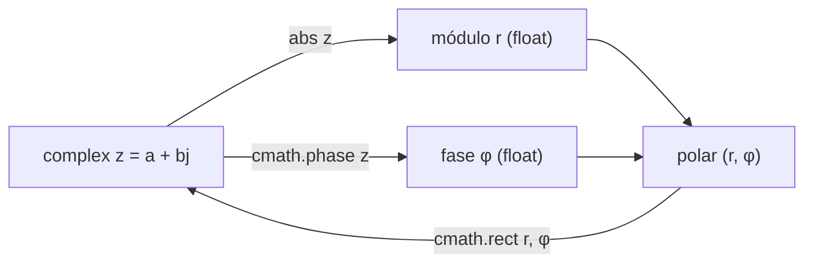

# Complejos-`complex`

Un número complejo consta de dos partes: una **parte real** y una **parte imaginaria**. En matemáticas, la unidad imaginaria se representa con una `i` ($\sqrt{ -1 }$), pero Python (siguiendo la tradición de los ingenieros electricistas) utiliza la letra **`j`**. Es un tipo inmutable, escalar, y ambas partes se almacenan internamente como [[02 Flotantes (float) | float]] de doble precisión (64 bits cada una).

Son fundamentales en campos como la física, el procesamiento de señales, la ingeniería eléctrica y el análisis de datos científicos.

> [!info] Modelo matemático
> Un `complex` representa $z = a + b\,j$ donde $a$ es la parte real y $b$ la imaginaria. Equivale a un punto en el plano complejo, descrito tanto en forma **cartesiana** $(a, b)$ como en forma **polar** $(r, \varphi)$ con módulo $r = |z|$ y fase $\varphi$.

## Construcción

| Forma | Sintaxis | Resultado |
| --- | --- | --- |
| Literal `j` | `3 + 5j` | `(3+5j)` |
| Solo imaginaria | `5j` | `5j` |
| Constructor 2 args | `complex(3, 5)` | `(3+5j)` |
| Constructor 1 arg | `complex(3)` | `(3+0j)` |
| Desde string | `complex("3+5j")` | `(3+5j)` |
| Imaginario puro | `complex(0, 1)` | `1j` |

```python
z1 = 3 + 5j            # literal: real + imag·j
z2 = complex(3, 5)     # constructor numérico
z3 = complex("3+5j")   # desde texto (sin espacios internos)
print(z1 == z2 == z3)  # True
```

> [!warning] Detalles del literal y del constructor
> - El sufijo `j` debe ir **pegado** al número: `5j` es válido, `5 j` es `SyntaxError`. Para coeficiente 1 hay que escribirlo: `1j`, no `j` (esto último sería un nombre de variable).
> - `complex("3+5j")` exige el string **sin espacios** alrededor del `+`: `complex("3 + 5j")` lanza `ValueError`.
> - Un literal como `3 + 5j` es en realidad la **suma** del `int` `3` con el `complex` `5j`; el resultado se promueve a `complex`.

## Acceso a sus partes

Un objeto `complex` expone tres miembros de solo lectura. `.real` e `.imag` son atributos (sin paréntesis); `.conjugate()` es un método.

| Miembro | Tipo devuelto | Descripción |
| --- | --- | --- |
| `z.real` | `float` | Parte real $a$ |
| `z.imag` | `float` | Parte imaginaria $b$ (coeficiente de `j`, sin la `j`) |
| `z.conjugate()` | `complex` | Conjugado $\bar z = a - b\,j$ |

```python
numero = complex(3, 5)
print(numero.real)         # 3.0   (siempre float)
print(numero.imag)         # 5.0   (coeficiente, no '5j')
print(numero.conjugate())  # (3-5j)
print(type(numero.imag))   # <class 'float'>
```

El conjugado es la herramienta algebraica clave: $z \cdot \bar z = a^2 + b^2 = |z|^2$ siempre es real y no negativo, y es lo que Python usa internamente para dividir.

## Operaciones aritméticas

Python implementa el álgebra de complejos de forma automática. Toda operación con un complejo **promueve** el otro operando a `complex`.

| Operación | Regla | Ejemplo | Resultado |
| --- | --- | --- | --- |
| Suma / Resta | componente a componente | `(1+2j)+(3+4j)` | `(4+6j)` |
| Multiplicación | distributiva con $j^2=-1$ | `(1+2j)*(3+4j)` | `(-5+10j)` |
| `j*j` | $j^2 = -1$ | `1j*1j` | `(-1+0j)` |
| División | multiplica por el conjugado | `(4+6j)/(1+1j)` | `(5+1j)` |
| Potencia | admite exponentes complejos | `(1+1j)**2` | `(2j)` |
| Negación / `abs()` | módulo (ver abajo) | `abs(3+4j)` | `5.0` |

```python
a = (1+2j) + (3+4j)     # (4+6j)   real con real, imag con imag
b = (1+2j) * (3+4j)     # (-5+10j) -> 3 + 4j + 6j + 8j² = 3+10j-8
c = (4+6j) / (1+1j)     # (5+1j)   internamente: (4+6j)·(1-1j)/2
d = (1+1j) ** 2         # 2j
```

> [!warning] Operaciones no soportadas
> - **`//` y `%`** no existen para complejos: `(1+2j) // 1` lanza `TypeError`. La división entera y el módulo aritmético no están definidos.
> - `complex` **no es subtipo** de `float` ni de `int`. No se puede convertir directamente con `int(z)` ni `float(z)` (ambos dan `TypeError`); hay que extraer `z.real` / `z.imag` primero.

## No son ordenables

A diferencia de [[01 Enteros (int) | int]] y [[02 Flotantes (float) | float]], los números complejos **no admiten orden total**: no existe una forma matemáticamente consistente de decir si $3+5j$ es "mayor" que $4+2j$. Por ello los operadores `<`, `<=`, `>`, `>=` lanzan `TypeError`.

```python
(3+5j) < (4+2j)   # TypeError: '<' not supported between instances of 'complex' and 'complex'
sorted([3+5j, 1+0j])  # TypeError

# Sí se permite la igualdad:
(3+5j) == (3+5j)  # True
(3+0j) == 3       # True  (un complejo con imag 0 es igual a su real)
```

> [!tip] Si necesitas ordenar
> Ordena por una magnitud real derivada, típicamente el módulo o la fase:
> ```python
> nums = [3+5j, 1+1j, 4+2j]
> ordenados = sorted(nums, key=abs)   # por módulo
> # [(1+1j), (4+2j), (3+5j)]
> ```

## Módulo, fase y forma polar

- `abs(z)` devuelve el **módulo** (magnitud) $r = \sqrt{a^2 + b^2}$ como `float`.
- El ángulo (fase, argumento) $\varphi$ requiere el módulo [[Modulo y Paquetes | `cmath`]].

```python
import cmath, math

z = 3 + 4j
print(abs(z))            # 5.0          módulo = √(3²+4²)
print(cmath.phase(z))    # 0.9272952...  fase en radianes (atan2(4,3))
print(math.degrees(cmath.phase(z)))  # 53.130...  en grados
```

### Conversión cartesiana ↔ polar

| Función `cmath` | Entrada → Salida | Uso |
| --- | --- | --- |
| `phase(z)` | `complex` → `float` | fase $\varphi$ en radianes, rango $(-\pi, \pi]$ |
| `polar(z)` | `complex` → `(r, φ)` | tupla módulo-fase de una sola vez |
| `rect(r, φ)` | `(float, float)` → `complex` | reconstruye desde forma polar |

```python
import cmath

z = 1 + 1j
r, phi = cmath.polar(z)          # (1.4142135..., 0.7853981...)  -> (√2, π/4)
z2 = cmath.rect(r, phi)          # (1.0000000000000002+1j)  reconstrucción
print(cmath.rect(1, cmath.pi))   # (-1+1.2246e-16j)  ≈ -1 (residuo numérico)
```

> [!note] Residuos de coma flotante
> `rect`/`polar` operan sobre `float`, por lo que aparecen residuos como `1.2246e-16` en lugar de `0`. No compares el resultado con `==`; usa `cmath.isclose(a, b)`.

## Módulo `cmath`

`cmath` es el equivalente complejo de [[Modulo y Paquetes | `math`]]: sus funciones aceptan y devuelven `complex`. La diferencia crítica es que `cmath` opera en el dominio complejo, donde operaciones imposibles para `math` (como la raíz de un negativo) **sí** tienen solución.

| Función | Descripción | Ejemplo → Salida |
| --- | --- | --- |
| `cmath.sqrt(x)` | raíz cuadrada (también de negativos) | `cmath.sqrt(-1)` → `1j` |
| `cmath.exp(z)` | exponencial compleja $e^{z}$ | `cmath.exp(1j*cmath.pi)` → `(-1+1.2e-16j)` |
| `cmath.log(z)` | logaritmo natural complejo | `cmath.log(-1)` → `3.1415...j` |
| `cmath.phase(z)` | fase / argumento | `cmath.phase(1j)` → `1.5707...` |
| `cmath.polar(z)` | $(r, \varphi)$ | `cmath.polar(1j)` → `(1.0, 1.5707...)` |
| `cmath.rect(r, φ)` | polar → cartesiano | `cmath.rect(1, 0)` → `(1+0j)` |
| `cmath.isclose(a, b)` | comparación tolerante | `cmath.isclose(1+1e-15j, 1)` → `True` |
| `cmath.pi`, `cmath.e` | constantes (float) | — |

```python
import math, cmath

# math falla con negativos; cmath no:
# math.sqrt(-1)        # ValueError: math domain error
print(cmath.sqrt(-1))  # 1j
print(cmath.sqrt(-4))  # 2j

# Identidad de Euler: e^(iπ) + 1 = 0
print(cmath.exp(1j * cmath.pi))  # (-1+1.2246e-16j)  ≈ -1
```

> [!warning] `math` vs `cmath`
> Las funciones de `math` esperan y devuelven `float`; pasarles un `complex` lanza `TypeError`, y la raíz/log de un negativo lanza `ValueError`. Para cualquier cálculo que pueda salir del eje real, usa `cmath`.



## Formateo

Los complejos admiten el mini-lenguaje de formato aplicado **por componente**. No existe un código de presentación global del complejo, pero sí se pueden formatear partes o usar `format()`/f-strings sobre el objeto.

```python
z = 3.14159 + 2.71828j

print(f"{z}")            # (3.14159+2.71828j)
print(f"{z:.2f}")        # 3.14+2.72j        -> aplica .2f a ambas partes
print(f"{z.real:.1f}")   # 3.1               componente individual
print(f"{abs(z):.3f}")   # 4.157             módulo formateado

# Reconstruir representación legible manualmente:
print(f"{z.real:.2f} + {z.imag:.2f}j")   # 3.14 + 2.72j
```

> [!note] Signo del componente imaginario
> `repr()` y `str()` siempre muestran el signo explícito de la parte imaginaria: `(3-5j)`, `(3+0j)`. Un complejo con parte real cero se abrevia a `5j` solo cuando es literal puro; impreso como objeto completo aparece `(0+5j)` salvo que provenga de un literal imaginario.

## Aplicaciones

| Dominio | Uso del complejo |
| --- | --- |
| Ingeniería eléctrica | **Fasores**: tensión/corriente AC como $V e^{j\omega t}$; impedancias $Z = R + jX$ |
| Procesamiento de señales | **FFT** (`numpy.fft`) devuelve espectros complejos: magnitud = amplitud, fase = desfase |
| Física / control | funciones de transferencia, polos y ceros en el plano $s$ |
| Geometría | rotaciones en 2D mediante multiplicación por $e^{j\theta}$ |

```python
import cmath

# Fasor: amplitud 10, fase 30° -> forma cartesiana
amplitud, grados = 10, 30
fasor = cmath.rect(amplitud, cmath.pi * grados / 180)
print(fasor)            # (8.660...+5.0j)

# Rotar el punto (1, 0) noventa grados en el plano:
punto = 1 + 0j
rotado = punto * cmath.exp(1j * cmath.pi / 2)
print(rotado)           # (6.12e-17+1j)  ≈ (0+1j)
```

> [!note] Nota
> Para ver mas Operaciones revisar [[Operadores de Variables]]
