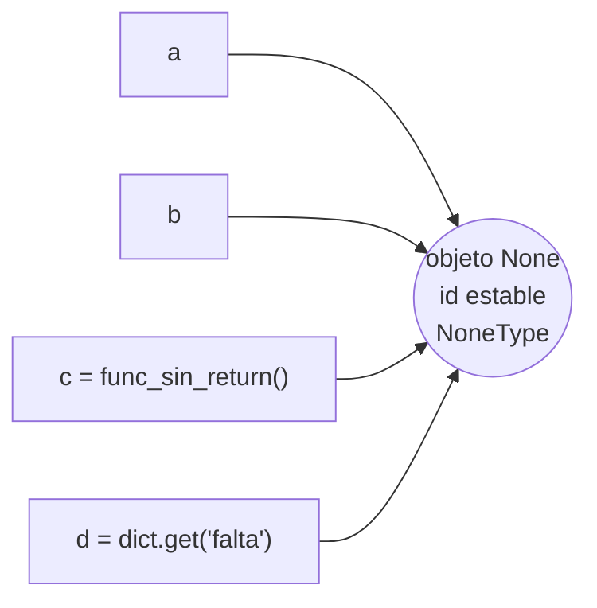

# NoneType-`None`
En Python, **`None`** es un objeto especial que se utiliza para señalar la **ausencia de valor** o un estado de **vacío definido**. A diferencia de otros lenguajes que usan `null` o `nil`, en Python `None` es un objeto único (un _singleton_), lo que significa que todas las variables que valen `None` apuntan exactamente al mismo lugar en la memoria.

Su tipo de dato oficial es `NoneType`.

```python
type(None)        # <class 'NoneType'>
bool(None)        # False  (None es falsy)
None == None      # True   (pero NO es la forma correcta de comparar; ver mas abajo)
```

> [!info] Identidad rapida
> - `None` no es lo mismo que `0`, ni `""`, ni `[]`, ni `False`. Es la **falta** de dato, no un dato "vacio".
> - Es **inmutable** y **falsy** (`bool(None)` es `False`).
> - No se puede instanciar: `NoneType()` lanza `TypeError`. El unico modo de obtener un `NoneType` es el literal `None`.

## El singleton: un unico objeto en todo el proceso

`None` existe **una sola vez** durante toda la vida del intérprete. No hay forma de crear "otro `None`": el nombre `None` es una palabra reservada que siempre referencia ese mismo objeto, con un `id()` estable.

```python
a = None
b = None

id(a) == id(b)    # True  -> a y b son el MISMO objeto en memoria
a is b            # True  -> identidad garantizada

None = 5          # SyntaxError: cannot assign to None (es palabra reservada)
NoneType = type(None)
NoneType()        # TypeError: cannot create 'NoneType' instances
```



Como solo existe un objeto, **comparar por identidad (`is`) es correcto, fiable y rapido**: no construye nada, solo compara dos punteros.

## Identidad y Comparación: `is` / `is not`, nunca `==`

Debido a que `None` es un objeto único en todo el programa, la documentación oficial (PEP 8) recomienda **siempre** usar el operador de identidad `is` en lugar del operador de igualdad `==`.

```python
if variable is None:       # CORRECTO: pregunta "¿es exactamente el objeto None?"
    ...
if variable is not None:   # CORRECTO: negacion
    ...

if variable == None:       # ANTIPATRON (ver abajo)
    ...
```

| Comparacion | Que pregunta | Resultado |
| --- | --- | --- |
| `x is None` | ¿`x` es el **mismo objeto** que `None`? | Forma correcta, no invocable por el usuario |
| `x is not None` | ¿`x` **no** es el objeto `None`? | Forma correcta para "tiene valor" |
| `x == None` | ¿`x` **es igual** a `None` segun `__eq__`? | Antipatron: depende de `__eq__`, puede mentir |

> [!warning] Por que `== None` es peligroso
> `==` invoca el metodo `__eq__` del objeto de la izquierda. Una clase puede sobrecargar `__eq__` y devolver `True` (o un valor truthy) al compararse con `None`, rompiendo la deteccion. Numpy es el caso clasico: comparar un array con `==` no devuelve un `bool` sino otro array.
> ```python
> import numpy as np
> arr = np.array([1, 2, 3])
> arr == None     # array([False, False, False])  -> NO es un bool
> bool(arr == None)  # falla o da resultado ambiguo en arrays mayores
> arr is None      # False  -> siempre seguro, devuelve un bool limpio
> ```
> Con `is` no hay despacho de metodos: la comparacion es de identidad pura y siempre devuelve un `bool`.

## `None` como retorno implicito de funciones

Si una [[40 Funciones/index | función]] no ejecuta una sentencia `return` con valor, Python devuelve `None` automáticamente. Esto aplica a:

- Funciones sin ningun `return`.
- Funciones que ejecutan `return` "pelado" (sin expresión).
- Funciones cuyo flujo termina sin alcanzar el `return`.

```python
def saludar(nombre):
    print(f"Hola {nombre}")
    # sin return -> devuelve None

resultado = saludar("Ana")   # imprime "Hola Ana"
print(resultado)             # None

def buscar(lista, x):
    for i, v in enumerate(lista):
        if v == x:
            return i
    # si no encuentra, cae aqui -> return implicito None

buscar([1, 2, 3], 9)         # None
```

> [!warning] El error de los metodos mutadores
> Muchos métodos modifican el objeto **en el sitio** (_in-place_) y devuelven `None`, no el objeto modificado. Encadenarlos es un error frecuente.
> ```python
> nums = [3, 1, 2]
> ordenada = nums.sort()      # sort() ordena nums in-place y DEVUELVE None
> print(ordenada)             # None  (¡no la lista!)
> print(nums)                 # [1, 2, 3]
>
> # Lo mismo con: list.append, list.reverse, dict.update, set.add ...
> # Si necesitas el valor, usa la version que retorna copia:
> ordenada = sorted(nums)     # sorted() SI devuelve una lista nueva
> ```

## `None` como valor por defecto de parametros

`None` es el valor por defecto idiomático para argumentos opcionales, sobre todo cuando el defecto "real" sería un objeto **mutable**. Usar un mutable directamente como default es un bug clásico, porque el default se evalúa **una sola vez** al definir la función y se comparte entre llamadas.

```python
# ANTIPATRON: el default mutable se comparte entre llamadas
def add(item, bucket=[]):
    bucket.append(item)
    return bucket

add(1)   # [1]
add(2)   # [1, 2]   <- ¡acumula! mismo list de la primera llamada

# PATRON CORRECTO: centinela None + crear el objeto dentro
def add(item, bucket=None):
    if bucket is None:
        bucket = []          # lista nueva en cada llamada sin argumento
    bucket.append(item)
    return bucket

add(1)   # [1]
add(2)   # [1]   <- correcto
```

## `None` por defecto vs centinela propio (_sentinel_)

`None` como default funciona **mientras `None` no sea un valor valido** que el usuario pueda querer pasar. Cuando necesitas distinguir **"no se paso argumento"** de **"se paso `None` a proposito"**, `None` deja de servir como marca y hay que crear un **objeto centinela** propio.

```python
_MISSING = object()   # centinela unico, distinto de cualquier valor del usuario

def actualizar(config, valor=_MISSING):
    if valor is _MISSING:
        print("el usuario NO paso 'valor'")
    elif valor is None:
        print("el usuario paso None a proposito (p.ej. borrar el campo)")
    else:
        print(f"el usuario paso: {valor!r}")

actualizar({})              # el usuario NO paso 'valor'
actualizar({}, None)        # el usuario paso None a proposito
actualizar({}, 42)          # el usuario paso: 42
```

| Necesidad | Centinela a usar |
| --- | --- |
| Distinguir "sin valor" de cualquier valor **excepto** `None` | `None` basta |
| Distinguir "no pasado" de "pasado `None`" | Centinela propio: `_MISSING = object()` |
| Centinela con buen `repr` para debug | `_MISSING = object()` envuelto en clase, o `enum`/`dataclass` |

> [!tip] Centinela con `repr` legible
> Un `object()` pelado se imprime como `<object object at 0x...>`. Para depurar mejor:
> ```python
> class _Missing:
>     def __repr__(self): return "<MISSING>"
> MISSING = _Missing()
> MISSING   # <MISSING>
> ```
> La libreria estandar usa este patron (`dataclasses.MISSING`, `inspect.Parameter.empty`).

## `None` y el tipado: `Optional` / `| None`

En anotaciones de tipo, un valor que puede ser `T` o `None` se declara con `Optional[T]` (modulo `typing`) o, desde Python 3.10, con la sintaxis `T | None`. Ambas son **equivalentes**: `Optional[T]` es exactamente `Union[T, None]`.

```python
from typing import Optional

def buscar(id: int) -> Optional[str]:   # devuelve un str o None
    ...

# Python 3.10+ (sintaxis preferida actual):
def buscar(id: int) -> str | None:
    ...
```

| Anotacion | Significa | Disponible |
| --- | --- | --- |
| `Optional[str]` | `str` o `None` | `typing`, todas las versiones |
| `str \| None` | `str` o `None` | Python 3.10+ |
| `Optional[str] = None` | parametro opcional con default `None` | siempre |

> [!warning] `Optional` no implica default
> `Optional[T]` significa "el tipo incluye `None`", **no** "tiene valor por defecto". Un parametro `x: Optional[int]` sigue siendo **obligatorio** salvo que ademas le des `= None`. Y solo deberias usar `Optional` (o `| None`) cuando `None` sea realmente un valor posible; no lo pongas "por si acaso".

## Antipatrones frecuentes

| Antipatron | Por que falla | Forma correcta |
| --- | --- | --- |
| `if x == None:` | depende de `__eq__`, puede mentir (numpy, etc.) | `if x is None:` |
| `if not x:` para detectar `None` | `0`, `0.0`, `""`, `[]`, `{}`, `False` tambien son falsy | `if x is None:` |
| `bucket=[]` como default | el mutable se comparte entre llamadas | `bucket=None` + crear dentro |
| `None` como marca cuando el user puede pasar `None` | no se distingue "no pasado" de "paso None" | centinela `object()` |
| encadenar `lista.sort().pop()` | `sort()` devuelve `None` | `sorted(lista)` o dos pasos |

> [!warning] El antipatron `if not x` (el mas costoso de depurar)
> Confundir "ausencia de valor" con "valor falsy" produce bugs silenciosos: un `0` o un `""` perfectamente validos se tratan como si no existieran.
> ```python
> def aplicar_descuento(precio, descuento):
>     if not descuento:            # MAL: 0 (sin descuento valido) entra aqui
>         descuento = 10
>     return precio - descuento
>
> aplicar_descuento(100, 0)        # 90  <- ¡se forzo un descuento de 10!
>
> def aplicar_descuento(precio, descuento):
>     if descuento is None:        # BIEN: solo el "no especificado" entra
>         descuento = 10
>     return precio - descuento
>
> aplicar_descuento(100, 0)        # 100 <- correcto: 0 es un descuento valido
> ```

## Usos comunes (resumen consultable)

| Uso | Ejemplo |
| --- | --- |
| Inicializar variable sin valor aun | `resultado = None` |
| Default seguro para parametros mutables | `def f(x, acc=None): ...` |
| Retorno "no encontrado" | `return None` (o el implicito) |
| Distinguir ausencia con centinela | `def f(x=MISSING): ...` |
| Tipado de valor opcional | `def f() -> int \| None: ...` |
| Borrar/resetear un atributo | `self.cache = None` |
| Default de `dict.get` y `getattr` | `d.get('k')` devuelve `None` si falta la clave |

```python
d = {"a": 1}
d.get("a")            # 1
d.get("z")            # None       (no lanza KeyError)
d.get("z", 0)         # 0          (default explicito)

getattr(obj, "attr", None)   # None si el atributo no existe
```

> [!note] Relacion con Truthiness
> `None` es uno de los valores **falsy** del lenguaje. La lista completa y la logica de evaluacion booleana esta en [[Valores Truthy y Falsy | Valores Truthy y Falsy]]. La distincion practica clave: `None` es falsy, pero **no todo falsy es `None`** (de ahi el antipatron `if not x`).
