# Datos Primitivos

Los **Datos Primitivos** son los *bloques de construcción* más básicos y fundamentales para la manipulación de datos: los tipos de información más simples que el lenguaje puede procesar y que no pueden descomponerse en algo más sencillo. Aunque en Python técnicamente *todo es un objeto*, categorizamos como primitivos a aquellos que representan **valores únicos y directos**, son **inmutables** y se almacenan en memoria como un objeto singular al que apuntan las variables.

```mermaid
flowchart TD
    classDef raiz fill:#3b4252,stroke:#88c0d0,stroke-width:3px,color:#eceff4,font-weight:bold;
    classDef categoria fill:#434c5e,stroke:#81a1c1,stroke-width:2px,color:#eceff4;
    classDef subcategoria fill:#4c566a,stroke:#5e81ac,stroke-width:1.5px,color:#eceff4;
    classDef especial fill:#bf616a,stroke:#d08770,stroke-width:2px,color:#eceff4,font-weight:bold;

    Title((Datos Primitivos)):::raiz

    Title --> Numericos[Numéricos]:::categoria
    Title --> Vacio[Vacío]:::categoria

    subgraph G1 [Matemática]
        Numericos --> Entero[int]:::subcategoria
        Numericos --> Flotante[float]:::subcategoria
        Numericos --> Complejo[complex]:::subcategoria
        Entero -.-> Booleano[bool]:::especial
    end

    subgraph G3 [Nulo]
        Vacio --> NoneT[NoneType]:::especial
    end

    style G1 fill:#2e3440,stroke:#5e81ac,stroke-dasharray:5 5,stroke-width:1.5px
    style G3 fill:#2e3440,stroke:#5e81ac,stroke-dasharray:5 5,stroke-width:1.5px

    linkStyle default stroke:#81a1c1,stroke-width:1.6px
    linkStyle 4 stroke:#bf616a,stroke-width:1.6px,stroke-dasharray:3 3

```

## Hojas

- [[01 Enteros (int) | Enteros (int)]] — `int` con precisión arbitraria, bases bin/oct/hex, divisiones `/` `//` `%` y enteros grandes sin `OverflowError`.
- [[02 Flotantes (float) | Flotantes (float)]] — `float` de doble precisión (64 bits), límites `inf`/`nan` y el problema del `0.1 + 0.2`.
- [[03 Complejos (complex) | Complejos (complex)]] — `complex` con sufijo `j`, partes `.real`/`.imag`, operaciones y conjugado.
- [[04 Booleanos (bool) | Booleanos (bool)]] — `bool` como subclase de `int`, operadores lógicos `and`/`or`/`not`, cortocircuito y la lógica de [[Valores Truthy y Falsy | truthiness]].
- [[05 NoneType (None) | NoneType (None)]] — `None` como singleton para ausencia de valor y por qué se compara con `is` y no con `==`.

## Resumen

| Tipo       | Hoja                                              | Valores / ejemplo        | Inmutable | Notas clave                                  |
| ---------- | ------------------------------------------------- | ------------------------ | --------- | -------------------------------------------- |
| `int`      | [[01 Enteros (int) \| Enteros]]                    | `10`, `0xA`, `2**1000`   | Sí        | Precisión arbitraria, sin `OverflowError`    |
| `float`    | [[02 Flotantes (float) \| Flotantes]]             | `3.14`, `inf`, `nan`     | Sí        | Doble precisión (64 bits), error de redondeo |
| `complex`  | [[03 Complejos (complex) \| Complejos]]           | `3 + 5j`, `complex(3,5)` | Sí        | Partes `.real` e `.imag`, sufijo `j`         |
| `bool`     | [[04 Booleanos (bool) \| Booleanos]]              | `True`, `False`          | Sí        | Subclase de `int` (`True == 1`)              |
| `NoneType` | [[05 NoneType (None) \| NoneType]]                | `None`                   | Sí        | Singleton, comparar con `is`                 |

> [!note] Nota
> Los tipos `str` (cadenas) y `bytes` / `bytearray` (datos binarios), aunque a veces se listan junto a los primitivos, se cubren como secuencias en **20 Estructura de Datos / 21 Secuencias**.
