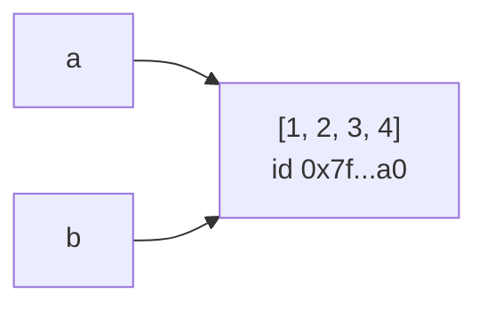
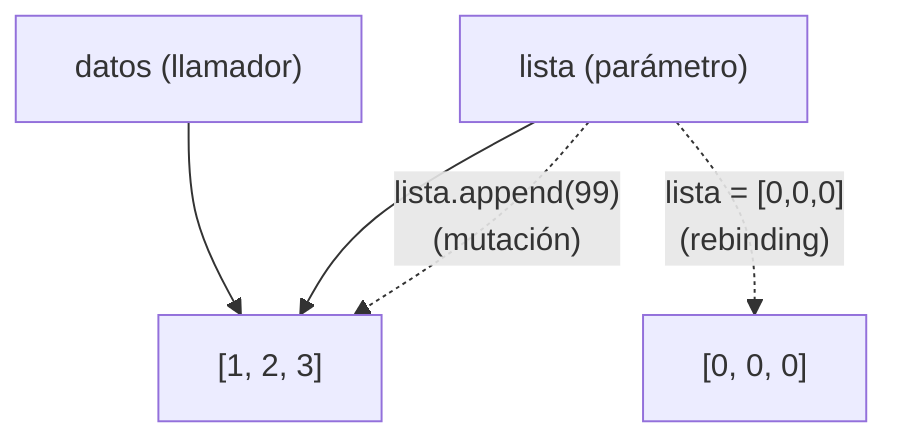

# Objetos Mutables

> [!definicion]
> Un objeto **mutable** permite cambiar su contenido interno **sin cambiar su identidad** (su dirección de memoria). Las operaciones *in-place* alteran el objeto existente; el `id` se conserva y todas las referencias a ese objeto ven el cambio.

Tipos mutables del núcleo de Python:

- **Colecciones:** `list`, `dict`, `set`.
- **Binarios:** `bytearray`.
- **Estructuras de usuario:** la mayoría de los objetos de clases definidas por el usuario son mutables por defecto.

Los mutables son **no hashables**: como su contenido (y por tanto su hash) podría cambiar, no pueden usarse como claves de [[01 Diccionarios | diccionarios]] ni como elementos de un `set`.

## Tabla de tipos mutables del núcleo

| Tipo        | Literal / constructor   | Muta con               | Hashable | Notas |
| ----------- | ----------------------- | ---------------------- | -------- | ----- |
| `list`      | `[1, 2]`                | `[i]=`, `append`, `+=` | No       | Secuencia ordenada heterogénea |
| `dict`      | `{"a": 1}`              | `[k]=`, `update`, `pop`| No       | Claves deben ser hashables; valores libres |
| `set`       | `{1, 2}`                | `add`, `discard`, `\|=`| No       | Elementos deben ser hashables |
| `bytearray` | `bytearray(b"abc")`     | `[i]=`, `append`, `+=` | No       | Versión mutable de `bytes`; ítems `0-255` |
| `frozenset` | `frozenset({1})`        | —                      | Sí       | Inmutable (incluido por contraste) |
| `bytes`     | `b"abc"`                | —                      | Sí       | Inmutable (incluido por contraste) |

```python
lst = [1, 2];          lst[0] = 99        # list:      [99, 2]
dct = {"a": 1};        dct["b"] = 2       # dict:      {"a": 1, "b": 2}
st  = {1, 2};          st.add(3)          # set:       {1, 2, 3}
ba  = bytearray(b"ab"); ba[0] = 65        # bytearray: b'Ab'  (65 == ord('A'))
```

## Modificación in-place: la identidad se conserva

A diferencia de los [[01 Objetos Inmutables | objetos inmutables]], modificar un mutable no crea un objeto nuevo. El `id` permanece constante antes y después de la operación.

```python
b = [1, 2, 3]            # Lista - mutable
print(f"id(b) antes: {id(b)}")   # Ej: 140123...
b.append(4)              # Modifica EN SITIO
print(f"id(b) después: {id(b)}")  # MISMO id
```

```python
d = {"a": 1}
print(id(d))
d["b"] = 2               # Muta el mismo dict
d.update({"c": 3})       # In-place, devuelve None
print(id(d))             # MISMO id

s = {1, 2}
s.add(3)                 # In-place
ba = bytearray(b"abc")
ba[0] = 65               # Permitido: 'a' -> 'A'  (b'Abc')
```

### `+=` vs `+` sobre mutables

En `list`, el operador aumentado `+=` muta **in-place** (equivale a `extend`), mientras que `+` construye una lista nueva. La diferencia es observable vía aliasing.

```python
a = [1, 2]; b = a
a += [3]          # IN-PLACE: extend -> a y b son el mismo objeto
print(b)          # [1, 2, 3]   (b vio el cambio)
print(a is b)     # True

a = [1, 2]; b = a
a = a + [3]       # NUEVO objeto + rebinding del nombre a
print(b)          # [1, 2]      (b conserva el original)
print(a is b)     # False
```

> [!warning]
> `lista += otra` falla si `lista` es atributo de una tupla: la tupla es inmutable y rechaza el *rebinding* final, **pero la lista ya se mutó**. `t = ([1],); t[0] += [2]` lanza `TypeError` y aun así deja `t == ([1, 2],)`.

## Métodos que mutan (retornan `None`) vs. métodos que retornan copia

Los métodos que modifican el objeto en sitio devuelven `None` por convención, para impedir el encadenado que sugeriría (falsamente) una copia. Confundirlos es un error frecuente: `x = lista.sort()` deja `x is None`.

| Operación        | In-place (retorna `None`)         | Equivalente que retorna objeto nuevo |
| ---------------- | --------------------------------- | ------------------------------------ |
| Ordenar lista    | `lst.sort()`                      | `sorted(lst)`                        |
| Invertir lista   | `lst.reverse()`                   | `lst[::-1]` / `reversed(lst)`        |
| Añadir al final  | `lst.append(x)` / `lst.extend(y)` | `lst + [x]` / `lst + list(y)`        |
| Fusionar dict    | `d.update(o)`                     | `{**d, **o}` / `d \| o` (3.9+)       |
| Unir conjuntos   | `s.update(o)` / `s \|= o`         | `s \| o`                             |
| Quitar duplicado | `s.discard(x)`                    | `s - {x}`                            |

```python
nums = [3, 1, 2]

nums.sort()                 # In-place
print(nums)                 # [1, 2, 3]
print(nums.sort())          # None   <- el método NO retorna la lista

ordenada = sorted([3, 1, 2])  # Retorna copia nueva
print(ordenada)             # [1, 2, 3]   (original intacto)
```

> [!tip]
> Regla mnemotécnica: **verbo sobre el objeto → muta y retorna `None`** (`lst.sort()`); **función que toma el objeto → retorna copia** (`sorted(lst)`). Lo mismo aplica `list.reverse()` vs `reversed()`.

## Aliasing: referencias compartidas mutan juntas

Asignar una variable mutable a otra **no copia** el objeto: ambos nombres apuntan al mismo objeto. Una mutación a través de cualquier nombre es visible a través del otro.

```python
a = [1, 2, 3]
b = a            # b NO es copia: mismo objeto
b.append(4)
print(a)         # [1, 2, 3, 4]  -> a también cambió
print(a is b)    # True
```



> [!warning]
> Este es el riesgo central de los mutables (*aliasing problemático*): cambios inesperados en un nombre porque otro lo mutó. Para obtener un objeto independiente hay que copiar explícitamente.

El aliasing también surge de forma silenciosa al construir estructuras anidadas por repetición:

```python
matriz = [[0] * 3] * 3      # TRAMPA: 3 referencias a la MISMA fila
matriz[0][0] = 1
print(matriz)               # [[1, 0, 0], [1, 0, 0], [1, 0, 0]]  -> todas

matriz = [[0] * 3 for _ in range(3)]   # Filas independientes
matriz[0][0] = 1
print(matriz)               # [[1, 0, 0], [0, 0, 0], [0, 0, 0]]
```

La copia superficial vs. profunda (`copy()`, `[:]`, `copy.deepcopy`) se trata en [[03 Copia (shallow vs deep) | Copia]].

## Paso de argumentos: efectos colaterales (*call by sharing*)

Python pasa argumentos por **referencia de objeto** (*call by sharing*): la función recibe una referencia al mismo objeto. Mutarlo dentro de la función afecta al original del llamador.

```python
def agregar(lista):
    lista.append(99)     # MUTA el objeto recibido (in-place)

datos = [1, 2, 3]
agregar(datos)
print(datos)             # [1, 2, 3, 99]  -> el original cambió
```

En cambio, una **reasignación** del parámetro dentro de la función solo reenlaza el nombre local; no afecta al original:

```python
def reemplazar(lista):
    lista = [0, 0, 0]    # rebinding local; el original NO cambia

datos = [1, 2, 3]
reemplazar(datos)
print(datos)             # [1, 2, 3]
```



> [!regla]
> Mutar el argumento (`.append`, `[i]=`, `.update`) propaga el cambio al llamador. Reasignar el parámetro (`param = ...`) no. Con inmutables, como toda "modificación" es un rebinding, nunca hay efecto colateral.

## La trampa del argumento por defecto mutable

> [!warning]
> Un valor por defecto mutable en una firma de función se evalúa **una sola vez**, en el momento de la definición (`def`), y se comparte entre todas las llamadas, acumulando estado entre invocaciones.

```python
def agregar(item, acc=[]):   # PELIGRO: la lista por defecto persiste
    acc.append(item)
    return acc

print(agregar(1))   # [1]
print(agregar(2))   # [1, 2]  -> NO [2]

# El default vive en el objeto función:
print(agregar.__defaults__)   # ([1, 2],)  <- estado acumulado
```

```python
# Solución: centinela None (crear el mutable DENTRO del cuerpo)
def agregar(item, acc=None):
    if acc is None:
        acc = []
    acc.append(item)
    return acc

print(agregar(1))   # [1]
print(agregar(2))   # [2]   -> lista fresca por llamada
```

> [!tip]
> El centinela `None` es el patrón canónico. Aplica igual a `dict`/`set` por defecto y a defaults derivados (`def f(x, cache={})`). Un default **inmutable** (`x=0`, `x=()`, `x="abc"`) no sufre el problema porque no puede mutar.

## Mutable vs. inmutable: criterios de elección

| Necesitas…                                       | Elige           |
| ------------------------------------------------ | --------------- |
| Clave de `dict` o elemento de `set`              | Inmutable (`tuple`, `frozenset`, `str`) |
| Colección que crece/cambia (acumular, ordenar)   | Mutable (`list`, `dict`, `set`) |
| Pasar datos sin temor a efectos colaterales      | Inmutable, o copia defensiva |
| Compartir estado intencionalmente entre partes   | Mutable (con disciplina de aliasing) |
| Constante / valor por defecto seguro             | Inmutable |
| Concurrencia sin locks                           | Inmutable (no hay escritura compartida) |
| Buffer binario editable (E/S, parsing)           | `bytearray` |
| Garantizar que nadie modifique tras construir    | Inmutable (`tuple`, `frozenset`) |

> [!info] Costes operativos de los mutables
> - **No thread-safe:** los cambios concurrentes requieren sincronización explícita.
> - **No hashables:** no pueden ser claves de `dict` ni elementos de `set`.
> - **Aliasing:** compartir referencias puede producir mutaciones no deseadas; copiar cuando se requiera independencia (ver [[03 Copia (shallow vs deep) | Copia]]).
> - **Razonamiento local:** una referencia mutable puede cambiar "a distancia", dificultando seguir el estado; el inmutable garantiza que su valor es estable.

## Casos especiales

> [!warning]
> Estos casos requieren temas que aún no se tratan; se incluyen como referencia.

`array.array` (tipo homogéneo compacto) y `collections.deque` (cola doble optimizada para extremos) son mutables especializados:

```python
import array
from collections import deque

arr = array.array('i', [1, 2, 3])
arr[0] = 99           # Mutable como lista, pero todos los ítems son 'i' (int)

dq = deque([1, 2, 3])
dq.appendleft(0)      # O(1) en ambos extremos (in-place)
print(dq)             # deque([0, 1, 2, 3])
```
