# Copia: superficial (shallow) vs. profunda (deep)

> [!definicion]
> **Copiar** un objeto [[02 Objetos Mutables | mutable]] crea un objeto nuevo (con `id` distinto) en lugar de un *alias*. La diferencia clave está en hasta qué nivel se duplica:
> - **Copia superficial (*shallow*):** duplica solo el contenedor externo; los objetos anidados se **comparten** (se copian las referencias, no los objetos).
> - **Copia profunda (*deep*):** duplica el contenedor y **recursivamente** todos los objetos anidados, hasta aislar la nueva estructura por completo.

La copia solo es relevante para mutables: copiar un inmutable es innecesario (no puede cambiar) y Python suele devolver el mismo objeto.

## Aliasing: el problema que la copia resuelve

Asignar una variable mutable a otra **no copia** el objeto: ambos nombres apuntan al mismo objeto (*aliasing*). Una mutación a través de cualquier nombre es visible a través del otro.

```python
a = [1, 2, 3]
b = a            # b NO es copia: mismo objeto (alias)
b.append(4)
print(a)         # [1, 2, 3, 4]  -> a también cambió
print(a is b)    # True
```

> [!warning]
> Este es el riesgo central de los mutables (*aliasing problemático*): cambios inesperados en un nombre porque otro lo mutó. Para obtener un objeto independiente hay que **copiar explícitamente**.

## Mecanismos de copia

```python
import copy

a = [1, 2, 3]

b = a.copy()             # copia superficial (shallow) - método de list/dict/set
b = list(a)              # idem: el constructor de tipo crea una copia superficial
b = a[:]                 # idem para secuencias: slice completo
b = copy.copy(a)         # copia superficial genérica (cualquier objeto)
b = copy.deepcopy(a)     # copia profunda: también duplica objetos anidados
```

| Mecanismo            | Nivel       | Aplica a                     |
| -------------------- | ----------- | ---------------------------- |
| `obj.copy()`         | Superficial | `list`, `dict`, `set`, ...   |
| `tipo(obj)`          | Superficial | `list(x)`, `dict(x)`, `set(x)` |
| `obj[:]`             | Superficial | secuencias (`list`, ...)     |
| `copy.copy(obj)`     | Superficial | cualquier objeto             |
| `copy.deepcopy(obj)` | Profunda    | cualquier objeto             |

## Superficial: el contenedor es nuevo, el contenido se comparte

La copia superficial duplica el contenedor pero **comparte los objetos anidados**. Mutar un elemento de primer nivel del nuevo objeto no afecta al original, pero mutar un objeto anidado **sí** se ve en ambos.

```python
import copy

original = [[1, 2], [3, 4]]
shallow = copy.copy(original)     # o original.copy() / original[:]

print(shallow is original)        # False  -> contenedor distinto
print(shallow[0] is original[0])  # True   -> sublistas COMPARTIDAS

# Mutar un anidado se ve en ambos
shallow[0].append(99)
print(original)                   # [[1, 2, 99], [3, 4]]  -> ¡afectó al original!

# Reemplazar un elemento de primer nivel NO afecta al original
shallow[1] = [0, 0]
print(original)                   # [[1, 2, 99], [3, 4]]  -> sin cambios
```

## Profunda: aislamiento recursivo total

`copy.deepcopy` recorre la estructura y duplica cada objeto anidado, produciendo una copia totalmente independiente. Mutar cualquier nivel del nuevo objeto **nunca** afecta al original.

```python
import copy

original = [[1, 2], [3, 4]]
deep = copy.deepcopy(original)

print(deep is original)           # False
print(deep[0] is original[0])     # False  -> sublistas también duplicadas

deep[0].append(99)
print(original)                   # [[1, 2], [3, 4]]  -> intacto
```

> [!regla]
> Si la estructura solo contiene inmutables en su interior, la copia superficial basta. Si contiene **mutables anidados** y se requiere independencia total, hace falta `copy.deepcopy`.

## Comparación

```mermaid
flowchart TB
    classDef raiz fill:#3b4252,stroke:#88c0d0,stroke-width:3px,color:#eceff4,font-weight:bold;
    classDef nodo fill:#434c5e,stroke:#81a1c1,stroke-width:2px,color:#eceff4;
    classDef shared fill:#bf616a,stroke:#d08770,stroke-width:2px,color:#eceff4,font-weight:bold;
    classDef nuevo fill:#4c566a,stroke:#a3be8c,stroke-width:2px,color:#eceff4;

    subgraph S [Copia superficial]
        OrigS[Contenedor original]:::raiz --> SubS[Sublistas anidadas]:::shared
        CopS[Contenedor copia]:::nuevo --> SubS
    end

    subgraph D [Copia profunda]
        OrigD[Contenedor original]:::raiz --> SubD1[Sublistas originales]:::nodo
        CopD[Contenedor copia]:::nuevo --> SubD2[Sublistas duplicadas]:::nodo
    end

    style S fill:#2e3440,stroke:#5e81ac,stroke-dasharray:5 5,stroke-width:1.5px
    style D fill:#2e3440,stroke:#5e81ac,stroke-dasharray:5 5,stroke-width:1.5px
    linkStyle default stroke:#81a1c1,stroke-width:1.6px
```



| Aspecto                       | Superficial (*shallow*) | Profunda (*deep*)      |
| ----------------------------- | ----------------------- | ---------------------- |
| Contenedor externo            | Nuevo (`id` distinto)   | Nuevo (`id` distinto)  |
| Objetos anidados              | Compartidos             | Duplicados (recursivo) |
| Mutar anidado afecta original | Sí                      | No                     |
| Coste                         | Bajo                    | Alto (recorre todo)    |
| Aislamiento                   | Parcial (1 nivel)       | Total                  |

## Notas de implementación

> [!info]
> - `copy.deepcopy` gestiona **referencias circulares** mediante un *memo* interno, evitando recursión infinita; cada objeto ya visto se copia una sola vez.
> - Los objetos **inmutables** anidados (p. ej. `int`, `str`, `tuple` de inmutables) no necesitan duplicarse: `deepcopy` puede devolver la misma instancia compartida sin riesgo, ya que no pueden mutar.
> - Una clase puede personalizar su copia definiendo `__copy__` y `__deepcopy__`.
> - El coste de `deepcopy` crece con el tamaño y profundidad de la estructura; usar copia superficial cuando el aislamiento de un solo nivel sea suficiente.
