# Mutabilidad e Inmutabilidad

> [!definicion]
> La **mutabilidad** es una propiedad del **tipo de dato**, no del valor. CPython la implementa a nivel de C: cada tipo define si sus instancias pueden modificarse *in-place*.
> - **Inmutable:** su contenido **no puede cambiar** tras la creación; "modificarlo" produce un objeto nuevo en otra dirección de memoria.
> - **Mutable:** **permite cambiar** su contenido interno **sin cambiar su identidad** (su dirección de memoria).

## Identidad vs. valor

La función `id(objeto)` devuelve la dirección de memoria. Si el `id` cambia tras una operación, el dato es inmutable; si se conserva, la operación fue *in-place* y el dato es mutable.

> [!tip]
> Comprobación con `id()`: un `id` que cambia delata un objeto [[01 Objetos Inmutables | inmutable]] (rebinding); un `id` que se conserva delata un objeto [[02 Objetos Mutables | mutable]] (mutación in-place).
> ```python
> a = (1, 2, 3)  # Tupla - inmutable
> b = [1, 2, 3]  # Lista - mutable
>
> print(f"id(a) antes: {id(a)}")  # Ej: 140245...
> a = a + (4,)  # Crea NUEVA tupla
> print(f"id(a) después: {id(a)}")  # DIFERENTE id
>
> print(f"\nid(b) antes: {id(b)}")  # Ej: 140123...
> b.append(4)  # Modifica EN SITIO
> print(f"id(b) después: {id(b)}")  # MISMO id
> ```

`is` compara **identidad** (mismo objeto), `==` compara **valor**. Dos objetos distintos pueden ser iguales en valor (`==`) pero no idénticos (`is`).

## Clasificación de datos

```mermaid
flowchart LR
    classDef raiz fill:#3b4252,stroke:#88c0d0,stroke-width:3px,color:#eceff4,font-weight:bold;
    classDef categoria fill:#434c5e,stroke:#81a1c1,stroke-width:2px,color:#eceff4;
    classDef subcategoria fill:#4c566a,stroke:#5e81ac,stroke-width:1.5px,color:#eceff4;
    classDef especial fill:#bf616a,stroke:#d08770,stroke-width:2px,color:#eceff4,font-weight:bold;

    Title((Clasificación por Mutabilidad)):::raiz

    Title --> Inmutables[Inmutables · Hashables]:::categoria
    Title --> Mutables[Mutables · No Hashables]:::categoria

    subgraph G1 [Seguros · Estáticos]
        Inmutables --> Num[int · float · complex · bool]:::subcategoria
        Inmutables --> SecIn[str · tuple · bytes]:::subcategoria
        Inmutables --> FSet[frozenset]:::especial
        Inmutables --> Cst[None]:::especial
    end

    subgraph G2 [Dinámicos · Flexibles]
        Mutables --> Col[list · dict · set]:::subcategoria
        Mutables --> Bin[bytearray]:::subcategoria
        Mutables --> User[Objetos de Usuario]:::especial
    end

    style G1 fill:#2e3440,stroke:#5e81ac,stroke-dasharray:5 5,stroke-width:1.5px
    style G2 fill:#2e3440,stroke:#5e81ac,stroke-dasharray:5 5,stroke-width:1.5px

    linkStyle default stroke:#81a1c1,stroke-width:1.6px

```



## Categorías

- [[01 Objetos Inmutables | Objetos inmutables]] — `int`, `float`, `complex`, `bool`, `str`, `tuple`, `bytes`, `frozenset`, `None`; hashables; cada "cambio" crea un objeto nuevo (rebinding); seguros frente al aliasing.
- [[02 Objetos Mutables | Objetos mutables]] — `list`, `dict`, `set`, `bytearray` y objetos de usuario; modificación in-place conservando identidad; no hashables; sensibles al aliasing y al paso de argumentos.
- [[03 Copia (shallow vs deep) | Copia (shallow vs deep)]] — `copy()`, `[:]`, `list(x)`, `copy.copy` vs. `copy.deepcopy`; copia superficial (comparte anidados) vs. profunda (aislamiento recursivo); soluciona el aliasing problemático.

| Hoja                                                  | Tema central                                  | Conceptos clave                                            |
| ----------------------------------------------------- | --------------------------------------------- | ---------------------------------------------------------- |
| [[01 Objetos Inmutables \| Objetos inmutables]]       | Tipos que no cambian; rebinding               | hashables, interning, pool de enteros, inmutabilidad superficial |
| [[02 Objetos Mutables \| Objetos mutables]]           | Tipos modificables in-place; identidad estable | aliasing, call by sharing, defecto mutable                 |
| [[03 Copia (shallow vs deep) \| Copia (shallow vs deep)]] | Duplicar en vez de aliasar                | `copy()` / `[:]` / `deepcopy`, superficial vs. profunda     |

## Implicaciones en memoria y paso de argumentos

Python pasa argumentos por **referencia de objeto** (*call by sharing*). Con inmutables nunca hay efecto colateral, porque toda "modificación" es un rebinding local. Con mutables, mutar el argumento dentro de una función (`.append`, `[i]=`, `.update`) propaga el cambio al llamador; reasignar el parámetro no. El detalle, junto con el aliasing, se desarrolla en [[02 Objetos Mutables | Objetos mutables]]; la copia superficial vs. profunda como solución al aliasing se trata en [[03 Copia (shallow vs deep) | Copia (shallow vs deep)]].

Los inmutables habilitan optimizaciones de CPython (pool de enteros pequeños, interning de strings) y compartición de memoria; los mutables exigen copia explícita cuando se requiere independencia. Ver [[01 Objetos Inmutables | Objetos inmutables]].

## Tabla comparativa

| Tipo           | Mutable | Hashable | Thread-safe | Copia por defecto | Uso memoria |
| -------------- | ------- | -------- | ----------- | ----------------- | ----------- |
| `int`, `float` | ❌       | ✅        | ✅           | Por valor         | Optimizado  |
| `str`          | ❌       | ✅        | ✅           | Por valor         | Interning   |
| `tuple`        | ❌       | ✅        | ✅           | Por valor         | Eficiente   |
| `list`         | ✅       | ❌        | ❌           | Por referencia    | Dinámico    |
| `dict`         | ✅       | ❌        | ❌           | Por referencia    | Hash table  |
| `set`          | ✅       | ❌        | ❌           | Por referencia    | Hash table  |
| `frozenset`    | ❌       | ✅        | ✅           | Por valor         | Hash table  |

> [!info]
> La inmutabilidad de un contenedor es **superficial**: una `tuple` con un elemento mutable conserva su `id` pero permite que el objeto interno mute, y pierde su carácter hashable. Esta distinción estricta vs. relativa se trata en [[01 Objetos Inmutables | Objetos inmutables]].
