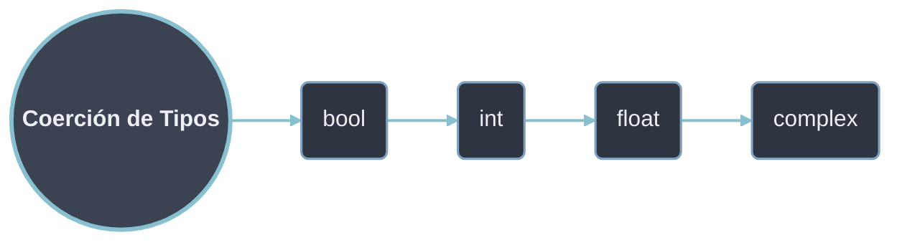

# Conversión Implícita (Coerción)

La **coerción** ocurre automáticamente cuando el intérprete realiza una operación entre operandos de tipos numéricos distintos. Python promueve el operando de menor capacidad al tipo de mayor capacidad para evaluar la expresión sin pérdida de información. No requiere intervención del programador y solo opera dentro del dominio numérico; entre `str` y números **nunca** hay coerción (lanza `TypeError`).

Hay dos contextos de coerción distintos en Python, que no deben confundirse:

| Contexto | Qué hace | Disparador |
|----------|----------|------------|
| **Promoción numérica** | Unifica el tipo de dos operandos numéricos antes de operar | Operadores aritméticos (`+ - * / ** //`), comparaciones |
| **Contexto booleano** | Evalúa la *veracidad* (truthiness) de un objeto cualquiera | `if`, `while`, `and`, `or`, `not`, `bool()` |

## Jerarquía de promoción

De menor a mayor capacidad de representación:



En una operación binaria, el tipo del resultado es el del operando situado más a la derecha en la jerarquía. `bool` es subclase de `int`, por lo que `True` actúa como `1` y `False` como `0` en cualquier contexto aritmético. El tipo `str` mantiene su propio espacio y queda fuera de esta cadena.

> [!info] Excepción: `/` siempre devuelve `float`
> La división verdadera rompe la regla de "el más a la derecha gana": `int / int` produce `float` aunque ambos operandos sean enteros (`6 / 2 → 3.0`). Es la única operación aritmética que promueve hacia arriba sin que ningún operando lo fuerce. Para preservar `int` usa división entera `//` (`6 // 2 → 3`).

### Mecánica de la operación mixta

La promoción no es una "conversión previa" del lenguaje, sino una negociación entre los métodos de los propios tipos. En `2 + 3.0`:

1. Python invoca `(2).__add__(3.0)`. El método de `int` no sabe sumar un `float` y devuelve `NotImplemented`.
2. Python invoca el método reflejado `(3.0).__radd__(2)`. El `float` sabe promover el `int` a `2.0` y suma.
3. Resultado `5.0`, de tipo `float`.

```python
print(2 + 3.0)            # 5.0
print(type(2 + 3.0))      # <class 'float'>
print((2).__add__(3.0))   # NotImplemented  (int no resuelve la suma mixta)
print((3.0).__radd__(2))  # 5.0             (float la resuelve)
```

El resultado de cualquier cadena de operandos numéricos es del tipo más alto presente en toda la expresión, no solo del par evaluado en cada paso:

```python
print(type(True + 3 + 2.0))   # <class 'float'>   bool→int→float
print(type(1 + 2.0 + 3j))     # <class 'complex'> float→complex
```

## Ejemplos

```python
# 1. Int + Float → Float
resultado = 5 + 2.0        # 7.0 (int promovido a float)
print(type(resultado))     # <class 'float'>

# 2. Booleanos como enteros
print(True + 5)           # 6 (True = 1)
print(False * 10)         # 0 (False = 0)
print(True + True)        # 2

# 3. Promoción completa
print(type(True + 3.14))  # <class 'float'>
print(type(5 + 3j))       # <class 'complex'> (int + complex → complex)

# 4. Strings NO se convierten implícitamente
# print("5" + 3)          # Error: can only concatenate str to str
```

## Tabla de coerción automática

| Operación | Tipo Resultado | Ejemplo | Valor Resultante |
|-----------|----------------|---------|------------------|
| `bool` + `int` | `int` | `True + 5` | `6` |
| `bool` + `float` | `float` | `False + 3.14` | `3.14` |
| `int` + `float` | `float` | `7 + 2.5` | `9.5` |
| `int` + `int` con `/` | `float` | `6 / 2` | `3.0` |
| `int/float` + `complex` | `complex` | `5 + 3j` | `5+3j` |
| `bool` en contexto aritmético | `int` | `sum([True, False, True])` | `2` |

## `bool` como subtipo de `int`

`bool` hereda de `int` (`issubclass(bool, int) → True`), por lo que `True`/`False` participan en aritmética como `1`/`0` sin conversión alguna. Esto habilita patrones de conteo directo sobre iterables de condiciones:

```python
print(True + True + False)        # 2
print(sum([True, False, True]))   # 2   cuenta de Trues
print([n % 2 == 0 for n in range(6)].count(True))  # 3

# Conteo idiomático: cuántos elementos cumplen una condición
datos = [4, 7, 1, 9, 2]
print(sum(x > 3 for x in datos))  # 3   (cada comparación es bool → int)

# Indexación binaria con bool
opciones = ["apagado", "encendido"]
print(opciones[True])             # encendido   (True == 1)
```

> [!tip] `True` y `False` son enteros válidos como índice/clave
> Como `True == 1` y `False == 0` (y comparten hash), `{1: "a", True: "b"}` colapsa en **una sola** entrada con clave `1` y valor `"b"`. No uses `bool` como clave de diccionario junto a `0`/`1`.

## Coerción al contexto booleano

`if`, `while`, `and`, `or`, `not` y `bool()` no exigen un `bool`: convierten implícitamente cualquier objeto a su valor de verdad (*truthiness*) invocando `__bool__` o, en su defecto, `__len__`. Reglas:

| Se evalúan como `False` | Se evalúan como `True` |
|-------------------------|------------------------|
| `False`, `None` | Cualquier otro objeto |
| `0`, `0.0`, `0j`, `Decimal(0)` | Números distintos de cero |
| `""`, `[]`, `()`, `{}`, `set()`, `range(0)` | Contenedores no vacíos |

```python
if "texto":   print("entra")     # str no vacío → True
if []:         print("no entra") # lista vacía → False
if 0.0:        print("no entra") # cero → False

print(bool(0), bool(""), bool([]))    # False False False
print(bool(-1), bool("0"), bool([0])) # True True True   ("0" NO es vacío)
```

> [!warning] `bool("0")` es `True`
> El contexto booleano solo mira si el `str` está vacío, no su contenido. `"0"`, `"False"` y `" "` son cadenas no vacías y por tanto **verdaderas**. Para interpretar texto numérico usa [[02 Conversion Explicita | conversión explícita]] (`int("0")`).

### Valor de retorno de `and` / `or`

Los operadores lógicos **no devuelven `True`/`False`**: devuelven uno de los operandos originales (evaluación de cortocircuito). `bool()` solo se aplica internamente para decidir cuál retornar.

```python
# or: devuelve el primer operando verdadero, o el último si todos son falsos
print(0 or "respaldo")      # respaldo   (0 es falso → devuelve el 2.º)
print("a" or "b")           # a          (ya es verdadero → corta)

# and: devuelve el primer operando falso, o el último si todos son verdaderos
print(5 and 10)             # 10         (ambos verdaderos → devuelve el último)
print(0 and 10)             # 0          (corta en el primer falso)

# Patrón de valor por defecto
nombre = entrada or "anónimo"   # usa "anónimo" si entrada es "", None, 0...
```

## Por qué NO hay coerción `str` ↔ número

Python es de tipado **fuerte**: nunca convierte texto a número (ni al revés) de forma implícita. Operar entre dominios incompatibles es un error, no una conversión silenciosa.

```python
"2" + 3        # TypeError: can only concatenate str (not "int") to str
"2" - 1        # TypeError: unsupported operand type(s) for -: 'str' and 'int'
5 < "5"        # TypeError: '<' not supported between 'int' and 'str'
```

Los únicos operadores que aceptan `str` con un número aplican **semántica de secuencia**, no aritmética: `*` repite y `+` solo concatena `str` con `str`.

```python
print("ab" * 3)     # ababab   (repetición de secuencia, no multiplicación)
print("10" * 2)     # 1010     (NO 20: el str se repite)
# "10" + 2          # TypeError (+ entre str y número no existe)
```

### Contraste con JavaScript (tipado débil)

La misma expresión que en Python es `TypeError` produce un resultado en JS por coerción implícita `str`↔número, fuente clásica de bugs silenciosos:

| Expresión | Python | JavaScript |
|-----------|--------|------------|
| `"2" + 3` | `TypeError` | `"23"` (coerciona `3`→`"3"`) |
| `"2" - 1` | `TypeError` | `1` (coerciona `"2"`→`2`) |
| `2 + true` | `3` (`bool` es `int`) | `3` |
| `[] + []` | `TypeError` | `""` |

> [!warning] Límite de la coerción
> La promoción solo es automática entre tipos numéricos. La expresión `"10" * 2` no convierte el `str` a número: aplica la semántica de repetición de secuencias y produce `"1010"`. Cuando se necesita combinar texto y números aritméticamente se requiere [[02 Conversion Explicita | conversión explícita]].
