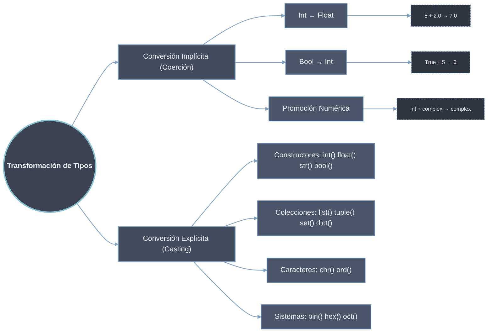

# Transformación de Tipos

Cambio del tipo de un valor en Python. Se distinguen dos mecanismos: la **coerción**, que el intérprete aplica de forma automática siguiendo una jerarquía de promoción numérica, y el **casting**, que el programador fuerza mediante funciones constructoras. La diferencia operativa es quién decide y quién asume el riesgo: la coerción nunca pierde información ni falla; el casting puede **truncar** (`int(3.9) → 3`) o lanzar `ValueError` ante un dato mal formado.

## Mecanismos

- [[01 Conversion Implicita | Conversión implícita (coerción)]] — promoción automática `bool → int → float → complex` en operaciones aritméticas; `str` queda fuera de la cadena.
- [[02 Conversion Explicita | Conversión explícita (casting)]] — constructores `int()`, `float()`, `str()`, `bool()`, `list()`, `tuple()`, `set()`, `dict()`, `chr()`, `ord()`, más conversiones seguras con manejo de `ValueError`.

## Coerción vs casting

| Aspecto | Coerción (implícita) | Casting (explícito) |
|---------|----------------------|---------------------|
| **Quién la dispara** | El intérprete | El programador |
| **Dominio** | Solo tipos numéricos | Cualquier par de tipos compatibles |
| **Pérdida de información** | Nunca (promueve a mayor capacidad) | Posible (`int()` trunca decimales) |
| **Puede fallar** | No | Sí (`ValueError`, `TypeError`) |
| **Sintaxis** | Implícita en el operador | Función constructora `tipo(valor)` |
| **Ejemplo** | `5 + 2.0 → 7.0` | `int("100") → 100` |
