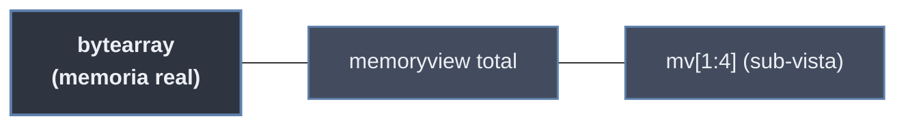

# Bytes y Bytearray

Los datos binarios son secuencias de números enteros en el rango **0 ≤ x < 256**. Cada número representa un **byte** (8 bits). A diferencia de `str` (que almacena caracteres Unicode), `bytes` y `bytearray` almacenan octetos crudos, esenciales al trabajar con:

- Imágenes o archivos de audio.
- Información enviada a través de una red (sockets).
- Archivos comprimidos o encriptados.

> [!info] Familia binaria
> `bytes` (inmutable) y `bytearray` (mutable) comparten **toda la interfaz de secuencia** (indexar, segmentar, iterar, `in`, `len`, `+`, `*`). `memoryview` es una **vista sin copia** sobre cualquiera de ellos. El puente con texto son `encode()` / `decode()`.

## Comparativa `str` / `bytes` / `bytearray`

| Característica | `str` | `bytes` | `bytearray` |
|---|---|---|---|
| **Contenido** | Caracteres Unicode | Enteros (0-255) | Enteros (0-255) |
| **Literal** | `"texto"` | `b"texto"` | sin literal; vía constructor |
| **Mutable** | No | **No** | **Sí** |
| **Hashable** | Sí (clave de dict) | Sí | **No** |
| **`x[i]` devuelve** | `str` de 1 carácter | `int` | `int` |
| **Uso común** | Texto legible | Almacenamiento / red | Manipulación de buffers |

> [!warning] `bytes` y `str` no se mezclan
> No existe coerción implícita entre ambos. `b"A" + "B"`, `b"A" == "A"` (→ `False` con `BytesWarning`) o usar `bytes` donde se espera `str` lanzan `TypeError`. Hay que convertir explícitamente con [[#Puente texto ↔ binario (`encode` / `decode`)|encode/decode]].

## `bytes` (inmutable)

Versión **inmutable** de los datos binarios. Una vez creado, no se pueden modificar sus elementos.

### Construcción y literales

```python
b"Hola"                  # literal: solo caracteres ASCII imprimibles + escapes
bytes()                  # b''            (vacío)
bytes(3)                 # b'\x00\x00\x00' (n ceros)
bytes([72, 105])         # b'Hi'          (desde iterable de ints 0-255)
bytes("ñ", "utf-8")      # b'\xc3\xb1'    (desde str + codificación)
bytes.fromhex("48 69")   # b'Hi'          (desde hex, ignora espacios)
```

> [!warning] El literal `b"..."` solo admite ASCII
> Un carácter no ASCII en un literal de bytes es error de sintaxis: `b"ñ"` → `SyntaxError`. Para incluir octetos arbitrarios se usan **escapes** o se codifica un `str`.

### Escapes en literales binarios

Dentro de `b"..."` se interpretan secuencias de escape para representar bytes no imprimibles:

| Escape | Byte | Significado |
|---|---|---|
| `\xHH` | `0xHH` | Byte arbitrario en hexadecimal (siempre 2 dígitos) |
| `\n` / `\r` / `\t` | `0x0A` / `0x0D` / `0x09` | Salto, retorno, tabulador |
| `\0` | `0x00` | Byte nulo |
| `\\` | `0x5C` | Barra invertida literal |
| `\'` `\"` | `0x27` `0x22` | Comilla |

```python
data = b"\x89PNG\r\n\x1a\n"   # firma mágica de un archivo PNG
print(len(data))              # 8
print(data[0])                # 137  (0x89)
b"\x41\x42\x43" == b"ABC"     # True
```

> [!note] `\u`, `\U`, `\N{}` NO existen en bytes
> Los escapes Unicode son exclusivos de `str`. En `bytes` solo se trabaja con octetos (`\x00`–`\xff`).

### Acceso: indexar devuelve `int`, segmentar devuelve `bytes`

```python
b_msg = b"ABC"
print(b_msg[0])      # 65        -> indexar UN elemento devuelve int
print(b_msg[0:1])    # b'A'      -> un slice devuelve bytes
print(b_msg[-1])     # 67
print(list(b_msg))   # [65, 66, 67]   -> iterar produce ints
for n in b_msg:
    pass             # n es int, no bytes

65 in b_msg          # True   -> 'in' con int busca ese byte
b"BC" in b_msg       # True   -> 'in' con bytes busca subsecuencia
```

## `bytearray` (mutable)

Versión **mutable** de los bytes. Útil al recibir datos binarios y modificarlos in-place sin crear copias nuevas en memoria (ahorra recursos). No es hashable, por lo que no sirve como clave de diccionario ni elemento de `set`.

### Construcción

```python
bytearray()                 # bytearray(b'')
bytearray(4)                # bytearray(b'\x00\x00\x00\x00')
bytearray(b"Hola")          # desde bytes
bytearray([72, 105])        # bytearray(b'Hi')
bytearray("café", "utf-8")  # desde str + codificación
```

### Mutación in-place

```python
ba = bytearray(b"Hola")
ba[0] = 77                 # asignación por índice (int 0-255)
print(ba)                  # bytearray(b'Mola')

ba.append(33)              # añade un byte (int) al final  -> b'Mola!'
ba.extend(b"!!")           # concatena bytes/iterable      -> b'Mola!!!'
ba[1:3] = b"ar"            # asignación por slice (puede cambiar longitud)
print(ba)                  # bytearray(b'Mara!!!')
del ba[-3:]                # elimina un tramo               -> b'Mara'
ba += b"villa"             # += muta el mismo objeto        -> b'Maravilla'
```

| Operación | Efecto | Notas |
|---|---|---|
| `ba[i] = n` | Reemplaza un byte | `n` debe ser `int` en 0-255, no `bytes` |
| `ba[i:j] = iterable` | Reemplaza un tramo | Puede cambiar la longitud total |
| `ba.append(n)` | Añade un byte | Argumento `int` |
| `ba.extend(it)` | Añade varios | Iterable de ints o `bytes` |
| `ba.insert(i, n)` | Inserta byte en `i` | |
| `ba.pop([i])` | Extrae y devuelve `int` | Por defecto el último |
| `ba.remove(n)` | Borra primer byte igual a `n` | |
| `del ba[i:j]` | Elimina tramo | |

> [!warning] Asignar requiere `int`, no `bytes`
> `ba[0] = b"M"` lanza `TypeError`. Hay que asignar el entero: `ba[0] = 77` o `ba[0] = ord("M")`. En cambio, en una asignación por **slice** sí se acepta un iterable de bytes: `ba[0:1] = b"M"`.

## Puente texto ↔ binario (`encode` / `decode`)

La conversión entre `str` y datos binarios siempre exige una **codificación** explícita (por defecto `utf-8`). Tratado a fondo en [[01 Cadenas | Cadenas]], sección de codificaciones.

```python
texto = "café"
b = texto.encode("utf-8")      # str -> bytes
print(b)                       # b'caf\xc3\xa9'
print(len(texto), len(b))      # 4 5   -> 'é' ocupa 2 bytes en UTF-8

de_vuelta = b.decode("utf-8")  # bytes -> str
print(de_vuelta)               # café
```

### Manejo de errores con `errors=`

Cuando un byte no es decodificable (o un carácter no es codificable), el parámetro `errors` controla la política:

| Valor de `errors` | Comportamiento | Sentido |
|---|---|---|
| `"strict"` | Lanza `UnicodeDecodeError` / `UnicodeEncodeError` | Por defecto |
| `"ignore"` | Descarta el byte/carácter problemático | Pérdida silenciosa |
| `"replace"` | Sustituye por `�` (decode) o `?` (encode) | Marca el fallo visiblemente |
| `"backslashreplace"` | Reemplaza por escape `\xHH` | Diagnóstico |
| `"surrogateescape"` | Mapea bytes inválidos a sustitutos reversibles | Round-trip de bytes opacos |

```python
mal = b"\xff\xfeA"
mal.decode("utf-8")                       # UnicodeDecodeError
mal.decode("utf-8", errors="ignore")      # 'A'
mal.decode("utf-8", errors="replace")     # '��A'
mal.decode("utf-8", errors="backslashreplace")  # '\\xff\\xfeA'

"€".encode("ascii", errors="replace")     # b'?'
```

## Hexadecimal: `.hex()` y `bytes.fromhex()`

Conversión simétrica entre datos binarios y su representación textual en base 16 (útil para logs, hashes, depuración de protocolos).

```python
b = b"Hi!"
b.hex()                      # '486921'
b.hex(" ")                   # '48 69 21'   (separador opcional, 3.8+)
b.hex("-", 2)               # '4869-21'    (separador cada 2 bytes)

bytes.fromhex("48 69 21")    # b'Hi!'  (ignora espacios)
bytearray.fromhex("ff00")    # bytearray(b'\xff\x00')
```

> [!tip] `.hex()` también existe en `bytearray` y `memoryview`
> Es el inverso de `fromhex`. Para representaciones binarias/octales por byte, recorre con `format(n, "08b")`.

## Operaciones de secuencia comunes

Disponibles en `bytes` y `bytearray` (las que mutan, solo en `bytearray`):

```python
b = b"ABCABC"
len(b)                  # 6
b + b"!"                # b'ABCABC!'   concatenación
b * 2                   # b'ABCABCABCABC'
b.count(b"A")           # 2
b.find(b"CA")           # 2     (-1 si no está; index() lanza ValueError)
b.startswith(b"AB")     # True
b.replace(b"A", b"x")   # b'xBCxBC'
b.split(b"C")           # [b'AB', b'AB', b'']
b.strip(b"A")           # b'BCABC'   (quita A's de los extremos)
b.upper()               # b'ABCABC'  (solo afecta a ASCII)
b.translate(None, b"A") # b'BCBC'    (elimina bytes de delete=)
```

> [!note] Métodos tipo-`str` operan en ASCII
> `upper`, `lower`, `isdigit`, `title`, etc. existen en `bytes`/`bytearray` pero solo transforman/clasifican bytes en el rango ASCII; los demás quedan intactos.

## `memoryview`: vista sin copia

`memoryview(obj)` crea una **vista** sobre la memoria de un objeto que soporta el *buffer protocol* (`bytes`, `bytearray`, `array.array`, arrays de NumPy), **sin copiar** los datos. Permite segmentar, leer y —si el origen es mutable— escribir tramos grandes sin duplicar memoria.

```python
ba = bytearray(b"abcdef")
mv = memoryview(ba)

mv[0]                    # 97        (indexar -> int)
bytes(mv[1:4])           # b'bcd'    el slice es OTRA vista, no copia
mv[0:3] = b"XYZ"         # escribe a través de la vista...
print(ba)                # bytearray(b'XYZdef')  -> mutó el original

mv.readonly              # False (origen mutable); True si origen es bytes
mv.nbytes                # 6
mv.release()             # libera la vista (recomendado al terminar)
```



> [!tip] Cuándo usar `memoryview`
> Procesar trozos de un buffer grande (leer cabeceras, parsear un paquete, enviar slices a un socket) sin pagar la copia que provoca `ba[i:j]`. Mientras existe una `memoryview` sobre un `bytearray`, **no se puede redimensionar** el `bytearray` (lanza `BufferError`).

## Usos en I/O binario, archivos y red

El I/O binario opera siempre con `bytes` / `bytearray`, nunca con `str`.

```python
# --- Archivos binarios: modo 'rb' / 'wb' devuelve y espera bytes ---
with open("imagen.png", "rb") as f:
    firma = f.read(8)            # bytes
print(firma == b"\x89PNG\r\n\x1a\n")

with open("salida.bin", "wb") as f:
    f.write(bytes([0, 1, 255]))  # escribe octetos crudos

# --- Sockets: send/recv trabajan con bytes ---
import socket
s = socket.socket()
# s.connect((host, port))
# s.sendall("GET / HTTP/1.0\r\n\r\n".encode("ascii"))
# datos = s.recv(4096)          # -> bytes

# --- Acumular fragmentos eficientemente con bytearray ---
buffer = bytearray()
# while chunk := s.recv(4096):
#     buffer.extend(chunk)      # crece in-place, sin copias por concatenación
```

> [!tip] `bytearray` como buffer de recepción
> Acumular respuestas de red con `buffer += chunk` sobre `bytes` recrea el objeto en cada paso (O(n²)). Con `bytearray.extend()` el crecimiento es amortizado. Para `read_into` (`f.readinto(buf)`), un `bytearray` o `memoryview` preasignado evita asignaciones por iteración.

## Resumen de conversiones

| Desde → Hacia | Operación |
|---|---|
| `str` → `bytes` | `s.encode("utf-8")` |
| `bytes` → `str` | `b.decode("utf-8")` |
| `bytes` ↔ `bytearray` | `bytearray(b)` / `bytes(ba)` |
| `list[int]` → `bytes` | `bytes([72, 105])` |
| `bytes` → `list[int]` | `list(b)` |
| `bytes` → hex `str` | `b.hex()` |
| hex `str` → `bytes` | `bytes.fromhex(s)` |
| `bytes`/`bytearray` → vista | `memoryview(obj)` |
