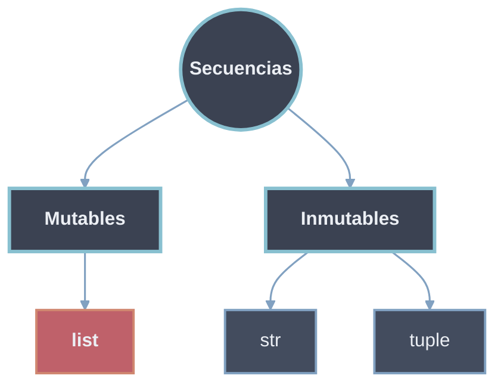

# Secuencias

Una **secuencia** es un tipo contenedor cuyos elementos están ordenados por **posición**: cada elemento ocupa un índice entero, desde `0` (primero) hasta `len(s)-1` (último), y desde `-1` (último) hacia atrás. Los tipos secuencia incorporados son `str`, `list` y `tuple`. Todos comparten un mismo protocolo de acceso y solo difieren en el **tipo de contenido** y en la **mutabilidad**.



## Protocolo común

Toda secuencia `s` soporta:

- **Indexación** `s[i]`: acceso por posición, índices positivos y negativos.
- **Slicing** `s[i:j:k]`: extrae una subsecuencia; siempre devuelve un objeto **nuevo** del mismo tipo.
- **Longitud** `len(s)`: número de elementos.
- **Pertenencia** `x in s` / `x not in s`: comprueba si un elemento está presente.
- **Concatenación** `s + t` y **repetición** `s * n` (entre secuencias del mismo tipo).
- **Iteración** con `for`, y funciones de orden como `min()`, `max()`, `sorted()`, `reversed()`.

```python
for s in ("abc", [1, 2, 3], (1, 2, 3)):
    print(s[0], s[-1], s[::-1], len(s), 1 in s if not isinstance(s, str) else 'a' in s)
```

## Mutables vs Inmutables

El eje que separa los tres tipos es la **mutabilidad**:

- Una secuencia **inmutable** (`str`, `tuple`) no admite asignación por índice ni cambio de tamaño tras su creación; "modificar" implica crear un objeto nuevo. A cambio, es **hashable** (si su contenido también lo es) y puede usarse como clave de diccionario o elemento de conjunto.
- Una secuencia **mutable** (`list`) admite asignación `s[i] = x`, crecimiento y reducción in place; **no es hashable**.

## Tipos delegados

- [[01 Cadenas | Cadenas `str`]] — secuencia inmutable de caracteres Unicode; texto, métodos de búsqueda/validación/formateo y expresiones regulares.
- [[02 Listas | Listas `list`]] — colección ordenada **mutable** y dinámica; métodos de inserción/eliminación, slicing asignable, comprehensions, uso como pila/cola y matrices multidimensionales.
- [[03 Tuplas | Tuplas `tuple`]] — colección ordenada **inmutable**; empaquetado/desempaquetado, hashabilidad, retorno múltiple y `namedtuple`.
- [[04 Bytes y Bytearray | Bytes y Bytearray]] — secuencias **binarias** de enteros `0–255`; `bytes` inmutable y `bytearray` mutable, comparativa con `str` y puente `encode()`/`decode()`.

## Tabla resumen

| Tipo               | Contenido            | Mutable | Hashable      | Sintaxis              | Uso típico                          |
| ------------------ | -------------------- | ------- | ------------- | --------------------- | ----------------------------------- |
| [[01 Cadenas \| str]]   | Caracteres Unicode   | No      | Sí            | `'...'` `"..."`       | Texto                               |
| [[02 Listas \| list]]   | Cualquier objeto     | **Sí**  | No            | `[...]`               | Datos que cambian, colecciones      |
| [[03 Tuplas \| tuple]]  | Cualquier objeto     | No      | Sí (si contenido inmutable) | `(...)` o sin paréntesis | Datos constantes, claves, retorno múltiple |
| [[04 Bytes y Bytearray \| bytes]]  | Enteros (0-255)  | No      | Sí            | `b'...'`              | Almacenamiento, red, binario |
| [[04 Bytes y Bytearray \| bytearray]]  | Enteros (0-255)  | **Sí**  | No            | `bytearray(...)`      | Manipulación de buffers |

> [!info] `bytes` y `bytearray`
> Las secuencias **binarias** (`bytes` inmutable, `bytearray` mutable) almacenan enteros `0–255` en lugar de caracteres. Se tratan en [[04 Bytes y Bytearray | Bytes y Bytearray]].
