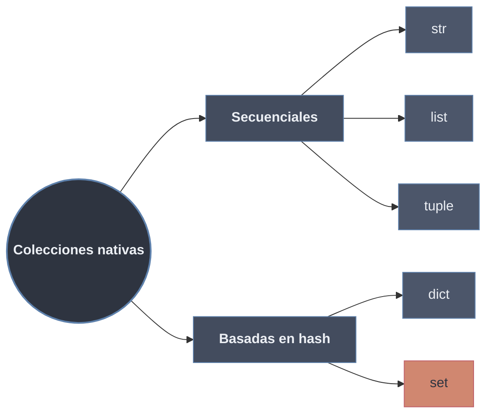

# Estructura de Datos

Una **estructura de datos** organiza múltiples valores en un solo objeto, optimizando ciertas operaciones (acceso, inserción, búsqueda, recorrido) a cambio de restringir otras. Elegir la colección correcta equivale a fijar el comportamiento del dato: si admite duplicados, si conserva orden, si es mutable y cómo se accede a sus elementos.

Las colecciones nativas se clasifican por su **organización interna**: **secuenciales** (orden por posición, acceso por índice) frente a **basadas en hash** (acceso por clave o pertenencia, en O(1) promedio).

## Subtemas

- [[21 Secuencias/index | Secuencias]] — colecciones ordenadas por posición: `str` (texto, incl. `bytes`), `list` (mutable) y `tuple` (inmutable).
- [[22 Mapas/index | Mapas]] — `dict` y sus variantes: asociación clave→valor sobre tabla hash.
- [[23 Conjuntos/index | Conjuntos]] — `set`/`frozenset`: elementos únicos y hashables, operaciones de teoría de conjuntos.

## Clasificación

| Estructura | Mutable | Organización | Duplicados | Acceso | Subtema |
| ---------- | :-----: | ------------ | :--------: | ------ | ------- |
| `str` | No | Secuencial | Sí | Índice / slicing | [[21 Secuencias/index \| Secuencias]] |
| `list` | **Sí** | Secuencial | Sí | Índice / slicing | [[21 Secuencias/index \| Secuencias]] |
| `tuple` | No | Secuencial | Sí | Índice / slicing | [[21 Secuencias/index \| Secuencias]] |
| `dict` | **Sí** | Hash | Claves no | Por clave | [[22 Mapas/index \| Mapas]] |
| `set` | **Sí** | Hash | No | Pertenencia (`in`) | [[23 Conjuntos/index \| Conjuntos]] |

La mutabilidad de cada estructura se define en [[12 Mutabilidad/index | Mutabilidad]]; las estructuras hash (`dict`, `set`) exigen que sus claves/elementos sean **hashables**, lo que excluye objetos mutables como `list`. Las colecciones son la materia prima sobre la que iteran los [[02 For | bucles]] y las comprensiones.
