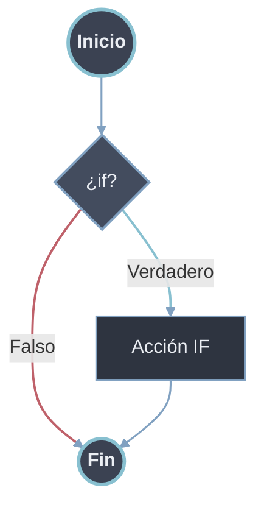
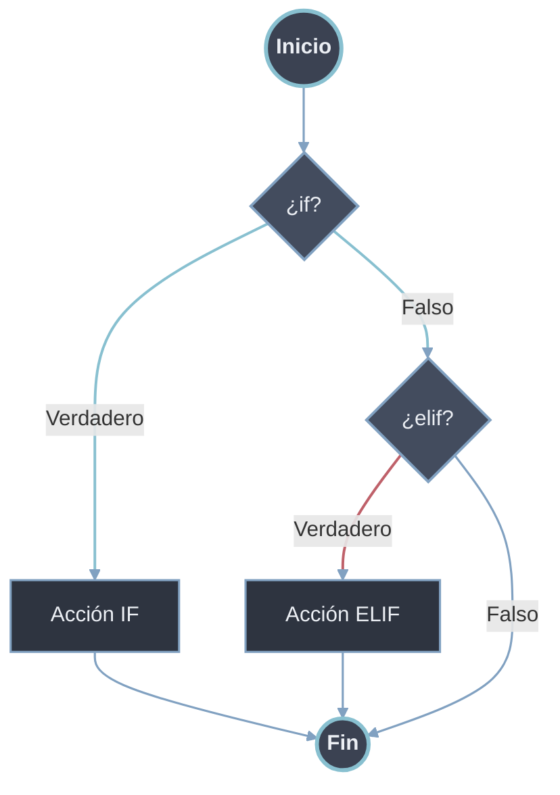
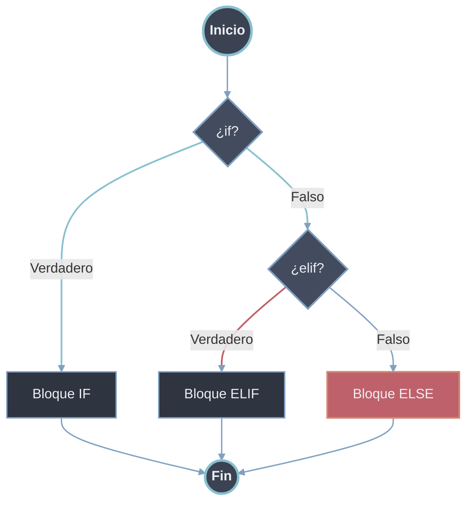
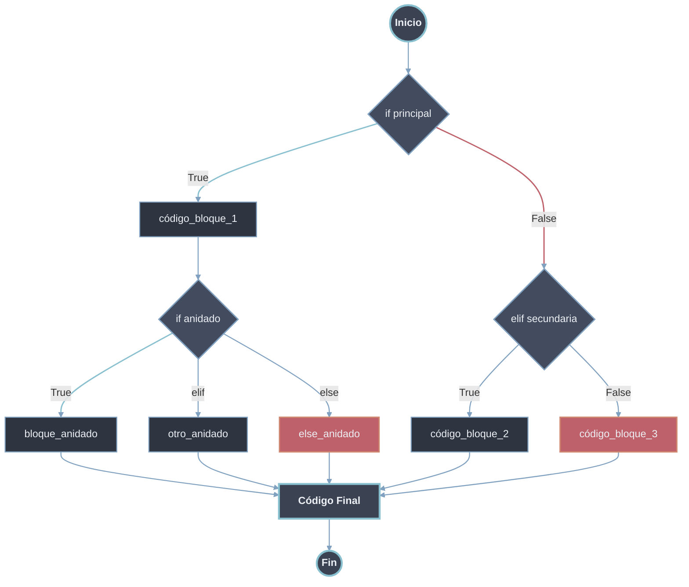

# If-Elif-Else

Estructura de control que ejecuta un bloque de código solo si una condición es verdadera. `elif` encadena condiciones alternativas; `else` cubre el caso restante. El bloque se delimita por **indentación** (4 espacios o tab) y la cabecera termina en `:`. Las condiciones se evalúan según los [[Valores Truthy y Falsy | valores de verdad]]: cualquier objeto sirve como condición, no solo `True`/`False`.

## Sintaxis

```python
if condición:          # 1. Palabra clave 'if' + expresión booleana + ':'
    instrucción_1      # 2. Bloque indentado (4 espacios o tab)
    instrucción_2
elif condición_2:      # 3. Palabra clave 'elif' (opcional, múltiples)
    instrucción_3
else:                  # 4. Palabra clave 'else' (opcional, único)
    instrucción_4
```

| Cláusula | Rol | Cardinalidad |
| -------- | --- | ------------ |
| `if` | Evalúa la condición principal; ejecuta su bloque si es `True`. | Obligatoria, única |
| `elif` | Condición alternativa, evaluada solo si las anteriores fueron `False`. | Opcional, múltiple |
| `else` | Bloque por defecto cuando todas las anteriores fueron `False`. | Opcional, único |

## `if` (Si)

Evalúa una condición y ejecuta el bloque solo si la condición es verdadera.

```python
# Sintaxis básica
if condición:
    # código a ejecutar si la condición es True
```



## `elif` (Sino-Si)

Evalúa una condición alternativa si todas las condiciones anteriores fueron falsas. Puede haber múltiples `elif`.

```python
if condición_1:
    # código si condición_1 es True
elif condición_2:
    # código si condición_1 es False y condición_2 es True
```



## `else` (Sino)

Ejecuta un bloque si todas las condiciones anteriores fueron falsas. Es opcional y solo puede haber uno por estructura `if`.

```python
if condición_1:
    # código si condición es True
elif condición_2
	# código si condición es True
else:
    # código si las condiciones son False
```



# Anidamiento (Forma Completa)

Un condicional puede contener otros condicionales dentro de su bloque. El código situado tras la estructura, sin indentar, se ejecuta siempre.

```python
# Estructura completa
if condición_principal:
    # Bloque 1 - se ejecuta si condición_principal es True
    código_bloque_1
    
    # Condicionales anidados
    if condición_anidada:
        código_bloque_anidado
    elif otra_condición_anidada:
        otro_código_anidado
    else:
        código_else_anidado
    
elif condición_secundaria:
    # Bloque 2 - se ejecuta si condición_principal es False
    # y condición_secundaria es True
    código_bloque_2
    
else:
    # Bloque 3 - se ejecuta si todas las condiciones anteriores son False
    código_bloque_3

# Código que se ejecuta siempre (fuera del condicional)
```



# Patrones de Comparación Especiales

## Identidad (`is`, `is not`)

Compara si dos variables se refieren al **mismo objeto** en memoria.

```python
# Comparación de identidad
a = [1, 2, 3]
b = [1, 2, 3]
c = a

print(a == b)  # True (mismo contenido)
print(a is b)  # False (objetos diferentes en memoria)
print(a is c)  # True (mismo objeto)

# Uso común: comparar con None
valor = None
if valor is None:
    print("Valor no asignado")

if valor is not None:
    print("Valor asignado")
```

## Igualdad (`==`, `!=`)

Compara si dos variables tienen el **mismo valor** o contenido.

```python
# Comparación de igualdad
lista1 = [1, 2, 3]
lista2 = [1, 2, 3]
lista3 = [3, 2, 1]

print(lista1 == lista2)  # True (mismo contenido)
print(lista1 == lista3)  # False (contenido diferente)
print(lista1 != lista3)  # True

# Comparaciones encadenadas
edad = 25
if 18 <= edad <= 65:
    print("Edad laboral")

# Comparación de estructuras complejas
persona1 = {"nombre": "Ana", "edad": 25}
persona2 = {"nombre": "Ana", "edad": 25}
print(persona1 == persona2)  # True
```

## Membresía (`in`, `not in`)

Verifica si un elemento está presente en una secuencia (lista, tupla, string, diccionario, etc.).

```python
# En listas/tuplas/conjuntos
frutas = ["manzana", "banana", "naranja"]
print("manzana" in frutas)    # True
print("uva" not in frutas)    # True

# En strings
texto = "Hola Mundo"
print("Hola" in texto)        # True
print("mundo" in texto)       # False (case-sensitive)

# En diccionarios (busca en las claves)
persona = {"nombre": "Carlos", "edad": 30}
print("nombre" in persona)    # True
print("Carlos" in persona)    # False (solo busca en claves)
print("edad" not in persona)  # False

# En rangos
print(5 in range(10))         # True
print(15 in range(0, 10, 2))  # False
```

## `is` vs `==`

```python
# Para valores inmutables (enteros pequeños, strings), Python optimiza
a = 256
b = 256
print(a == b)  # True
print(a is b)  # True (optimización de Python)

a = 257
b = 257
print(a == b)  # True
print(a is b)  # False (puede variar según implementación)

# REGLA: Usar 'is' para None, True, False; '==' para valores
valor = None
# CORRECTO:
if valor is None:    # ✓
    pass
# INCORRECTO:
if valor == None:    # ✗ (funciona pero no es idiomático)
    pass
```

# Patrones Avanzados de Comparación

```python
# Comparaciones de intervalos
temperatura = 22
if 20 <= temperatura <= 25:
    print("Temperatura ideal")

# Múltiples condiciones con 'in'
dia = "lunes"
if dia in ["lunes", "miércoles", "viernes"]:
    print("Día de ejercicio")

# Patrón de guardia (guard clause)
def procesar_datos(datos):
    if datos is None:
        return None
    if not datos:  # Si está vacío
        return []
    # Procesamiento normal...
    return datos_procesados
```

# Operador Morsa (Walrus `:=`)

La asignación en expresión `:=` se trata en [[04 Operador Morsa (walrus) | Operador Morsa]].

# Ejemplo Integrado

```python
def clasificar_persona(edad, es_estudiante=False, tiene_descuento=False):
    """
    Clasifica a una persona según múltiples condiciones
    """
    # Patrón de guardia
    if edad is None:
        return "Edad no proporcionada"
    
    # Condicionales anidados con múltiples factores
    if edad < 0:
        categoria = "Edad inválida"
    elif edad < 12:
        categoria = "Niño"
        if es_estudiante:
            categoria += " (estudiante)"
    elif edad < 18:
        categoria = "Adolescente"
        if es_estudiante:
            categoria += " (estudiante)"
            if tiene_descuento:
                categoria += " con descuento"
    elif edad < 65:
        categoria = "Adulto"
        if es_estudiante:
            categoria += " (estudiante adulto)"
    else:
        categoria = "Adulto mayor"
        if tiene_descuento:
            categoria += " (descuento aplicado)"
    
    # Operador ternario para mensaje adicional
    mensaje_extra = "¡Bienvenido!" if edad >= 0 else "Revisar datos"
    
    return f"{categoria}. {mensaje_extra}"

# Pruebas
print(clasificar_persona(10, es_estudiante=True))      # Niño (estudiante). ¡Bienvenido!
print(clasificar_persona(16, True, True))             # Adolescente (estudiante) con descuento. ¡Bienvenido!
print(clasificar_persona(30, False))                  # Adulto. ¡Bienvenido!
print(clasificar_persona(70, False, True))            # Adulto mayor (descuento aplicado). ¡Bienvenido!
print(clasificar_persona(None))                       # Edad no proporcionada
```

# Buenas Prácticas

1. Usa `is` para comparar con `None`, `True`, `False`.
2. Prefiere `==` para comparaciones de valor.
3. Utiliza `in` para verificar membresía en colecciones.
4. Mantén los condicionales simples y legibles.
5. Usa el [[02 Operador Ternario | operador ternario]] solo para casos simples.
6. Aplica patrones de guardia para validaciones tempranas.
7. Evita anidaciones excesivas (máximo 2-3 niveles); para muchos casos sobre un mismo sujeto, considera [[03 Match Case | match-case]].
8. Comenta condiciones complejas para claridad.
