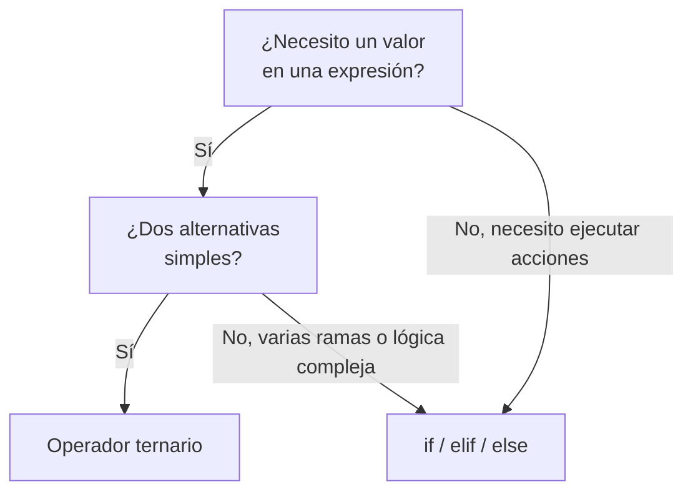

# Operador Ternario

Expresión condicional (PEP 308) que devuelve uno de dos valores según una condición, en una sola línea. A diferencia de `if`/`elif`/`else`, es una **expresión** (produce un valor) y no una sentencia, por lo que puede usarse dentro de asignaciones, argumentos, `return`, comprehensions o f-strings.

> [!info] Nombre
> En la documentación oficial se llama *conditional expression*. El término "operador ternario" viene de C (`cond ? a : b`); Python invierte el orden y antepone el valor verdadero.

## Forma Básica

```python
valor_si_true if condición else valor_si_false
```

```python
# Estructura completa
resultado = expresión_true if condición else expresión_false
#           ↑                      ↑             ↑
#     Se evalúa si           Condición a   Se evalúa si
#     condición es True      evaluar        condición es False

# Ejemplo práctico
edad = 18
status = "Mayor" if edad >= 18 else "Menor"
# status = "Mayor" (porque 18 >= 18 es True)
```

Solo se evalúa la rama correspondiente al resultado de la condición; la otra no se ejecuta (evaluación perezosa / *short-circuit*). Esto importa cuando una rama tiene efectos o puede fallar:

```python
# La rama no elegida nunca se evalúa: no hay ZeroDivisionError
n = 0
r = 100 // n if n != 0 else 0
# r = 0  (la división nunca se ejecuta)
```

### Orden de evaluación

El motor evalúa **primero la condición**, luego la rama seleccionada. La lectura textual (valor-condición-valor) no coincide con el orden de ejecución (condición-valor).

```python
def log(etiqueta, valor):
    print(f"eval {etiqueta}")
    return valor

x = log("A", 1) if log("cond", True) else log("B", 2)
# Salida:
# eval cond
# eval A
# x = 1
```

## Precedencia y paréntesis

El ternario tiene **precedencia muy baja**: menor que casi todos los operadores, mayor solo que `lambda` y el operador de asignación `:=`. Esto provoca dos errores típicos.

```python
# La condición se evalúa al final: a + (b if c else d), NO (a+b) if c else d
total = 1 + 2 if True else 0
# total = 3   (es 1 + (2 if True else 0)), no (1+2) if ... 

# Concatenación: el ternario absorbe lo que sigue
msg = "Hola " + nombre if logueado else "Invitado"
# Si logueado es False -> msg = "Invitado"  (se pierde "Hola ")
# Equivale a: ("Hola " + nombre) if logueado else "Invitado"
# Correcto:
msg = "Hola " + (nombre if logueado else "Invitado")
```

> [!warning] Siempre parentizar al incrustar
> Dentro de una expresión mayor (suma, concatenación, llamada con coma, f-string con formato), envuelve el ternario en paréntesis. El error es silencioso: produce un valor válido pero equivocado.

## Usos por contexto

| Contexto | Forma | Por qué |
|---|---|---|
| Asignación | `x = a if c else b` | Selección de valor en una línea |
| Argumento de función | `f(a if c else b)` | `if`-sentencia no cabe como argumento |
| `return` | `return a if c else b` | Una sola salida según condición |
| Elemento de lista/dict | `[a if c else b for ...]` | Transformar dentro de comprehension |
| f-string | `f"{a if c else b}"` | Lógica inline en interpolación |
| Valor por defecto | `x = dato if dato else fallback` | Ojo con *falsy* (ver más abajo) |

### En asignaciones y argumentos

```python
numero = 10
tipo = "Par" if numero % 2 == 0 else "Impar"
print(tipo)  # "Par"

precio = 100
descuento = precio * 0.9 if precio > 50 else precio
print(descuento)  # 90.0

# Como argumento, sin variable intermedia
print("ok" if precio > 0 else "sin stock")  # "ok"
```

### En comprehensions

El ternario es la **única** forma de elegir un valor dentro de la parte de salida de una comprehension. No confundir con el `if` de filtrado, que va al final y omite elementos.

```python
nums = [-2, -1, 0, 1, 2]

# Ternario: transforma TODOS los elementos (va antes del 'for')
signos = ["+" if n > 0 else "0" if n == 0 else "-" for n in nums]
# ['-', '-', '0', '+', '+']

# 'if' de filtrado: OMITE elementos (va después del 'for'), sin else
positivos = [n for n in nums if n > 0]
# [1, 2]

# Combinados: filtra y luego transforma
etiquetas = [str(n) if n % 2 else "par" for n in nums if n != 0]
# ['par', '-1', '1', 'par']  (omite el 0, transforma el resto)
```

> [!note] Regla mnemotécnica
> `valor if c else valor for x in it` → **ternario** (con `else`, antes del `for`, transforma).
> `valor for x in it if c` → **filtro** (sin `else`, después del `for`, descarta).

### En f-strings

```python
n = 5
print(f"{n} es {'par' if n % 2 == 0 else 'impar'}")
# 5 es impar

stock = 0
print(f"Estado: {'disponible' if stock else 'agotado'}")
# Estado: agotado
```

> [!tip] Comillas dentro de f-strings
> Antes de Python 3.12 no podías reutilizar el mismo tipo de comilla del f-string dentro de la expresión; se alternaba `"..."` con `'...'`. Desde 3.12 (PEP 701) ya es libre.

## Anidamiento y encadenado

Un ternario puede colocarse en la rama `else` de otro para encadenar varias condiciones. Se evalúa de **izquierda a derecha**: la primera condición verdadera fija el resultado. Equivale a una cadena `if`/`elif`/`else`, pero pierde legibilidad rápidamente.

```python
# Cadena (chained): cada else abre otro ternario
puntaje = 75
nota = "A" if puntaje >= 90 else "B" if puntaje >= 80 else "C" if puntaje >= 70 else "F"
# nota = "C"

# Equivalente con if/elif/else
if puntaje >= 90:
    nota = "A"
elif puntaje >= 80:
    nota = "B"
elif puntaje >= 70:
    nota = "C"
else:
    nota = "F"
```

El encadenado es **asociativo a la derecha**: `a if c1 else b if c2 else c` se agrupa como `a if c1 else (b if c2 else c)`. Por eso no requiere paréntesis para encadenar, pero sí los necesita si anidas en la rama **del valor verdadero**:

```python
# Anidar en la rama TRUE: paréntesis OBLIGATORIOS para no romper el encadenado
x, y, z = 5, 10, 15
mayor = x if (x > y and x > z) else (y if y > z else z)
# mayor = 15
```

> [!warning] Límite de legibilidad
> Más de **un** nivel de anidamiento, o un encadenado de más de **2-3** condiciones, se vuelve difícil de leer y propenso a errores de agrupación. En ese punto, preferir [[01 If-Elif-Else | if-elif-else]] o, para igualdad sobre un mismo valor, [[03 Match Case | match-case]].

## Expresión vs. sentencia

Esta es la diferencia de fondo con [[01 If-Elif-Else | if-elif-else]]: el ternario **produce un valor**; el `if` clásico **ejecuta acciones**.

| Aspecto | Ternario (expresión) | `if`/`else` (sentencia) |
|---|---|---|
| Produce | Un valor | Nada (ejecuta bloques) |
| Va dentro de | Asignaciones, args, `return`, comprehensions, f-strings | Solo a nivel de sentencia |
| Ramas con | Solo expresiones | Cualquier sentencia (`=`, `return`, `raise`, bucles…) |
| `elif` | No existe; se simula encadenando `else ... if` | Sí |
| Sin `else` | No permitido (error de sintaxis) | `if` sin `else` es válido |
| Efectos secundarios | Desaconsejado | Su uso natural |

```python
# El ternario NO admite sentencias en sus ramas:
# x = (return 1) if c else 2        # SyntaxError
# x = (a = 1)    if c else 2        # SyntaxError

# Tampoco existe ternario sin else:
# y = 5 if c                        # SyntaxError
```



## Patrón `x or default` y el riesgo de *falsy*

Un idiom frecuente para valores por defecto es `x or default`, que devuelve `x` si es *truthy* y `default` si es *falsy*. Es más corto que el ternario, pero **dispara con cualquier valor falsy**, no solo con `None`.

```python
def saludar(nombre=None):
    nombre = nombre or "Invitado"   # cae a default si nombre es falsy
    return f"Hola {nombre}"

saludar("Ana")   # "Hola Ana"
saludar()        # "Hola Invitado"
saludar("")      # "Hola Invitado"   (string vacío es falsy)
```

El problema aparece cuando `0`, `0.0`, `""`, `[]`, `{}` o `False` son **valores legítimos**: `or` los sobrescribe por error.

```python
cantidad = 0

# Bug: 0 es falsy -> usa el default aunque 0 sea válido
c1 = cantidad or 10
# c1 = 10   ❌  (queríamos 0)

# Correcto si solo None debe caer al default:
c2 = cantidad if cantidad is not None else 10
# c2 = 0    ✅
```

| Entrada (`x`) | `x or default` | `x if x is not None else default` |
|---|---|---|
| `5` | `5` | `5` |
| `None` | `default` | `default` |
| `0` | `default` ⚠️ | `0` |
| `""` | `default` ⚠️ | `""` |
| `[]` | `default` ⚠️ | `[]` |
| `False` | `default` ⚠️ | `False` |

> [!tip] Cuándo usar cada uno
> - `x or default`: cuando *cualquier* valor falsy debe ser reemplazado (p. ej. normalizar `""`/`None` a un placeholder).
> - `x if x is not None else default`: cuando solo la **ausencia** (`None`) debe caer al default y los falsy son datos válidos.

## Buenas y malas prácticas

```python
# BIEN: selección simple de un valor, legible
estado = "activo" if usuario.online else "ausente"

# BIEN: evita una variable temporal en un return
def abs_(n):
    return n if n >= 0 else -n

# BIEN: dentro de una comprehension para transformar
clamped = [min(v, 100) if v > 0 else 0 for v in valores]
```

```python
# MAL: efectos secundarios y lógica que pide un bloque
resultado = guardar() if validar() else registrar_error()  # ilegible; usa if/else

# MAL: triple anidamiento sin paréntesis claros
g = "A" if p>90 else "B" if p>80 else "C" if p>70 else "D" if p>60 else "F"
# Funciona, pero ilegible -> match-case o un dict de rangos

# MAL: ternario que solo devuelve True/False
es_par = True if n % 2 == 0 else False
# Redundante; la condición YA es booleana:
es_par = (n % 2 == 0)
```

> [!warning] Antipatrón booleano
> `True if cond else False` y `False if cond else True` son ruido: equivalen a `cond` y `not cond`. Igual, `x if x else y` suele ser `x or y`.

## Referencias cruzadas

- [[01 If-Elif-Else | If-Elif-Else]] — la sentencia condicional completa; usar cuando hay efectos o múltiples acciones.
- [[03 Match Case | Match-Case]] — para despachar sobre el valor/estructura de un único objeto.
- [[04 Operador Morsa (walrus) | Operador Morsa]] — `:=` asigna dentro de una expresión; combina con ternarios pero no los reemplaza.
- [[40 Funciones/index | Funciones]] — sintaxis de `def` y `return` usada en los ejemplos.
