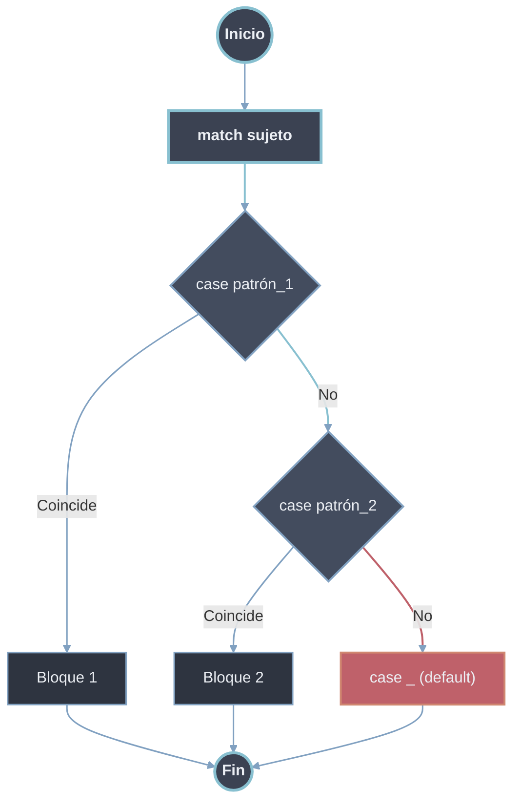
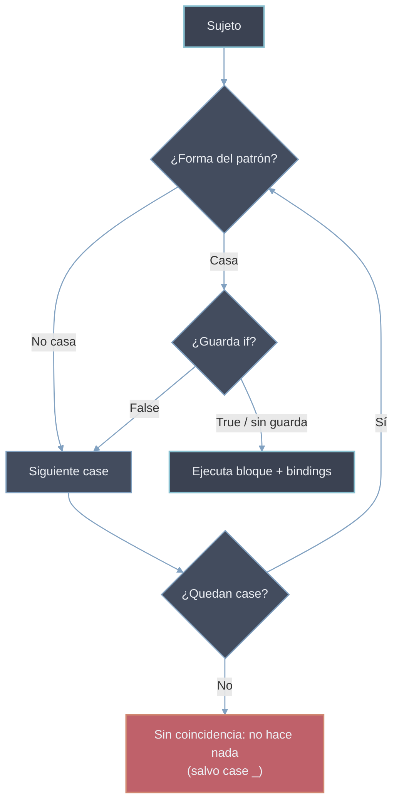

# Match Case

El `match`-`case` evalúa un sujeto contra una serie de patrones y ejecuta el bloque del primer patrón que coincide. Se comporta como un despacho estructural (*structural pattern matching*), no como una mera comparación de igualdad: el sujeto se contrasta contra la *forma* de cada patrón y, si coincide, sus componentes pueden vincularse a nombres en la misma operación.

> [!warning] Disponibilidad
> El `match`-`case` se introduce en **Python 3.10+** (PEP 634/635/636). En versiones anteriores no existe y debe sustituirse por cadenas `if`-`elif`-`else`. `match` y `case` son *soft keywords*: siguen siendo válidos como nombres de variable o función fuera de la sentencia.

## Forma Básica

```python
match sujeto:
    case patrón_1:
        # código si sujeto coincide con patrón_1
    case patrón_2:
        # código si sujeto coincide con patrón_2
    case _:
        # código por defecto (ningún patrón coincidió)
```



> [!info] Semántica general
> - Los `case` se evalúan **de arriba abajo**; gana el **primero** que coincide y el resto se ignora (no hay *fallthrough* como en C).
> - Si ningún patrón coincide y no hay `case _:`, el `match` no ejecuta nada (no es un error).
> - Un patrón puede **coincidir** y a la vez **vincular** nombres; esos nombres quedan disponibles en el cuerpo del `case` y persisten tras el `match`.

## Tipos de Patrones

| Patrón | Sintaxis | ¿Vincula? | Comportamiento |
|--------|----------|-----------|----------------|
| Literal | `case 200:` | No | Coincide si el sujeto es **igual** (`==`) a la constante. |
| Valor con punto | `case Color.ROJO:` | No | Coincide si el sujeto es igual al valor referenciado (constante/enum). |
| Captura (variable) | `case x:` | Sí | Coincide **siempre** y vincula el sujeto al nombre `x`. |
| Comodín (`_`) | `case _:` | No | Coincide con cualquier valor sin vincular; actúa como `default`. |
| OR | `case 1 \| 2 \| 3:` | — | Coincide si el sujeto satisface alguna alternativa. |
| AS | `case [x, y] as p:` | Sí | Coincide con el subpatrón y vincula todo el sujeto a `p`. |
| Guarda | `case x if x > 0:` | Sí | El patrón encaja **y** la condición `if` es `True`. |
| Secuencia | `case [a, *resto]:` | Sí | Desempaqueta una secuencia (longitud fija o con resto). |
| Mapeo | `case {"clave": v}:` | Sí | Coincide si el dict contiene las claves indicadas. |
| Clase | `case Punto(x=0, y=y):` | Sí | Comprueba el tipo y empareja atributos por posición/nombre. |

> [!warning] Captura vs literal
> Un patrón de captura (`case x:`) coincide **incondicionalmente** y atrapa todo lo que llegue a él; cualquier `case` posterior queda inalcanzable. Colocar siempre al final, o usar `case _:` cuando no se necesita vincular el valor.

## Patrón Literal, Captura y Comodín

```python
def estado_http(codigo):
    match codigo:
        case 200:                 # patrón literal
            return "OK"
        case 404:
            return "No encontrado"
        case otro:                # patrón de captura: vincula el valor
            return f"Código no catalogado: {otro}"

print(estado_http(200))   # OK
print(estado_http(500))   # Código no catalogado: 500
```

Los literales admitidos son números, cadenas, `True`, `False` y `None`. Estos tres últimos se comparan por **identidad** (`is`), no por `==`.

```python
match valor:
    case None:        # equivale a 'valor is None'
        ...
    case True:        # equivale a 'valor is True'
        ...
```

> [!warning] Un nombre suelto es captura, no comparación
> `case x:` **nunca** compara contra una variable `x` existente: crea un nuevo binding que captura el sujeto. Para comparar contra el contenido de una variable hay que usar un **valor con punto** (`Modulo.x`) o una guarda (`case v if v == x:`).

## Patrón de Valor con Punto (constantes y enums)

Un nombre **calificado con punto** (`obj.attr`) se interpreta como un **valor a comparar**, no como una captura. Es la vía para casar contra constantes nombradas y miembros de `Enum`.

```python
from enum import Enum

class Color(Enum):
    ROJO = 1
    VERDE = 2
    AZUL = 3

def describir(c):
    match c:
        case Color.ROJO:          # valor: compara contra Color.ROJO
            return "Parar"
        case Color.VERDE:
            return "Avanzar"
        case Color.AZUL:
            return "Frío"

print(describir(Color.ROJO))   # Parar
print(describir(Color.AZUL))   # Frío
```

| Forma en el `case` | Interpretación |
|--------|----------|
| `case ROJO:` | **Captura**: vincula el sujeto al nombre `ROJO`, coincide siempre. |
| `case Color.ROJO:` | **Valor**: compara el sujeto con `Color.ROJO`. |

## Patrón OR (`|`)

Agrupa varias alternativas en un mismo `case`; coincide si el sujeto satisface cualquiera de ellas. Se evalúan de izquierda a derecha y gana la primera.

```python
def tipo_dia(dia):
    match dia:
        case "sábado" | "domingo":
            return "Fin de semana"
        case "lunes" | "martes" | "miércoles" | "jueves" | "viernes":
            return "Día laboral"
        case _:
            return "Día inválido"

print(tipo_dia("domingo"))  # Fin de semana
print(tipo_dia("lunes"))    # Día laboral
```

> [!warning] Bindings consistentes en OR
> Si alguna alternativa del OR captura un nombre, **todas** deben capturar el mismo conjunto de nombres; de lo contrario es `SyntaxError`. Válido: `case Click(x, y) | Tecla(x, y):`. Inválido: `case [x] | [x, y]:` (la rama izquierda no liga `y`).

## Patrón AS (`patrón as nombre`)

Casa con un subpatrón y, además, vincula el **valor completo** que ese subpatrón emparejó a un nombre. Útil para inspeccionar la forma y conservar el objeto entero a la vez.

```python
def clasificar(punto):
    match punto:
        case [0, 0]:
            return "Origen"
        case [x, 0] as eje:               # 'eje' = la lista completa [x, 0]
            return f"Eje X en {eje}, x={x}"
        case ("circulo" | "cuadrado") as forma:
            return f"Forma reconocida: {forma}"
        case _:
            return "Otro"

print(clasificar([5, 0]))        # Eje X en [5, 0], x=5
print(clasificar("circulo"))     # Forma reconocida: circulo
```

> [!tip] AS sobre subpatrones internos
> El `as` puede anidarse para capturar una **parte** de la estructura, no solo el sujeto entero: `case [Punto(x=0, y=0) as centro, *resto]:` vincula `centro` al primer elemento si es un `Punto` en el origen.

## Guardas (`case patrón if condición:`)

Un patrón puede restringirse con una guarda `if`; el `case` coincide solo cuando el patrón encaja **y** la condición es verdadera. La guarda se evalúa **después** del emparejamiento, por lo que puede usar los nombres recién capturados.

```python
def signo(n):
    match n:
        case 0:
            return "Cero"
        case x if x > 0:      # guarda sobre el valor capturado
            return "Positivo"
        case x if x < 0:
            return "Negativo"

print(signo(0))    # Cero
print(signo(7))    # Positivo
print(signo(-4))   # Negativo
```

> [!warning] Guarda falsa no detiene el match
> Si el patrón encaja pero la guarda es `False`, ese `case` se **descarta** y la evaluación continúa con los siguientes. No hay retroceso a alternativas internas: solo se pasa al próximo `case`.

## Patrón de Secuencia (`[a, *resto]`)

Empareja objetos secuenciales (listas, tuplas, `range`...) por **forma y longitud**, vinculando posiciones a nombres. `str`, `bytes` y `bytearray` **no** se tratan como secuencias aquí (un `str` no se desempaqueta carácter a carácter).

```python
def describir_seq(s):
    match s:
        case []:                      # secuencia vacía
            return "Vacía"
        case [unico]:                 # exactamente 1 elemento
            return f"Singleton: {unico}"
        case [primero, *medio, ultimo]:   # >=2: extremos + resto
            return f"Extremos {primero}/{ultimo}, medio={medio}"

print(describir_seq([]))            # Vacía
print(describir_seq([9]))           # Singleton: 9
print(describir_seq([1, 2, 3, 4]))  # Extremos 1/4, medio=[2, 3]
```

| Patrón | Casa con |
|--------|----------|
| `[a, b]` | Secuencia de longitud **exacta** 2. |
| `[a, *resto]` | Longitud ≥ 1; `resto` es una `list` (posiblemente vacía). |
| `[*_]` | Cualquier secuencia, sin vincular. |
| `(a, b)` y `[a, b]` | **Equivalentes**: el tipo de paréntesis no importa, ambos casan listas y tuplas. |

> [!info] El comodín en secuencias
> `*_` descarta una porción de longitud variable sin nombrarla. Solo puede haber **un** elemento con estrella por patrón de secuencia.

## Patrón de Mapeo (`{"k": v}`)

Empareja `dict` (y *mappings* en general). Coincide si el sujeto contiene **al menos** las claves indicadas; las claves extra se ignoran. Las claves del patrón son literales/valores; los valores son subpatrones.

```python
def parsear(config):
    match config:
        case {"accion": "borrar", "id": id}:
            return f"Borrar {id}"
        case {"accion": "crear", **resto}:    # ** captura el resto del dict
            return f"Crear con datos {resto}"
        case {"accion": accion}:              # ignora otras claves presentes
            return f"Acción genérica: {accion}"

print(parsear({"accion": "borrar", "id": 7}))            # Borrar 7
print(parsear({"accion": "crear", "nombre": "x", "tam": 3}))  # Crear con datos {'nombre': 'x', 'tam': 3}
```

> [!warning] Subconjunto, no igualdad
> `case {"a": 1}:` casa cualquier dict que tenga `"a": 1`, **aunque tenga más claves**. Para exigir que no haya claves adicionales se usa `**resto` y se comprueba `if not resto`, o se valida la longitud en una guarda. No existe un patrón de mapeo "exacto" directo.

## Patrón de Clase (`Punto(x=0, y=y)`)

Comprueba que el sujeto sea **instancia** de la clase (vía `isinstance`) y empareja sus atributos. Admite argumentos **posicionales** y **por palabra clave**.

```python
from dataclasses import dataclass

@dataclass
class Punto:
    x: int
    y: int

def ubicar(p):
    match p:
        case Punto(x=0, y=0):           # atributos por nombre, ambos literales
            return "Origen"
        case Punto(x=0, y=y):           # x fijo a 0; y se captura
            return f"Eje Y en y={y}"
        case Punto(x=x, y=0):
            return f"Eje X en x={x}"
        case Punto():                   # cualquier Punto
            return "Punto cualquiera"
        case _:
            return "No es un Punto"

print(ubicar(Punto(0, 0)))   # Origen
print(ubicar(Punto(0, 5)))   # Eje Y en y=5
print(ubicar(Punto(3, 0)))   # Eje X en x=3
```

### Argumentos posicionales y `__match_args__`

Para usar patrones de clase **posicionales** (`Punto(0, y)`), la clase debe declarar el orden de sus atributos en `__match_args__`. Las `dataclass` lo generan automáticamente con el orden de los campos.

```python
@dataclass
class Punto:
    x: int
    y: int
# __match_args__ == ('x', 'y')  -> generado por @dataclass

match Punto(0, 7):
    case Punto(0, y):        # 0 -> x (posición 0), y -> captura
        print(y)             # 7
```

En una clase manual hay que declararlo explícitamente; sin él, los patrones posicionales lanzan `TypeError`:

```python
class Punto:
    __match_args__ = ("x", "y")   # habilita Punto(a, b) posicional
    def __init__(self, x, y):
        self.x, self.y = x, y
```

> [!info] Tipos integrados con un argumento posicional
> `int`, `str`, `float`, `bool`, `bytes`, `list`, `dict`, etc. aceptan un único patrón posicional que casa contra **el valor mismo**: `case int(n):` casa cualquier entero y lo vincula a `n`; `case str() | bytes():` filtra por tipo. Útil para validar tipo y capturar en un paso.

```python
match dato:
    case int(n) if n > 0:
        print(f"Entero positivo {n}")
    case str(s):
        print(f"Cadena {s!r}")
```

## Patrones Anidados

Los patrones se **componen**: cualquier subpatrón puede ser a su vez secuencia, mapeo, clase, OR o guarda. Esto permite validar estructuras complejas en un solo `case`.

```python
def procesar(evento):
    match evento:
        # secuencia cuyo 2.º elemento es un dict con clave "pos"
        case ["render", {"pos": [x, y]}, *capas]:
            return f"Render en ({x},{y}) con {len(capas)} capas"
        # lista de Puntos, capturando el primero
        case [Punto(x=0) as p, *_]:
            return f"Primer punto en eje Y: {p}"
        case _:
            return "Desconocido"
```

## Orden de Evaluación y Exhaustividad



- **Top-down, primero gana**: se prueba cada `case` en orden textual; el primero cuyo patrón casa *y* cuya guarda es verdadera ejecuta su bloque y termina el `match`.
- **No exhaustivo por defecto**: a diferencia de otros lenguajes, Python **no** exige cubrir todos los casos. Si nada casa, simplemente no se ejecuta nada. Para garantizar cobertura se añade `case _:` (o un `case` de captura) al final.
- **Errores frecuentes**: un patrón de captura o `_` colocado antes de casos más específicos los vuelve **inalcanzables** (el código posterior nunca se ejecuta, pero Python no avisa).

> [!tip] Garantizar manejo total
> Cerrar con `case _: raise ValueError(...)` convierte un sujeto inesperado en error explícito en lugar de un fallo silencioso aguas abajo.

## `match` vs `if`-`elif`

Ver [[01 If-Elif-Else | If-Elif-Else]] para la cadena condicional clásica.

| Criterio | `match`-`case` | `if`-`elif`-`else` |
|--------|----------|----------|
| Fortaleza | Despacho por **estructura/forma** y desempaquetado | Condiciones booleanas **arbitrarias** |
| Captura de subpartes | Integrada en el patrón | Manual, tras el `if` |
| Igualdad simple | Posible pero verboso | Natural (`==`, `in`) |
| Rangos/expresiones complejas | Requiere guardas | Directo |
| Exhaustividad | Opcional (`case _`) | Opcional (`else`) |
| Versión | Python 3.10+ | Cualquiera |

> [!tip] Cuándo usar cada uno
> Usar `match` cuando el sujeto tiene **forma** (secuencias, dicts, objetos a desestructurar) o varios valores discretos. Para una o dos comparaciones booleanas o pruebas con `in`/rangos, `if`-`elif` es más claro y no obliga a 3.10+.

## Resumen Operativo

| Quiero... | Patrón |
|--------|----------|
| Comparar contra una constante | `case 200:` / `case Color.ROJO:` |
| Capturar cualquier valor | `case x:` |
| Caso por defecto sin vincular | `case _:` |
| Varias opciones | `case "a" \| "b":` |
| Condición extra | `case x if x > 0:` |
| Conservar el todo y la parte | `case [x, y] as p:` |
| Desempaquetar lista/tupla | `case [a, *resto]:` |
| Leer claves de un dict | `case {"k": v}:` |
| Filtrar por tipo y atributos | `case Punto(x=0, y=y):` |
| Filtrar por tipo y capturar | `case int(n):` |

Relacionado: [[02 Operador Ternario | Operador Ternario]] · [[04 Operador Morsa (walrus) | Operador Morsa]].
