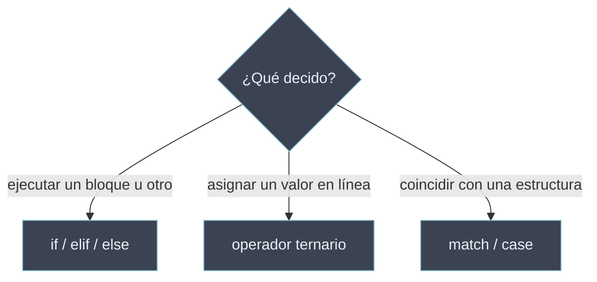

# Condicionales

Construcciones que ejecutan un bloque u otro según el resultado de **evaluar una condición**. Sin ellas el programa corre secuencialmente; con ellas el flujo se ramifica. Toda condición se interpreta según los [[Valores Truthy y Falsy | valores de verdad]]: cualquier objeto vale como condición, no solo `True`/`False`. Python ofrece tres mecanismos: la cadena `if`/`elif`/`else` (sentencia, ramificación general), el operador ternario (expresión, selección de un valor) y `match`/`case` (despacho por la *forma* del sujeto, Python 3.10+).

## Subtemas

- [[01 If-Elif-Else | If-Elif-Else]] — ramificación general: sintaxis `if`/`elif`/`else`, anidamiento, comparadores (`is`, `==`, `in`) y buenas prácticas.
- [[02 Operador Ternario | Operador Ternario]] — expresión `x if cond else y` para elegir un valor en una línea; usos, límites y anidamiento.
- [[03 Match Case | Match Case]] — pattern matching (3.10+): patrones literales, de captura, comodín `_`, OR (`|`), guardas y patrones estructurales.
- [[04 Operador Morsa (walrus) | Operador Morsa]] — asignación en expresión `:=` (3.8+): uso en `if`/`while`/comprehensions y limitaciones.

## Mapa de decisión

| Necesidad | Mecanismo | Nota |
| --------- | --------- | ---- |
| Ramificar lógica con uno o varios bloques | `if` / `elif` / `else` | [[01 If-Elif-Else \| If-Elif-Else]] |
| Elegir **un valor** entre dos en una expresión | `x if cond else y` | [[02 Operador Ternario \| Operador Ternario]] |
| Despachar según la **forma/estructura** del sujeto | `match` / `case` | [[03 Match Case \| Match Case]] |
| Asignar dentro de una expresión (`if`/`while`/comprehension) | `:=` (walrus) | [[04 Operador Morsa (walrus) \| Operador Morsa]] |

