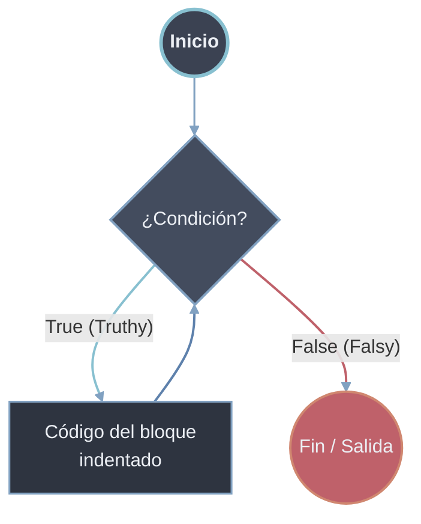
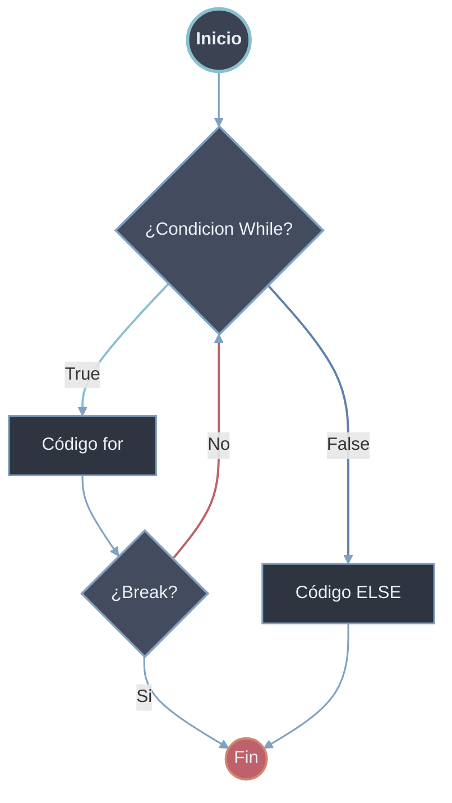

# While

El bucle `while` ejecuta un bloque de código mientras una condición sea verdadera. Es la herramienta para iteración **indefinida**: cuando no se sabe de antemano cuántas repeticiones harán falta y la salida depende de un estado que cambia durante la ejecución.

## Sintaxis

```python
# Sintaxis básica
while condición:
    # código a ejecutar mientras condición sea True
```



## Ejemplos Básicos

```python
# Contador básico
contador = 0
while contador < 5:
    print(f"Contador: {contador}")
    contador += 1  # Incremento CRUCIAL para evitar bucle infinito
# Salida: 0, 1, 2, 3, 4

# Validación de entrada de usuario
respuesta = ""
while respuesta != "salir":
    respuesta = input("Escribe 'salir' para terminar: ")
    print(f"Escribiste: {respuesta}")
```

## Evitar Bucles Infinitos

Un bucle infinito ocurre cuando la condición nunca llega a evaluarse como `False`. El cuerpo debe modificar el estado del que depende la condición.

### Mal

- **Falta incremento**
  ```python
  contador = 0
  while contador < 5:
      print(f"Contador: {contador}")
      # Falta contador += 1
  ```

- **Condición siempre True**
  ```python
  while True:
      print("Esto nunca termina")

  ```

### Correcto

- **Siempre asegurar que la condición pueda cambiar a False**
  ```python
  contador = 0
  while contador < 5:
      print(contador)
      contador += 1  # Esto asegura que eventualmente contador >= 5
  ```

- **Patrón de bucle controlado con [[33 Control de Flujo/index | break]]**
  
  ```python
  while True:
      entrada = input("Ingresa un número (0 para salir): ")
      if entrada == "0":
          break  # Sale del bucle
      print(f"Cuadrado: {int(entrada) ** 2}")
  ```

## Inicialización y Actualización Correctas

Un `while` robusto sigue cinco fases: inicializar las variables de control, evaluar la condición, procesar, **actualizar** el estado y producir el resultado tras la salida.

```python
# Ejemplo completo de control de bucle while
# 1. INICIALIZACIÓN
total = 0
contador = 0

# 2. CONDICIÓN
while contador < 5:
    # 3. PROCESAMIENTO
    numero = float(input(f"Ingresa número {contador + 1}: "))
    total += numero
    
    # 4. ACTUALIZACIÓN (IMPORTANTE)
    contador += 1

# 5. RESULTADO
print(f"Total: {total}")
print(f"Promedio: {total / contador}")

# Ejemplo con múltiples condiciones
temperatura = 25
tiempo = 0
while temperatura > 15 and tiempo < 10:
    print(f"Tiempo: {tiempo}h, Temp: {temperatura}°C")
    temperatura -= 1  # Enfriamiento
    tiempo += 1       # Pasa el tiempo
```

## `while-else`

La cláusula `else` se ejecuta **solo si el bucle termina normalmente**, es decir, cuando la condición pasa a `False`. Si se sale con [[33 Control de Flujo/index | break]], el bloque `else` se omite.

```python
while condición:
    # código del bucle
    if condición_especial:
        break
else:
    # Se ejecuta si NO se usó break
    print("Bucle completado normalmente")
```



```python
# Búsqueda con while
intentos = 3
objetivo = 7

while intentos > 0:
    adivina = int(input("Adivina el número (1-10): "))
    if adivina == objetivo:
        print("Correcto")
        break
    intentos -= 1
    print(f"Fallaste. Te quedan {intentos} intentos")
else:
    # Se ejecuta si se agotan los intentos sin acertar
    print(f"¡Perdiste! El número era {objetivo}")

# Validación de entrada segura
intentos = 0
while intentos < 3:
    entrada = input("Ingresa 'ok' para continuar: ")
    if entrada.lower() == "ok":
        print("Contraseña aceptada")
        break
    print("Intento fallido")
    intentos += 1
else:
    print("Demasiados intentos fallidos. Cerrando...")
```

## Cuándo Usar `while`

```python
# USAR WHILE CUANDO:
# 1. No sabes cuántas iteraciones necesitas
respuesta = ""
while respuesta != "salir":
    respuesta = input("Comando: ")

# 2. La condición depende de un estado cambiante
segundos = 10
while segundos > 0:
    print(f"Tiempo restante: {segundos}s")
    segundos -= 1
    time.sleep(1)

# 3. Necesitas un bucle infinito controlado
while True:
    evento = obtener_evento()
    if evento == "terminar":
        break
    procesar(evento)
```
