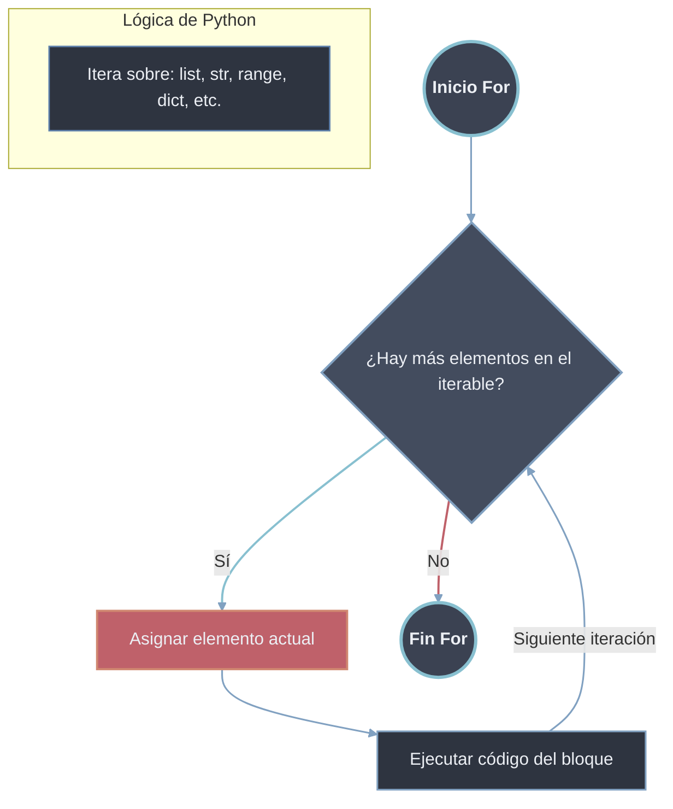
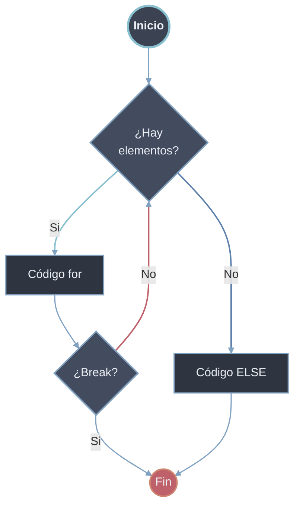

# For

El bucle `for` itera sobre los elementos de cualquier objeto iterable (listas, cadenas, `range`, diccionarios, etc.). Es la herramienta para iteración **definida**: recorre una colección elemento a elemento sin gestionar manualmente un índice ni una condición de parada.

## Sintaxis

```python
# Sintaxis básica
for elemento in iterable:
    # código a ejecutar para cada elemento
```



## Iteración Sobre Secuencias

### Iteración sobre [[02 Listas | Listas]]
```python
frutas = ["manzana", "banana", "naranja"]

for fruta in frutas:
    print(f"Fruta: {fruta}")
    print(f"Tiene {len(fruta)} letras")
# Salida:
# Fruta: manzana
# Tiene 7 letras
# Fruta: banana
# Tiene 6 letras
# Fruta: naranja
# Tiene 7 letras
```

### Iteración sobre [[03 Tuplas | Tuplas]]
```python
coordenadas = (10, 20, 30)

for coord in coordenadas:
    print(f"Coordenada: {coord}")
# Salida:
# Coordenada: 10
# Coordenada: 20
# Coordenada: 30


```

### Iteración sobre [[01 Cadenas | Cadenas (Strings)]]
```python
texto = "Python"

for caracter in texto:
    print(caracter.upper())
# Salida:
# P
# Y
# T
# H
# O
# N
```

### Iteración sobre [[01 Diccionarios | Diccionarios]]
```python
persona = {
    "nombre": "Ana",
    "edad": 25,
    "ciudad": "Madrid"
}

# Iterar sobre claves (por defecto)
for clave in persona:
    print(f"Clave: {clave}")
# Salida: nombre, edad, ciudad

# Iterar sobre valores
for valor in persona.values():
    print(f"Valor: {valor}")

# Iterar sobre pares clave-valor
for clave, valor in persona.items():
    print(f"{clave}: {valor}")
# Salida:
# nombre: Ana
# edad: 25
# ciudad: Madrid
```

## Función `enumerate()` - Obtener Índice y Elemento

```python
# enumerate() devuelve pares (índice, elemento)
frutas = ["manzana", "banana", "naranja"]

# Forma tradicional (no recomendada)
for i in range(len(frutas)):
    print(f"Índice {i}: {frutas[i]}")

# Forma con enumerate()
for indice, fruta in enumerate(frutas):
    print(f"Índice {indice}: {fruta}")

# Con índice personalizado
for indice, fruta in enumerate(frutas, start=1):
    print(f"Fruta #{indice}: {fruta}")
# Salida:
# Índice 0: manzana
# Índice 1: banana
# Índice 2: naranja
# Índice 0: manzana
# Índice 1: banana
# Índice 2: naranja
# Fruta #1: manzana
# Fruta #2: banana
# Fruta #3: naranja
```

## Función `range()` - Generación de Secuencias Numéricas

```python
# range(stop) - de 0 a stop-1
print("range(5):")
for i in range(5):
    print(i)  # 0, 1, 2, 3, 4

# range(start, stop) - de start a stop-1
print("\nrange(2, 7):")
for i in range(2, 7):
    print(i)  # 2, 3, 4, 5, 6

# range(start, stop, step) - con paso
print("\nrange(1, 10, 2):")
for i in range(1, 10, 2):
    print(i)  # 1, 3, 5, 7, 9

# Paso negativo (decremento)
print("\nrange(10, 0, -2):")
for i in range(10, 0, -2):
    print(i)  # 10, 8, 6, 4, 2

# Uso común: iterar con índice
nombres = ["Ana", "Carlos", "Beatriz"]
for i in range(len(nombres)):
    print(f"Posición {i}: {nombres[i]}")
```

## Iteración Múltiple con `zip()`

```python
# zip() combina múltiples iterables
nombres = ["Ana", "Carlos", "Beatriz"]
edades = [25, 30, 28]
ciudades = ["Madrid", "Barcelona", "Valencia"]

for nombre, edad, ciudad in zip(nombres, edades, ciudades):
    print(f"{nombre} ({edad} años) vive en {ciudad}")
# Salida:
# Ana (25 años) vive en Madrid
# Carlos (30 años) vive en Barcelona
# Beatriz (28 años) vive en Valencia

# zip() termina cuando el iterable más corto se acaba
for a, b in zip(range(3), range(5)):
    print(a, b)  # Solo 3 iteraciones
```

## Patrones Comunes

```python
# 1. Procesar con índice
lista = ['a', 'b', 'c']
for i, valor in enumerate(lista):
    print(f"Índice {i}: {valor}")

# 2. Iterar en reversa
for i in reversed(range(5)):
    print(i)  # 4, 3, 2, 1, 0

for elemento in reversed(lista):
    print(elemento)

# 3. Iterar sobre rangos con pasos
for i in range(0, 100, 10):
    print(i)  # 0, 10, 20, ..., 90

# 4. Diccionarios con items()
persona = {"nombre": "Ana", "edad": 25}
for clave, valor in persona.items():
    print(f"{clave}: {valor}")

# 5. Nested loops (bucles anidados)
for i in range(3):
    for j in range(2):
        print(f"({i}, {j})")
# Salida: (0,0), (0,1), (1,0), (1,1), (2,0), (2,1)
```

## `for-else`

La cláusula `else` se ejecuta **solo si el bucle termina normalmente** (sin usar [[33 Control de Flujo/index | break]]). Es el patrón idiomático para distinguir "se recorrió todo el iterable" de "se salió antes" (típicamente búsquedas con caso "no encontrado").

```python
for elemento in iterable:
    # código del bucle
    if condición:
        break
else:
    # Se ejecuta si NO se usó break
    print("Bucle completado normalmente")
```



```python
# Buscar un elemento en lista
numeros = [1, 3, 5, 7, 9]
busqueda = 6

for num in numeros:
    if num == busqueda:
        print(f"Encontrado {busqueda}")
        break
else:
    # Solo se ejecuta si NO se encontró el número
    print(f"{busqueda} no está en la lista")
# Salida: 6 no está en la lista

# Verificar si todos cumplen condición
edades = [18, 22, 25, 17, 30]
for edad in edades:
    if edad < 18:
        print("Hay menores de edad")
        break
else:
    print("Todos son mayores de edad")
# Salida: Hay menores de edad
```

### Casos de Uso Comunes

```python
# 1. Búsqueda con mensaje de "no encontrado"
productos = ["manzana", "banana", "naranja"]
buscar = "pera"

for producto in productos:
    if producto == buscar:
        print(f"Producto '{buscar}' disponible")
        break
else:
    print(f"Producto '{buscar}' no disponible")

# 2. Validación de lista vacía/inexistente
lista_datos = None

if lista_datos:
    for dato in lista_datos:
        print(dato)
    else:
        print("Lista procesada completamente")
else:
    print("No hay datos para procesar")

# 3. Verificar si todos los elementos cumplen condición
calificaciones = [8, 7, 9, 6, 8]

for calif in calificaciones:
    if calif < 6:
        print("Hay reprobados")
        break
else:
    print("Todos aprobaron")
```

## Comprensiones

Las comprensiones se tratan en [[03 Comprensiones|Comprensiones]].
